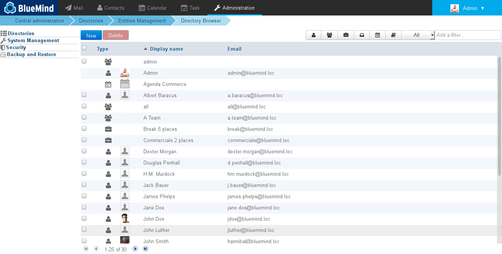
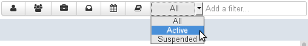
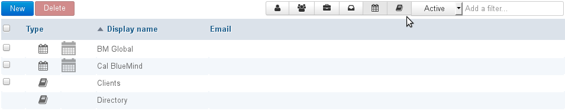
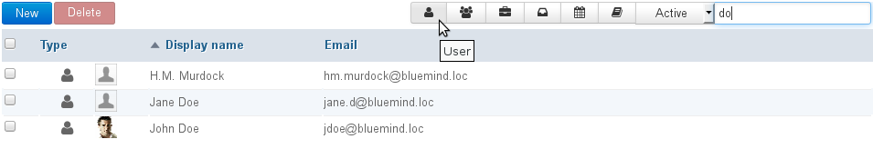

# Directory Browser

# Introduction

The directory browser page shows the content of the directory: users (internal and external), groups, resources, shared mailboxes, and also domain calendars and addressbooks.

# Sorting entries

By default, entries are sorted by username in alphabetical order.

An arrow shows the current sorting column and order. To change the sorting order, click the header of the corresponding column.

# Filtering entries

Shown entries can be filtered using the form at the top right of the entry list:

BlueMind offers 3 types of filters:

1 
**Type**
The first 4 buttons allow you to show or hide a type of entry: users, groups, resources or shared mailboxes.
When a button is enabled, it is grayed out and matching entries are displayed. That way you can choose to display one or several types of entries by enabling one or several buttons. In the example above, active calendars and domain address books will be shown:

To reset the filter, set each button to its initial non-grayed out state.

1 
**Status**
The drop-down list allows you to filter entries according to their status: active or suspended.
To reset the filter, select "All".

1 
**Text**
The text box allows you to filter entries according to a string of characters.
Type the word (or part of it) and validate by pressing &lt;Enter>. All entries containing these characters in their username or display name will be shown.
To reset the filter, clear the text box and validate by pressing &lt;Enter>.
NB: the search is not case-sensitive, it doesn't distinguish between uppercase or lowercase.

Filters are cumulative. This means you can display active users whose name and/or username contain "do":

