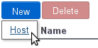
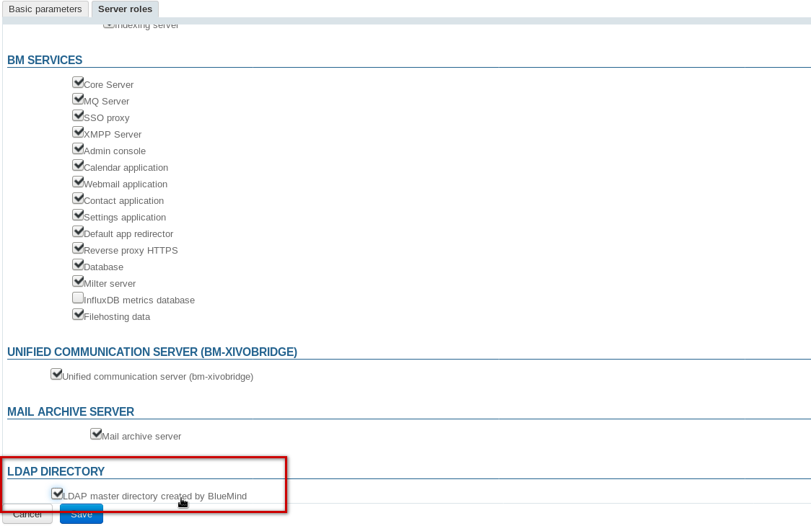
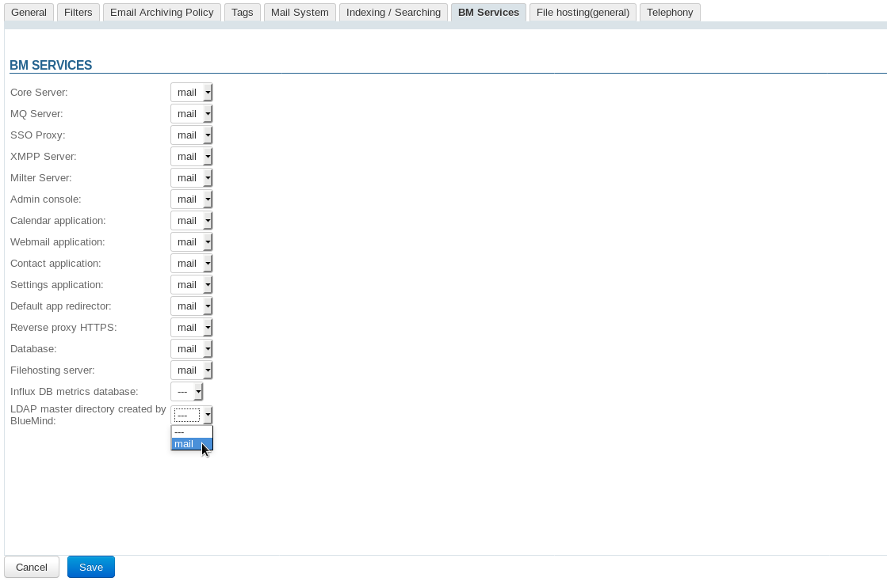

# LDAP Exports


# Introduction

BlueMind allows you to export your directory in LDAP format so that it can be viewed and queried by other applications such as an LDAP directory.


# Procedure

1 
Install the packages required on the BlueMind host server:


**
Ubuntu/Debian


**
RedHat/CentOS


**Ubuntu/Debian**

```
aptitude update
aptitude install bm-plugin-admin-console-ldap-export bm-plugin-core-ldap-export
```


**RedHat/CentOS**

```
yum update
yum install bm-plugin-admin-console-ldap-export bm-plugin-core-ldap-export
```


1 
Restart BlueMind:


```
bmctl restart
```


1 
Install the package* **bm-ldap-role* on the server on which you want the LDAP directory to run (which may be the BlueMind server or another separate server)


**
Ubuntu/Debian


**
RedHat/CentOS


**Ubuntu/Debian**

```
aptitude update
aptitude install bm-ldap-role
```


**RedHat/CentOS**

```
yum update
yum install bm-ldap-role
```


1 Assign the role to the server. To do this:
  - while logged in as admin0, go to the admin console > Application Servers
  - if your are using a separate server that does not exist yet, add it using the button New > Host 
  - select the server and go to the "Server roles" tab
  - in the "LDAP Directory" section, check "LDAP master directory created by BlueMind":
1 Click "Save" to confirm
1 Next, link this server to the domains as desired.To do this, go to the section Domain Management > Manage Domains and:
  - select the domain you want to export in LDAP format
  - go to the "BM Services" tab
  - select the server for the service with the same name "LDAP master directory created by BlueMind":
  - Click "Save" to confirm
Repeat this process for each domain as required.


Enregistrer

Enregistrer

Enregistrer

