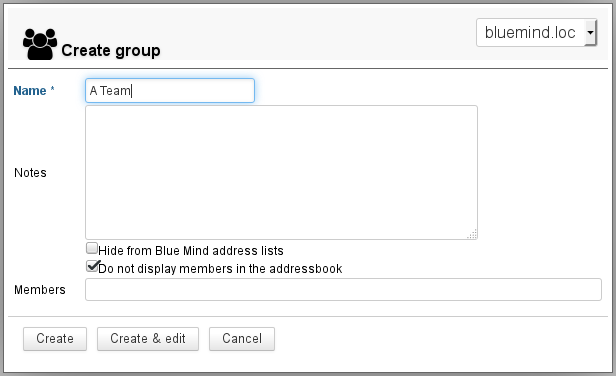
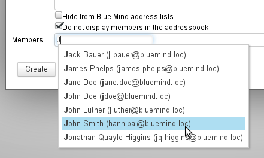
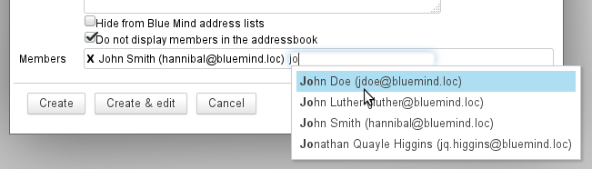
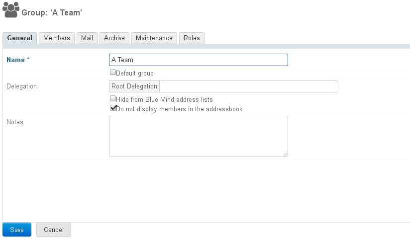
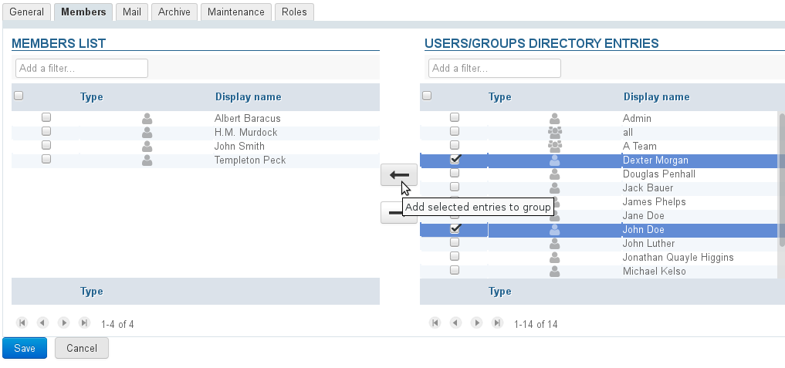
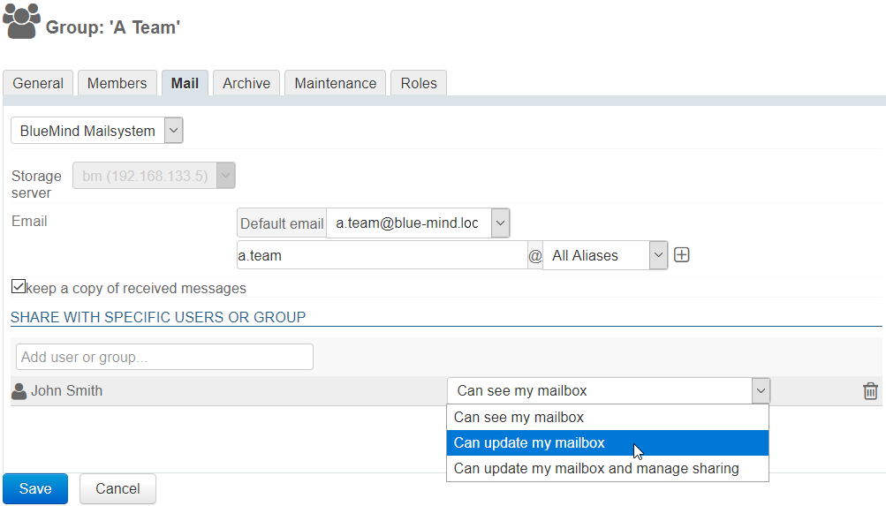
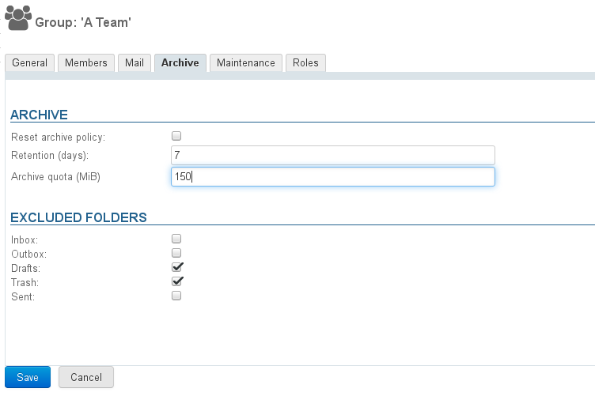
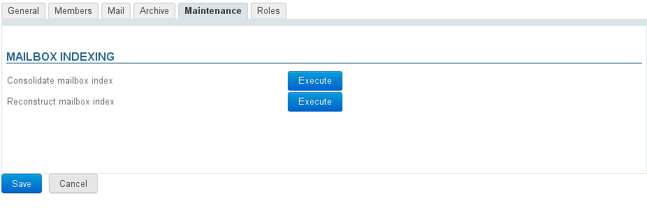
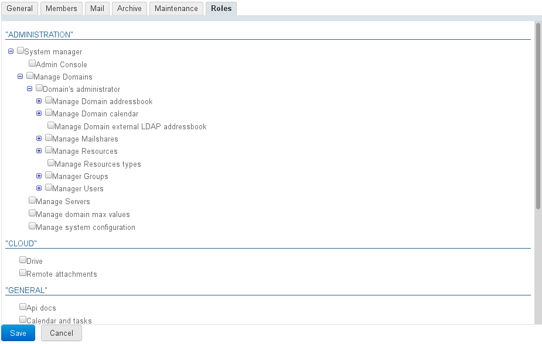

# Groups

## Introduction

Administrators can create groups of users which, when public, can be used to:

- display the calendars of a group of people;
- assign rights to a group of people on calendars, resources, shared mailboxes, private mailboxes, address books, etc.
- set up other groups to include one or several groups;
- send emails to a group of people (if the group has an email address): internal distribution list.

## Creating groups

In the homepage or the "Directories" page of the admin console, click "Create Group":

Enter the group name, a description (optional) and select the desired options:

- Hide from BlueMind address lists: the group exists but is not visible (neither in autocomplete, nor in contact lists from the directory or groups it belongs to). This group can be used by administrators or those who know its address.
- Do not display members in the address book: even if the group is visible in the directory, users cannot see its individual members.

The group can be left empty, or you can start adding members in the box at the bottom of the form.
Autocomplete helps you find members as you type:

To add several users, keep typing to the right of the previous user selected:

### Quick create

As for users, groups can be created quickly by clicking "Create".
The newly created group then has the properties entered in the dialog box and the following default settings:

- no email address
- archiving is disabled

The group's properties can be completed and modified in the admin console.

### Create and edit

The "Create and edit" button (&lt;Ctrl-Enter> key combination) creates a group with the same properties as "quick create" and redirects you to the group's settings editor to fine-tune configuration.

## Editing and managing groups

In the Directories > Entities Management page, filter for groups by clicking the "group" icon and select the group you want to edit from the list.

### Basic parameters

The "Basic Parameters" tab shows basic group information: name, delegation and visibility options for the group and for his members.

### Members

The "Members" tab includes two columns for group management: the left-hand side column lists current group members while the right-hand side column lists other users and groups in the directory.

- Select a user or group in either column and user the arrows in the middle to add them or remove them from the group.

:::info

Groups within groups

Groups can be included within groups, however, only groups with an email address will be taken into account – if a group included in another group doesn't have an email address, its members will not receive the messages sent to the parent group.

:::

:::tip

You can add external users to groups. For more information see: [Users](/Guide_de_l_administrateur/Gestion_des_entités/Utilisateurs/) > [External Users](/Guide_de_l_administrateur/Gestion_des_entités/Utilisateurs/Utilisateurs_externes/)

:::

### Mail

The Mail tab is used to configure group addresses and aliases as well as whether to keep messages: the group then has a shared mailbox where received messages can be found.

When the box "Keep a copy of received messages" is checked, messages are kept in a mailbox and they can be viewed.

When this box is unchecked, new messages are not kept.

:::tip

When this option is disabled, the contents of the mailbox are not deleted.

If this option is enabled for a while before being disabled, the shared mailbox remains and contains the emails received during the time it was enabled.

:::

Group mailboxes can be shared even if the user is not a member of the group (please refer to [Managing Groups](/Guide_de_l_utilisateur/Gestion_des_partages/)). Possible rights are as follows:

- **Can see my mailbox**: users can read emails
- **Can update my mailbox**: users can edit (add, delete, move, etc.) emails
- **Can update my mailbox and manage sharing**: in addition to editing rights, users can manage share rights

In the mail folders list, the mailbox is placed with shared mailboxes and bears the name of the group preceded with a "_" (underscore).
E.g. for a group named "contact", the shared mailbox will be named "_contact" in the folders list.

:::info

Unlike shared mailboxes, group emails cannot be used to create identities and write on behalf of the group.

:::

### Archiving groups

When a [global archiving policy](/Guide_de_l_administrateur/Configuration/Archivage/) is set for the domain, its default rules are applied to all domain users and groups.

You can however edit default settings to set user or group-specific settings.

By default, the form shows the domain's archiving settings whose values can be customized:

- the number of days after which messages are archived. All older messages will be archived.
- the disk space quota allocated to the group's users.

:::info

The quota cannot exceed the maximum domain quota: if you enter a number that exceeds it, it will be taken down to the maximum quota when you save.

:::

- check or uncheck the folders you want to **exclude** as needed.
- click "Save" to apply the changes.

The "Reset archive policy" box  allows you to reset the user's default values: either those of the group it belongs to, or the domain's if no specific rule has been assigned to the group:

- check the box, the form is grayed out
- click "Save"
- the information is saved: the user's section closes and you can reopen it to make sure the information has been reset.

:::info

The MiB (Mebibyte) is a multiple of a byte, not to be confused with the MB (megabyte): it is equal to 1024 kebibytes, which itself is equal to 1024 bytes.

Therefore, 9 MiB equals 9,43718 MB.

:::

### Maintenance

The Maintenance tab allows you to perform maintenance operations on the group's mailbox: consolidation and reconstruction.

**  **

### Roles

The Roles tab allows you to select the applications group members have access to:

This allows you to grant access to specific features to selected users in one single operation. Once roles are assigned to groups, you no longer have to worry about individual rights, simply add a user to a group for them to have access to the applications they need.

E.g., you can grant access to "Telephony" to the sales team only so that they can communicate outside the company or restrict the use of "Instant messaging" to technical teams so that they can communicate in writing more easily.

## Deleting groups

In the list of directory entries, check the box at the beginning of the row for the group you want to delete, then click "Delete" and confirm.

 **Deletions are immediate and final.** 

