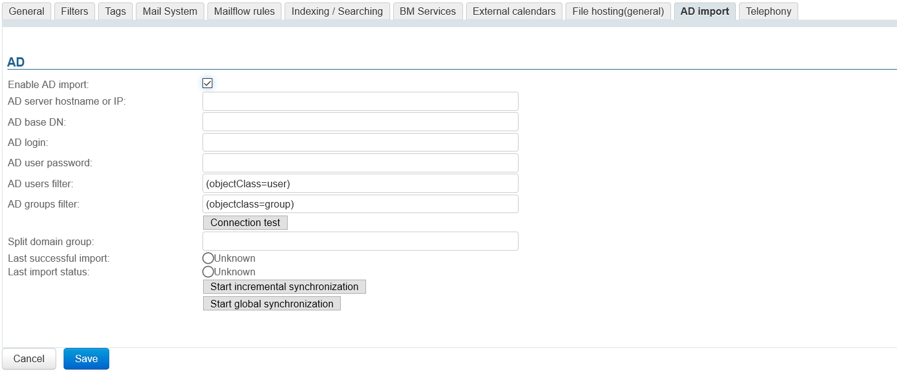
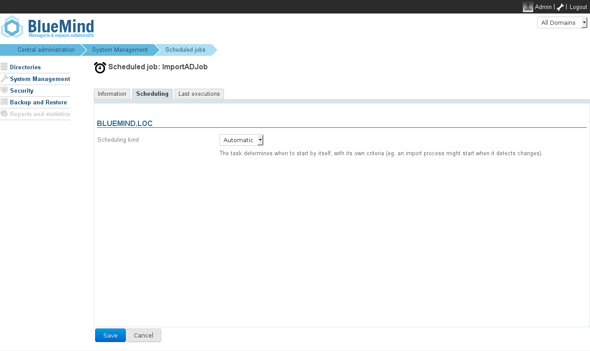
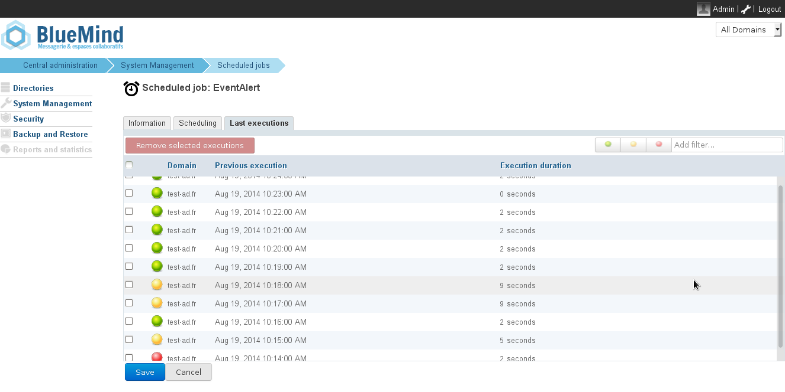

# Active Directory Synchronization


# Introduction

The professional BlueMind subscription includes access to tools that facilitate the integration of BlueMind into your information system.

This article describes the functionalities of the Active Directory access module.

** **Active Directory scope** **

The admin console can be used to create and manage users, groups and other entities directly in BlueMind.

However, information systems often include a centralized directory – such as LDAP or Active Directory – which we recommend that you use to manage users and groups centrally. When you do, user management can be delegated to an Active Directory directory and automatic account creation enabled through periodic synchronization. 

Active Directory synchronization allows BlueMind to:

- transparently import your directory's users and groups database periodically. 
- authenticate BlueMind users directly against the Active Directory.


This tool avoids having to manage a user database in BlueMind and prevents issues with multiple passwords. Passwords are centralized in the AD directory and BlueMind does not know or import them.

** **Active Directory authentication** **

Users that are imported from the directory are authenticated against this directory as the BlueMind database does not know Active Directory passwords.


# How AD synchronization works

BlueMind allows you to import and use users and groups from an Active Directory system.

An Active Directory incremental import is carried out on each domain on the BlueMind side.

The passwords of imported users are validated directly against the Active Directory. BlueMind does not store any passwords.

New users can log into a BlueMind server even if they haven't been imported yet. Their BlueMind account will be created upon request automatically if the authentication process is successful. 

User or group provisioning (creation or modification) from the Active Directory to BlueMind therefore takes place:

- when the server is configured, during the initial import,  
- periodically during the day, through scheduled jobs
- or automatically when a user logs in.


# Installation

Access to AD directory synchronization functionalities requires the ad-import plugin to be installed.

To start the plugin installation, log into the server and enter the command below:
**Debian/Ubuntu**

```
sudo aptitude update
sudo aptitude install bm-plugin-admin-console-ad-import bm-plugin-core-ad-import
```

**RedHat/CentOS**

```
yum update
yum install bm-plugin-admin-console-ad-import bm-plugin-core-ad-import
```


When installation is complete, restart the *bm-core* component using the following command:


```
bmctl restart
```


# Set up

- Log into the target BlueMind server as global administrator.


- Browse the admin console to System Management > Modify Domain > select the domain > AD import tab: 


- Check "Enable AD import" (from BlueMind 4.3.0)
- Fill in the information requested with the Active Directory parameters provided in the table below: 


   | Parameter Requested | Active Directory Value |
| --- | --- |
| AD user login | Login ID used to make queries to the Active Directory server.Any user account with browsing rights in the Active Directory tree in read-only mode can be used.Values are mapped on import for compatibility reasons:* accented letters are replaced by their non-accented equivalent
* all letters are changed to lowercase
* spaces are replaced by '\_'
 |
| AD user password | Password for the account entered in the *AD user login* box |
| AD server hostname or IP | Active Directory server IP or FQDN address. This field can be left empty if the server can be located by using a DNS SRV record.
```
\_ldap.\_tcp.dc.\_msdcs.domain
```
(see the following [Technet article](http://technet.microsoft.com/en-us/library/cc759550%28v=ws.10%29.aspx)) |
| AD root DN | Root for Active Directory search. If left empty, searches are made using the root DN.Used to limit the search to a sub-section of the Active Directory tree.  |
| AD users filter | Filter for searching user entries in the AD.LDAP filter [syntax](http://www.ietf.org/rfc/rfc2254.txt) can be used.For example, to display all persons whose telephone number is stored in the database:

```
(&(objectclass=person)(telephoneNumber=*))
```

*see &lt;http://ldapbook.labs.libre-entreprise.org/book/html/ch03s02.html>* Or, to display all accounts whose accountStatus is "MAIL" and are not included in the MAILSHARE branch of the directory:

```
(&(!(ou:dn:=MAILSHARE))(&(objectClass=posixAccount)(accountStatus=MAIL)))
```

 |
| AD groups filter | Filter for searching group entries in the AD.LDAP [syntax](http://www.ietf.org/rfc/rfc2254.txt) can be used.For example, to display exclusively groups of branches whose DN contain cn=system or cn=users:

```
(&(objectClass=group)(|(cn:dn:=System)(cn:dn:=Users)))
```

Or groups with a description:

```
(&(objectCategory=group)(description=*))
```

*see &lt;https://social.technet.microsoft.com/wiki/contents/articles/5392.active-directory-ldap-syntax-filters.aspx#Examples>*  |
| Split domain group | This field can be left empty.It will be ignored if the split domain functionality is not configured for BlueMind.Emails addressed to members of this group will be redirected to another mail server in the same domain (configured via domain segmentation). |


# Connection method

The BlueMind Active Directory plugin is not restrictive and does not require a specific schema, just the following information:

- the hostname (or IP address) of the Active Directory server
- AD directory credentials ("username" and "password") to allow logging in.


By default, all users and groups are imported from the Active Directory. Filters that are used to query part of the directory can be configured with the following information:

- root directory
- filters to use for user and group synchronization, to apply restrictions to imported data.


Finally, you can specify the split domain group.

The synchronization tool allows you to check directly if the directory is available and access has been configured correctly.

# How the synchronization tool works

## User accounts

The Active Directory plugin has three interdependent functions:

- global import of all users
- incremental import 
- real-time import on authentication 


The global import browses through all Active Directory users and groups (taking into account the AD root and filters) and imports them into BlueMind. Those that do not exist are created, and existing ones are modified if necessary. 

The incremental import works the same way, but only browses through the users modified since the last import.

Finally, import on authentication looks for the user unknown to BlueMind in the Active Directory. If the user is found, it is imported and authenticated in the Active Directory, giving the user immediate access to BlueMind.

## Account status 

Accounts imported from an Active Directory that complies with the LDAP filter are activated automatically.

Conversely, accounts can be suspended or deleted from the Active Directory thereby forbidding them access to the mail system. A user deleted in the Active Directory is merely suspended in BlueMind.

## Scheduled Active Directory synchronization

### Incremental import 

When the Active Directory plugin is installed, BlueMind creates a scheduled job whose purpose is to synchronize user and group databases against the Active Directory at regular intervals.

Incremental imports only processes the data that has been created, deleted or modified since the last import.

As shown in the screenshot below, a scheduled job can be:

- automatic: activated based on criteria from earlier imports, at 4-hour intervals at the most;
- scheduled: with a cron-type scheduling format, which allows any activation frequency;
- disabled: in this case, the scheduled job is not executed.





Import Active Directory scheduled job


### Scheduled jobs monitoring

The [scheduled jobs](/Guide_de_l_administrateur/Configuration/Les_tâches_planifiées/) monitoring page allows you check that they are performed correctly. The screenshot below shows a log of synchronization jobs performed, execution date and results:



# Active Directory-BlueMind mapping

## User attributes


    | BlueMind | Active Directory Attribute | Note |
| --- | --- | --- |
| login | sAMAccountName |  |
| title* | personalTitle | Personal title: Mr., Mrs., Ms., Miss |
| firstname | givenName |  |
| lastname | sn |  |
| jobtitle* | title | Job title: Manager, IT Director, etc. |
| description | description |  |
| mail | mailotherMailboxproxyAddresses | The  *mail*  Active Directory attribute is set as the default email address in BlueMind. If this field is missing or empty, the default BlueMind email address is populated with the first value found in the following fields (in that order): 1. *otherMailbox*
2. proxyAddresses:
	1. the first with the "SMTP:" prefix
	2. the first with the "smtp:" prefix if no email has the "SMTP:" prefixNB: only addresses with the "SMTP:" or "smtp:" prefix are taken into account ([Microsoft](https://support.microsoft.com/en-us/help/3190357/how-the-proxyaddresses-attribute-is-populated-in-azure-ad)-defined syntax)

 If none of these fields is populated, the user will not have a mail service. |
| street | streetAddress |  |
| zip | postalCode |  |
| town | l |  |
| country | co |  |
| state | st |  |
| Work phones | telephoneNumberotherTelephone |  |
| Home phones | homePhoneotherHomePhone |  |
| Mobile phones | mobileotherMobile |  |
| Fax | facsimileTelephoneNumberotherFacsimileTelephoneNumber |  |
| Pager | pagerotherPager |  |
| memberOf | memberOf | List of groups the user is a member of. The BlueMind user is added to groups previously imported only. |
| service | department | BlueMind v.3.0 and above. |
| photoID | thumbnailPhoto | Profile picture: the attribute content is imported as profile picture for the related account |
| user.value.contactInfos.organizational.org.company | company |  |
| user.value.contactInfos.organizational.org.department | department |  |


## Group attributes 


    | BlueMind | Active Directory Attributes | Note |
| --- | --- | --- |
| name | sAMAccountName |  |
| description | description |  |
| mail | mail |  |
| member | member | Only synchronized groups and users are added to members of the BlueMind group. |


# Role assignment

From BlueMind 3.5, [access to applications is subject to the roles ](/Guide_de_l_administrateur/Gestion_des_entités/Utilisateurs/)users are assigned. As AD imports do not handle roles, imported users are not assigned any roles and they are unable to access applications (webmail, contacts, calendar).

The easiest and most effective way of handling this is through groups:

- in AD, assign one (or several, if desired) common group to users
- launch a first import: group(s) are imported into BlueMind along with users
- go to the admin section and [assign the desired roles to the group(s)](/Guide_de_l_administrateur/Gestion_des_entités/Groupes/#Groups-Gestiondesgroupes-Roles)

:::important

Roles will be maintained during subsequent imports and updates.

:::

In the future, simply assign new users to this/these group(s) in order to give them the desired roles.

# Forcing or correcting a UID

A user's UID can be populated or corrected in the user's admin page in BlueMind.

To do this, go to the admin console > Directories > Directory Browser > select user > Maintenance tab: enter the user's AD UID in the ExternalID box then save.
:::important

ExternalID must be prefixed by "ad://"

For example :


```
ad://5d6b50-399a6-1e6f2-d01267d1f-0fbecb
```


:::


