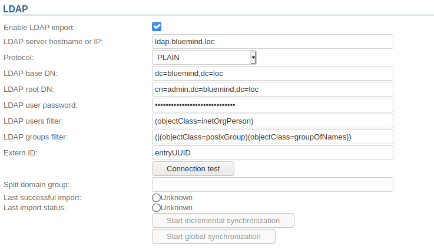
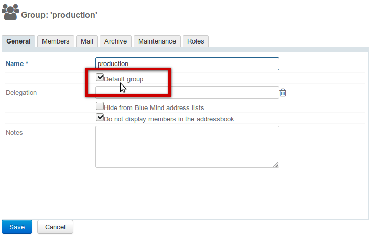

# LDAP Synchronization


# Introduction

BlueMind allows you to import users or groups from an LDAP directory (e.g. OpenLDAP). LDAP imports are incremental (new entries are added, and changes to data are recorded). Set up and execution of LDAP imports are domain-specific.

Imported user passwords are then validated against the LDAP server.

New users can connect to BlueMind even if their information has not been imported yet. Their BlueMind account will be created in the process if authentication is successful.

BlueMind users and groups are populated from the LDAP directory:

- during installation and set up, through the initial import
- regularly and automatically through scheduled jobs
- on the spot, when an unknown user logs in.

:::important

LDAP synchronization is designed based on a directory schema of the InetOrgPerson type  .

:::


# Installation

To access LDAP synchronization functionalities, you must install the plugin "ldap-import".

To do this, log into the server and use the following command to start installation:
**Debian/Ubuntu**

```
sudo aptitude update
sudo aptitude install bm-plugin-admin-console-ldap-import bm-plugin-core-ldap-import
```

**RedHat/CentOS**

```
yum update
yum install bm-plugin-admin-console-ldap-import bm-plugin-core-ldap-import
```


Once installation is complete, restart the "*bm-core" *component using the following command:


```
bmctl restart
```


# Set up

Only the global administrator is able to configure LDAP synchronization for a domain. Domain administrators are able to view settings and launch import jobs.

- Log in as global administrator [admin0@global.virt](mailto:global admin0@global.virt)
- Go to System Management > Modify Domains and select the domain you want to set up
- Go to the "Directories" tab





| Field | Note |
| --- | --- |
| LDAP server name or IP address | LDAP server host name or IP address. |
| Protocol | Choose which protocol to use:* PLAIN
* SSL
* SSL/accept all certificates
* TLS
* TLS/accept all certificates

Depending on the protocol, the port will automatically be set to:* PLAIN : 389
* SSL : 636
* TLS : 389
 |
| Root directory | Specify the LDAP root directory |
| User DN | DN of the root user used to connect to the LDAP server |
| Password | The user password used to connect to the LDAP server |
| LDAP filter for users | Only users validated by this filter will be imported into BlueMind |
| LDAP filter for groups | Only groups validated by this filter will be imported into BlueMind |
| External ID | Attribute of an invariant and unique LDAP entry identifier used to bind an LDAP entry to a BlueMind entry. |
| Split domain group | This field can be left empty.It will be ignored if the split domain functionality is not configured for BlueMind.Emails sent to members of this group will be redirected to another mail server in the same domain (through split domain configuration). |


# LDAP-BlueMind mapping

## User attributes


    | BlueMind | LDAP Attribute | Note |
| --- | --- | --- |
| login | uid | Values are mapped on import for compatibility reasons:* accented letters are replaced by their non-accented equivalent
* all letters are changed to lowercase
* spaces are replaced by '\_'
 |
| firstname | givenName |  |
| lastname | sn |  |
| description | description |  |
| mail | mailmailLocalAddressmailAlternateAddressgosaMailAlternateAddress | BlueMind's default email address is defined from the first LDAP attribute of the following: "*mail",* "*mailLocalAddress",* "*mailAlternateAddress", or "*gosaMailAlternateAddress*"*.The others will be used as alias email addresses. If none of these fields is filled in, the user will not have a mail service. |
| user mail quota | mailQuotaSizemailQuotagosaMailQuota | Must be expressed in bytes in LDAP.The first of these LDAP attributes to be found is used : mailQuotaSize > mailQuota > gosaMailQuota |
| work phones | telephoneNumber |  |
| home phones | homePhone |  |
| mobile phones | mobile |  |
| fax | facsimileTelephoneNumber |  |
| pager | pager |  |
| memberOf | memberOf | List of groups the user is a member of. BlueMind users can only be added to LDAP groups imported previously. |
| photoID  | jpegPhoto | Profile picture: attribute content is imported as profile picture for related account |
| user.value.contactInfos.organizational.title | title |  |
| user.value.contactInfos.organizational.org.company | o |  |
| user.value.contactInfos.organizational.org.division | ou |  |
| user.value.contactInfos.organizational.org.department | departmentNumber |  |
| address.locality | l |  |
| address.postalCode | postalCode |  |
| address.countryName | st |  |
| address.streetAddress | postalAddress |  |
| address.postOfficeBox | postOfficeBox |  |


## Group attributes


    | BlueMind | Attribut LDAP | Note |
| --- | --- | --- |
| name | cn |  |
| description | description |  |
| mail | mail |  |
| member | memberUid | Only users and groups already imported into BlueMind will be added to the group |


# Assigning roles 

From BlueMind 3.5, [access to applications is subject to the roles](/Guide_de_l_administrateur/Gestion_des_entités/Utilisateurs/) users are assigned. As LDAP imports do not handle roles, imported users are not assigned any roles and they are unable to access applications (webmail, contacts, calendar).

The easiest and most effective way of handling this is through groups:

- in LDAP, assign one (or several, if desired) common group to users
- launch a first import: the group(s) are imported into BlueMind along with users
- go to the admin section and [assign the desired roles to the group(s)](/Guide_de_l_administrateur/Gestion_des_entités/Groupes/#Groups-Gestiondesgroupes-Roles)

:::important

Roles are maintained during subsequent imports and updates.

:::

In the future, simply assign new users to this/ese group(s) in order to give them the desired roles.
:::important

Editing Roles

As new versions are released, new roles and feature improvements are regularly added to BlueMind.

E.g. BlueMind version 3.5.9 allows administrators to enable or disable the ability for BlueMind users to connect to Thunderbird through new roles. In earlier versions, all users had this ability.

To make sure that after the update the new right will be enabled for existing users, you must set the group(s) in which LDAP users have been assigned to are as default group.

To do this, go to the group(s)' admin page, check the "Default group" box and save:



:::

# Forcing or correcting a UID

A user's UID can be filled in or corrected in the user's admin page in BlueMind.

To do this, go to the admin console > Directories > Directory Browser > select user > Maintenance tab: enter the user's LDAP UID in the ExternalID box then save.
:::important

The ExternalID must be prefixed with "ldap://".

For example :


```
ldap://5d6b50-399a6-1e6f2-d01267d1f-0fbecb
```


:::


