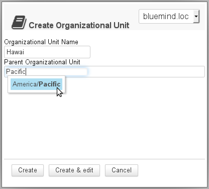
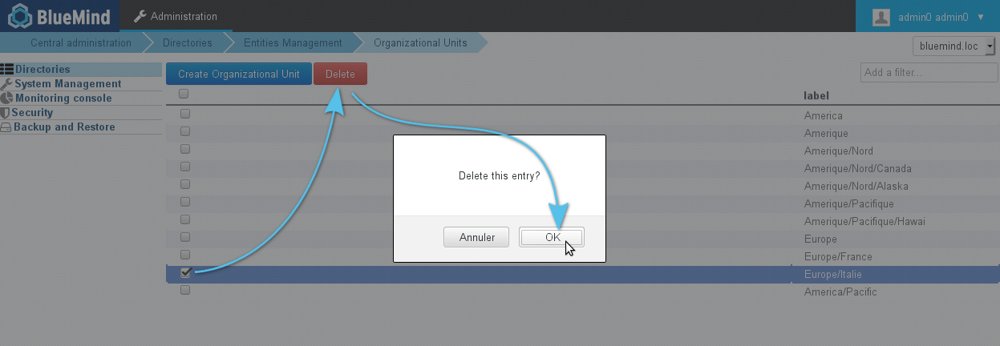
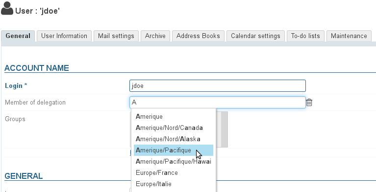
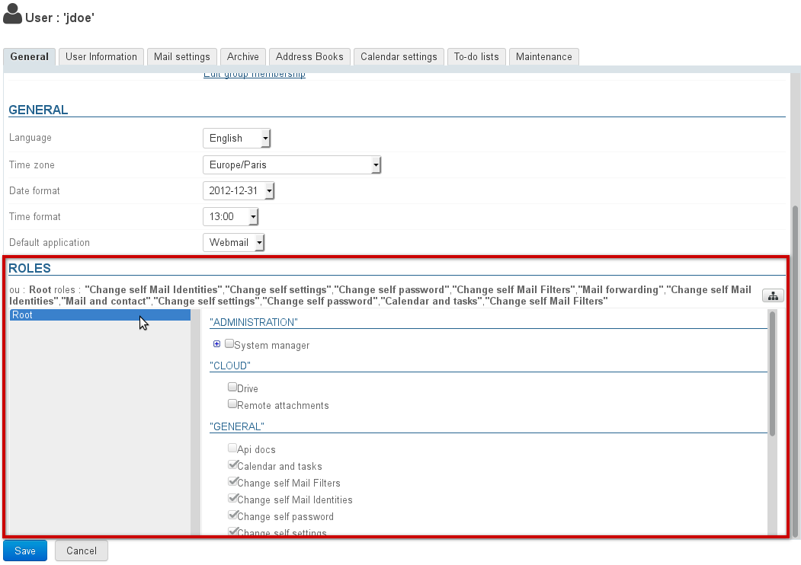
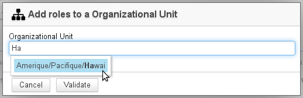
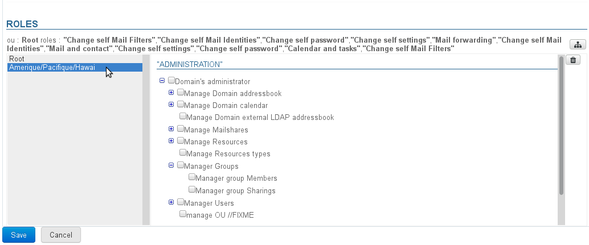
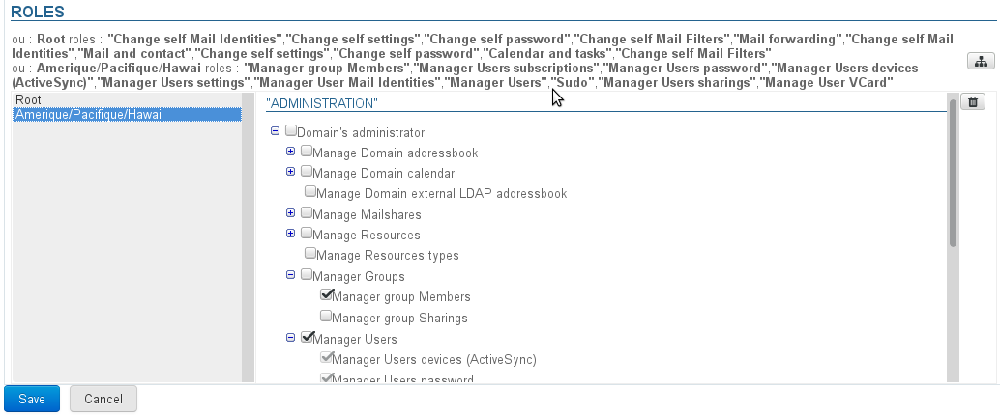
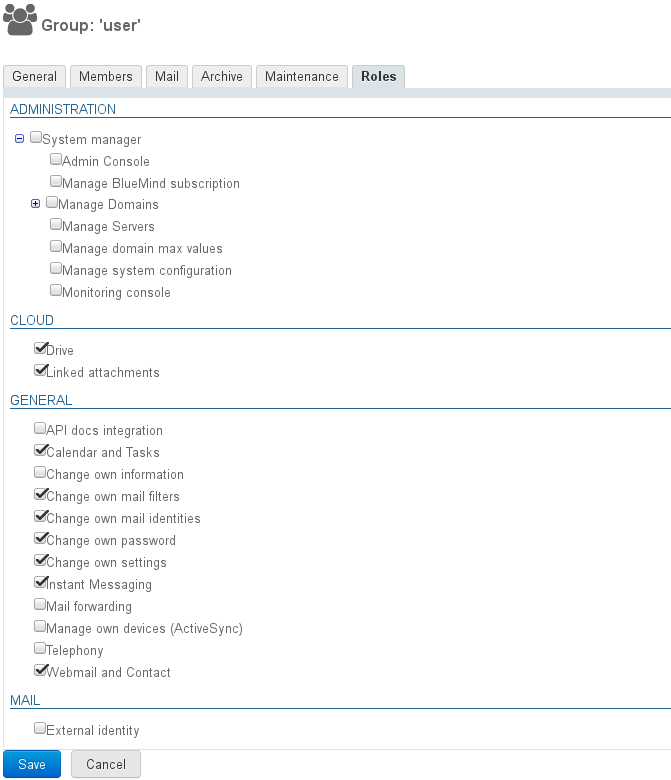

# Delegated Administration

# Introduction

When BlueMind handles a large population or has users over several separate sites, you might want to appoint administrators with delegated rights over a sub-segment of this population.

To address this issue, BlueMind integrates a delegated administration functionality. It allows you to grant limited administration rights to administrators (who become delegated administrators). Delegated administration rights can be given to specific users selected according to certain criteria (job type, industry, geographical area...).

This functionality can be used, for instance, for members of a regional branch: the main domain administrator appoints a delegated administrator for each branch's users. This delegated administrator will be able to manage users' access to applications and features (such as linked attachments), adjust mail quotas, fill in directory information cards, perform maintenance operations, etc.

# Organizational Units

## Managing organizational units

Delegation trees can be created and organized so as to allow different levels of delegated administration.

For instance, you can set up delegations:

By geographic area:

- Root
  - Americas
    - Americas/North/Canada
      - Americas/North/Canada
      - Americas/North/Alaska
    - Americas/Pacific
      - Americas/Pacific/Hawaï

  - Europe
    - Europe/France
    - Europe/Italy
    - Europe/UK
      - Europe/UK/England
      - Europe/UK/Scotland

Or according to the company's structure:

- Root
  - IT
    - IT/Technical
    - IT/Support
  - Administration
    - Administration/Managers
    - Administration/Assistants
    - Administration/Sales&Marketing
      - Administration/Sales&Marketing/Sales
      - Administration/Sales&Marketing/Marketing
  - Production
    - Production/Management
    - Production/Technical

In these two examples, administrators and target populations can be set for each delegation level.
:::important

Root

The "Root" unit is the parent of all other units. It is the BlueMind domain: it cannot be deleted and enables you to grant rights for the whole domain. All users belong to this organisational unit by default.

The Root unit incorporates additional rights relative to other delegations (for data that cannot be divided and applies to the whole domain: system configuration, server management, applications to assign to users, etc.)
:::important

Access to the admin console

The Root includes the Admin Console right which must be enabled for a user you want to grant rights over an organisational unit to. **This isn't enabled automatically**.

:::

:::

### Creation

- Click the "Create Organizational Unit" button to open a creation window:
- Enter the name for organizational unit you want to create and, if appropriate, a parent to create a new tree branch.
- Click "Create" to apply.

### Deletion

In the Organizational Units page:

- Select the unit(s) you want to delete by checking the appropriate box(es)
- Click the "Delete" button at the top of the list
- Confirm

## Assigning a member to a delegation

By default, a user always is a member of the Root organizational unit. For a user to be a member of a child organizational unit, go to the user's administration page:

- 
in the General tab, fill in the "Member of delegation" field using autocomplete which suggests existing units:

- 
Save to apply the changes.

:::important

A user can be a member of one delegation only.

:::

# Delegating administration rights
:::important

Administrators may only assign or withdraw roles they themselves have.

:::
:::important

Administration and membership

An administrator does not need to be a member of an organizational unit to administer it.

:::

## To a user

To assign a unit's administration rights to a user, go the user's administration page, and in the "General" tab, go to the "Roles" section:

This section shows:

- Top: the rights assigned to the user for each organizational unit – as text
- Left hand side (gray background): the list of organizational units concerned.
- Right hand side: the rights for the unit currently selected in the list.The rights inherited from a parent organizational unit or a group are grayed out, they can be deleted for this organizational unit only.

:::important

What are roles and what does each of them do?

For more details on roles, go to the dedicated page: [Roles: Access and Administration Rights](/Guide_de_l_administrateur/Gestion_des_entités/Utilisateurs/Les_rôles_droits_d_accès_et_d_administration/)

:::

To add administration rights for an organizational unit that isn't included in the list:

1 Click the  button at the top of the section and search for the unit using autocomplete:
1 Select the unit and confirm
1 The organizational unit is then added to the list of delegations:
1 Check the appropriate rights (they are added to the text list at the top as you check them):
1 
If the role requires access to the administration console:

  2 click on Root
  2 in the right-hand side, check the "Administration Console" role

For more information, [see the box at the top of the page](#DelegatedAdministration-root).
1 
**Save to apply the changes.**

## To a group

To assign rights to a group of users, go to the group's management page > Roles tab:

Roles are then managed in the same way as for users - [see the previous chapter](#DelegatedAdministration-delegation-role).

The rights assigned here will be applied to all group members and throughout the domain they belong to.
:::important

In individual users' pages, the roles they are assigned via a group are then checked and grayed out – they cannot be unchecked individually. Users who belong to a group automatically enjoy **all** the rights assigned to that group.

:::
:::important

What are roles and what does of them each do?

For more details on roles, go to the dedicated page: [Roles: Access and Administration Rights](/Guide_de_l_administrateur/Gestion_des_entités/Utilisateurs/Les_rôles_droits_d_accès_et_d_administration/)

:::

