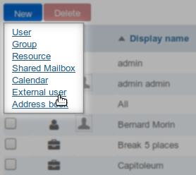
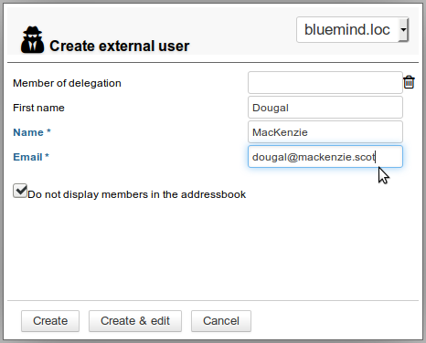
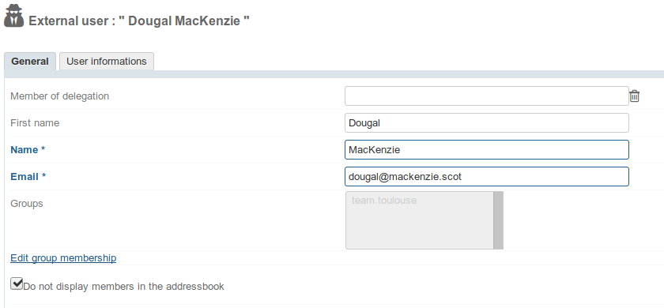
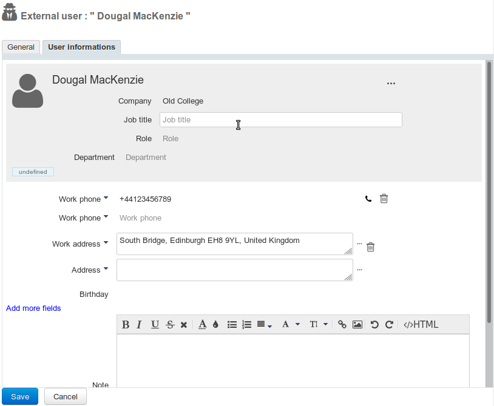
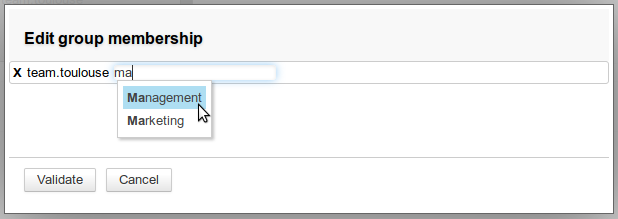
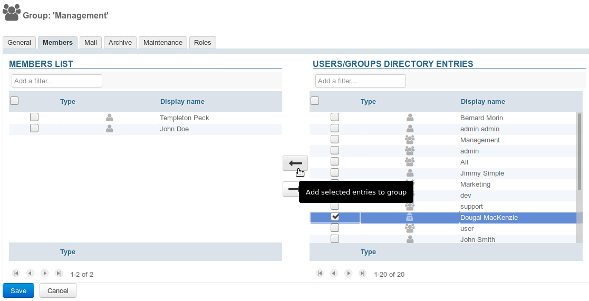
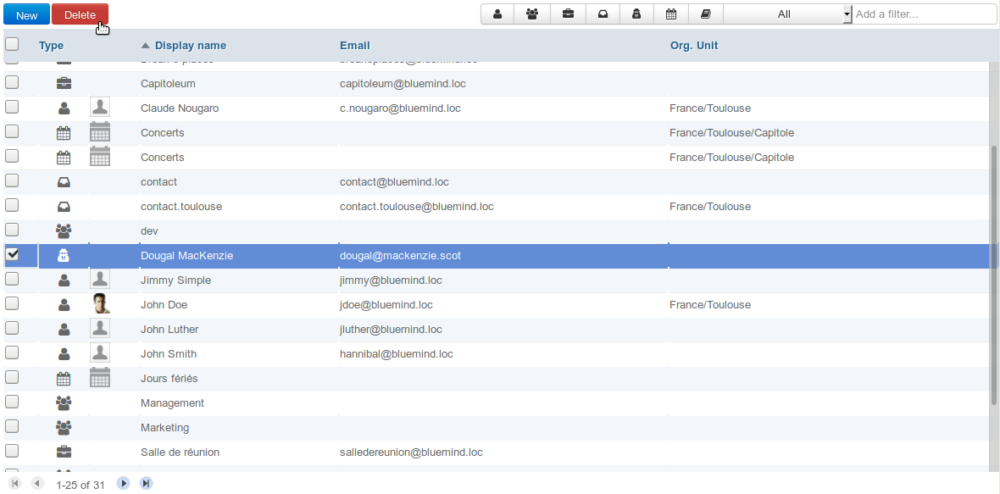

# External Users

# Introduction

External users are users who do not have a BlueMind account but have an **email address outside** BlueMind. ****These users can be added to BlueMind groups in order to receive messages****.  

External users are shown in BlueMind with the following icon: 

# Creating external users

From BlueMind 3.5.10, directory shortcuts are shown in the homepage as well as in the drop-down menu for creating new entities:

Click the "External user" link to open the "create external user" window. External users have fewer properties than BlueMind users:

- **Member of delegation**: the user can belong to an organisational unit (see [L'administration déléguée](/Guide_de_l_administrateur/Gestion_des_entités/Utilisateurs/L_administration_déléguée/))
- **First name**: -optional-
- **Name**: required
- **Email**: required - must contain a valid email address
- **Do not display members in the addressbook**: the contact may be a member of a group but will not be shown in the directory - this option is enabled by default, it can be disabled/enabled again on creation and at any other time.

After you've filled in the form, click:

- &lt;Create> to create the user immediately as is
- &lt;Create & edit> to create the user and open the full user information window

# Managing external users

## The user

The General tab in the user information window enables you to complete/edit the fields filled in on creation as well as edit the groups the user belongs to:

## The contact card

The "User informations" tab allows you to add user details so that it can be shared in the directory:

## Adding users to a group

There are two ways you can add users to a group:

1 in the user information window, click "Edit group membership" and enter the groups you want to add the user to:
1 in a group's information window, look for the user and add it as you would any other user:

:::important

Users are added to the group instantly, at which point they will start receiving messages addressed to the group (either via the group's address or when their address is added to that of other members if the group doesn't have an email address).

:::

## Deleting external users

To delete an external user:

- go to the BlueMind directory window
- select the user and click "Delete":

:::important

User removal from groups

The user is automatically removed from all the groups it belonged to.

:::

