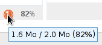
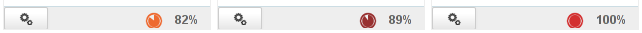

# Users


# Introduction

Users are individuals who connect to BlueMind. Users have access to BlueMind features depending on their profile. 

Two types of users with the following profiles can be created:

- user: access to the Mail, Calendar, Contacts and Settings applications.
- admin: access to user applications plus the admin console.


Administration roles:

- **Functional domain administrator **(usually called **domain administrator).** Domain administrators are users who have been given admin privileges. Several users can act as functional administrators on a single domain. They manage users, groups and users from the BlueMind admin console as well as domain configuration and shared items (mailboxes, calendars, address books).They can delegate permissions by creating other administrators.
- **Platform administrator **(also called** global administrator). ** There is only one global administrator on any one BlueMind install. The global administrator logs in with the username admin0@global.virt and is responsible for the technical aspects of the platform. The global administrator does not have a user account and only has access to the admin console. The global administrator is responsible for installing and configuring domains: server addresses, disk space, specific scheduled jobs, etc. and has access to the same administration functionalities as domain administrators.


# Creating a user

From the homepage or the "Directories" page, click "Create user" and complete the new user information in the dialog box that opens:


:::important

The display name is generated automatically when the First and Last names are entered and cannot be edited.

:::
:::important

Only fields marked with an asterisk (Last Name, Login and Password) are mandatory.

:::

Accounts can be created with or without an email address:

- Without an email address, the "Mail" section is disabled and the "Mail" tab is unavailable.
- When you click "Mail address", the Mail account is activated and a default, non-editable email address based on the login username is created automatically.To add aliases, click  at the end of the row.
- If the install has several domain aliases, each email address can be registered on a specific domain or on all aliases.BlueMind allows you to create as many aliases as you like on as many domains aliases as you like.


## Quick create

The "Create" button (&lt;Enter> key) quickly creates a user with the information entered in the dialog box and the following default settings:

- server localization (time zone, format, etc.)
- default storage server, with no disk space quota
- no auto-reply or auto-forward
- no contact details
- the calendar can be shared with the option "can invite me to a meeting". This means that other domain users cannot view this user's calendar but are able to invite them to an event 
- the mailbox is not shared
- archiving is disabled


These settings can be changed later in the admin console.

## Create and edit

The "Create and edit" button (&lt;Ctrl+Enter>) creates a user with the information entered in the dialog box and the default settings, and automatically redirects you to the user settings editor.

# Editing and managing users 

From the homepage or the "Directories" page, go to "Directory Browser" and select the user from the list.

The user's information is shown in tabs:


## General

### General user information

The "General" tab shows the main user information: account details, profile, group(s), password, time format settings...

It also allows you to set the user as the member or administrator of a [root delegation](/Guide_de_l_administrateur/Gestion_des_entités/Utilisateurs/L_administration_déléguée/).
:::important

Group memberships

The link "Edit group membership" opens a popup window showing the groups users belong to and can be edited.


To delete a group, click the corresponding "x". To add a group, simply type the group's name in the text box and validate it when suggested by autocomplete.

:::

### Roles: administration rights and access to features

You can set which rights are granted to a user or a domain administrator. You can therefore specifically authorize them to manage:

- users
- groups
- domain address books
- domain calendars
- shared mailboxes
- resources
- the domain (maximum quota max, number of users)
- ...


:::important

Delegating rights

Administrators are only able to delegate a right they have, except for access to applications: e.g. even if they don't have a mail account or access to the Calendar application, they can enable "Mail and Contacts" or "Calendar and Tasks" for users they administrate.

:::

Rights are organized into the following sections:

- **Administration**: used to delegate administration rights to entities
- **Cloud**: used to give access to the linked attachment and attachment storage features
- **General**: used to give access to applications (webmail, calendar, etc.) and other key features (personal mail filters, identities, mail transfer, etc.)
- **Mail**: used to give access to mail-specific features

:::important

Inherited rights

The rights granted can only be added to the rights inherited from a group: the rights assigned to a group the user belongs to cannot be unchecked in the user's page.

Applications can therefore appear as unchecked but be accessible to a user regardless: the user belongs to a group for which the application is enabled. Make sure you check the groups the user may belong to (see above).

This is also what enables a newly-created user to have access to basic applications: when users are created, they belong to the "user" group which, by default, on a classic blank install, has access rights to the "Calendar and Tasks" and "Mail and Contacts" applications.

:::

For more details on roles, please go to the dedicated page [Roles: Access and Administration Rights](/Guide_de_l_administrateur/Gestion_des_entités/Utilisateurs/Les_rôles_droits_d_accès_et_d_administration/) as well as the page about [L'administration déléguée](/Guide_de_l_administrateur/Gestion_des_entités/Utilisateurs/L_administration_déléguée/).

## User information

The "User Information" tab allows administrators to complete user contact details.

Administrators can enter information such as telephone numbers, postal addresses or assign pictures that will be used throughout the application (e.g. in [Contacts](/Guide_de_l_utilisateur/Les_contacts/) or [the dialler](/Guide_de_l_utilisateur/La_téléphonie/)).


User contact information belongs to the internal BlueMind directory and can be seen by all users. Only **administrators are allowed to edit this information.** Users themselves are unable to access this page or edit it.
:::important

The "Change own information" role now allows users to manage their own information details. Currently, changes can only be made by script using user API keys. A management interface will be available soon in settings.

:::

## Mail settings

The "Mail settings" tab gives you access to mail-related settings:


### Email addresses

- **Storage server**: server that handles this user
- 
**Disk space quota**: maximum storage space for a user's mailbox.
The quota used is visible with the dedicated progress bar visible above
:::important

** **About space quotas** **

When disk space quota is enabled, the disk usage percentage is displayed permanently in Mail at the bottom of the left-hand pane and hovering with the mouse shows usage details:
 

Disk space quota usage is color-coded –  orange = 75% used, dark red = 85% used, and red 100% used:



When a quota is reached, incoming emails are blocked. These messages can be kept on the server for a few days.
This may also cause disruptions to send - and possibly delete - operations as the system needs to perform copies in a temporary and/or trash folder.
:::important

Space quotas and deletion

To delete messages when the disk quota has been reached, use the delete permanently function (without sending them to the trash) by pressing &lt;SHIFT+Del>.

:::

When a space quota has been reached, you can increase it manually and decrease it back to its original size at any time.

:::

- 
**Main email address **and** **alias: users can have as many email aliases as desired, on any or all domain users available.


### My identities

Identities allow users to write messages as an alias or a shared mailbox or to set up different signatures.


 

To find out more, go to the user's guide page:    [Identities](/Guide_de_l_utilisateur/La_messagerie/Les_identités/)

### Mailbox sharing

The sharing section allows you to make a user's mailbox public (shared with all directory members) or customize its sharing options (share mailbox with specific users or groups only).

By default, when a user is created, sharing is disabled.

A mailbox's sharing rights can be set:

- by administrators through the UI described here
- by users, through settings: Settings icon > Mail section > [Sharing](/Guide_de_l_utilisateur/Gestion_des_partages/).


To find out more about sharing and privileges, go to the user's guide page: [Mail preferences | §5 - Sharing](/Guide_de_l_utilisateur/La_messagerie/Préférences_de_messagerie/)

### Forwarding emails

Since BlueMind 3.0.31, you can set up several addresses for email messages to be forwarded to.

:::important

Autocomplete looks for addresses in all user address books (directory, personal address books, etc.).

:::

You can also add external addresses manually. These will not be added to collected addresses when messages are forwarded.

### Vacation

This section allows you to enable or disable a user's vacation responder.

To find out more about configuration and sending rules, go to the user's guide page: [Mail preferences | §1 - General preferences](/Guide_de_l_utilisateur/La_messagerie/Préférences_de_messagerie/)

### My filters

Filters allow you to apply sorting rules and actions to be performed automatically on a user's incoming messages.


To find out more about configuration and sending rules, go to the user's guide page:   [Message filters](/Guide_de_l_utilisateur/La_messagerie/Les_filtres_de_messages/)

## Archiving

When archiving is [enabled for the domain](/Guide_de_l_administrateur/Configuration/Gestion_des_domaines/#ManagingDomains-Archivage), it applies to all domain users. You can however customize archiving rules by group or by user, or enable individual archiving if no global domain policy has been set.

By default, domain settings are applied and can be seen in the user's section:


The Archive tab allows you to:

- 
**enable individual archiving **if no [global domain archiving](/Guide_de_l_administrateur/Configuration/Archivage/) policy has been set.
:::important

The opposite is not possible: archiving cannot be disabled for a user if it enabled for a domain or a group the user belongs to.

:::

- **customize the number of days** after which messages are archived. All older messages will be archived.
- 
**customize the disk space quota** allocated to this user.
:::important

The quota cannot exceed the maximum domain quota: if you enter a number that exceeds it, it will be taken down to the maximum quota when you save.

:::

- check or uncheck the folders you want to **exclude** as needed
- click "Save" to apply the changes.


The "**Reset archive policy**" box allows you to reset the user's default values: either those of the group it belongs to, or the domain's if no specific settings have been set for the group:

- check the box, the form is grayed out
- click "Save"
- the information is saved, the form is enabled again and it contains the data set for the hierarchy level above it (group or domain)

:::important

The MiB (Mebibyte) is a multiple of a byte, not to be confused with the MB (megabyte): it is equal to 1024 kebibytes, which itself is equal to 1024 bytes.

Therefore, 9 MiB equals 9.43718 MB.

:::

## Address Books

This tab allows you to manage user subscriptions to the address books available to them (personal address books or address books shared with them) as well as manage how their address books are shared with other users or groups.


Administrators are not, however, able to create address books for users.

To find out more, go to the user's guide page: [Contact preferences](/Guide_de_l_utilisateur/Les_contacts/Gestion_des_carnets_d_adresses/) and [Managing Shares](/Guide_de_l_utilisateur/Gestion_des_partages/)

## Calendar sharing

The "Calendar settings" tab contains all user-specific parameters (working hours and days, items displayed, etc.) as well as sharing options and subscriptions (users or domains) for calendars shared with them:


:::important

As for address books, administrators cannot create additional calendars for users but they can manage how they are shared both for domain users and [individuals outside BlueMind](/Guide_de_l_utilisateur/L_agenda/Le_partage_d_agenda/):


:::

## Todolists

This tab allows you to manage user to-do lists and user subscriptions to lists shared with them:


To find out more, go to the user's guide pages on: [to-do lists](/Guide_de_l_utilisateur/Les_tâches/) and [Managing shares](/Guide_de_l_utilisateur/Gestion_des_partages/)

## Maintenance

This tab gives you access to maintenance features and user preferences:

  


### External ID

This box is filled in when the user is synchronized with an [AD](/Guide_de_l_administrateur/Gestion_des_entités/Synchronisation_Active_Directory/) or [LDAP](/Guide_de_l_administrateur/Gestion_des_entités/Synchronisation_LDAP/) account. It can be filled in or edited to force or correct the user's UID in the AD or LDAP directory.

### Validate user

The "Execute" button runs a "Validate and repair" operation on the user's account. This includes a series of operations that verify and correct – if needed – the user's integrity and their data in the BlueMind system –  verification of the mailbox in Cyrus, calendar and address books containers, IMAP folders hierarchy, subscriptions, mail filters, etc.

This operation is the same as the following [bm-cli](/Guide_de_l_administrateur/Administration_avancée/Client_CLI_pour_l_administration/) command:


```
bm-cli maintenance repair user@domain.net
```


### As the user

The link in this section can be accessed by the admin0 superadministrator or any other administrator with the [role "Sudo (elevated privileges)"](/Guide_de_l_administrateur/Gestion_des_entités/Utilisateurs/Les_rôles_droits_d_accès_et_d_administration/). This link is used to access the user's BlueMind, i.e. it connects to BlueMind in their place without them having to give their password.

### Password

You can change/reset the user's BlueMind login password without knowing their old password.


From version 4.3, BlueMind has a more detailed password management and expiry policy.

If the password has been changed, this section now shows the date and time when it was changed and who changed it (an administrator or a user).
:::important

This information isn't retroactive -- dates prior to the server update to 4.3 are not shown.

For users created after the 4.3 version update, the change date may be the user's creation date.

:::

You also have two options:

- **Update password on next login**: the user will be forced to change their password the next time they log in
- **Password never expires**: this option excludes the user from the [domain password expiry](/Guide_de_l_administrateur/Configuration/Gestion_des_domaines/) policy if it has been set up.


To enable either of these options, check the corresponding box and click "Save" at the bottom of the page.
:::important

AD or LDAP connections

The password expiry policy does not apply to users imported from an AD or LDAP directory.

:::

### Mailbox indexing

This section gives you access to mailbox index consolidation operation for a user's mailbox: this operation completes the mailbox's current indexation by indexing missing items only

 

To run the operation, simply click "**Execute**" next to "**Consolidate mailbox index**".

### Mobile devices

This section is used to manage user mobile devices: authorizations, synced devices, reset, remote wipe.


- **Partnership**: this box is used to suspend or enable a device's syncing without removing it altogether.
- **Identity**: shows the serial number the device signed in under
- **Type**: device brand/OS 
- **Last Sync**: date and time of the device's latest sync with the server
- **Reset sync**: resets the device's sync information. The next sync will be performed the same way as an initial sync – the device will perform a full sync as if it had never been known to the server.
- **Remote wipe**: erases all the data on the device – including BlueMind-related information and personal information (photos, SMS, etc.)  **This cannot be undone.**  *See paragraph 4 on the page [EAS Server Configuration](/Guide_de_l_administrateur/BlueMind_et_mobilité/Configuration_du_serveur_EAS/) *
- **Trash icon**: removes a device from synced devices.Removing a smartphone from the list blocks this device's synchronization in BlueMind - when unknown devices are not authorized by default. The "Authorize unknown devices" option is connected to a BlueMind instance. It can be modified by admin0, in the Central administration section > System Management > EAS server.*See the page [EAS Server Configuration](/Guide_de_l_administrateur/BlueMind_et_mobilité/Configuration_du_serveur_EAS/) *


# Deleting users

## Suspend

Users can be suspended. This allows you to block access to a user without deleting the data associated with them. As a result, users can be reactivated later and their account returns to its previous state.

To suspend a user:

- Go to Directories > Directory Browser and select the user.
- in the first tab ("General") check the "Suspended" box on the right hand side of the page and click "Save to apply changes".


## Delete

To delete one or several users completely and permanently, go to the page Directories > Directory Browser.

In the list of users, check the box at the beginning of the row for the user(s) you want to delete and click "Delete". You are then prompted to confirm deletion. ** Once you confirm, the user(s) and all their data will be deleted permanently. **
:::important

Restoring a user

BlueMind allows you to restore a user by retrieving an earlier backup. Please refer to the "restore a backup" feature, which enables you to restore all or part of a user's data. Changes made to data since the last backup cannot be recovered.

:::

See also [Procédure de départ utilisateur et redirection de ses mails](/Guide_de_l_administrateur/Gestion_des_entités/Utilisateurs/Procédure_de_départ_utilisateur_et_redirection_de_ses_mails/)

# Password security

To make user passwords more secure, you can install the "Password SizeStrength" plugin which lets you set strict password rules.

## Installing the plugin

As root:


```
aptitude install bm-plugin-core-password-sizestrength
```


To complete installation, you must restart BlueMind:


```
bmctl restart
```


## Configuration

From version 4.3, password policies are configured in the admin console > System Configuration > Password policy tab:


The changes are effective immediately – no restart required.
:::important

Changes are not retroactive and only apply to future password changes – users whose current password does not meet newly set rules will not be asked to change it and it will continue to work.

:::

#### Versions earlier than 4.3

Once the plugin is installed, it can be configured via file `/etc/bm/password.ini,` whose default installation values are:


```
length=10
capital=1
digit=1
lower=1
special=1
```


- `length`: the minimum number of characters the password must contain
- `capital`: the minimum number of capital letters the password must contain
- `digit`: the minimum number of digits the password must contain
- `lower`: the minimum number of lowercase letters the password must contain
- 
`special`: the minimum number of special characters the password must contain. Special characters are:


```
!"#$%&'()*+,-./:;<=>?@[\]^\_`{|}~
```


:::important

These rules do not apply to administrators (global administrator admin0 or domain administrators) whose choice of password continues to be free.

:::

If a user fails to comply with these rules when they attempt to modify their password, an alert will be displayed at the top of their page:


