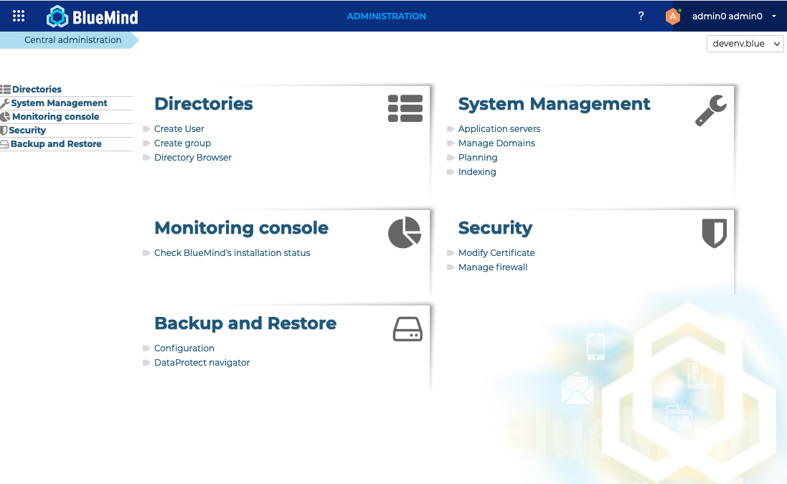

# Admin Console

The admin console allows the global administrator as well as domain administrators to manage system configuration, servers, domains, scheduled jobs and documentation.

The configuration of a BlueMind server includes platform-specific operations, which apply to all the domains of a BlueMind server, and to domain-specific operations.

In this documentation, we use the following terms: 

- global administrator (or superuser) for platform-related operations; whose username is *[admin0@global.virt](mailto:admin0@global.virt)*.
- domain administrator for domain-specific operations.

Global administrators are able to perform all domain administrator operations.

