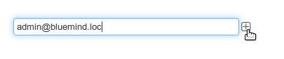

# BlueMind Subscription

# BlueMind – Open Source Solution and Professional Subscription

## BlueMind's Open Source Solution

BlueMind offers an Open Source collaborative mail, calendar and contacts solution and new generation collaborative spaces developed by a team of experts. It features streamlined ergonomics, a highly responsive web-based interface, comprehensive mobility management and an enhanced mail service through collaborative spaces and business rules capabilities. BlueMind's design relies on an up-to-date, open architecture (offline mode, native web services, an API that covers 100% of the scope, plugins, etc.).

## BlueMind's Professional Subscription

Building upon its Open Source software, BlueMind's professional solution seeks to provide long-term in production use with complete peace of mind.

The professional subscription's software versions are guaranteed and supported by BlueMind SAS. It includes access to updates and upgrades as well as additional components and tools, making it easier to operate and integrate into any information system.

This professional offering – "BlueMind Subscription" – is the solution you cannot go without to ensure that your system remains operational.

# Subscription contents 

The BlueMind Subscription includes:

- The BlueMind Open Source software in guaranteed, supported versions 
- [updates](/Guide_d_installation/Mise_à_jour_de_BlueMind/)
- upgrades (new versions)
- comprehensive connector-free use of Outlook 
- a graphical update tool that makes updating and upgrading easy
- additional components:
  - 
an [Active Directory connector](/Guide_de_l_administrateur/Gestion_des_entités/Synchronisation_Active_Directory/)

:::important

Update notifications

Don't forget to sign up for our notifications about new versions - updates and upgrades: [https://lists.bluemind.net/mailman/listinfo/bluemind](https://lists.bluemind.net/mailman/listinfo/bluemind)

:::

## Guaranteed versions with vendor support 

The BlueMind Subscription includes identified, vendor-supported versions with updates and upgrades. 

## Update tool

BlueMind's update tool is straightforward, secure and fast so that updates not remain virtual and are applied quickly.  

To ensure scalability, subscriptions include a graphical administration tool for software updates and upgrades. The client can decide when to perform updates.

# Subscription types

BlueMind offers different subscription options depending on usage and end user type:

- Prod / Host
- Trial (Testing, Preprod, Dev...)
- Free

## Prod / Host

Production / hosting subscriptions allow clients to install and maintain the BlueMind solution according to vendor-agreed characteristics.

Note: Host subscriptions are reserved for our hosting partners.

## Trial

Trial subscriptions are designed for testing, development or pre-production environments, with a full professional solution for a limited duration and number of users.

## Free

A full-feature, free subscription can be offered to certain audiences such as:

- non-profit organizations that operate in the field of Open Source
- major contributors
- individuals – for personal use – with a maximum of 10 accounts.

# Validity limits
:::important

Who is the subscription administrator?

Subscription administrators are the [users who are assigned the role](/Guide_de_l_administrateur/Gestion_des_entités/Utilisateurs/Les_rôles_droits_d_accès_et_d_administration/) "Manage the BlueMind subscription"

- users without access to the admin console will receive notification emails
- users with access to the admin console will receive notification emails and will be able to access the page where they will be able to install and update the subscription

:::
:::important

Service continuity

During periods when users are unable to log in, the system continues to work. BlueMind isn't blocked, only access to it is: incoming emails continue to come in and are handled by the server, users will find them in their inbox when they are able to access BlueMind again.

:::

## Expiry

BlueMind subscriptions are valid until a given date.

For PROD or HOST subscriptions, administrators receive reminders of the impending expiry

1 2 months before the expiry date: an email is sent to domain administrators
1 1 month before the expiry date: an email is sent to domain administrators and a banner appears on their UI as well as the superadministrator's admin0
1 on the expiry date:
  - an information banner appears in users' UI
  - when administrators log in, they are automatically redirected to the subscription management page so that they can correct the situation
  - an email is sent to administrators every two days
1 10 days after the expiry date:
  - all users are blocked: BlueMind cannot be accessed, including remotely (mobile, third-party software...)
  - when they log in, administrators are automatically redirected to the subscription management page so that they can correct the situation

For trial subscriptions, the system is blocked on the expiry date:

- users are no longer able to log into BlueMind
- 
administrators are able to log in and are automatically redirected to the subscription management page so that they can correct the situation

## Number of users

The BlueMind subscription entitles clients to a certain number of users.

A 10% excess allowance is provided so that administrators can correct the situation.

Administrators are informed as follows:

1 **When additional users are created **and until the number of users exceeds the subscription's excess allowance:
  - an information banner appears in their UI, in the admin console as well as other applications (mail, calendar, etc.)
  - a reminder email is sent every 7 days.
1 **After one month**, if the situation has not been addressed (users deleted or subscription adjusted): 
  - all users' access is blocked: users are no longer able to access to BlueMind, including remotely (mobile, third-party software...)
  - an information email is sent to administrators
  - administrators with the appropriate rights can log into the admin console in order to correct the situation

**If the 10% excess threshold has been reached, creating new users is no longer possible**. An information banner appears in administrator's BlueMind UI (admin console, mail, calendar, etc.).

# Email alerts

When a validity (number or user or date) limit is approaching or has been reached, an alert banner is shown in administrators' or users' UI – as applicable, see previous chapter – and email alerts are sent. 

For this, you ****must** **to have at least one recipient email address filled in in the subscription management page to make sure that at least one person receive the alerts as the system may be blocked if the subscription isn't updated in time (see previous chapter). Until an email address is provided, an information banner will be shown in the admin console for users with the [appropriate role](/Guide_de_l_administrateur/Gestion_des_entités/Utilisateurs/Les_rôles_droits_d_accès_et_d_administration/):

Clicking the text in the banner takes you directly to the subscription management page. In that page, a warning is displayed as well as a box for you to add an email address:

To add an email address, simply type it in the box and click the  button:

The email is added immediately and the warning disappears:

Repeat this process for as many email addresses as you need:

:::important

Mise en indésirable

Regarding external email addresses, some anti-spam programs may filter the message: make sure you tell the recipient to check their spam folder regularly.

For this reason, it is always preferable to have at least one internal recipient.

:::

You can remove email addresses at any time by clicking the  button next to it:

No need to confirm or save, all changes are effective immediately.

