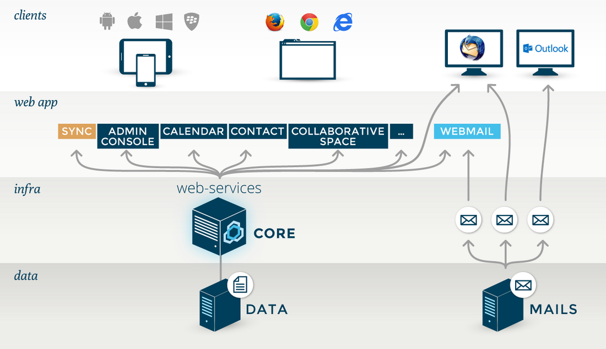

# BlueMind in a nutshell

BlueMind is 100% web-based.

All its features are designed for and can be accessed through a web browser. This means mail clients are no longer required and deployment is much easier.

BlueMind supports the following browsers in particular:

- Mozilla from version ESR 52
- Chrome : last version
- Internet Explorer from version 11
- Safari from version 5.

#### Full JavaScript User Interfaces

BlueMind's rich thick client-like ergonomics are available through a simple web browser with:

- No page reloading
- Browser-based offline mode

#### Message Queue (MOM)

BlueMind uses message queues to help restrict redundant traffic and centralize processes, in particular:

- push e-mail (new mail messages are pushed to mobile devices when necessary, making the traffic caused by checking for new messages redundant),
- session replication between all BlueMind servers,
- load balancing and high availability.

#### Integrated SSO

BlueMind has its own SSO, which makes switching applications transparent. In web mode, whatever the web browser used, users are authenticated when they access BlueMind. Once their authentication is validated, users can access all BlueMind applications (Mail, Calendar, Contacts, Admin Console...) without having to authenticate again.

In addition, the SSO enables single logout, which disconnects users from all BlueMind windows or tabs when they disconnect in one window.

#### Microsoft Environment

BlueMind allows you to avoid having to re-authenticate when using a Microsoft environment.

This means that in Windows, an Outlook user's authentication to the Active Directory is picked up when they open Outlook. As a result, the connection to BlueMind is transparent.

Enregistrer

