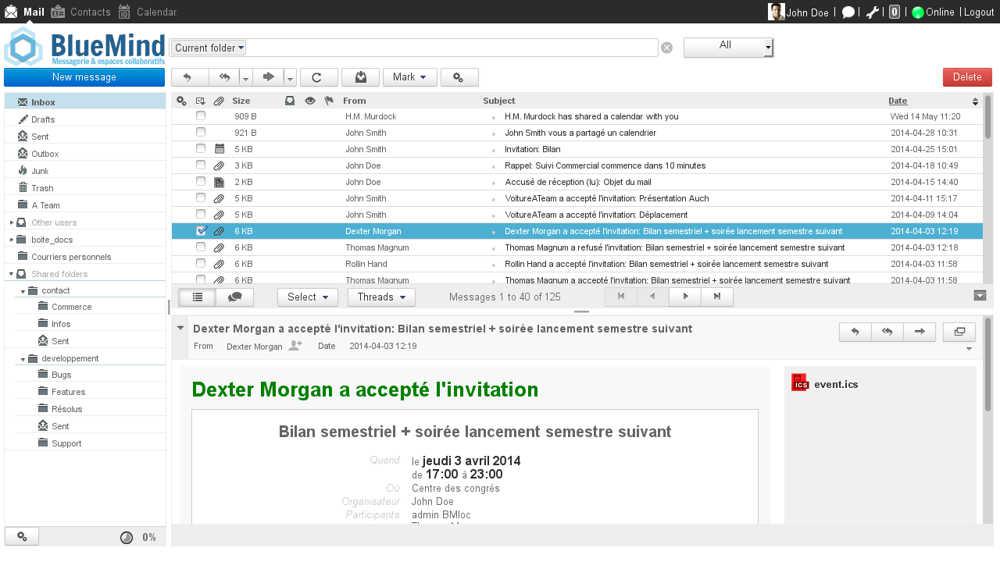
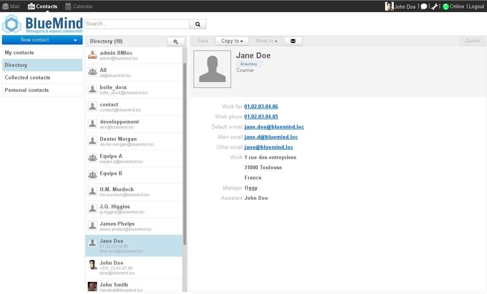
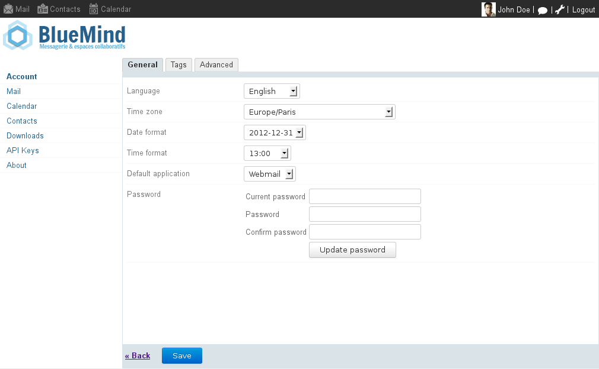

# Applications and Components

# User applications

## Mail

The BlueMind Mail application is fully integrated with other BlueMind applications.

Key features include:

- 3-pane view
- in-app reply to events
- BlueMind contact and distribution list autocomplete
- advanced full-text and multifolder search

## Calendar

The Calendar application includes the following key features:

- offline mode support
- multi-calendar display
- tag management
- resources management

## Contacts

The Contacts application includes the following features:

- offline-mode support
- tag management
- contact list management
- user contacts and address book management 

## Settings manager

The settings manager allows users to change personal settings and display preferences.

It is accessed by clicking the spanner icon in the top right hand corner of the window:

   

Access to BlueMind settings

  

# Administrator applications

## Installation Wizard

The Installation Wizard (IW) allows you to install BlueMind on a new server. It configures all system components and BlueMind settings to provide a complete, consistent and efficient BlueMind installation.
:::important
The Installation Wizard cannot be used for BlueMind system updates. Only the Setup Wizard allows this operation.
:::

Interface translation not currently available

## Setup Wizard

The Setup Wizard (SW) is both a BlueMind installation and update assistant.

The Setup Wizard is included in the [BlueMind subscription](http://www.blue-mind.net/solutions/article/solution-professionnelle). In addition to performing the same operations as the Installation Wizard, it can be used to update a current BlueMind installation, including in a distributed environment and for major updates.

Interface translation not currently available

# Server components

## Core

The Core server component is BlueMind's main web service. It is used to manage:

- business logic
- access to databases
- calls to the BlueMind API

## Application server

All end-user web interfaces run from a JEE web server (Tomcat in BlueMind's case). Hosted applications are:

- Calendar
- Contacts 
- Admin console
- Settings manager
- Installation Wizard and Setup Wizard
- Apache Solr 
- XMPP server client interface (BlueMind v3 and above)

## SMTP and IMAP

BlueMind supports standard messaging protocols:

- SMTP via postfix
- IMAP and POP with Cyrus IMAPd

## MQ Server

Hazelcast comes packaged and fully integrated with BlueMind, enabling event exchange between BlueMind applications. This component is used to:

- send notifications for Calendar events (e.g. events issued by Core and listened on by EAS)
- send notifications for Contacts events (e.g. events issued by Core and listened on by EAS)
- send notifications for delivered emails (e.g. events issued by the LMTP daemon and listened on by EAS)
- send notifications for login and logout events (e.g. events issued by Core and listened on by HPS)

The Hazelcast cluster is made up of 3 nodes operated by the core, EAS and bm-webserver services. It is very important that the cluster is complete for BlueMind to work properly. Its status can be checked using [Bm-Tick](/Guide_de_l_administrateur/Supervision/Monitoring_Bm_Tick/) monitoring.

## EAS

EAS is a synchronization server that manages native protocols for mobile devices (smartphones, tablets, etc.). This enables users to use native smartphone applications to synchronize emails, calendars and contacts.

## Locator

The Locator component can be viewed as a internal name resolution server. It allows components to establish connections with each other.

For example, Locator allows the EAS component to recognize the name of the IMAP server that owns a specific user's mailbox. 

## HPS

HPS is a Reverse Proxy type HTTP authentication server. It is located between the [Nginx](http://wiki.nginx.org/Main) reverse proxy and user applications.

When authentication is required, HPS presents the user with the login dialog if the user isn't authenticated, or relays the query to the services requested. 

This component is responsible for SSO logic (Single Sign-On / Single Sign-Out) in the user interfaces.

## SASL Daemon

This component named YSNP is BlueMind's SASL authentication daemon. It is used for password validation against the Core component and authentication against the IMAP component for users connected via web interfaces.

# Plugins

BlueMind can be enhanced using add-ons or additional programmes which are shared by the community in the [MarketPlace](https://marketplace.bluemind.net/).

To find out more about developing these plugins, please go to the page [Contributing to BlueMind](/Guide_du_développeur/Contribuer_à_BlueMind/).

