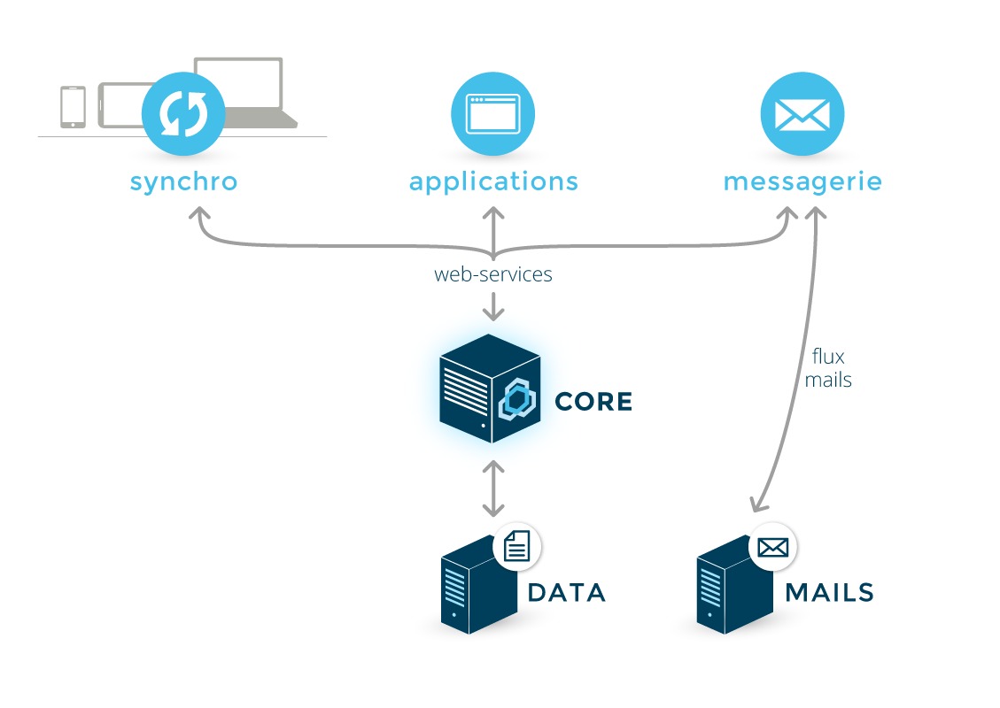

# Services

# Service architecture

- BM-Core is BlueMind's core component. It serves a a single management center for data and business rules. It is the only component that accesses the database.
- 
All functionalities are exposed as Web Services and can therefore be driven by other applications.

- 
All components, whether internal or external, use Web Services. This is useful for limiting incoming and outgoing BlueMind Mail flows (which are restricted to Web Services flows and mail flows) and ensuring the use of consistent management rules whatever the point of entry of a modification.

|  |  |
| --- | --- |
| 

|  |

 |

# Packages supplied with BlueMind

Packages are available in /var/spool/bluemind-pkgs/

Aptitude ([Debian](https://wiki.debian.org/fr/Aptitude)/[Ubuntu](https://doc.ubuntu-fr.org/aptitude)) and yum ([RedHat](http://www.linuxcommand.org/man_pages/yum8.html)) shell commands are used to search and list available and/or installed packages.

# Services used by BlueMind

   | Service | Use |
| --- | --- |
| net.bluemind.eas.push | syncing of mobile devices through the Exchange Active Sync protocol |
| net.bluemind.dav.server.dav | CardDav and CalDav syncing of Apple clients |
| net.bluemind.milter.milter | milter service  |
| net.bluemind.xmpp.server.launcher.tigase | instant messaging |
| net.bluemind.core.launcher.core | main service |
| net.bluemind.node.server.nodelauncher | communication between different servers in multi-server installations  |
| net.bluemind.tika.server.tika | detection and extraction of metadata and texts from documents |
| net.bluemind.proxy.http.launcher.hpslauncher | authentication proxy  |
| exchange.http | communication with MAPI |
| net.bluemind.webmodules.launcher.webLauncher | HTTP proxy for webservices |
| net.bluemind.locator.app | location service for different servers in multi-server installations |
| org.elasticsearch.bootstrap.Elasticsearch | indexing and search service  |
| net.bluemind.ysnp.ysnp | SMTP and IMAP authentication |
| net.bluemind.lmtp | local mail transfer service  |
| postgresql | database |
| postfix | mail server |
| nginx | HTTP + IMAP server |
| php-fpm | PHP interpreter for web applications (webmail) |
| cyrus (imapd and pop3d) | imap and pop syncing service for third-party mail software (thick or mobile clients) |

# Data used by BlueMind

## Backup 

- /var/backups/bluemind

## /etc

The files and directories found in `/etc/` contain the configuration of the components BlueMind uses.

   | File/directory | Contents |
| --- | --- |
| bm | bm.ini, bm-node certificates and ssh keys |
| bm-node | rsync.excludes |
| bm-webmail | php5-fpm configuration for BlueMind and nginx-webmail.conf |
| cyrus.conf | Cyrus configuration |
| imapd.conf | imap configuration (generated by bm-core) |
| nginx | nginx configuration |
| php5 | php5 configuration |
| postfix | postfix configuration, including transport mapsYou can add extra postfix maps but under no circumstances should you remove or edit existing maps used by BlueMind. |
| postgresql | postgresql configuration |

## /usr/share

Subfolders located in `/usr/share/` contain web modules and applications. The data in these directories is installed by the BlueMind packages and must not be edited.

- 
bm-conf/logs: applicative logs default configuration (log4)

## /var/spool

`/var/spool/` sub-directories contain the data used by BlueMind (excluding the data contained in the postgresql database).

    | Directory | Data | Storage Type |
| --- | --- | --- |
| bm-docs | BlueMind documents (user/resource photos) | all |
| bm-elasticsearch | ElasticSearch index | block device |
| bm-hsm | archived emails  | all |
| bm-filehosting | linked email attachments | all |
| cyrus/data | emails | all |
| cyrus/meta | email metadata | block device |
| postfix | postfix queues | all |
| sieve | script sieve | all |
| bluemind-pkgs | BlueMind installation data - used during installation and as long as you don't have a subscription | all |

## /var/lib

The data found in `/var/lib/` must not be edited manually.

   | Directory | Contents |
| --- | --- |
| bm-ca | certification authority generated during installation |
| postgresql | postgresql database |
| cyrus | Cyrus administrative information - list of BAL, ACLs, quota, quota used |

## Estimating folder sizes

The usual size of some folders can be estimated:

| Folder | Estimated Size |
| --- | --- |
| /var/spool/bm-elasticsearch | ~10% /var/spool/cyrus/data + /var/spool/bm-hsm**The size of the partition must be AT LEAST twice the volume of the data it contains.**Ideally, this folder should be deported and split into 2 dedicated partitions, which must meet the same size constraints:* /var/spool/bm-elasticsearch/data
* /var/spool/bm-elasticsearch/repo
 |
| /var/spool/cyrus/meta | ~10% /var/spool/cyrus/data + /var/spool/bm-hsm |
| /var/spool/sieve | ~1Mb/(users+mailshare) |

| Folder | Mount Type | Estimated Size |
| --- | --- | --- |
| /var/lib/cyrus | block device | ~10Gb |
| /var/lib/postgresql | block device | ~20Gb |

:::important

These are mere estimates, which may vary depending on your install and your organization's evolution. We therefore recommend that you use technologies that enable you to increase the size of your file system easily.

:::

# Logs

Logs are written into subdirectories of the `/var/log/` directory:

   | Directory | Content |
| --- | --- |
| bm | core logs  |
| bm-elasticsearch | elasticsearch logs |
| bm-hps | hps logs |
| bm-lmtpd | LMTP service logs |
| bm-locator | locator logs |
| bm-mapi | mapi service logs |
| bm-node | node logs |
| bm-tika | Tika logs |
| bm-webserver | webserver logs |
| bm-webmail | webmail logs |
| bm-xmpp | XMPP logs |
| bm-ysnp | YNSP logs |

For other components you may want to monitor, the following folders or sub-directories can be used:

   | Folder/directory | Contents |
| --- | --- |
| mail.err | Postfix/Cyrus errors |
| mail.log | Postfix/Cyrus logs |
| nginx/ | NGinx logs |
| bm-php5-fpm/ | FPM logs (/var/log/bm-php-fpm/ on RedHat) |
| postgresql/ | PostgreSQL logs |

For more information, please see [Logs](/Guide_de_l_administrateur/Supervision/Logs_Fichiers_journaux/)

