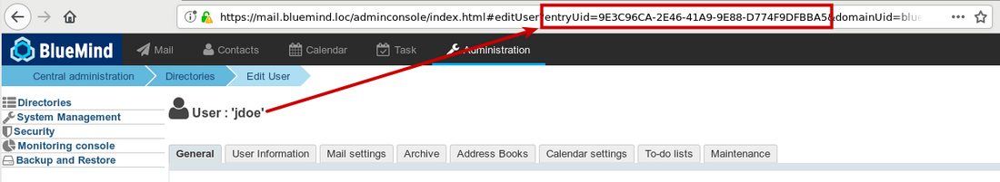
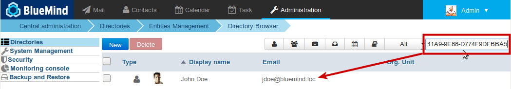

# Missing events


## Introduction

Actions carried out on calendar events (creation, modification, deletion) are logged on the server in the /var/log/bm/audit directory, in folders each corresponding to a calendar.

File names have the following format `audit-calendar:<calendar name>:<user uid >@domain.log`

E.g., the file for user John Doe's calendar on our demo server is called: `audit-calendar:Default:9E3C96CA-2E46-41A9-9E88-D774F9DFBBA5@bluemind.loc.log`


:::tip

uid and user ID

If you know a user ID, you can find their uid in their administration page: the uid can be seen in the url:


If you know an uid and you want to know what user it belongs to, simply search the uid in the users' administration page:


:::

## Decoding a simple event log line


:::info

L'outil en ligne de commande bm-cli permet un filtrage et un affichage plus clair du contenu des fichiers logs. Consultez la [documentation dédiée](/Guide_de_l_administrateur/Administration_avancee/Client_CLI_pour_l_administration/) ou l'aide en ligne de l'outil pour en savoir plus sur son usage et les options possibles :


```
bm-cli help calendar log
```


:::


:::tip

To find information on an event, you can use the "grep" command on their title (whole or in part) rather than browsing the user's file

:::

E.g., you can search the information about user John Doe's "Réunion commerce" event:


```
root@mail:/var/log/bm/audit# grep commerce audit-calendar:Default:9E3C96CA-2E46-41A9-9E88-D774F9DFBBA5@bluemind.loc.log
2018-02-13 10:55:27,347 INFO - 1518519326822 9bd44f3a-6201-44ed-972a-5e787fbae9fc : (actor:9E3C96CA-2E46-41A9-9E88-D774F9DFBBA5@bluemind.loc meta: {session=02907900-87a0-407b-bcb7-6fa48b9801b5, origin=bm-hps, remote=192.168.122.1,127.0.0.1}) -> (action:create, ro:false, meta: {sanitized-value="{\"main\":{\"dtstart\":{\"iso8601\":\"2018-02-15T14:00:00.000+01:00\",\"timezone\":\"Europe/Paris\",\"precision\":\"DateTime\"},\"summary\":\"Réunion commerce\",\"classification\":\"Public\",\"location\":\"\",\"description\":\"\",\"priority\":5,\"alarm\":null,\"status\":\"Confirmed\",\"attendees\":[],\"organizer\":null,\"categories\":[],\"exdate\":null,\"rdate\":null,\"rrule\":null,\"url\":\"\",\"dtend\":{\"iso8601\":\"2018-02-15T15:00:00.000+01:00\",\"timezone\":\"Europe/Paris\",\"precision\":\"DateTime\"},\"transparency\":\"Opaque\"},\"occurrences\":[],\"properties\":null,\"icsUid\":\"489eddbe-b669-4bdc-b8ba-e9ffe672f8e2\"}", item-uid="80e03821-6fcd-4c02-b45f-fc320c5461cb", value="{\"main\":{\"dtstart\":{\"iso8601\":\"2018-02-15T14:00:00.000+01:00\",\"timezone\":\"Europe/Paris\",\"precision\":\"DateTime\"},\"summary\":\"Réunion commerce\",\"classification\":\"Public\",\"location\":\"\",\"description\":\"\",\"priority\":5,\"alarm\":null,\"status\":\"Confirmed\",\"attendees\":[],\"organizer\":null,\"categories\":[],\"exdate\":null,\"rdate\":null,\"rrule\":null,\"url\":\"\",\"dtend\":{\"iso8601\":\"2018-02-15T15:00:00.000+01:00\",\"timezone\":\"Europe/Paris\",\"precision\":\"DateTime\"},\"transparency\":\"Opaque\"},\"occurrences\":[],\"properties\":null,\"icsUid\":\"489eddbe-b669-4bdc-b8ba-e9ffe672f8e2\"}", sendNotif="false"}) on (object:calendar:Default:9E3C96CA-2E46-41A9-9E88-D774F9DFBBA5@bluemind.loc meta: {container-json="{\"id\":27,\"uid\":\"calendar:Default:9E3C96CA-2E46-41A9-9E88-D774F9DFBBA5\",\"type\":\"calendar\",\"name\":\"John Doe\",\"owner\":\"9E3C96CA-2E46-41A9-9E88-D774F9DFBBA5\",\"createdBy\":\"system\",\"updatedBy\":\"system\",\"created\":1475668302446,\"updated\":1475668302446,\"domainUid\":\"bluemind.loc\",\"defaultContainer\":true,\"readOnly\":false}"}) succeed
2018-02-13 10:56:06,389 INFO - 1518519366020 4b5d4721-8600-4639-ab24-e99bf7d8831c : (actor:030835FF-B045-448D-AFAE-EAA8CFA0F3F6@bluemind.loc meta: {session=d26c1876-d92e-4ecd-855c-a536398cc9e4, origin=bm-hps, remote=192.168.122.1,127.0.0.1}) -> (action:delete, ro:false, meta: {previous-value="{\"main\":{\"dtstart\":{\"iso8601\":\"2018-02-15T14:00:00.000+01:00\",\"timezone\":\"Europe/Paris\",\"precision\":\"DateTime\"},\"summary\":\"Réunion commerce\",\"classification\":\"Public\",\"location\":\"\",\"description\":\"\",\"priority\":5,\"alarm\":null,\"status\":\"Confirmed\",\"attendees\":[],\"organizer\":null,\"categories\":[],\"exdate\":null,\"rdate\":null,\"rrule\":null,\"url\":\"\",\"dtend\":{\"iso8601\":\"2018-02-15T15:00:00.000+01:00\",\"timezone\":\"Europe/Paris\",\"precision\":\"DateTime\"},\"transparency\":\"Opaque\"},\"occurrences\":[],\"properties\":{},\"icsUid\":\"489eddbe-b669-4bdc-b8ba-e9ffe672f8e2\"}", item-uid="80e03821-6fcd-4c02-b45f-fc320c5461cb", sendNotif="false"}) on (object:calendar:Default:9E3C96CA-2E46-41A9-9E88-D774F9DFBBA5@bluemind.loc meta: {container-json="{\"id\":27,\"uid\":\"calendar:Default:9E3C96CA-2E46-41A9-9E88-D774F9DFBBA5\",\"type\":\"calendar\",\"name\":\"John Doe\",\"owner\":\"9E3C96CA-2E46-41A9-9E88-D774F9DFBBA5\",\"createdBy\":\"system\",\"updatedBy\":\"system\",\"created\":1475668302446,\"updated\":1475668302446,\"domainUid\":\"bluemind.loc\",\"defaultContainer\":true,\"readOnly\":false}"}) succeed
```


The key information in these lines is:

- **2018-02-13 10:55:27,347**: the date when the action was carried outWarning: this is GMT time, there may therefore be a difference between the actual time the event was carried out depending on the time zone you are in. The action herewith described was logged in France during winter time, it was in fact logged at 11:55.
- **origin**: the action's provenance
In this example, bm-hps indicates an hps connection, i.e. either a webmail or Thunderbird connector connection


:::tip

Possible origins include:

- ****bm-hps****: webmail or Thunderbird
- ****bm-connector-outlook-&lt;version>****: Outlook*e.g.: origin=bm-connector-outlook-3.1.25071 otlk:16.0.0.4266*
- ****bm-eas****: EAS connected device


:::

- **actor**: **uid of the user who carried out the action**In this example:
    - 1st line: [9E3C96CA-2E46-41A9-9E88-D774F9DFBBA5@bluemind.loc](mailto:9E3C96CA-2E46-41A9-9E88-D774F9DFBBA5@bluemind.loc): corresponds to user John Doe  
    - 2nd line: [030835FF-B045-448D-AFAE-EAA8CFA0F3F6@bluemind.loc](mailto:030835FF-B045-448D-AFAE-EAA8CFA0F3F6@bluemind.loc): corresponds to user John Smith
- **action**: **the action carried out**In this example:
    - 1st line: action:create: creation of the event
    - 2nd line: action:delete: deletion of the event


Event-related information:

- **dtstart** and **dtend** allow you to identify the event's start and end timesIn this example:
    - dtstart: 2018-02-15T14:00:00.000+01:00: 15/02/2018 at 3pm, GMT+1 time in the Europe/Paris zone
    - dtend: 2018-02-15T15:00:00.000+01:00: 15/02/2018 at 3pm
- **summary**: the event's titleIn this example:
    - \"summary\":\"Réunion commerce\": the event's title is "Réunion commerce"
- **\"attendees\":[]**: there are no attendees
- **\"organizer\":null**: no organizers are specified, this is a simple event on the organizer's own calendar
- **object:calendar** allows you to check the calendar concerned, its information is specified between parentheses.In this example, it includes:
    - the calendar's ID (the same name as the log folder)
    - **name**: the user's name: John Doe
    - **owner**: the user's uid: 9E3C96CA-2E46-41A9-9E88-D774F9DFBBA5


## Meeting logs 

Take for example, a meeting whose life cycle you want to look at:

1. the organizer creates a meeting with two invitees:


```
2018-02-13 12:39:23,734 INFO - 1518525563613 f7ed4a4e-6627-44aa-92bf-5b9b6d1fc5e6 : (actor:9E3C96CA-2E46-41A9-9E88-D774F9DFBBA5@bluemind.loc meta: {session=96a513b4-add8-4a7f-849f-aabcb87333b8, origin=bm-hps, remote=192.168.122.1,127.0.0.1}) -> (action:create, ro:false, meta: {sanitized-value="{\"main\":{\"dtstart\":{\"iso8601\":\"2018-02-15T15:00:00.000+01:00\",\"timezone\":\"Europe/Paris\",\"precision\":\"DateTime\"},\"summary\":\"Réunion de suivi\",\"classification\":\"Public\",\"location\":\"Agence de Toulouse\",\"description\":\"\",\"priority\":5,\"alarm\":[],\"status\":\"Confirmed\",\"attendees\":[{\"cutype\":\"Individual\",\"member\":null,\"role\":\"RequiredParticipant\",\"partStatus\":\"NeedsAction\",\"rsvp\":true,\"delTo\":null,\"delFrom\":null,\"sentBy\":null,\"commonName\":\"John Smith\",\"dir\":\"bm://bluemind.loc/users/030835FF-B045-448D-AFAE-EAA8CFA0F3F6\",\"lang\":null,\"mailto\":\"hannibal@bluemind.loc\",\"uri\":\"addressbook\_bluemind.loc/030835FF-B045-448D-AFAE-EAA8CFA0F3F6\",\"internal\":true,\"responseComment\":null},{\"cutype\":\"Individual\",\"member\":null,\"role\":\"RequiredParticipant\",\"partStatus\":\"NeedsAction\",\"rsvp\":true,\"delTo\":null,\"delFrom\":null,\"sentBy\":null,\"commonName\":\"client@somewhere.loc\",\"dir\":null,\"lang\":null,\"mailto\":\"client@somewhere.loc\",\"uri\":null,\"internal\":false,\"responseComment\":null}],\"organizer\":{\"uri\":null,\"commonName\":\"John Doe\",\"mailto\":\"jdoe@bluemind.loc\",\"dir\":\"bm://bluemind.loc/users/9E3C96CA-2E46-41A9-9E88-D774F9DFBBA5\"},\"categories\":[],\"exdate\":[],\"rdate\":null,\"rrule\":null,\"url\":\"\",\"dtend\":{\"iso8601\":\"2018-02-15T17:00:00.000+01:00\",\"timezone\":\"Europe/Paris\",\"precision\":\"DateTime\"},\"transparency\":\"Opaque\"},\"occurrences\":[],\"properties\":null,\"icsUid\":\"90318754-e081-4974-b54f-68c711727a85\"}", item-uid="50cdb282-f8f1-4d50-bdfd-3ef06e70f37e", value="{\"main\":{\"dtstart\":{\"iso8601\":\"2018-02-15T15:00:00.000+01:00\",\"timezone\":\"Europe/Paris\",\"precision\":\"DateTime\"},\"summary\":\"Réunion de suivi\",\"classification\":\"Public\",\"location\":\"Agence de Toulouse\",\"description\":\"\",\"priority\":5,\"alarm\":[],\"status\":\"Confirmed\",\"attendees\":[{\"cutype\":\"Individual\",\"member\":null,\"role\":\"RequiredParticipant\",\"partStatus\":\"NeedsAction\",\"rsvp\":true,\"delTo\":null,\"delFrom\":null,\"sentBy\":null,\"commonName\":\"John Smith\",\"dir\":null,\"lang\":null,\"mailto\":\"hannibal@bluemind.loc\",\"uri\":\"addressbook\_bluemind.loc/030835FF-B045-448D-AFAE-EAA8CFA0F3F6\",\"internal\":false,\"responseComment\":null},{\"cutype\":\"Individual\",\"member\":null,\"role\":\"RequiredParticipant\",\"partStatus\":\"NeedsAction\",\"rsvp\":true,\"delTo\":null,\"delFrom\":null,\"sentBy\":null,\"commonName\":\"client@somewhere.loc\",\"dir\":null,\"lang\":null,\"mailto\":\"client@somewhere.loc\",\"uri\":null,\"internal\":false,\"responseComment\":null}],\"organizer\":{\"uri\":null,\"commonName\":\"John Doe\",\"mailto\":null,\"dir\":\"bm://bluemind.loc/users/9E3C96CA-2E46-41A9-9E88-D774F9DFBBA5\"},\"categories\":[],\"exdate\":[],\"rdate\":null,\"rrule\":null,\"url\":\"\",\"dtend\":{\"iso8601\":\"2018-02-15T17:00:00.000+01:00\",\"timezone\":\"Europe/Paris\",\"precision\":\"DateTime\"},\"transparency\":\"Opaque\"},\"occurrences\":[],\"properties\":null,\"icsUid\":\"90318754-e081-4974-b54f-68c711727a85\"}", sendNotif="true"}) on (object:calendar:Default:9E3C96CA-2E46-41A9-9E88-D774F9DFBBA5@bluemind.loc meta: {container-json="{\"id\":27,\"uid\":\"calendar:Default:9E3C96CA-2E46-41A9-9E88-D774F9DFBBA5\",\"type\":\"calendar\",\"name\":\"John Doe\",\"owner\":\"9E3C96CA-2E46-41A9-9E88-D774F9DFBBA5\",\"createdBy\":\"system\",\"updatedBy\":\"system\",\"created\":1475668302446,\"updated\":1475668302446,\"domainUid\":\"bluemind.loc\",\"defaultContainer\":true,\"readOnly\":false}"}) succeed
```


    - **actor**:9E3C96C[A-2E46-41A9-9E88-D774F9DFBBA5@bluemind.loc](mailto:A-2E46-41A9-9E88-D774F9DFBBA5@bluemind.loc): the organiser is John Doe
    - **action**:create
    - **dtstart**: 2018-02-15T15:00:00.000+01:00: on 15/02/2018 at 3pm
    - **dtend**: 2018-02-15T17:00:00.000+01:00: on 15/02/2018 at 5pm
    - **summary**: Réunion de suivi ("Follow-up meeting")
    - **attendees**: the list of invitees (between brackets), each invitee is shown between curly brackets. For each of them, you can see:
        - **commonName**: the name (John Smith and [client@somewhere.loc](mailto:client@somewhere.loc), the second invitee is not included in contacts)
        - **dir**: null if the invitee is not a domain user, otherwise it shows the uid 
        - **mailTo**: the invitee's email address
        - **uri**: null if the invitee is not a domain user, otherwise their "address" is shown in the BlueMind directory which includes their uid
    - **organizer**: allows you to identify the meeting's organizer, the part between curly brackets is similar to the invitees', it includes the same data, such as commonName, dir, mailTo, uri
    - **on (object:calendar**: similarly as for simple events, it allows you to check the calendar's information
2. Invitation emails are sent:


```
2018-02-13 12:39:23,973 INFO - 1518525563723 3bc532fe-e480-4db5-9666-ce8db3e9fc8c : (actor:9E3C96CA-2E46-41A9-9E88-D774F9DFBBA5@bluemind.loc meta: {session=96a513b4-add8-4a7f-849f-aabcb87333b8, origin=bm-hps, remote=192.168.122.1,127.0.0.1}) -> (action:send-mail, ro:false, meta: {ics="BEGIN:VCALENDAR\r\nPRODID:-//BlueMind//BlueMind Calendar//FR\r\nVERSION:2.0\r\nCALSCALE:GREGORIAN\r\nMETHOD:REQUEST\r\nBEGIN:VEVENT\r\nDTSTAMP:20180213T123923Z\r\nUID:90318754-e081-4974-b54f-68c711727a85\r\nDTSTART;TZID=Europe/Paris:20180215T150000\r\nSUMMARY:Réunion de suivi\r\nCLASS:PUBLIC\r\nLOCATION:Agence de Toulouse\r\nPRIORITY:5\r\nSTATUS:CONFIRMED\r\nATTENDEE;CUTYPE=INDIVIDUAL;ROLE=REQ-PARTICIPANT;PARTSTAT=NEEDS-ACTION;RSVP=TRUE;CN=John Smith;DIR=\"bm://bluemind.loc/users/030835FF-B045-448D-AFAE-EAA8CFA0F3F6\":MAILTO:hannibal@bluemind.loc\r\nATTENDEE;CUTYPE=INDIVIDUAL;ROLE=REQ-PARTICIPANT;PARTSTAT=NEEDS-ACTION;RSVP=TRUE;CN=client@somewhere.loc:MAILTO:client@somewhere.loc\r\nORGANIZER;CN=John Doe:mailto:jdoe@bluemind.loc\r\nVERSION:2.0\r\nDTEND;TZID=Europe/Paris:20180215T170000\r\nTRANSP:OPAQUE\r\nX-MICROSOFT-DISALLOW-COUNTER:TRUE\r\nX-MICROSOFT-CDO-BUSYSTATUS:BUSY\r\nX-MOZ-LASTACK:20180213T123923Z\r\nEND:VEVENT\r\nBEGIN:VTIMEZONE\r\nTZID:Europe/Paris\r\nTZURL:http://tzurl.org/zoneinfo-outlook/Europe/Paris\r\nX-LIC-LOCATION:Europe/Paris\r\nBEGIN:DAYLIGHT\r\nTZOFFSETFROM:+0100\r\nTZOFFSETTO:+0200\r\nTZNAME:CEST\r\nDTSTART:19700329T020000\r\nRRULE:FREQ=YEARLY;BYMONTH=3;BYDAY=-1SU\r\nEND:DAYLIGHT\r\nBEGIN:STANDARD\r\nTZOFFSETFROM:+0200\r\nTZOFFSETTO:+0100\r\nTZNAME:CET\r\nDTSTART:19701025T030000\r\nRRULE:FREQ=YEARLY;BYMONTH=10;BYDAY=-1SU\r\nEND:STANDARD\r\nEND:VTIMEZONE\r\nEND:VCALENDAR\r\n", mailTo="hannibal@bluemind.loc"}) on (object:calendar:Default:9E3C96CA-2E46-41A9-9E88-D774F9DFBBA5@bluemind.loc meta: {container-json="{\"id\":27,\"uid\":\"calendar:Default:9E3C96CA-2E46-41A9-9E88-D774F9DFBBA5\",\"type\":\"calendar\",\"name\":\"John Doe\",\"owner\":\"9E3C96CA-2E46-41A9-9E88-D774F9DFBBA5\",\"createdBy\":\"system\",\"updatedBy\":\"system\",\"created\":1475668302446,\"updated\":1475668302446,\"domainUid\":\"bluemind.loc\",\"defaultContainer\":true,\"readOnly\":false}"}) succeed
2018-02-13 12:39:24,198 INFO - 1518525563986 701820e7-bdd7-4cf4-81a0-085c3eed246c : (actor:9E3C96CA-2E46-41A9-9E88-D774F9DFBBA5@bluemind.loc meta: {session=96a513b4-add8-4a7f-849f-aabcb87333b8, origin=bm-hps, remote=192.168.122.1,127.0.0.1}) -> (action:send-mail, ro:false, meta: {ics="BEGIN:VCALENDAR\r\nPRODID:-//BlueMind//BlueMind Calendar//FR\r\nVERSION:2.0\r\nCALSCALE:GREGORIAN\r\nMETHOD:REQUEST\r\nBEGIN:VEVENT\r\nDTSTAMP:20180213T123923Z\r\nUID:90318754-e081-4974-b54f-68c711727a85\r\nDTSTART;TZID=Europe/Paris:20180215T150000\r\nSUMMARY:Réunion de suivi\r\nCLASS:PUBLIC\r\nLOCATION:Agence de Toulouse\r\nPRIORITY:5\r\nSTATUS:CONFIRMED\r\nATTENDEE;CUTYPE=INDIVIDUAL;ROLE=REQ-PARTICIPANT;PARTSTAT=NEEDS-ACTION;RSVP=TRUE;CN=John Smith;DIR=\"bm://bluemind.loc/users/030835FF-B045-448D-AFAE-EAA8CFA0F3F6\":MAILTO:hannibal@bluemind.loc\r\nATTENDEE;CUTYPE=INDIVIDUAL;ROLE=REQ-PARTICIPANT;PARTSTAT=NEEDS-ACTION;RSVP=TRUE;CN=client@somewhere.loc:MAILTO:client@somewhere.loc\r\nORGANIZER;CN=John Doe:mailto:jdoe@bluemind.loc\r\nVERSION:2.0\r\nDTEND;TZID=Europe/Paris:20180215T170000\r\nTRANSP:OPAQUE\r\nX-MICROSOFT-DISALLOW-COUNTER:TRUE\r\nX-MICROSOFT-CDO-BUSYSTATUS:BUSY\r\nX-MOZ-LASTACK:20180213T123923Z\r\nEND:VEVENT\r\nBEGIN:VTIMEZONE\r\nTZID:Europe/Paris\r\nTZURL:http://tzurl.org/zoneinfo-outlook/Europe/Paris\r\nX-LIC-LOCATION:Europe/Paris\r\nBEGIN:DAYLIGHT\r\nTZOFFSETFROM:+0100\r\nTZOFFSETTO:+0200\r\nTZNAME:CEST\r\nDTSTART:19700329T020000\r\nRRULE:FREQ=YEARLY;BYMONTH=3;BYDAY=-1SU\r\nEND:DAYLIGHT\r\nBEGIN:STANDARD\r\nTZOFFSETFROM:+0200\r\nTZOFFSETTO:+0100\r\nTZNAME:CET\r\nDTSTART:19701025T030000\r\nRRULE:FREQ=YEARLY;BYMONTH=10;BYDAY=-1SU\r\nEND:STANDARD\r\nEND:VTIMEZONE\r\nEND:VCALENDAR\r\n", mailTo="client@somewhere.loc"}) on (object:calendar:Default:9E3C96CA-2E46-41A9-9E88-D774F9DFBBA5@bluemind.loc meta: {container-json="{\"id\":27,\"uid\":\"calendar:Default:9E3C96CA-2E46-41A9-9E88-D774F9DFBBA5\",\"type\":\"calendar\",\"name\":\"John Doe\",\"owner\":\"9E3C96CA-2E46-41A9-9E88-D774F9DFBBA5\",\"createdBy\":\"system\",\"updatedBy\":\"system\",\"created\":1475668302446,\"updated\":1475668302446,\"domainUid\":\"bluemind.loc\",\"defaultContainer\":true,\"readOnly\":false}"}) succeed
```

1 line per invitee is shown including:

    - **action**:send-mail
    - **mailTo**: the invitees email addressBe careful not to mistake MAILTO keywords earlier in the same line for each invitee's address.
3. John Smith, who has writing rights on John Doe's calendar, deletes the meeting:


```
2018-02-13 12:39:54,110 INFO - 1518525594028 34bf638c-e9b5-46d2-9685-cd3b6028b9d5 : (actor:030835FF-B045-448D-AFAE-EAA8CFA0F3F6@bluemind.loc meta: {session=642532de-7613-491c-81e5-9dd63e6afb69, origin=bm-hps, remote=192.168.122.1,127.0.0.1}) -> (action:delete, ro:false, meta: {previous-value="{\"main\":{\"dtstart\":{\"iso8601\":\"2018-02-15T15:00:00.000+01:00\",\"timezone\":\"Europe/Paris\",\"precision\":\"DateTime\"},\"summary\":\"Réunion de suivi\",\"classification\":\"Public\",\"location\":\"Agence de Toulouse\",\"description\":\"\",\"priority\":5,\"alarm\":null,\"status\":\"Confirmed\",\"attendees\":[{\"cutype\":\"Individual\",\"member\":null,\"role\":\"RequiredParticipant\",\"partStatus\":\"Accepted\",\"rsvp\":false,\"delTo\":null,\"delFrom\":null,\"sentBy\":null,\"commonName\":\"John Smith\",\"dir\":\"bm://bluemind.loc/users/030835FF-B045-448D-AFAE-EAA8CFA0F3F6\",\"lang\":null,\"mailto\":\"hannibal@bluemind.loc\",\"uri\":\"addressbook\_bluemind.loc/030835FF-B045-448D-AFAE-EAA8CFA0F3F6\",\"internal\":true,\"responseComment\":null},{\"cutype\":\"Individual\",\"member\":null,\"role\":\"RequiredParticipant\",\"partStatus\":\"NeedsAction\",\"rsvp\":true,\"delTo\":null,\"delFrom\":null,\"sentBy\":null,\"commonName\":\"client@somewhere.loc\",\"dir\":null,\"lang\":null,\"mailto\":\"client@somewhere.loc\",\"uri\":null,\"internal\":false,\"responseComment\":null}],\"organizer\":{\"uri\":null,\"commonName\":\"John Doe\",\"mailto\":\"jdoe@bluemind.loc\",\"dir\":\"bm://bluemind.loc/users/9E3C96CA-2E46-41A9-9E88-D774F9DFBBA5\"},\"categories\":[],\"exdate\":null,\"rdate\":null,\"rrule\":null,\"url\":\"\",\"dtend\":{\"iso8601\":\"2018-02-15T17:00:00.000+01:00\",\"timezone\":\"Europe/Paris\",\"precision\":\"DateTime\"},\"transparency\":\"Opaque\"},\"occurrences\":[],\"properties\":{},\"icsUid\":\"90318754-e081-4974-b54f-68c711727a85\"}", item-uid="50cdb282-f8f1-4d50-bdfd-3ef06e70f37e", sendNotif="true"}) on (object:calendar:Default:9E3C96CA-2E46-41A9-9E88-D774F9DFBBA5@bluemind.loc meta: {container-json="{\"id\":27,\"uid\":\"calendar:Default:9E3C96CA-2E46-41A9-9E88-D774F9DFBBA5\",\"type\":\"calendar\",\"name\":\"John Doe\",\"owner\":\"9E3C96CA-2E46-41A9-9E88-D774F9DFBBA5\",\"createdBy\":\"system\",\"updatedBy\":\"system\",\"created\":1475668302446,\"updated\":1475668302446,\"domainUid\":\"bluemind.loc\",\"defaultContainer\":true,\"readOnly\":false}"}) succeed
```


    - **actor**:030835FF-B045-448D-[AFAE-EAA8CFA0F3F6@bluemind.loc](mailto:AFAE-EAA8CFA0F3F6@bluemind.loc): John Smith
    - **action**:delete
4. Again, information emails are sent to each invitee:


```
2018-02-13 12:39:54,298 INFO - 1518525594114 f0d9ab6a-7bda-40db-9df1-d201c8f146e4 : (actor:030835FF-B045-448D-AFAE-EAA8CFA0F3F6@bluemind.loc meta: {session=642532de-7613-491c-81e5-9dd63e6afb69, origin=bm-hps, remote=192.168.122.1,127.0.0.1}) -> (action:send-mail, ro:false, meta: {ics="BEGIN:VCALENDAR\r\nPRODID:-//BlueMind//BlueMind Calendar//FR\r\nVERSION:2.0\r\nCALSCALE:GREGORIAN\r\nMETHOD:CANCEL\r\nBEGIN:VEVENT\r\nDTSTAMP:20180213T123954Z\r\nUID:90318754-e081-4974-b54f-68c711727a85\r\nDTSTART;TZID=Europe/Paris:20180215T150000\r\nSUMMARY:Réunion de suivi\r\nCLASS:PUBLIC\r\nLOCATION:Agence de Toulouse\r\nPRIORITY:5\r\nSTATUS:CONFIRMED\r\nATTENDEE;CUTYPE=INDIVIDUAL;ROLE=REQ-PARTICIPANT;PARTSTAT=ACCEPTED;RSVP=FALSE;CN=John Smith;DIR=\"bm://bluemind.loc/users/030835FF-B045-448D-AFAE-EAA8CFA0F3F6\":MAILTO:hannibal@bluemind.loc\r\nATTENDEE;CUTYPE=INDIVIDUAL;ROLE=REQ-PARTICIPANT;PARTSTAT=NEEDS-ACTION;RSVP=TRUE;CN=client@somewhere.loc:MAILTO:client@somewhere.loc\r\nORGANIZER;CN=John Doe:mailto:jdoe@bluemind.loc\r\nVERSION:2.0\r\nDTEND;TZID=Europe/Paris:20180215T170000\r\nTRANSP:OPAQUE\r\nX-MICROSOFT-DISALLOW-COUNTER:TRUE\r\nX-MICROSOFT-CDO-BUSYSTATUS:BUSY\r\nX-MOZ-LASTACK:20180213T123954Z\r\nEND:VEVENT\r\nBEGIN:VTIMEZONE\r\nTZID:Europe/Paris\r\nTZURL:http://tzurl.org/zoneinfo-outlook/Europe/Paris\r\nX-LIC-LOCATION:Europe/Paris\r\nBEGIN:DAYLIGHT\r\nTZOFFSETFROM:+0100\r\nTZOFFSETTO:+0200\r\nTZNAME:CEST\r\nDTSTART:19700329T020000\r\nRRULE:FREQ=YEARLY;BYMONTH=3;BYDAY=-1SU\r\nEND:DAYLIGHT\r\nBEGIN:STANDARD\r\nTZOFFSETFROM:+0200\r\nTZOFFSETTO:+0100\r\nTZNAME:CET\r\nDTSTART:19701025T030000\r\nRRULE:FREQ=YEARLY;BYMONTH=10;BYDAY=-1SU\r\nEND:STANDARD\r\nEND:VTIMEZONE\r\nEND:VCALENDAR\r\n", mailTo="hannibal@bluemind.loc"}) on (object:calendar:Default:9E3C96CA-2E46-41A9-9E88-D774F9DFBBA5@bluemind.loc meta: {container-json="{\"id\":27,\"uid\":\"calendar:Default:9E3C96CA-2E46-41A9-9E88-D774F9DFBBA5\",\"type\":\"calendar\",\"name\":\"John Doe\",\"owner\":\"9E3C96CA-2E46-41A9-9E88-D774F9DFBBA5\",\"createdBy\":\"system\",\"updatedBy\":\"system\",\"created\":1475668302446,\"updated\":1475668302446,\"domainUid\":\"bluemind.loc\",\"defaultContainer\":true,\"readOnly\":false}"}) succeed
2018-02-13 12:39:54,481 INFO - 1518525594299 7729d1a7-c170-4bc4-a8cf-c79df1bdea02 : (actor:030835FF-B045-448D-AFAE-EAA8CFA0F3F6@bluemind.loc meta: {session=642532de-7613-491c-81e5-9dd63e6afb69, origin=bm-hps, remote=192.168.122.1,127.0.0.1}) -> (action:send-mail, ro:false, meta: {ics="BEGIN:VCALENDAR\r\nPRODID:-//BlueMind//BlueMind Calendar//FR\r\nVERSION:2.0\r\nCALSCALE:GREGORIAN\r\nMETHOD:CANCEL\r\nBEGIN:VEVENT\r\nDTSTAMP:20180213T123954Z\r\nUID:90318754-e081-4974-b54f-68c711727a85\r\nDTSTART;TZID=Europe/Paris:20180215T150000\r\nSUMMARY:Réunion de suivi\r\nCLASS:PUBLIC\r\nLOCATION:Agence de Toulouse\r\nPRIORITY:5\r\nSTATUS:CONFIRMED\r\nATTENDEE;CUTYPE=INDIVIDUAL;ROLE=REQ-PARTICIPANT;PARTSTAT=ACCEPTED;RSVP=FALSE;CN=John Smith;DIR=\"bm://bluemind.loc/users/030835FF-B045-448D-AFAE-EAA8CFA0F3F6\":MAILTO:hannibal@bluemind.loc\r\nATTENDEE;CUTYPE=INDIVIDUAL;ROLE=REQ-PARTICIPANT;PARTSTAT=NEEDS-ACTION;RSVP=TRUE;CN=client@somewhere.loc:MAILTO:client@somewhere.loc\r\nORGANIZER;CN=John Doe:mailto:jdoe@bluemind.loc\r\nVERSION:2.0\r\nDTEND;TZID=Europe/Paris:20180215T170000\r\nTRANSP:OPAQUE\r\nX-MICROSOFT-DISALLOW-COUNTER:TRUE\r\nX-MICROSOFT-CDO-BUSYSTATUS:BUSY\r\nX-MOZ-LASTACK:20180213T123954Z\r\nEND:VEVENT\r\nBEGIN:VTIMEZONE\r\nTZID:Europe/Paris\r\nTZURL:http://tzurl.org/zoneinfo-outlook/Europe/Paris\r\nX-LIC-LOCATION:Europe/Paris\r\nBEGIN:DAYLIGHT\r\nTZOFFSETFROM:+0100\r\nTZOFFSETTO:+0200\r\nTZNAME:CEST\r\nDTSTART:19700329T020000\r\nRRULE:FREQ=YEARLY;BYMONTH=3;BYDAY=-1SU\r\nEND:DAYLIGHT\r\nBEGIN:STANDARD\r\nTZOFFSETFROM:+0200\r\nTZOFFSETTO:+0100\r\nTZNAME:CET\r\nDTSTART:19701025T030000\r\nRRULE:FREQ=YEARLY;BYMONTH=10;BYDAY=-1SU\r\nEND:STANDARD\r\nEND:VTIMEZONE\r\nEND:VCALENDAR\r\n", mailTo="client@somewhere.loc"}) on (object:calendar:Default:9E3C96CA-2E46-41A9-9E88-D774F9DFBBA5@bluemind.loc meta: {container-json="{\"id\":27,\"uid\":\"calendar:Default:9E3C96CA-2E46-41A9-9E88-D774F9DFBBA5\",\"type\":\"calendar\",\"name\":\"John Doe\",\"owner\":\"9E3C96CA-2E46-41A9-9E88-D774F9DFBBA5\",\"createdBy\":\"system\",\"updatedBy\":\"system\",\"created\":1475668302446,\"updated\":1475668302446,\"domainUid\":\"bluemind.loc\",\"defaultContainer\":true,\"readOnly\":false}"}) succeed

```


    - **actor**:030835FF-B045-448D-[AFAE-EAA8CFA0F3F6@bluemind.loc](mailto:AFAE-EAA8CFA0F3F6@bluemind.loc): John Smith
    - **action**:send-mail


