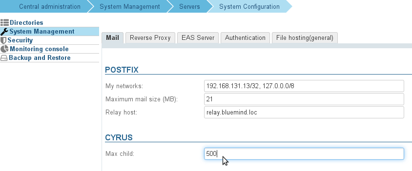

# IMAP Identification Issues


# Symptoms

- Users are no longer able to log in at all
- 'Bad Gateway' errors when accessing the Web application
- Occasional connection issues


# Issue

When the maximum number of IMAP processes has been reached, users get log in errors.

# Solution

You need to increase the maximum number of IMAP processes.
In general, you need to allow for 1.5 the number of users for a mixed webmail/thick client use. On installations where many users use thick clients, you need to allow for approximately 3 times the number of users.

1 
Count the number of processes used currently:


```
pgrep -c imap
```


1 Go to the administration console > System configuration > Mail tab and increase the maxchild value of the Cyrus section(see calculation above) :


