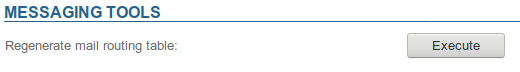

# Trouble sending or receiving emails


# Known issues

## Emails are not delivered to an existing address

** **Symptoms******:** emails are not delivered to an existing address and the sender does not receive any error messages

** **Cause**:** a change in the email address (e.g. after a username has been changed) has not been correctly reported by the system in the postfix maps

** **Solution**:** you need to regenerate the Postfix maps by going to the admin console > System Management > Manage messaging system > click "Execute":


:::important

There is no need to restart the service, changes are effective immediately.

:::

If this doesn't solve the problem, see the paragraphs below for further investigations.


# Checking for incoming emails on the server

There are several reasons why an email message that is supposed to have arrived may not be in the user's mailbox.

- The message has been blocked by an antispam before arriving on the BlueMind server. In that case, you must check your antispam solution's logs
- 
The message is stuck in the BlueMind server's postfix queue. This typically happens when a user's usage quota is at full capacity. The email will be held in the postfix queue for 3 days. If after 3 days the server hasn't been able to deliver it, a non-delivery message will be sent to the sender. You can check whether the message is in the postfix queue using the command:


```
[root@bluemind ~]# postqueue -p
-Queue ID- --Size-- ----Arrival Time---- -Sender/Recipient-------
4E4D83AF8E      943 Thu Mar  2 07:10:58  full@bluemind.net
(host 192.168.124.72[192.168.124.72] said: 452 4.2.2 Over quota SESSIONID=<cyrus-4311-1488438658-1> (in reply to RCPT TO command))
                                         full@bluemind.net
```


To release the message, you can either ask the user to delete some emails, or increase their quota, then wait for the message to be delivered or force postfix to try to deliver messages again using the postqueue command -f


If the email message is not stuck, you can find tracks of its arrival in the postfix logs (/var/log/maillog ou /var/log/mail.log):


```
Mar  1 20:45:32 bluemind postfix/lmtp[16928]: C5BF3135FAF: to=<user@bluemind.net>, relay=192.168.124.72[192.168.124.72]:2400, delay=0.32, delays=0.21/0.02/0.01/0.09, dsn=2.1.5, status=sent (250 2.1.5 Ok SESSIONID=<cyrus-12823-1488397532-1> [bluemind.net!user.user.INBOX () 2294])
```


This log line shows that the message with id number C5BF3135FAF has indeed been delivered to the inbox of 'user@[bluemind.net](http://bluemind.net)' on 1 March at 20:45 hrs.

You can find more details about the message, including the sender's address by searching the message-id:


```
[root@bluemind ~]# grep C5BF3135FAF /var/log/maillog
Mar  1 20:45:32 bluemind postfix/smtpd[16923]: C5BF3135FAF: client=smtp.domain.net[192.168.120.30]
Mar  1 20:45:32 bluemind postfix/cleanup[16927]: C5BF3135FAF: message-id=<AM5PR04MB3219A293B59D96973D338B01D2290>
Mar  1 20:45:32 bluemind postfix/qmgr[364]: C5BF3135FAF: from=<user2@domain.net>, size=8386, nrcpt=1 (queue active)
Mar  1 20:45:32 bluemind postfix/lmtp[16928]: C5BF3135FAF: to=<user@bluemind.net>, relay=192.168.124.72[192.168.124.72]:2400, delay=0.32, delays=0.21/0.02/0.01/0.09, dsn=2.1.5, status=sent (250 2.1.5 Ok SESSIONID=<cyrus-12823-1488397532-1> [bluemind.net!user.user.INBOX () 2294])
Mar  1 20:45:32 bluemind postfix/qmgr[364]: C5BF3135FAF: removed
```


In this case, you can see that [user2@domain.net](mailto:user2@domain.net) is the sender of message AM5PR04MB3219A293B59D96973D338B01D2290 and it has been delivered to this user.

The message-id is the identifier for the message only and it is found in the email header.

The number at the end of the lmtp line (2294 in this case) corresponds to the email id in the user's *INBOX* folder, you can therefore find it in `/var/spool/cyrus/data*/b/bluemind\_net/b/[bluemind.net/](http://bluemind.net/)* u/user/user/2294`.

# Tracking email history

## For a known email address

Once you've found the email ID (see above), you can use bm-cli to view a messages' movements history:


```
bm-cli mail history-imap --email <email> --imapUid <imapUid>
```


Or:

- email: the user's email address
- imapUid: the email ID, found through the logs or present on the server in the user's folder


For example:


```
[root@centos7 test]# bm-cli mail history-imap --email john.test@local.lan --imapUid 1
+------------------------------+---------+--------------------+---------------------------------------+--------+---------------+----------------+
| Date                         | Type    | Owner              | Folder-UID                            | Folder | Item/IMAP-UID | Flags          |
+------------------------------+---------+--------------------+---------------------------------------+--------+---------------+----------------+
| Thu Jun 13 13:11:14 GMT 2019 | Created |   John Test (USER) | mbox\_records\_nqjg0zo2avnp9p8i121e8czq |  INBOX |        12617. |                |
+------------------------------+---------+--------------------+---------------------------------------+--------+---------------+----------------+
| Thu Jun 13 13:11:25 GMT 2019 | Updated |   John Test (USER) | mbox\_records\_nqjg0zo2avnp9p8i121e8czq |  INBOX |        12617. | Seen,Important |
+------------------------------+---------+--------------------+---------------------------------------+--------+---------------+----------------+
| Thu Jun 13 13:11:25 GMT 2019 | Created | admin admin (USER) | mbox\_records\_xyum8ijpaahokdnpnhvr6vwp |  Trash |        12617. |                |
+------------------------------+---------+--------------------+---------------------------------------+--------+---------------+----------------+
| Thu Jun 13 13:11:25 GMT 2019 | Updated |   John Test (USER) | mbox\_records\_nqjg0zo2avnp9p8i121e8czq |  INBOX |        12617. |        Deleted |
+------------------------------+---------+--------------------+---------------------------------------+--------+---------------+----------------+
```


## For a keyword search

The CLI can also be used to search by keyword:


```
bm-cli mail history-query --email <email> --query <query>
```


In the example below, we're going to look for a user's reminder emails to see if they've been recieved/moved/deleted:


```
# bm-cli mail history-query --email jdoe@blue-mind.net --query Rappel
+------------------------------+---------+-----------------+---------------------------------------------------+--------+---------------+-------+
| Date                         | Type    | Owner           | Folder-UID                                        | Folder | Item/IMAP-UID | Flags |
+------------------------------+---------+-----------------+---------------------------------------------------+--------+---------------+-------+
| Sat Apr 13 06:45:17 GMT 2019 | Created | John Doe (USER) | mbox\_records\_0ad3865e-6336-4c98-b4b8-1706fc05e73f |  INBOX |            7. |       |
+------------------------------+---------+-----------------+---------------------------------------------------+--------+---------------+-------+
+------------------------------+---------+-----------------+---------------------------------------------------+--------+---------------+--------------+
| Date                         | Type    | Owner           | Folder-UID                                        | Folder | Item/IMAP-UID | Flags        |
+------------------------------+---------+-----------------+---------------------------------------------------+--------+---------------+--------------+
| Sun Apr 14 06:45:18 GMT 2019 | Created | John Doe (USER) | mbox\_records\_0ad3865e-6336-4c98-b4b8-1706fc05e73f |  INBOX |            8. |              |
+------------------------------+---------+-----------------+---------------------------------------------------+--------+---------------+--------------+
| Thu Jun 13 14:09:35 GMT 2019 | Updated | John Doe (USER) | mbox\_records\_0ad3865e-6336-4c98-b4b8-1706fc05e73f |  INBOX |            8. |              |
+------------------------------+---------+-----------------+---------------------------------------------------+--------+---------------+--------------+
| Thu Jun 13 14:09:41 GMT 2019 | Created | John Doe (USER) | mbox\_records\_6330f080-7b22-4a9d-b181-7ca99e226878 |  Trash |            3. |         Seen |
+------------------------------+---------+-----------------+---------------------------------------------------+--------+---------------+--------------+
| Thu Jun 13 14:09:42 GMT 2019 | Updated | John Doe (USER) | mbox\_records\_0ad3865e-6336-4c98-b4b8-1706fc05e73f |  INBOX |            8. | Seen,Deleted |
+------------------------------+---------+-----------------+---------------------------------------------------+--------+---------------+--------------+
```


1 One email (id 7) as just been received, it is still in the user's inbox and hasn't been read
1 Another email (id 8) has been read and moved to the trash:
  - it is copied to the trash and its id becomes 3
  - the original, with id 8, is removed from the inbox
  - both 2 versions are marked as read


In another exemple, you can see that email with id 7 is "gone":


```
# bm-cli mail history-imap --email jdoe@blue-mind.net --imapUid 7
+------------------------------+---------+------------------------+---------------------------------------------------+------------+---------------+--------------+
| Date                         | Type    | Owner                  | Folder-UID                                        | Folder     | Item/IMAP-UID | Flags        |
+------------------------------+---------+------------------------+---------------------------------------------------+------------+---------------+--------------+
| Sat Apr 13 06:45:17 GMT 2019 | Created |        John Doe (USER) | mbox\_records\_0ad3865e-6336-4c98-b4b8-1706fc05e73f |      INBOX |            7. |              |
+------------------------------+---------+------------------------+---------------------------------------------------+------------+---------------+--------------+
| Thu Jun 13 14:09:42 GMT 2019 | Updated |        John Doe (USER) | mbox\_records\_0ad3865e-6336-4c98-b4b8-1706fc05e73f |      INBOX |            7. |              |
+------------------------------+---------+------------------------+---------------------------------------------------+------------+---------------+--------------+
| Thu Jun 13 14:13:54 GMT 2019 | Created |     projet (MAILSHARE) |                     mbox\_records\_32d9e5e24fb3a25a |     project |           56. |              |
+------------------------------+---------+------------------------+---------------------------------------------------+------------+---------------+--------------+
| Thu Jun 13 14:13:55 GMT 2019 | Updated |        John Doe (USER) | mbox\_records\_0ad3865e-6336-4c98-b4b8-1706fc05e73f |      INBOX |            7. | Seen,Deleted |
+------------------------------+---------+------------------------+---------------------------------------------------+------------+---------------+--------------+
```


→ the email has been moved to the shared mailbox named "project" :

- the email is created in this mailbox, where its id becomes 56
- the original is marked as read and removed from the user's mailbox

:::important

In this particular instance, the email message isn't copied to the trash and the file no longer appears on the server as it is not a deletion as such but a message being moved to another folder, even if it is a shared folder.

:::

# Restoration

*Delayed* delete has been set up at the cyrus level. This means that emails are actually deleted from the server after seven days only. In the meantime, they are present on the disk but not visible in IMAP.
This deletion mode is laying the groundwork for an upcoming double-bottom trash feature.

To list a user's deleted emails, use this command:


```
unexpunge -l user/john@domain.net
```


To restore an email message:


```
unexpunge -u -d user/john@domain.net 46908
```


*46908 being the message's id.*

To restore all a user's messages:


```
unexpunge -a -d user/john@domain.net
```


For more information about these commands and how to pass them, please refer to the cyrus documentation: [https://www.cyrusimap.org/imap/reference/manpages/systemcommands/unexpunge.html](https://www.cyrusimap.org/imap/reference/manpages/systemcommands/unexpunge.html)


