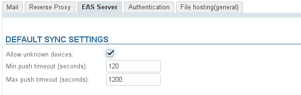
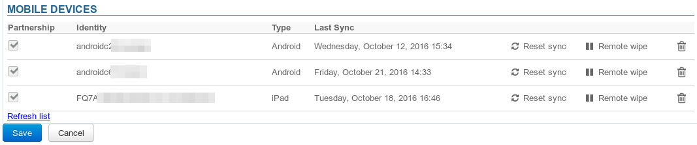
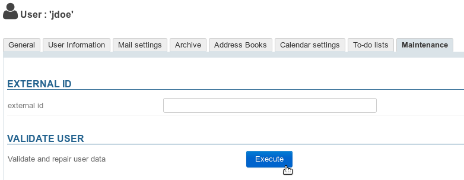

# Synchronization issues with mobile devices

Below are some things you can investigate and monitor when you are having issues with BlueMind synchronization on mobile devices.

# Trouble connecting

** **Symptoms:** ** Connection fails despite correct server and identifier settings

** **Actions:** ** Make sure the device has permission to connect to the server:

- **Domain-wide permission**: you can allow all BlueMind users to connect to a mobile device. To do this, go to System Management > System Configuration > EAS Server tab and check the box "Allow unknown devices": 
- **User-specific permission**: if the permission above isn't enabled, you can allow specific users and specific devices to synchronize with BlueMind. To do this:
  - configure the device and make a connection request
  - go to the user's administration card > Maintenance tabThe device will be listed with the corresponding row grayed out and no last sync date: 
  - Check the box at the beginning of the rowNote: if domain-wide permission has been enabled, these boxes will not be checked
  - Confirm the permission requestNote: There is no need to click "Save". The permission is effective immediately.
  - Restart synchronization on the mobile device

# Issues with message synchronization

** **Symptoms:** ** some folders are missing or inbox contents are not shown

** **Cause:** ** folder hierarchy is probably corrupt

** **Actions:** ** you must repair the inbox:

1 Run *check&repair*: go to the user's administration card, Maintenance tab, "Validate User" section, click the "Execute" button: 
1 If this doesn't work, and the user continues to encounter the same issues, check the EAS logs (`/var/log/bm-eas/eas.log` et `/var/log/bm-eas/user-eas-&lt;identifiant>.log`) and core logs (`/var/log/bm/core.log`) during *check&repair*:
  - check the files at the time when the above operation was carried out
  - restart the operation above after putting a tail on the files
Open a ticket including the information collected if it hasn't enabled you to find the cause and resolve the issues.

