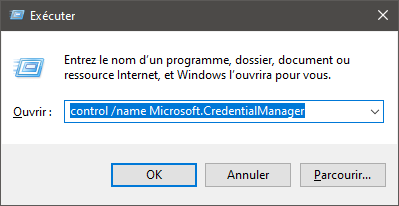
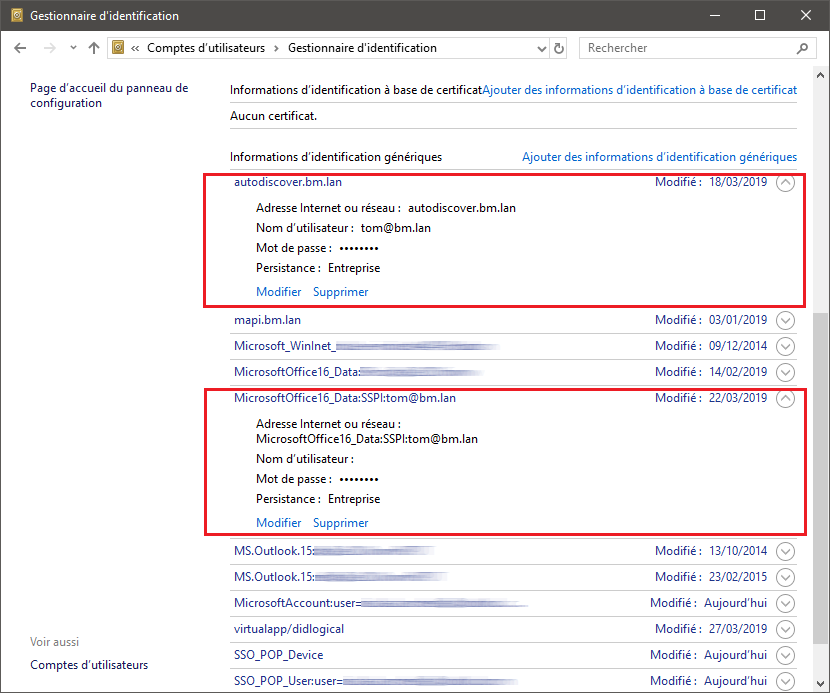

# Resolving issues with Outlook


# Introduction

This page is designed to help you investigate, diagnose and resolve issues related to using Outlook with BlueMind.

First, if you are having trouble creating an account, check the [compatibility](/FAQ_Foire_aux_questions_/Compatibilité/) page to make sure that your **Outlook version is supported. **That** **page also describes known limitations.


# Retrieving logs

**On the client software side**, you may find messages in Outlook itself, in the "Sync Issues" folder.

**On the server side**, there are 2 files you should look at:

1 the general log `/var/log/bm-mapi/mapi.log`
1 the activity log `/var/log/bm-mapi/activities.log`

:::important

You can enable a detailed log for a specific user on the server for more in-depth investigation, ****but be warned that this impacts performance****. This is enabled using the [bm-cli](/Guide_de_l_administrateur/Administration_avancée/Client_CLI_pour_l_administration/) command line tool with the additional `bm-plugin-cli-mapi` package installed on the server:


```
bm-cli mapi logging --enable jdoe@bluemind.loc
```


Logs are then located in the file `/var/log/bm-mapi/user-jdoe@bluemind.loc.log`

 ** Settings are lost when you restart the bm-mapi server.**

:::

# Troubleshooting

## Unable to copy or move an email to a folder

**Issue/Symptoms:**

- an email can be seen in an Outlook folder but it isn't shown in that same folder on the server (it is visible neither in webmail nor on mobile devices)
- the *"Sync Issues" *Outlook folder contains many errors about this email
- syncing is stuck but it resumes when you delete the email in Outlook


**Troubleshooting:**

1 
Locate the email on the server with part of its subject text:


```
# cd /var/spool/cyrus/data/bluemind\_loc/domain/b/bluemind.loc/j/user/jdoe/
# grep "subject text" *
```


1 
Copy the file you found as an eml file:


```
# cp 4817. ~/faulty-email.eml
```


1  Retrieve it and copy it in a working, test installation of Outlook to check whether the issue occurs there too and watch/retrieve the corresponding logs.


# Known Issues

## Error when creating an account because of a wrong saved password

** **Issue/symptoms******:** Outlook doesn't let you create an account when you enter a password – Outlook says that the password is wrong. 

** **Cause:**** The user has saved a wrong password for this account during a previous attempt to create an account.

****Diagnosis******:** In the server's log file `/var/log/nginx/access.log`, you will find lines such as:


```
192.168.61.133 - - [06/May/2019:16:57:53 +0200] "POST /autodiscover/autodiscover.xml HTTP/1.1" 401 0 "-" "Microsoft Office/16.0 (Windows NT 10.0; Microsoft Outlook 16.0.11601; Pro)"
```


or


```
192.168.61.133 - tom@bm.lan [06/May/2019:16:58:31 +0200] "POST /mapi/nspi/?MailboxId=94a5c596-90a8-4985-91fd-57629ee06561@bm.lan HTTP/1.1" 200 149 "-" "Microsoft Office/16.0(Windows NT 10.0; Microsoft Outlook 16.0.11601; Pro)"
```


This means that a wrong password for [tom@bm.lan](mailto:tom@bm.lan) is being submitted during account creation.


** **Solution:** **

To remove the wrong password:

- make sure that Outlook and the account creation window are closed.
- open the Credential Manager by typing Windows + R
- then "`control /name Microsoft.CredentialManager`" in the run box:
- click OK (or type &lt;Enter>)
- delete entries such as `autodiscover.domaine.tld`  and `MicrosoftOffice16\_SSPI:utilisateur@domaine.tld`  E.g. to delete the password for *[tom@bm.lan](mailto:tom@bm.lan)*:



## Password being asked in a loop

** **Issue/Symptom******:** The account creation and synchronization have been successful but then Outlook keeps asking for the user's password repeatedly.

** **Cause**:** If your system uses CAS authentication, Outlook may not find the right method to use to contact the autodiscover service.

** **Solution**:** You have to force the registry key to tell Outlook to exclude the direct connection method to Office365

1 Open regedit:
  - Click the start button
  - Type `regedit` either in the Run application or in the Windows search bar.
  - Press Enter
1 **(HIGHLY RECOMMENDED BUT OPTIONAL)** Back-up your registry – [Click here to find out how](https://support.microsoft.com/help/322756).
1 In the registry, go to `HKEY_CURRENT_USER\Software\Microsoft\Office\16.0\Outlook\AutoDiscover`
1 Right-click anywhere in the right column, select NEW and then *DWORD (32-bit)*.
1 Name this entry: `ExcludeExplicitO365EndPoint`
1 Right-click this entry and select *Edit*
1 Change the value to 1 in the value field and click OK
1 Restart your computer
1 Create your Outlook profile again
1 Open Outlook and when asked, enter your email address and password.


For more information about this issue, go to: [https://docs.microsoft.com/en-us/outlook/troubleshoot/domain-management/unexpected-autodiscover-behavior](https://docs.microsoft.com/en-us/outlook/troubleshoot/domain-management/unexpected-autodiscover-behavior)

## Folders are empty

****Issue/Symptom**:** The default folders (Inbox, Sent, Trash, etc.) are present but empty. In webmail, they do contain messages.

****Cause**:** This is because of an account replication issue. 

****Solution**:** Perform specific maintenance repairs:


```
bm-cli maintenance repair --ops replication.subtree user@domain.tld
bm-cli maintenance repair --ops replication.parentUid user@domain.tld
```


Then **restart Outlook** and check that the messages are coming in properly.

## The Global Address Book in Outlook is incomplete

****Issue/Symptom******:**

- I start Outlook
- I write a message
- I click the "To" button
- I can't find all the addresses from the BlueMind server


****Diagnosis**:**

Check the `/var/log/bm-mapi/mapi.log`. log file. You will find errors such as:


```
2019-11-22 10:51:07,079 [OAB-generation-pool-2-thread-7] n.b.e.p.c.o.OABGenerator WARN - Cannot handle directory entry a25a572f-eadd-4232-a183-4c0c41e56d0b of type USER
java.lang.NullPointerException: null
        at net.bluemind.exchange.mapi.commons.DistinguishedName.userDN(DistinguishedName.java:96)
        at net.bluemind.exchange.provider.core.impl.gal.UserAddressProps.getDn(UserAddressProps.java:60)
        at net.bluemind.exchange.provider.core.impl.gal.UserAddressProps.<init>(UserAddressProps.java:54)
        at net.bluemind.exchange.provider.core.oab.OABGenerator.userRecord(OABGenerator.java:221)
        at net.bluemind.exchange.provider.core.oab.OABGenerator.create(OABGenerator.java:119)
        at net.bluemind.exchange.oab.impl.OABIndexHandler.lambda$1(OABIndexHandler.java:121)
```


****Cause**:** Regenerate the hollow database which maps BlueMind uids with "Outlook for mapi uids". E.g.:

To read mapping information:


```
bm-cli hollow directory domain.tld
Record{uid=a25a572f-eadd-4232-a183-4c0c41e56d0b, dn=/o=mapi/ou=domain.tld/cn=recipients/cn=user:a25a572f-eadd-4232-a183-4c0c41e56d0b}
```


****Solution**: **Regenerate the hollow database using this procedure:


**
BlueMind 4.0.x


**
BlueMind 4.1 et plus


```
systemctl stop bm-mapi && systemctl stop bm-core
rm -fr /var/spool/bm-hollowed/directory/domain.tld/
systemctl start bm-core
```


```
# bm-cli maintenance ops devenv.blue|grep -i hollow
hollow.directory 	Ensure Hollow copy of the directory is in sync v
```


Check the core logs and wait until the hollow database is done regenerating. Then restart the mapi service:


```
systemctl start bm-mapi
```


## Messages aren't arranged by folder despite conversation mode being enabled

This feature hasn't been implemented as part of BlueMind's MAPI yet. 

Some messages may be sorted by conversation depending on the third-party client they come from (e.g. Webmail or Thunderbird).

## During an Outlook profile creation, Outlook displays a message: "The name cannot be matched to a name in the address list."

****Cause:**** During the creation of an Outlook profile, Outlook checks that the account's email address is present in the GAL, but only the default email address is present in the GAL.

****Solution:**** In the BlueMind account settings (admin), set the email address used to create the Outlook profile as the default email address.


