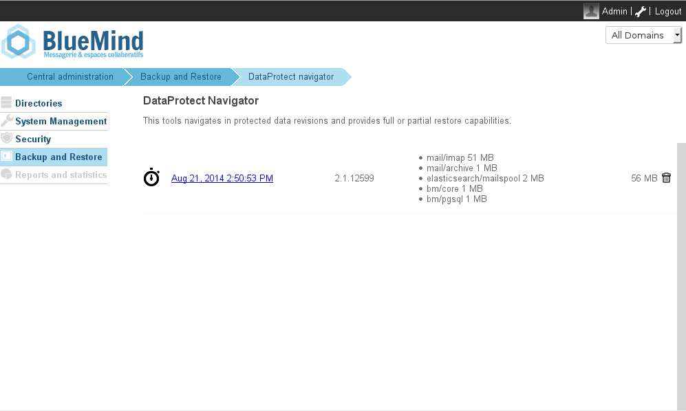
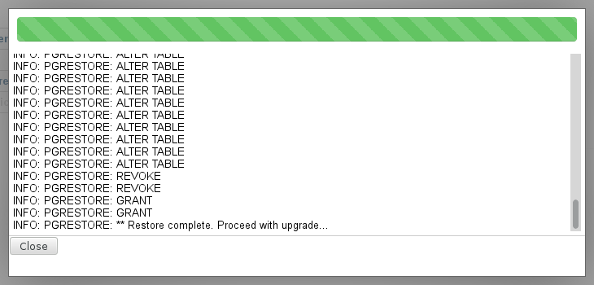
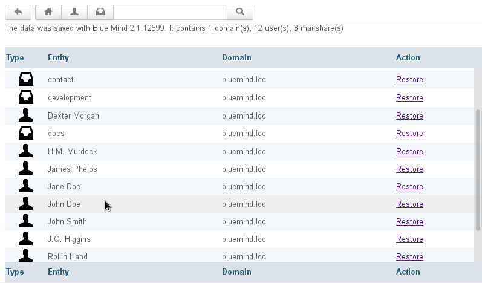
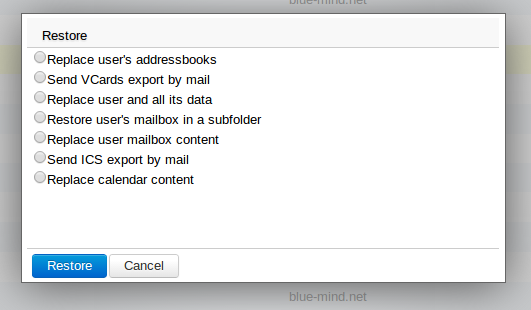
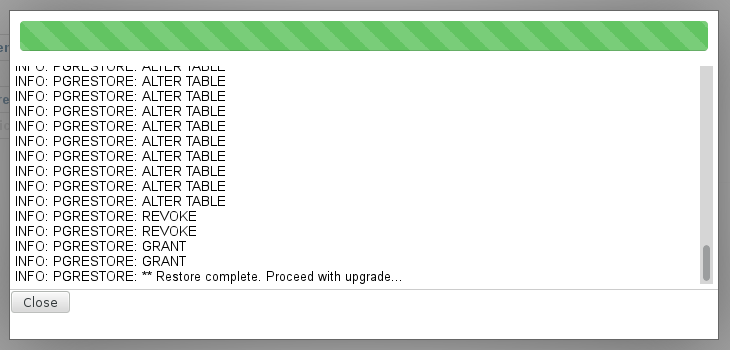
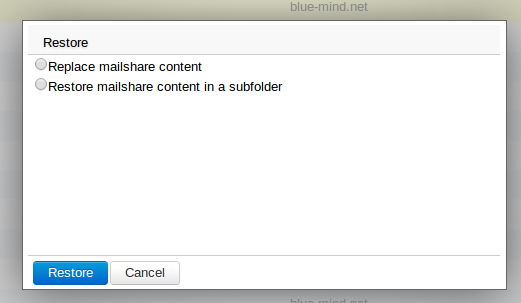

# Single-user restoration - DataProtect Navigator

## Introduction

 BlueMind's single-user restoration feature is extremely useful if you want to restore a single user's data quickly. Restoration is done graphically and enables you to choose the object type (entity: user, mail, calendar, shared mailbox, etc.), and then the object whose data you want to restore.  

 This feature also relies on data history to choose the date of the data to backup. 

## Restoring user or shared mailbox data

The DataProtect Navigator provides a simple graphical way to browse through backup data from the BlueMind admin console.

To restore data:

- In the admin console, go to > Backup and Restore > DataProtect navigator: The page shows the backups performed by BlueMind and currently available.
- Click the backup you want to access. The system runs a temporary data restoration which allows you to explore the backup:
- Click "Close" to access the data.
- The navigator then shows you backup data by entity:

The search tools at the top of the page can be used to filter and search the entities displayed:

-  shows/hides domains
-  shows/hides users
-  shows/hides shared mailboxes

The search box can be used for text searches and the   button takes you back to the DataProtect navigator homepage.

### To restore a user's data

- Click the "Restore" link for the user whose data you want to restore. A dialog box opens and offers you various restore options: 
    - **Replace user's address books**: replaces all the user's address books with those at time of backup.
    - **Send VCards export by mail**: exports the user's address books as a [VCard file](http://en.wikipedia.org/wiki/VCard) and sends them to the user by email.
    - **Replace user and its data**: restores all user data (messages, contacts, calendar, preferences, etc.) at time of backup. All changes made since will be lost.
    - **Restore user's mailbox in a sub-folder**: restores the whole user mailbox in one of its sub-folders.
    - **Replace user mailbox contents**: replaces the entire user mailbox. This means it returns to its state at backup time. All changes (messages received or sent, items moved between folders, etc.) made since will be lost.
    - **Send ICS export by email**: the user's calendar is exported as an [ICS file](http://en.wikipedia.org/wiki/ICalendar) which is sent to the user by email.
    - **Replace calendar content**: restores the entire calendar as it was at time of backup. All changes (new events, deletions, moves, etc.) made since will be lost.
- Select the desired option and click "Restore".The popup box shows progress information including a progress bar and real-time log details:
- When the operation is complete, click "Close" to return to the list of entities.

### To restore a shared mailbox's data

Click the "Restore" link for the shared mailbox you want to restore. A popup window opens with the following options:

- Restore mailshare content in a subfolder: restores the entire shared mailbox's contents in a subfolder of this mailbox. 
- Replace mailshare content: replaces the entire shared mailbox. This means it returns to its state at time of backup. All changes (messages received or sent, items moved between folders, etc.) made since will be lost.

- Select the desired option and click "Restore".The popup box shows progress information including a progress bar and real-time log details.
- When the operation is complete, click "Close" to return to the list of entities.

### Post-backup script

After each backup, DataProtect looks for a script named */usr/bin/bm-post-full-backup.sh* and if it is found it runs it on the backed up server. This script must be created by the user and may be used to carry out post-backup tasks such as copying backed up data to another location.

