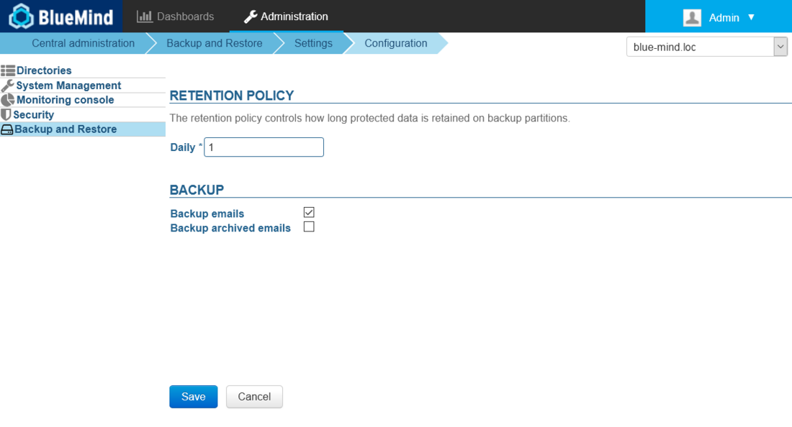

# Backing up and Restoring Data


## Introduction

BlueMind automatically generates backups so that data can be easily restored through the admin console.

All system data (calendar/contacts/emails) is saved at regular intervals and placed in a system directory. An additional backup system (Bacula, TiNa, etc.) can be used to copy and externalize these backups on tapes or on the external system.

The backup data is organized so that you can go back in time and restore user data at a specific point.

Backup frequency can be configured and depends on the disk space you have available. Please note that the minimum time between backups is of one day.

Backups can then be linked to a centralized enterprise backup software (Time Navigator, NetBackup, etc.).


## What are the benefits of an integrated backup system?

- **Time-saving** Backups are incremental. Only changes (new messages, deletions, etc.) since the previous backup are transferred.
- **More functionalities** The system manages data history.
- **More space available** The system historizes data without duplicating it. Each backup is stand-alone (snapshot-like), even if only differences have been transferred. As a result, 10 backups can occupy the same amount of space as your mail storage.
- **Optimization** Data is deduplicated automatically.
- **Complete backups**The backup tool ensures that current and future data is automatically saved, whether it be mail (messages stored as folders) calendar and address book data (stored in databases) or configuration files. 
- **Compatibility** Backups, regardless of when they were performed, remain compatible with all minor versions of a major version (e.g. 3.5.x or 4.x). This means that a backup in a given version can be mounted again in a more recent version of BlueMind. E.g. a backup made in version 3.5.12 can be mounted in version 3.5.16-7, or a backup made in version 4.0.1 can be mounted again in version 4.4.3.
- **Performance** Backups do not cause service disruptions. They are designed and performed within a short time-frame to ensure the consistency of the data restored. This constraint is at the core of the design of the BlueMind backup system. 
- **History** Backups are incremental while maintaining data history. The historization feature is particularly interesting for those without a large backup infrastructure: one piece of data is only present in one backup and new data is stored in an increment. In addition, to ensure safe restoration, the program reconstructs the data from one backup and one or several increments. This is transparent for the administrator who is able to specify the date the data should be restored from.


## Technical backup architecture 

-  **Storage and historization component**  BlueMind relies on the open-source software obnam. This outstanding tool allows you to make incremental copies while historizing data. The mail spool and the database backup are injected into obnam, which provides intricate historization and significant space savings.
-  **BlueMind modules and backups**  BlueMind's architecture allows you to split services over distinct servers. Depending on the services hosted on each server, they can be assigned different backup methods and data can be stored on one application node (mail spool, database, index, archiving, etc.). As a result, each role assigned to BlueMind servers has its specific backup procedure, thus ensuring optimum and comprehensive data retrieval. 
-  **Backup location ** Backup data is usually stored on a stand-alone external backup server. BlueMind offers you ways of configuring backup storage space:
    1. set up an NFS mount on your production server's file system.
    2. use a dedicated node (a server) of the BlueMind architecture which acts exclusively as a backup server.
 You can use either option depending on your availability and your infrastructure type, bearing in mind to keep production and backup data separate to make sure that you are able to remount services in the event of lost or corrupted data  .- **Integration in a backup infrastructure** Information systems are typically equipped with backup infrastructure. Software such as Atempo Time Navigator, Tivoli Storage Manager or Net Backup centralize backup methods and manage your backups' historization. These tools interface well with BlueMind. They require specific configuration to enable the storage of BlueMind's backup history. The BlueMind server performs the backup of production data securely, comprehensively and immediately. The client's backup software must be configured not to historize data. That way, the third-party backup software retrieves the contents of the backup made by BlueMind and transfers it to another tape or other medium.


## NFS mount configuration

For ext3 or ext4 NFS mount points, you need to apply the options *nodiratime* and *noatime* to speed up disk access. Advanced file systems such as NTFS, ext3/4 allow you to know the last file access date. For each file read, an additional writing operation is performed in order to modify the last file access date and check it. Here is an example of mount for the file  */etc/fstab*:


```
# NFS mount point
nas.mydomain.lab:/backup  /var/backups/bluemind  nfs  rw,soft,noatime,nodiratime,vers=3,exec 0 0
```


Next, we recommend that you test the mount to make sure it is running properly, using the following command lines:


```
cd /var/backups/bluemind
sudo touch test
sudo chown cyrus:mail
```


Make sure that rights are set properly:


```
ls -l /var/backups/bluemind/test
-rw-r--r-- 1 cyrus mail 0 Nov  6  2014 test

```


Then, delete this test file:


```
sudo rm test
```


:::tip

Permanent path

To use the same path to access your latest backup all the time, you may want to use the script `/usr/bin/bm-post-full-backup.sh` with following content:


```
#!/bin/bash
parts=("bm/es" "bm/pgsql" "filehosting/data" "mail/imap" "mail/archive")
server\_ip="192.168.124.72"

for part in ${parts[@]}
do
        echo "creating last directory for part : $part"
        # get last backup directory
        last\_version=`ls -tr /var/backups/bluemind/dp\_spool/rsync/$server\_ip/$part | grep -v "last" | tail -1`
        echo " last version : $last\_version"
        # create link
        rm /var/backups/bluemind/dp\_spool/rsync/$server\_ip/$part/last
        ln -s /var/backups/bluemind/dp\_spool/rsync/$server\_ip/$part/$last\_version /var/backups/bluemind/dp\_spool/rsync/$server\_ip/$part/last
done
```


NB:

- the script can be created if it doesn't already exist on the server
- the script can be completed with this content if it already exists
- a directory named "last" always pointing to the last backup must be created.


:::

## Backup configuration

The admin console allows you to configure the number of daily backups you want to keep.

To set up a backup policy, go to the BlueMind administration page > Backup and Restore > Settings > Configuration:



- **Retention policy:** sets the number of days to keep a backup (here, daily backups)
- **Backup emails:** when checked, emails are included in the backup, when unchecked, only contact, calendar and task data is backed up. This allows you to avoid double backups when messages are already backed up in another dedicated system.


:::info

Backup Performance

We strongly recommend against enabling this option if you have a large mail spool (~1Tb, although the backup system's effectiveness may vary depending on the backup space chosen).

There are several alternatives:

- hypervisor tools (backup of the spool's virtual disk, VMs...)
- internal system technologies (e.g. LVM snapshots)
- internal storage technologies (snapshots in the storage bay)

That way you can use BlueMind's backup system for other data only (contacts/agenda/tasks) which can be restored through the admin console and an external backup system for email – which can be bigger.

:::


- **Backup archived emails**: when this option is enabled, archived emails are backed up as well.By default, this option is disabled, only non-archived emails are backed up.


## Post-backup actions

When the backup is complete, the script `/usr/bin/bm-post-full-backup.sh` runs automatically if it exists.

It can contain several specific operations to be performed after a successful backup.

## Restoration

One single BlueMind backup enables you to perform both a disaster recovery plan and single-user restoration (for a user's data or part of it).

### Disaster Recovery Plan (DRP)


:::info

For data restoration to work, the server must have the same IP address and the same BlueMind version as the original server.

:::

All data is restored when you install or re-install BlueMind. 

When you install BlueMind using the Setup Wizard, you can choose either to install a blank BlueMind system, or perform a global restoration. A global data restoration allows you to rebuild your entire server from a backup, and is akin to a DRP restoration.

This solution is an easy, fast and safe way for you to rebuild a new BlueMind server.

### Single-user Restoration 

The single-user restoration functionality BlueMind offers is extremely useful if you want to restore a single user's data quickly. Restoration is done graphically and enables you to choose the object type (entity: user, mail, calendar, shared mailbox, etc..), and then the object whose data you want to restore itself. This functionality also relies on data historization to choose the date of the data to backup.


