# Exploring and analyzing data with bm-tick


## Data explorer

The *DataExplorer* tab is used to browse the database contents, i.e. the metrics collected.


:::info

Please refer to our documentation's page on [references for collected metrics](/Guide_de_l_administrateur/Supervision/Monitoring_Bm_Tick/Référence_des_métriques/) to find out more about the metrics collected and their contents.

:::

You can write or generate a query by:

- writing in the box at the top of the window
- selecting the relevant indicators using the data browser:
    - **DB.RetentionPolicy**: the databases you want to analyze. The most relevant is **telegraf.autogen** which contains the actual data. The other databases (_internal.monitor and chronograf.autogen) contain internal system data.
    - **Measurements & Tags**: the metrics being looked for
    - **Fields**: the field(s) required for this data


The graph with the query results is shown at the bottom of the window. Refresh rates and interval settings are shown and can be edited at the top of the page, as well as in the dashboards:
 


****To look for and analyze a metric:** **

1. Select the database telegraf.autogen in the first column
2. In the search box in the second column (*"Measurements & tags")*, enter the name of the item you want to analyze – e.g. a BlueMind component – to view what metrics are available for it: 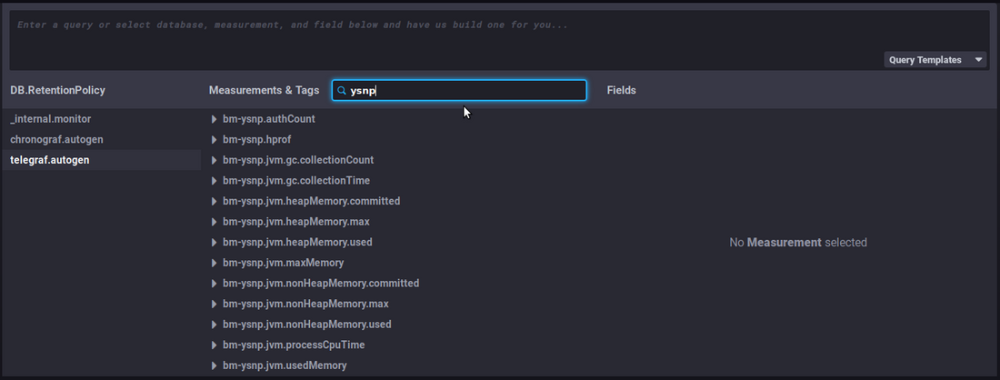
3. Select a metric by clicking it – e.g. "`bm-ysnp-authCount`" in this instance
4. You can navigate within each metric so specify the data you are looking for:

    - **datalocation**: server name
    - **host**: host name or IP 
    - **meterType**: data type, this field is particularly important as it specifies the kind of information contained in this metric 
        - *gauge*: instant measurement

        - *counter*: incremental counter
        - *[distsum](#Exploreretanalyserlesdonneesavecbmtick-distsum)*: counter-amount data paire.g.:
            - bm-lmtpd.emailSize = (number of emails, total size of emails)
            - bm-lmtpd.emailRecipients = (number of emails, number of recipients)
        - *timer*: same as distsum but here the amount is always expressed in nanoseconds
    - **status**: depending on the type of data, the status may be *ok/failed* (e.g. query successful/failed), *success/failure* (e.g. authentication successful/failed), etc.


:::tip

We recommend that you group data by server by clicking the "Group by host" button which appears when you hover on the "host" line or by opening the submenu:


This will show host-specific data rather than a server average.

Depending on the metric being looked at, it may also be relevant to **group by status**, code or *datalocation*.

:::
5. Select the field in the third column according to the data you're looking for. The corresponding graph is then shown: 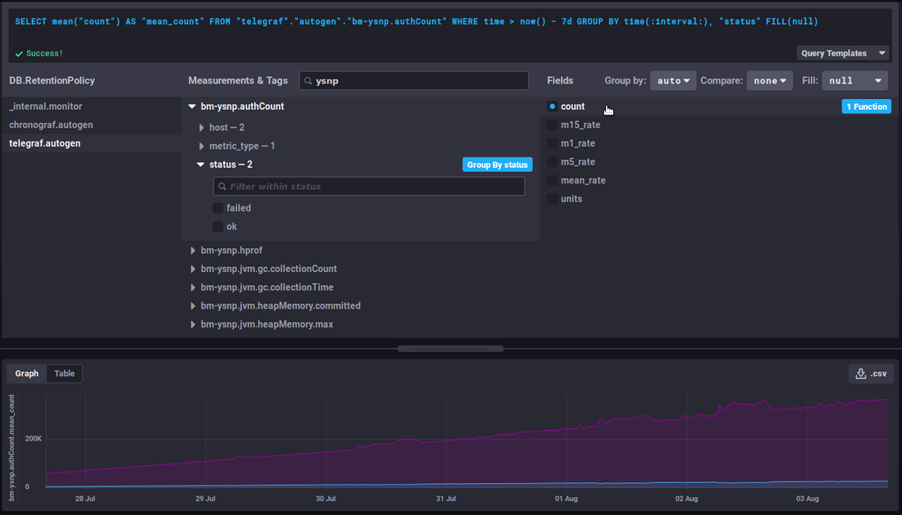


### Useful features/advanced queries

#### Changing the time interval displayed

This part of the query sets the time interval displayed:


```
WHERE time > now() - 7d
```


This literally translates as: the data whose time is greater than today minus 7 days, i.e. the data from the past 7 days.

 change the number of days/hours as desired to increase or decrease the graph's timeframe. 

#### Evolution of a counter

*Counter* data is cumulative and therefore increases regularly. This means that its evolution is more relevant than the data itself.

For example, the `bm-ysnp.authCount` data counts the number of authentications processed: viewing the raw data will only give you, at a given point in time, the amount of data processed since the data collection was set up, which isn't interesting in itself. This figure's evolution over time, however, will give you the number of authentications processed as time passes.

##### non_negative_difference

To watch how this data evolves, you can use the "[non_negative_difference](https://docs.influxdata.com/influxdb/v1.6/query_language/functions/#non-negative-difference)" function which returns the non-negative difference between 2 points in the graph.

To use the authentication example again, the graph below, with no function applied, shows the mean number of authentications processed by the ysnp component in the last 24 hours, by server and by status:

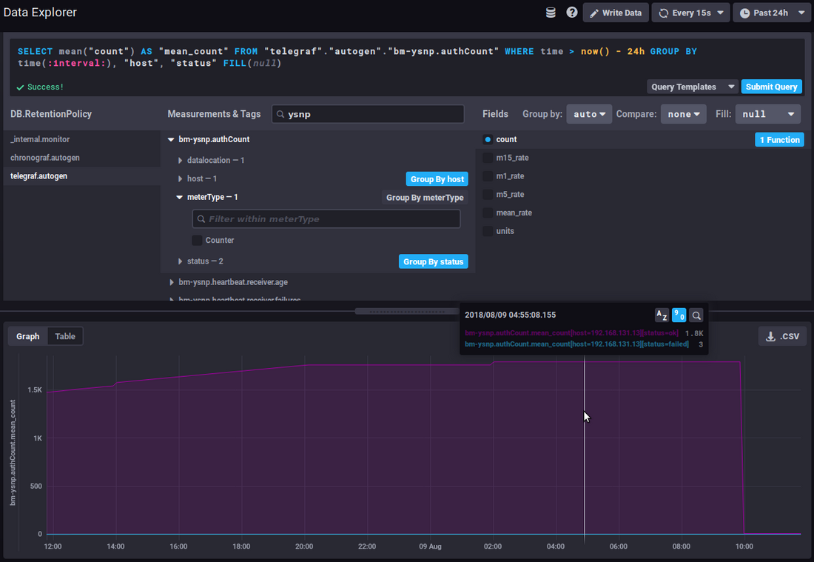

 the mean value keeps going up as additional authentications are being processed.

With an interval difference function, the graph returns the number of authentications for each time interval, you can now see how the amount of authentications processed evolves:

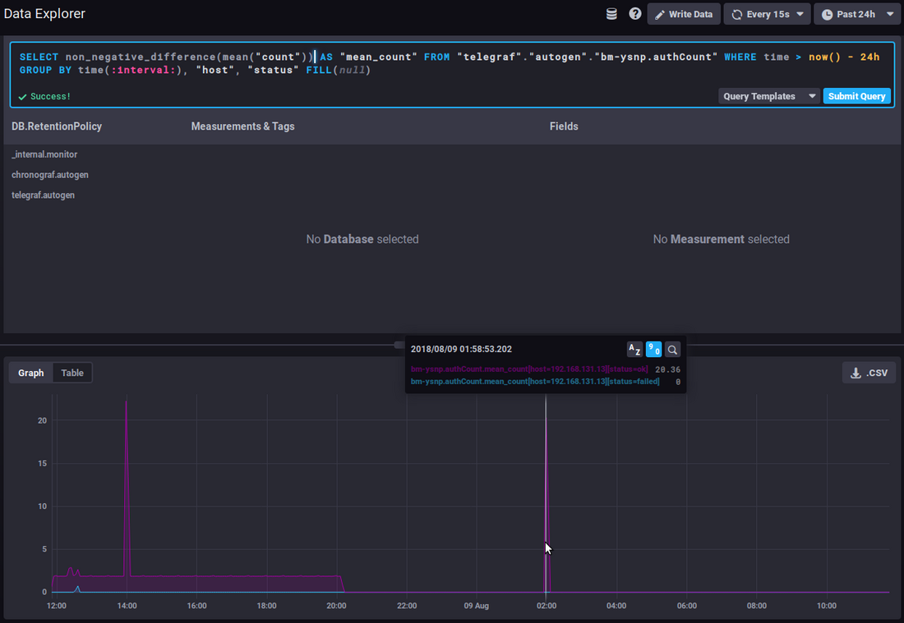

 A sudden spike of "failed" in the timeline could be the sign of an attack by spammers attempting to use the server to send emails.

##### non_negative_derivative

Another function returns an evolution graph for field values with un additional setting: [non_negative_derivative](https://docs.influxdata.com/influxdb/v1.6/query_language/functions/#non-negative-derivative).

This function also calculates the difference between 2 points, but in addition, it specifies the unit argument.
In the *non_negative_difference* function, the system calculates an automatic interval based on the duration displayed ("*where time..."*) and the data's grouping ("*group by time...*"). With the *non_negative_derivative* function, you can force-set the unit, e.g. a rate per minute, hour, day, etc.

E.g., the query below shows the mean number of connections (*mean("count")*) per minute (*non_negative_derivative(...,1m)*) in the last 24h (*where time > now() - 1d*) for every hour (*group by time(1h)*):

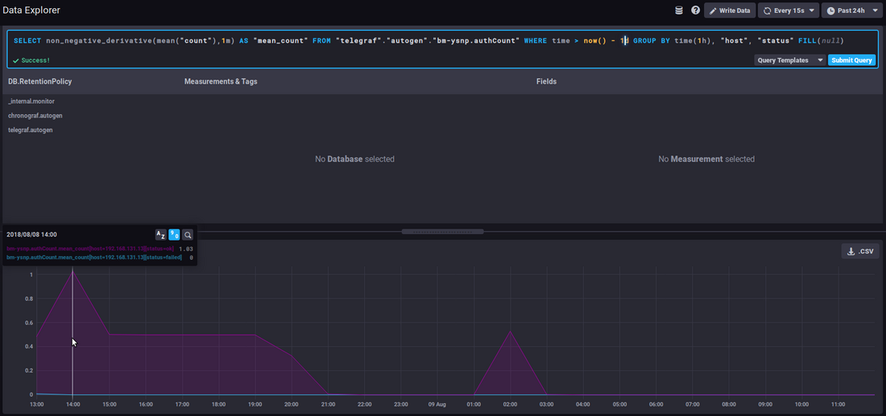

 at 14:00 hours, there was a mean of 1.03 connections per minute, at 15:00 there was 0.5/mn, etc.

#### *distsum*

*distsum* metrics comprise 2 types of information:

1. the first digit is a count
2. the second digit is an amount


As a result it may be a pair such as:

- `bm-lmtpd.emailSize` = (number of email, total size of emails)
- `bm-lmtpd.emailRecipients` = (number of emails, number of recipients)


Take the `emailSize` metric, for example: with each save, the system records the number of emails counted for the interval (since the last save) and the total size the emails account for.

This data can be used to calculate an average message size and see whether it evolves abnormally or suddenly.

E.g. you may observe a regular increase in average message size over time, which may be down to better connections, servers or user habits etc. but if over a few days average message size suddenly doubles (or more), there's something wrong and you need to find out what: was a corporate signature added? Does it contain an image whose size hasn't been reduced, which increases the size of messages and as a result server load.

#### Useful links

To find out more about InfluxQL queries, please refer to the documentation:

[https://docs.influxdata.com/influxdb/v1.6/query_language/](https://docs.influxdata.com/influxdb/v1.6/query_language/)

In particular, about fonctions: [https://docs.influxdata.com/influxdb/v1.6/query_language/functions/](https://docs.influxdata.com/influxdb/v1.6/query_language/functions/)

And grouping by time: [https://docs.influxdata.com/influxdb/v1.6/query_language/data_exploration/#advanced-group-by-time-syntax](https://docs.influxdata.com/influxdb/v1.6/query_language/data_exploration/#advanced-group-by-time-syntax)

### Doing more with graphs

The *DataExplorer* graphical tool has limited options. For example, you can't create a stacked chart to view the sum of two line graphs.

To do this, you need to use the Dashboard's graphs (see next section):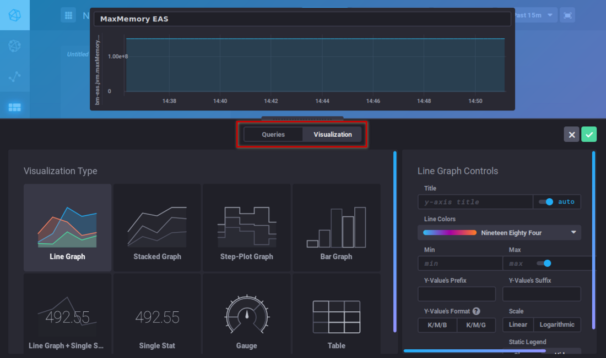

## Dashboards

The *Dashboards* tab is used to access to a series of pages where you can group data as desired.

By default, 3 tableaux are preconfigured and shown as examples:

- ** **JVMs Memory Usage****: usage information for each BlueMind component (EAS, Core, milter, ElasticSearch, HPS, etc.) which can help you monitor over-consumption or the absence of data showing that a service has stopped. 
- ** **Mail insights****: number of emails delivered, average message size, number of IMAP processes, etc.
- ** **Monitoring system status****: amount of data collected, database size, etc.


:::info

Automatic dashboard resetting

BlueMind's default dashboards are reset with every update.

This means that they will be created again if they were deleted and returned to default contents if those have been changed. If you want to customize one of these 3 dashboards, you should clone it (see below) and edit the clone or simply rename the dashboard.

:::

You can add as many dashboards as you like, that way you can have customized views of the data you're interested in by grouping it by type, relevance, module, etc.


:::tip

Dashboards can be duplicated or deleted straight from the main list. When you hover your mouse on a dashboard's row, action buttons pop up at the end of the row:

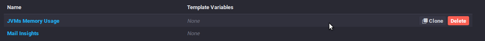

:::

To create a new dashboard, go to the *Dashboard* homepage and click "*Create dashboard*":


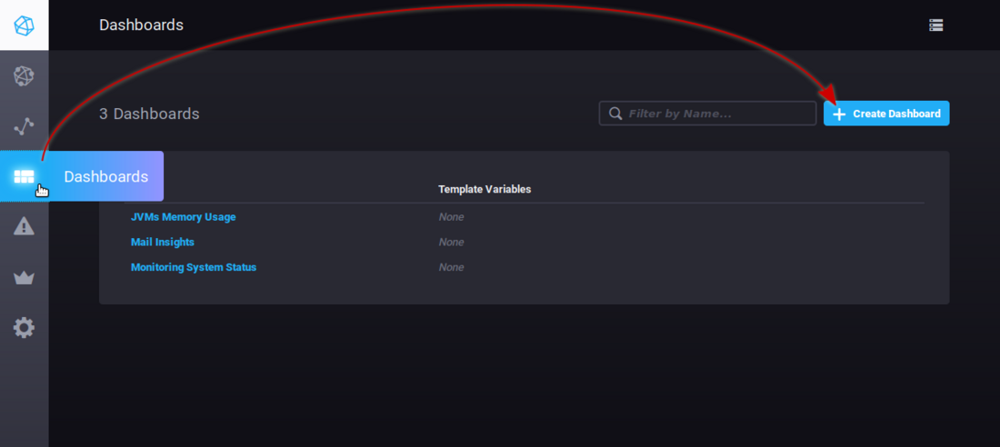

The dashboard is created immediately, and an empty view of it opens:

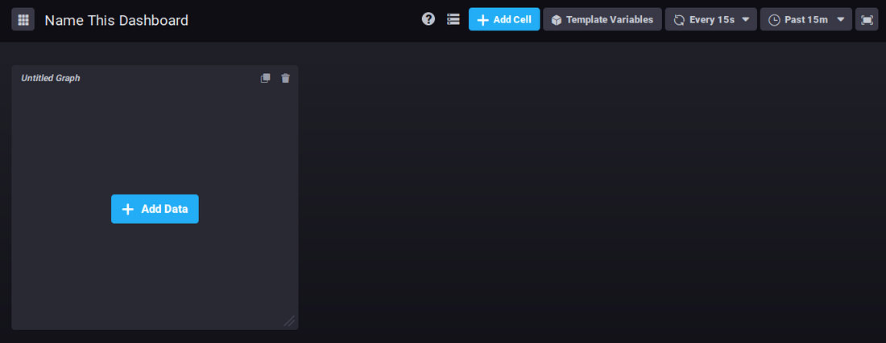

Click "*Name this dashboard*" to edit the box and enter a name for the dashboard:


To add a graph in the existing area, click 

The query editor opens. You can create a query either by typing a command or using the database browser. A view of the graph is shown in real time:

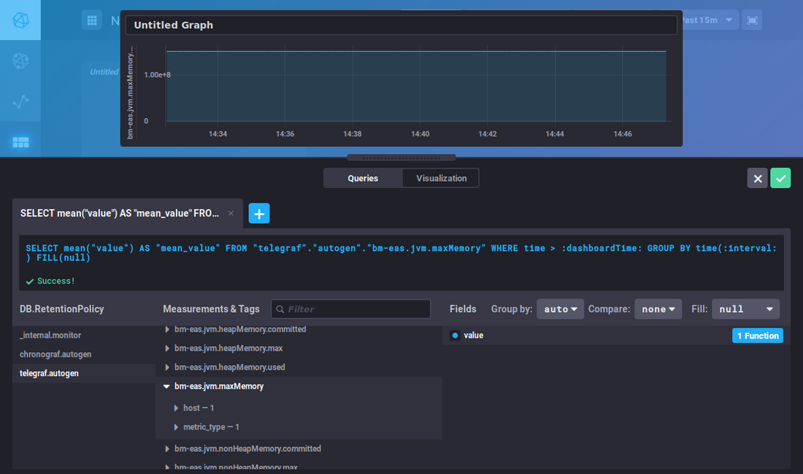

This editor is similar to the *DataExplorer*'s. Please refer to the previous section for metrics search and query building.

The "***Visualization***" button is used to choose a graphic type and customize it:


Once your graphic has been created, click "Save" in the top right corner of the editor. The graph is saved and added to the area:

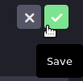

Click  to add as many graph areas as you like:

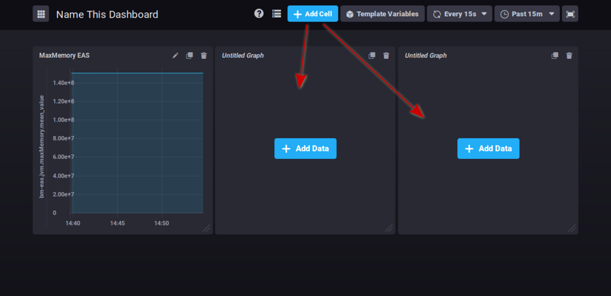

In the top right corner of each cell, three buttons are used to:

- : edit, add comments or download csv data
- : clone the graph. A new area containing the same graph is added at the end of the dashboard
- : delete the graph


Clicking the icon opens a menu of possible actions.


:::tip

Graphs can be reorganized by clicking the title area and dragging and dropping them as desired:

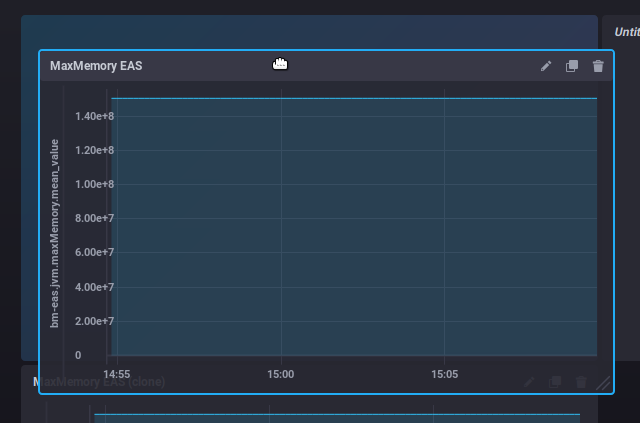

:::


:::info

There is no "save" button: all changes are saved as they are made.

:::

## Alerts

The *Alerting* tab is used to manage alerts as well as alert history.

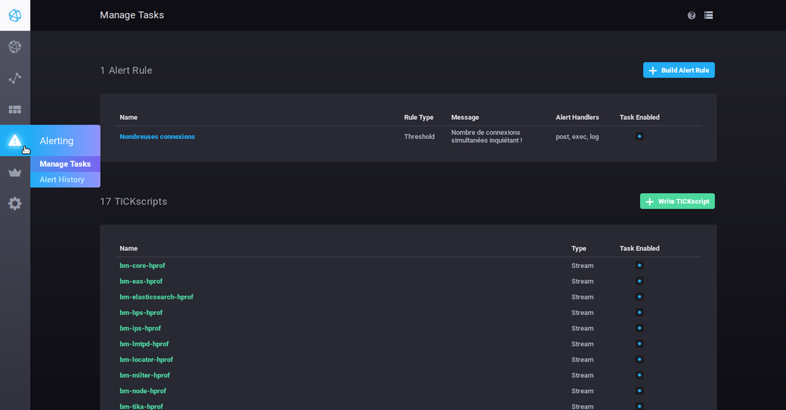

Alerts can be shown as scripts or as alert rules.

By default, there are no alert rules on installation, there are however, a number of pre-set scripts which you can modify. You can also add as many scripts as you like.


:::info

BlueMind pre-set alerts are important server health alerts, you must pay close attention to them if they are triggered.

:::

### Alert rules

- To create an alert, click 
- To edit an alert, click its name in the list.


Fill in (or edit) the form:

- ** **Name this alert rule****: alert name
- ** **Alert type****: described below
    - **Threshold**: an alert will be triggered when the data reaches, exceeds or falls below the set value
    - **Relative**: relative to its own history – an alert will be triggered when value changes exceed set conditions
    - **Deadman**: an alert will be triggered when no data is detected within the set period
- ** **Time series****: use the navigator to find the relevant series 
    - **DB.RetentionPolicy**: the databases you want to analyze. The most relevant is **telegraf.autogen** which contains the actual data. The other databases (_internal.monitor and chronograf.autogen) contain internal system data.
    - **Measurements & Tags**: the metric being searched for, a box at the top of the column can be used to filter your search by name
    - **Fields**: the field(s) required for this data
- ** **Conditions****: once you have selected the field, set the conditions according to the type of alert chosen earlier.When you type a value, a real-time display of the data collected is shown which can help you set or adjust the value.For example in the form below: 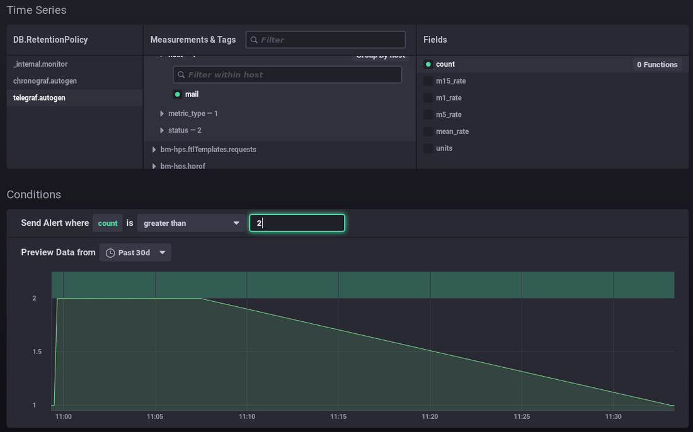 
    - You want to set up an alert for when the number of connections is more than 2.
    - The graph shows the number of connections over the previous month (green line).
    - The green area at the top highlights the area for which the alert would have been triggered.
    -  You can see that your values have always been below, it would be abnormal for them to exceed this value, therefore this threshold seems to be relevant. 
This can help you set the right value in light of the data's history: above typical values, possible spikes, etc.In this other example, an alert will be triggered when there are memory usage spikes every day: 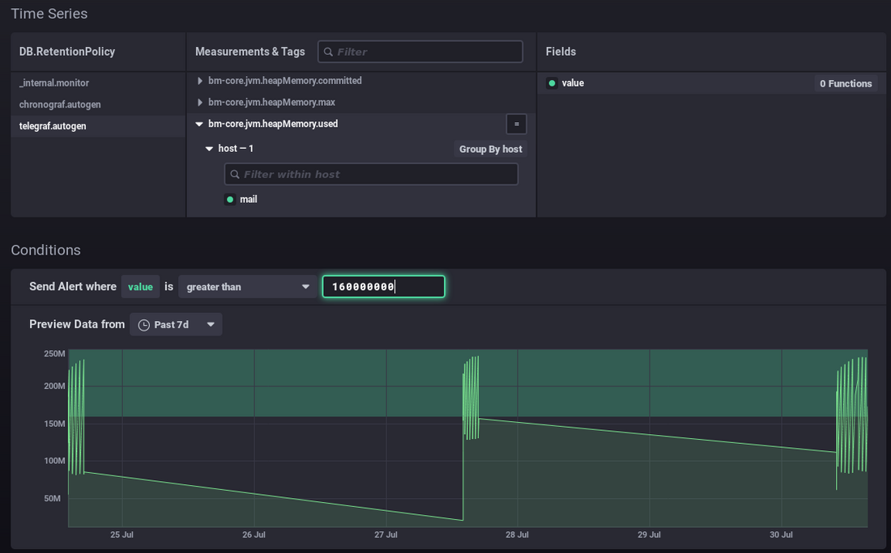- ** **Alert** ** handlers****: Add alert recipients using the drop down list:
    - post: sends a "post" http alert to the url provided
    - tcp: sends a request via tcp to the address indicated
    - exec: command line to run on the server
    - log: write a message to the indicated log file
    - ...
In this example, the alert sends an http request, runs a command on the server and writes a message to the dedicated log file: 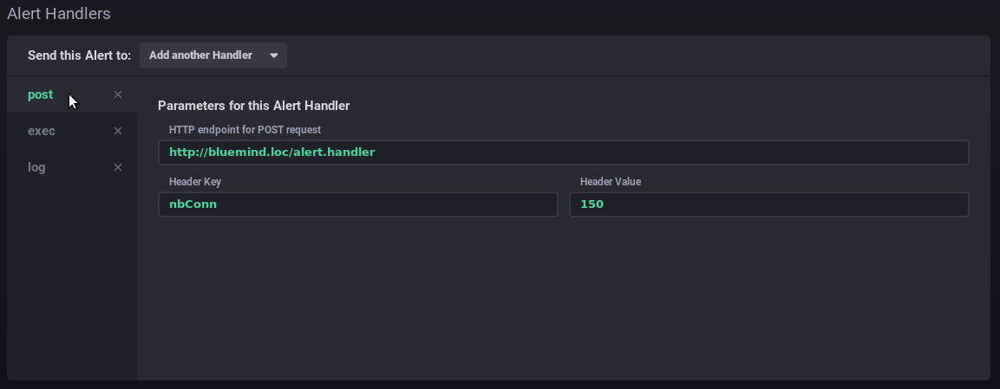- ** **Message****: the message to write or send via the handler(s) specified above 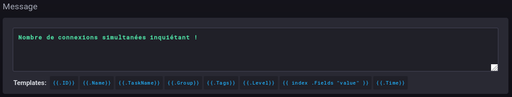


### Scripts

Scripts are used for advanced alert management. Each alert created as a rule also exists as a script and can be edited using that method.

- To create a script, click 
- To edit a script, click its name in the list.


For more information on writing scripts, please refer to the product's documentation:

[https://docs.influxdata.com/kapacitor/v1.5/tick/](https://docs.influxdata.com/kapacitor/v1.5/tick/)

[https://www.influxdata.com/blog/tick-script-templates/](https://www.influxdata.com/blog/tick-script-templates/)

### Alert history

The *Alerting* > *Alert history* sub-menu is used to access the history of alerts triggered:

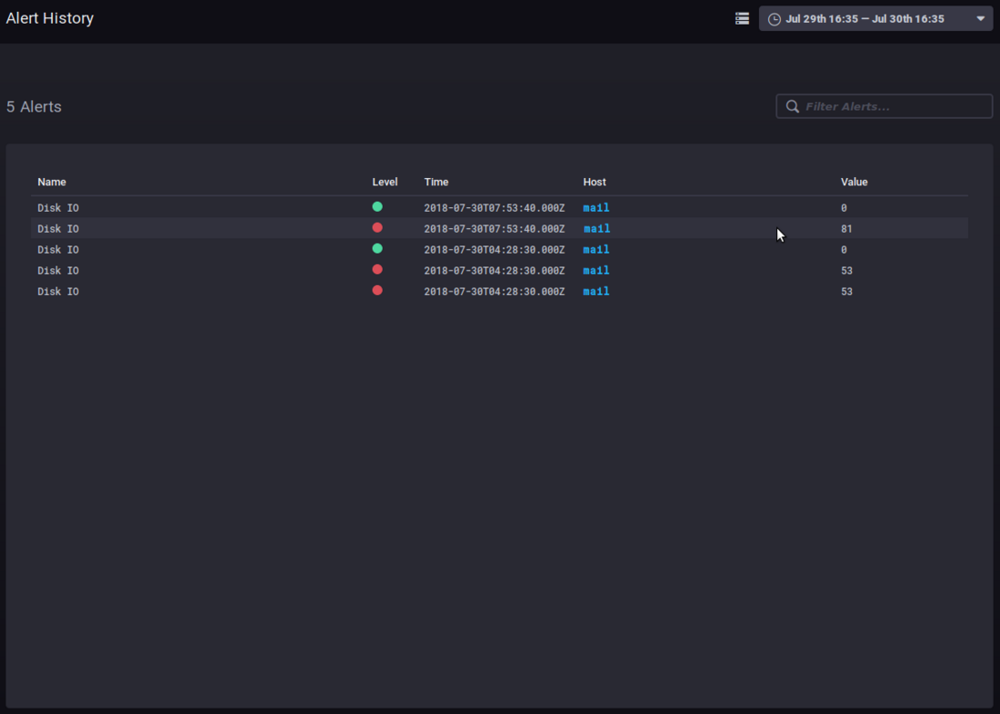

The history shows the name, level, host and value of the data when the alert was triggered.

Click the host's name to open its dashboard. 

## Other tabs

### Hosts

The *Host List* tab shows the list of monitored host servers, with the apps they include:


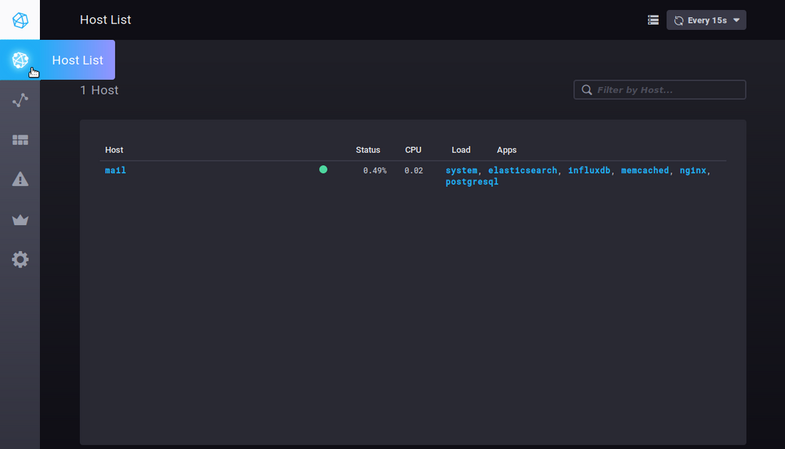

Clicking a server or an app opens its specific dashboard.


