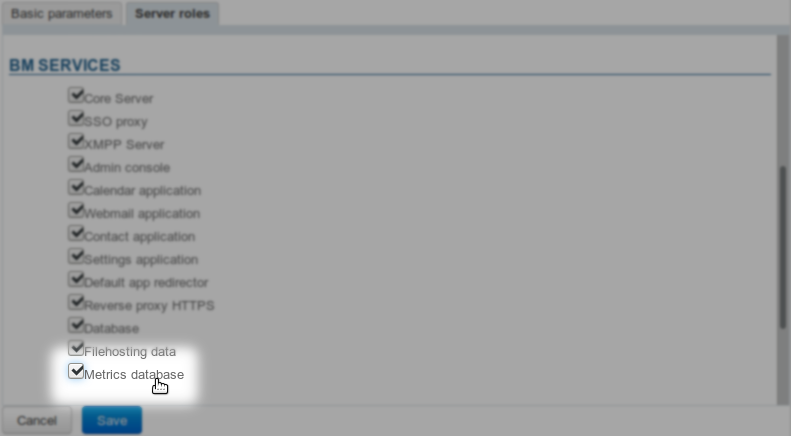

# Installation and Access


## Introduction

The bm-tick monitoring suite is included by default in the BlueMind 4 installation.


## Installation

Software packages are pre-installed on the server along with the BlueMind installation, but they do need to be configured:

1. Log into the admin console as admin0 (or delegated administrator with the required permissions) and go to System Management > Application servers > select the servers > Server roles tab
2. Enable the role "Metrics database":********
3. ****Save****
4. Add last packages and restart BlueMind:


```
aptitude install bm-plugin-admin-console-monitoring bm-plugin-node-monitoring
bmctl restart
```


5. Run a first generation of the alerts' and dashboards' default configuration. To do this, still connected to the server as root, run the following command:


```
bm-cli tick reconfigure
```


6. Reload the Nginx service:


```
systemctl reload bm-nginx
```

Note: this command has no impact on users, you can run it without risking a service break.


## Accessing the application

Once the installation is complete, you can access the application by logging into **https://&lt;your**** bluemind>.tld/tick**


:::tip

The username and password requested are those for the setup wizard you were provided when you installed BlueMind, which you can configure in BlueMind's administration page.

If you've lost your log in credentials, please refer to our FAQ on this issue: [I have lost my password for the setup wizard](/FAQ_Foire_aux_questions_/#FAQ-swpassword)

:::

Accessing the application is more straightforward but requires a [role](/Guide_de_l_administrateur/Gestion_des_entités/Utilisateurs/Les_rôles_droits_d_accès_et_d_administration/) to be assigned:

- Assign the "Monitoring Console" role to the people you want (through each individual user's page or through a group)
- These users then have a "Dashboards" link in their ribbon menu giving them access to the console (this may require them to log in again):


