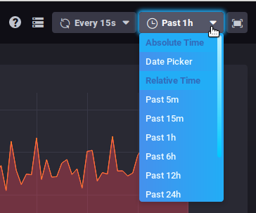

# Bm-Tick Monitoring

# Introduction
:::important

Monitoring tool is included in BlueMind 4 installation, you can not uninstall it.

:::

BlueMind uses the Tick monitoring tool to monitor all server data in real time as well as to view data history through its database-based storage. It also allows detailed alert configuration: in-UI alerts, command line actions, writing to a specific log file, etc.BlueMind's Tick monitoring tool includes the following products:

- **Telegraf**: the server agent for collecting & reporting metrics.
- **InfluxDB**: scalable datastore for metrics, events, and real-time analytics
- **Chronograf**: monitoring and visualization web user interface
- **Kapacitor**: framework for processing, monitoring, and alerting on time series data

In addition to these, the BlueMind package provides:

- BlueMind-specific default configuration
- automatic configuration of Telegraf and installation of necessary plugins 
- automatic configuration of dashboards and default alerts

The BlueMind package provides the most comprehensive, precise and customised monitoring possible for large amounts of data. You can also access **data history**, which is kept for one month and lets you view the data, monitor evolution and compare past data with existing data to detect and analyse issues. 

We recommend that you read the rest of our documentation in order to install, use and work with this tool:

- [Installation and Access](/Guide_de_l_administrateur/Supervision/Monitoring_Bm_Tick/Installation_et_Accès/)
- [Exploring and analyzing data with bm-tick](/Guide_de_l_administrateur/Supervision/Monitoring_Bm_Tick/Explorer_et_analyser_les_données_avec_bm_tick/)
- [Metrics references](/Guide_de_l_administrateur/Supervision/Monitoring_Bm_Tick/Référence_des_métriques/)

# User Interface

The homepage shows the key information:

- alert statistics
- alerts
- production information flow
- useful links

The [DataExplorer](/Guide_de_l_administrateur/Supervision/Monitoring_Bm_Tick/Explorer_et_analyser_les_données_avec_bm_tick/) tab lets you make queries to view and analyse the metrics collected.

The dashboards show real-time data graphs:

When you hover your mouse on a graph, detailed information on the data pointed at pops up. A white line also appears on the other graphs, showing the time the mouse is pointing at to help you read all the data for one point in time.

You can also zoom on a graph by selecting a time slot with your mouse. Double-clicking the selected time slot takes you back to the graph's default view.

Two drop-down lists in the top right corner of each dashboard allow yo to change (or freeze) the refresh rate or the time frame to display:

:::important

This data is kept in memory when you switch between dashboards.

:::

