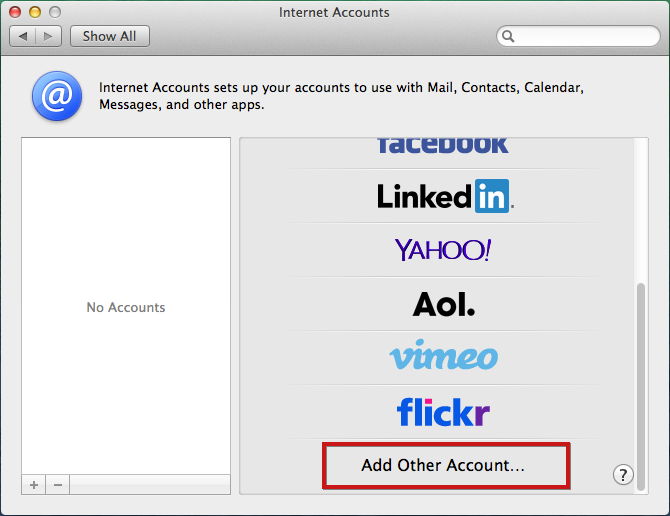
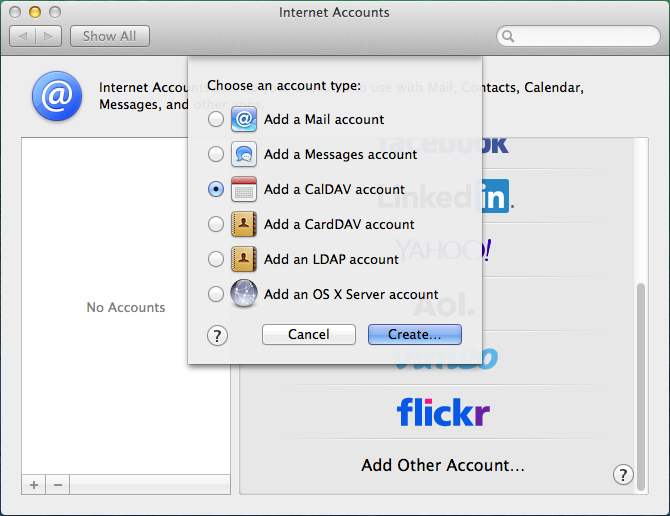
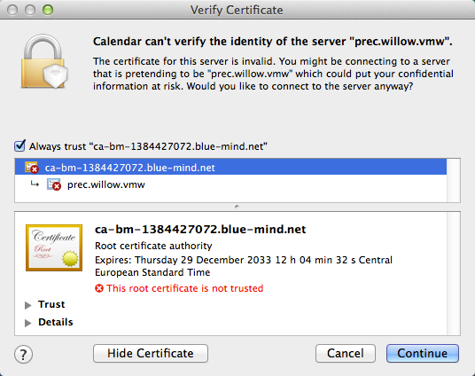
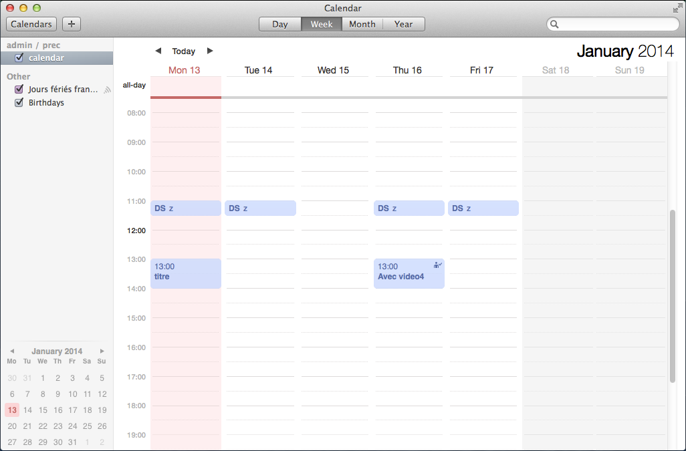
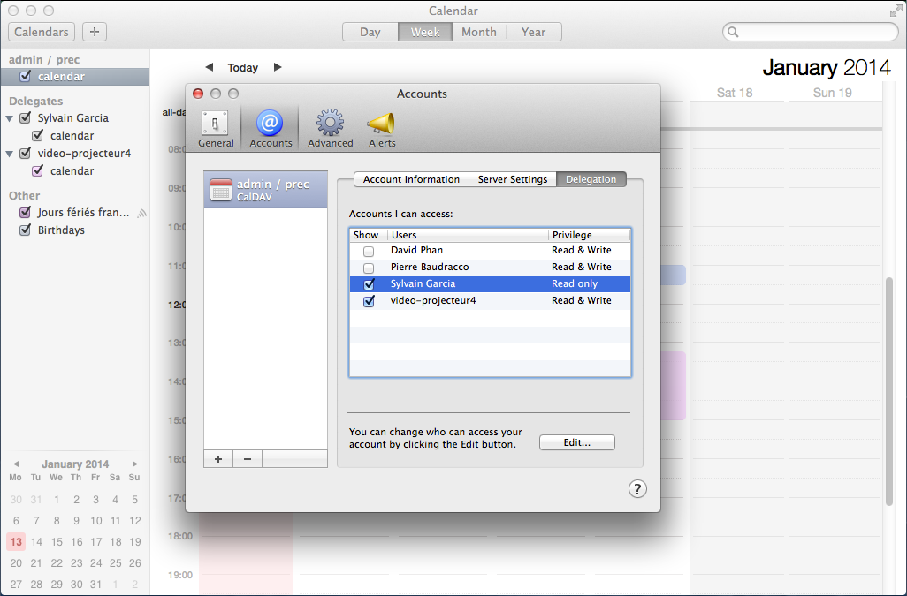

# Setting Up Apple Calendar

## Introduction

:::info

This guide was written using a Mac running OS X Mavericks.

The CalDav protocol isn't currently supported by clients other than OS X and, preferably, the latest OS version. Given the standard's flexibility, we are unable to guarantee that it will work smoothly with other clients.

:::

## Setting up a CalDAV account

### Creating an account

Go to System Preferences > "Internet Accounts":

Select "Add other account":

Select "Add a CalDAV account" and click "Create":

Set Account Type to Manual (an automatic account requires DNS SRV records) and enter the account information:

- The username must be your full username **including the domain name**.  

- The password is the password provided to you by your administrator to connect to BlueMind.

- The server address must be given to you by your administrator. Typically, it is &lt;servername>.domain.com. 

Click "Create". 

You will get a warning that the connection is unsecured, which isn't entirely technically accurate.

Click "Create" again. The system then tells you that the issue is that the certificate is invalid:

Check "Always trust..." to tell the system to trust the certificate and click "Continue":

Confirm that you want to add this certificate by entering your system user name and password.

The account is then created with the following settings:

:::info

Do not activate reminders, this feature has not been implemented yet.

:::

Launch Calendar. Your appointments should appear:

### Displaying shared calendars 

To view shared calendars in Calendar, you must first subscribe to them in BlueMind. This operation must be made in the web-based UI.
To do this:

- Go to User settings > Calendar > Subscriptions tab. 
- Enter the name of the calendar you are looking for (user calendar, resource calendar, ...).
- Validate with &lt;Enter> or select it from the list displayed by autocomplete. 
- **Click "Save" to apply changes.**

For more details, go to *[Calendar preferences](../Guide_de_l_utilisateur/../L_agenda/Paramétrer_l_agenda.md)*.

Once you've subscribed to calendars in BlueMind, go to Calendar preferences > "Accounts" > select the account you've created > "Delegation": the calendars you have access to (your own calendars as well as those you have rights to) are listed.
Check the boxes in the "Show" column to select the calendars you want to display:

 

 

 

 

