# Synchronizing with Thunderbird


## Installing Thunderbird

Download and install Thunderbird from the provider's website: [http://www.mozilla.org/thunderbird/](http://www.mozilla.org/thunderbird/)

## Setting up a user account

When you first open it, Thunderbird asks if you want a new email address and account. Choose "Skip this and use my existing email".


:::info

If Thunderbird is already installed and set up with a user account and email, just go to File > New > Existing Mail account.

:::

- Enter your name, email address and password to connect to the BlueMind server and click "Continue".
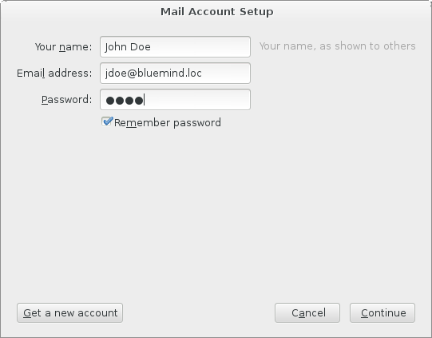

- Thunderbird tries to connect to the server based on this information and displays the information tested and/or found.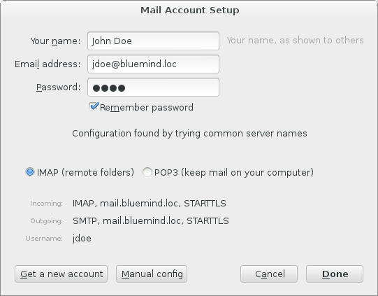
- Thunderbird suggests an abbreviated username based on the first part of your email address. However, the BlueMind server expects the username to match your full email address. Go to "Advanced config" (at the bottom of the dialog box) to correct this: 
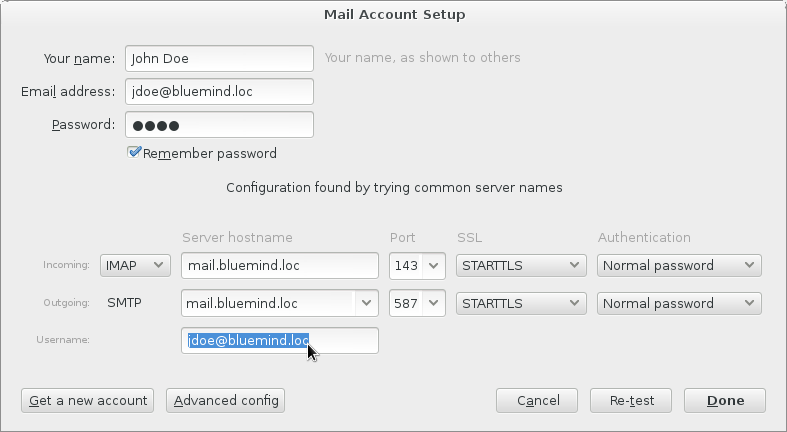


:::info

If Thunderbird is unable to guess the incoming and outgoing server names, it automatically displays the advanced configuration dialog box and the "Done" button is grayed out. Enter the correct addresses as well as the username and click "Re-test" to validate the connections and complete the process.

:::


:::info

- You are free to use any name as "Your name". This is the name that will appear on your outgoing messages.
- The email address is the address configured by the BlueMind administrator. 
- Incoming and outgoing server names must be given to you by your administrator. Typically, they are &lt;servername>.domain.com.
- The username must be your full username including **the domain name**. 
- The password is the password provided to you by the administrator to log into BlueMind.


:::

- Click "Done".
- Thunderbird then opens the main window and retrieves messages from the account you have configured.


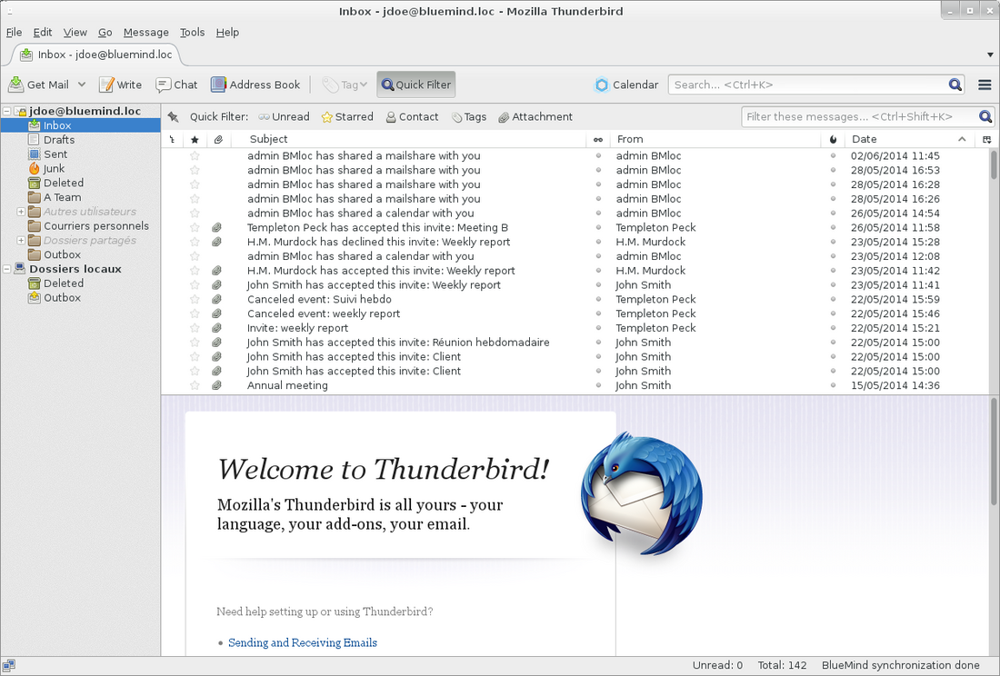

## Connecting to a shared mailbox

To access a shared mailbox, you must subscribe to it in Thunderbird.

To do this, right-click the left pane and choose "Subscribe" from the menu:

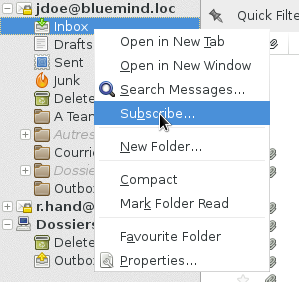

A window showing the list of files you have access to opens.

Open the grayed out "Dossiers partagés" ("shared folders") menu – double-click it or click the "+" sign at the beginning of the row – and check the box(es) corresponding to the folder(s) you want to subscribe to. Click "OK" to finalize:

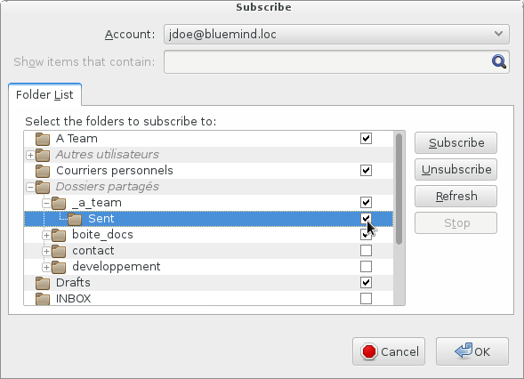

The shared mailbox is shown in the main window along with the other account folders, under a sub-menu called "Dossiers partagés".

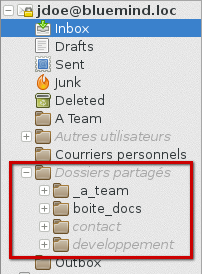


:::tip

Thunderbird can be configured to display all your shared folders without you having to subscribe to them:

- Go to *Tools* > *Account settings*.

- Go to *Server settings* for the account you want to configure.

- Click *"Advanced...".*

- Uncheck *"Show only subscribed folders".*


:::

Depending on the rights you have on the shared mailbox, you can view the messages it contains or copy/move messages from your mailbox – from your "Inbox" folder, for example.


:::info

WARNING

If you use drag and drop to **move** an email to this mailbox, it disappears from its original mailbox.

**To copy a message**, right-click the message header on the right hand side of the window and select Copy To > select the user's mailbox > "Dossiers partagés" > choose the shared mailbox and the location you want to move the message to by selecting "Copy Here":

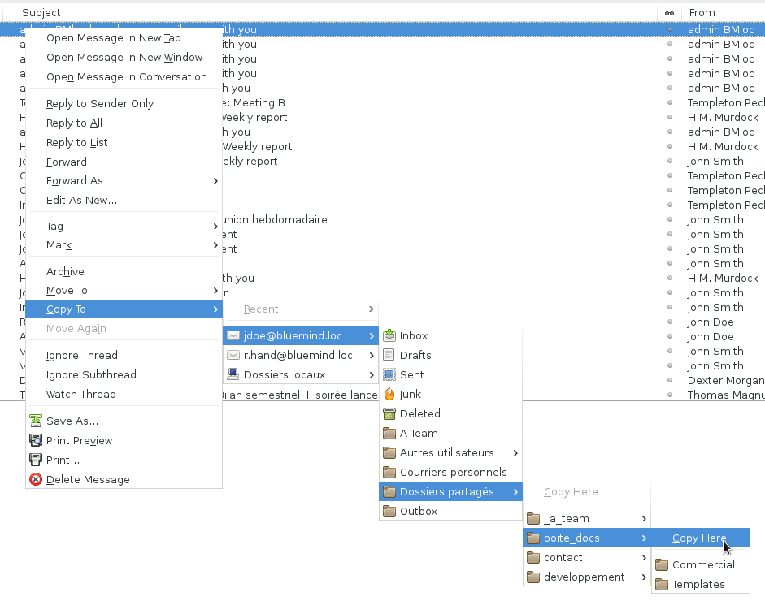

:::

## The BlueMind connector

The BlueMind connector allows you to synchronize the BlueMind calendar and address book with Thunderbird. It also enables access to tasks and [linked attachments](../La_messagerie/Ajouter_des_pièces_jointes.md) when you write emails.

### Installing the connector

To install the BlueMind connector:

- Download the installation file from the Downloads menu in BlueMind settings.


:::info

If the connector is not shown in the Downloads menu, please contact your system administrator for them to [install it](../../Guide_de_l_administrateur/BlueMind_et_mobilité/Les_connecteurs_BlueMind_pour_clients_lourds.md).

:::

- In Thunderbird, go to Tools > Add-ons.
- Drag the file from the file explorer to the main Thunderbird window or choose to install a new add-on from the add-on tools menu: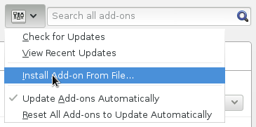
- Follow Thunderbird's installation instructions and restart Thunderbird.
- Go to Tools > Add-on Options > BlueMind Connector and configure the server address: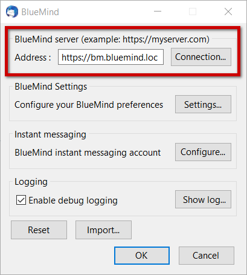 NB: depending on your operating system's or Thunderbird version, there are several ways to access this window:
    - Tools > Add-ons > "Options" button on the corresponding module 
    - Tools (or Preferences) > Options > BlueMind tab
- Click OK to quit
- The connector initiates a first connection and prompts for the user's username and password.


:::info

The Thunderbird connector synchronizes all items automatically every 2 minutes. To force synchronize manually, go to Tools > BlueMind > Synchronize.

:::

### BlueMind Preferences

 With BlueMind version 4.1, Thunderbird users can manage all their BlueMind preferences in Thunderbird without having to go to the BlueMind web application.

There are several ways to access preferences in Thunderbird:

- Tools > BlueMind > BlueMind Preferences
- From the connector window:Tools > Module options > BlueMind Connector > "Preferences button"


The UI looks and works exactly like the preferences page in the BlueMind web application:

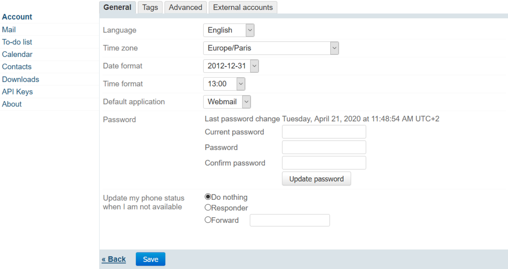


### Attaching files as links

Once the connector is installed, you can access the [link attachments](../La_messagerie/Ajouter_des_pièces_jointes.md) feature in the compose message window.

#### Working with linked attachments

Simply attach your file as usual (using the attach button or drag and drop). If the file size exceeds the auto-detach size configured in BlueMind, Thunderbird gives you the option to link the file:

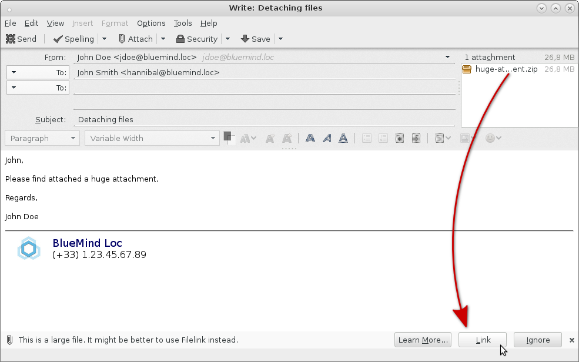

The file is then automatically sent to the server and linked to the message:

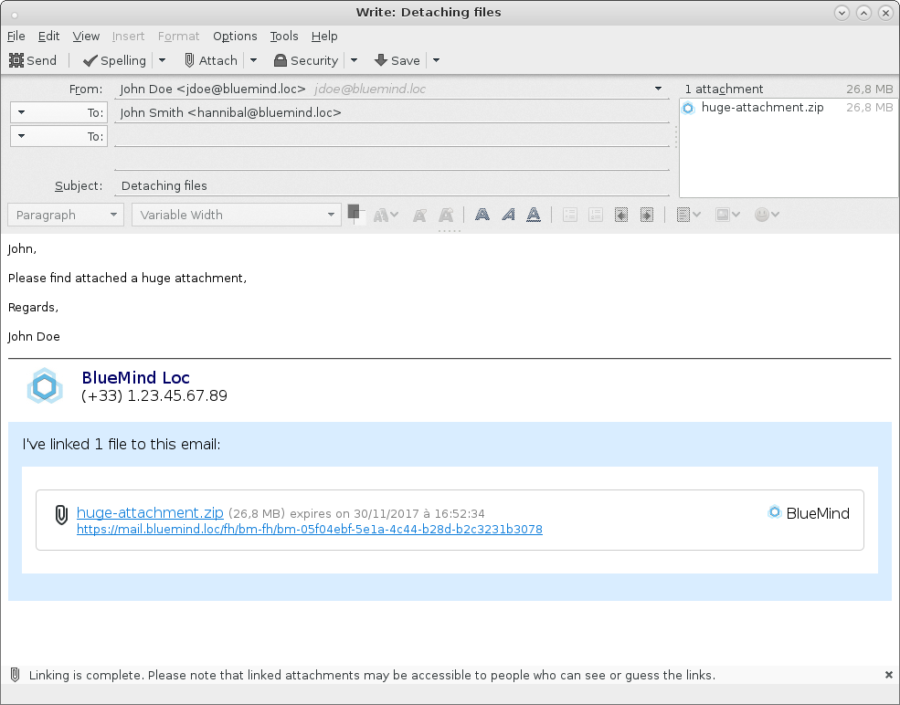

Just like in BlueMind webmail, the download block will be displayed in recipients' messages, whatever email client they are using.


:::info

When you use this for the first time, you will be asked to choose which service to use:

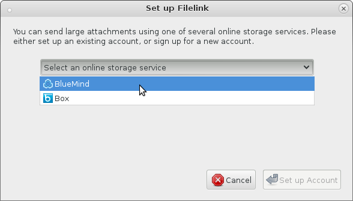

1. Select BlueMind
2. Click "Set up Account"
3. A warning may pop up, in that case accept the certificate exception and click "Set up Account" again
4. The pop-up closes and the file is attached to the message


:::

#### Forced detachment

To detach an attachment from a message, right-click the file name and select Convert to > BlueMind:

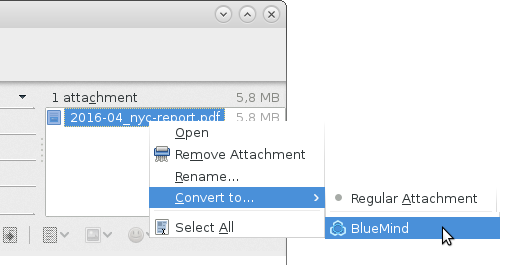

Conversely, to reattach a file that has been detached, select Convert to  > Regular Attachment. The file is then added to the message and the download block is deleted.

Files can also be added to messages as links rather than physically when they are first attached. To do this, click the arrow next to the "Attach" button to open the drop-down menu and select Filelink > BlueMind

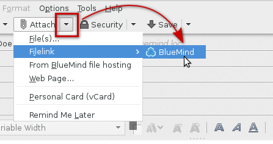

Your system's file browser opens and once you've chosen a file, it is automatically and immediately sent to the server and added to the message as a link:

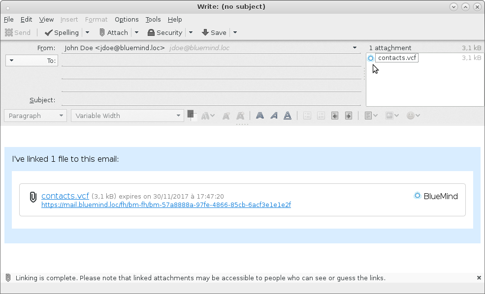

#### BlueMind file chooser

Just like in BlueMind webmail, you can access the file chooser to send files you already have in your online space (files you've already sent as links).

To access them, click the arrow next to the "Attach" button in order to open the options menu and select "From BlueMind file hosting":

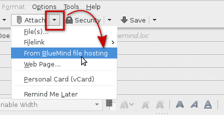

The BlueMind file chooser opens, which allows you to select available files. Click one or several files and then the "Select" button to add them to the message:

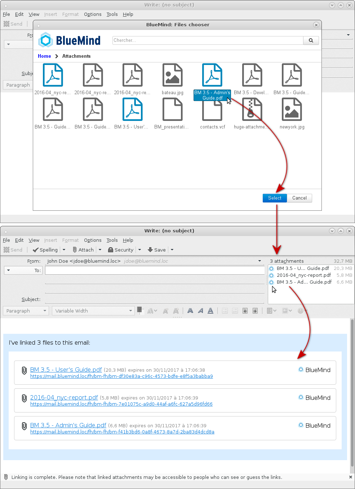

#### Configuration

In Thunderbird preferences, Attachments tab, you can choose to disable automatic file linking for files exceeding a certain size by checking or unchecking the dedicated box:

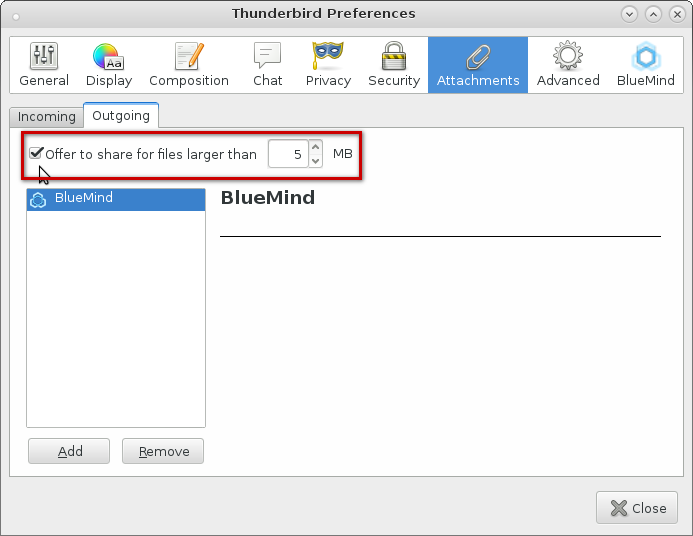


:::info

Although file size can be changed in this window, it is synchronized with the BlueMind server every time Thunderbird starts. As a result, the changed value will be overwritten next time you open Thunderbird.

:::

### Calendar

#### Display

Once the connector is installed and connected, you can access the Calendar through Tools > BlueMind > Calendar or by using the new button in the main window:

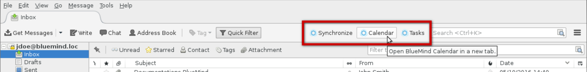

It is looks and works just like the web [calendar](../L_agenda/Découvrir_l_agenda.md):

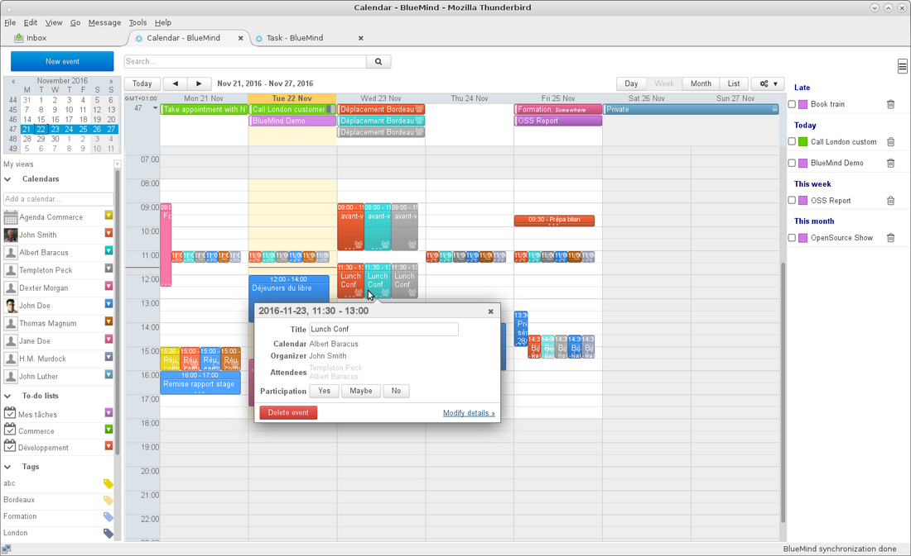

#### Preferences and calendars

Choosing what calendars to display, creating secondary calendars and granting share rights to other users are done in preferences (see above): Tools menu > BlueMind > BlueMind Preferences > Calendar section.

For more details, go to the page on [Préférences de l'agenda](../L_agenda/Paramétrer_l_agenda.md)

### Tasks

Just like the calendar, tasks are available in a dedicated tab with the same UI as the BlueMind web application:

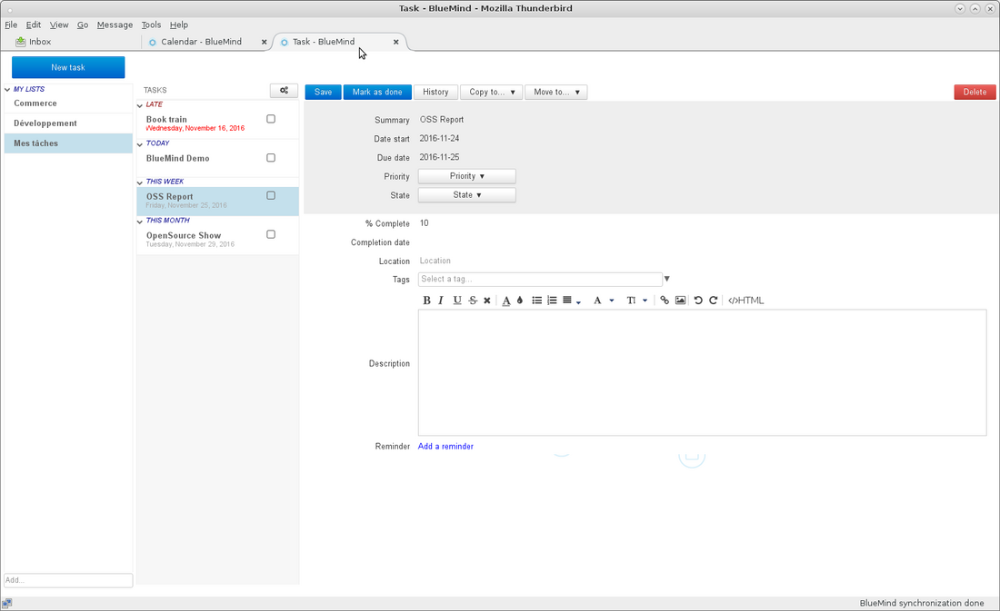

To find out more about how tasks work, go to the page: [Tasks](../Les_tâches/Découvrir_les_tâches.md)

### Contacts

All BlueMind user address books can be synchronized with Thunderbird and accessed in the address book window (Tools > Address Book):

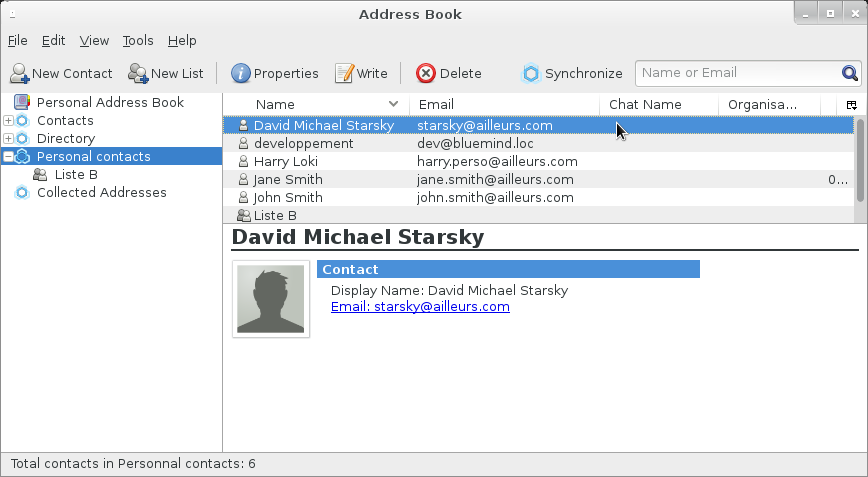

To see an address book in Thunderbird, you must first subscribe to it in BlueMind, whether it is a personal address book or an address book shared by another user.

To add an address book subscription:

- Once the address book is shared (by a user for a personal address book or by the administrator for a domain address book), go to BlueMind preferences: Tools > BlueMind > BlueMind Preferences > Contacts section > Subscriptions tab

- in the field box, start typing the name of the address book and autocomplete will give you a list of suggestions:
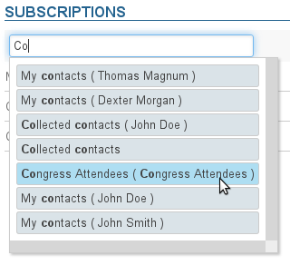 
Note: personal address books are automatically added when they are created.


:::tip

Subscriptions and Synchronization

The "Synchronize" button is used to configure address book-specific synchronization.

- **If synchronization is enabled**: the address book you can see the address book and contact cards can be viewed and are available offline
- **If synchronization is disabled**: the address book is identified with a different icon from other address books and contact cards can be accessed via search (address book) and autocomplete (compose messages) only


:::info

Directory synchronization

To avoid issues with large numbers of domain users, the Directory address book is not synchronized by default.

:::

For more information, please go to the page [Use a shared address book](../Les_contacts/Utiliser_un_carnet_d_adresses_partagé.md)

:::

- Go back to the address book.
- Click "Synchronize" or go to Tools > BlueMind > Synchronize to see the address book: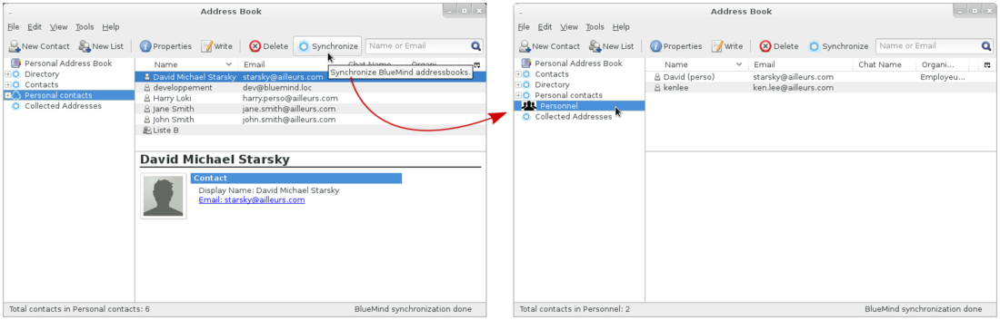


### Corporate signature

If a [corporate signature](../../Guide_de_l_administrateur/Configuration/Signatures_d_entreprise.md) has been configured, it will be automatically added at the end of the message by the server after the message is sent.

A preview is shown in the compose window. This allows you to confirm that a signature will be added and which signature it is if several have been configured (internal, external or group signature, etc.):
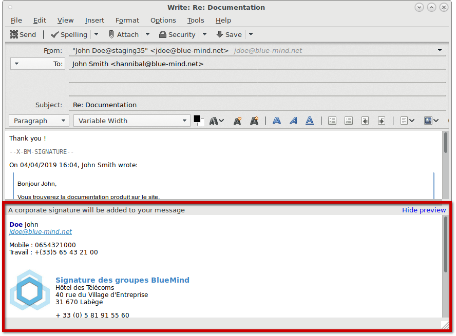

#### Signature placement

If the administrator has enabled this option, you can choose where to place your signature.

**To do this, add the string (tag) `--X-BM-SIGNATURE--` where you want your signature to go.**

To make this easier, you can set up this string to make it your default signature in Thunderbird:

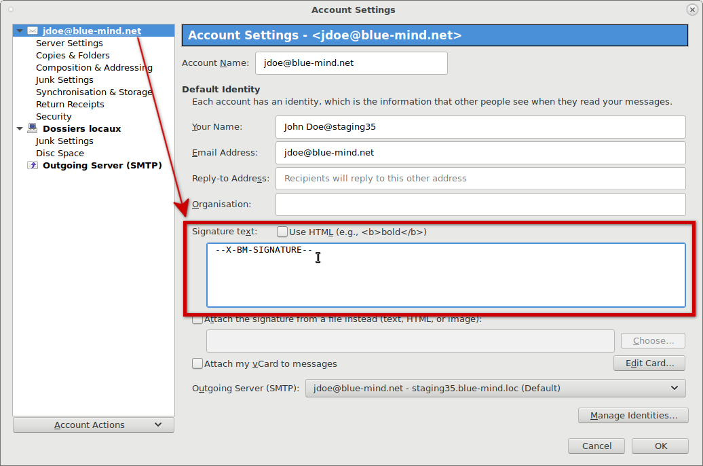

When you write or reply to an email, the tag will be added to the message automatically:

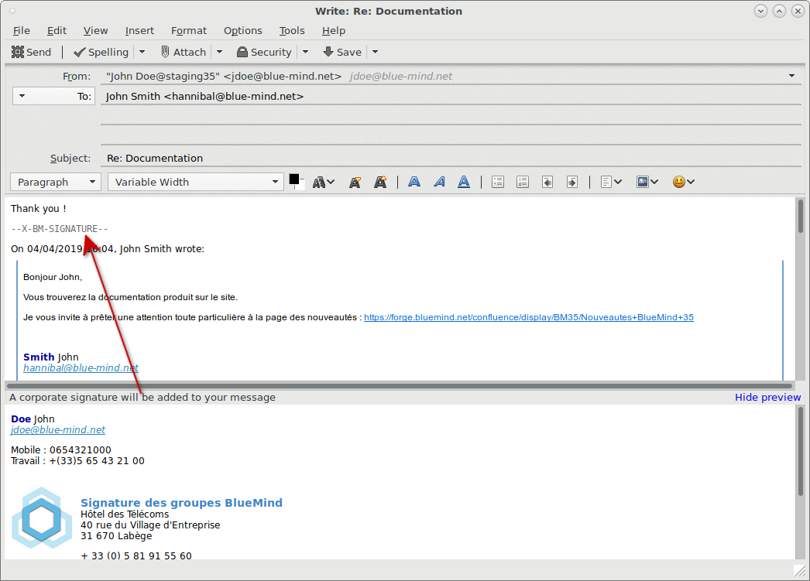


:::tip

Even when the tag is added by Thunderbird, you can move it manually if you want to change the signature's placement temporarily.

:::

The signature is then added where the tag is placed:

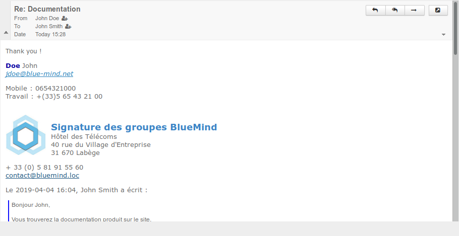


:::info

If the tag is missing or removed, the signature will be added at the very end of the message.

:::

#### Using a personal signature

Unlike in webmail, when you use Thunderbird, BlueMind cannot detect personal signatures and replace them. If a personal signature is used in Thunderbird, the corporate signature will be added **in addition to** the personal signature.

You should therefore not use personal signatures when a corporate signature is configured, unless it deliberately adds relevant information or it is used as a placement tag (see section above).

## Troubleshooting


:::tip

You can access preferences via Tools menu > BlueMind > BlueMind Connector Preferences

:::

### Resetting the connector

When you're having issues with the connector that don't resolve after a simple restart, the first thing to try is to reset the connector. This resets synchronization and empties Thunderbird's browser cache.

To do this:

- Go to the connector's preferences
- Click the "Reset" button:
- Click "OK" to quit


### Connector logs

#### Getting detailed logs

When issues arise with no obvious cause, you need to enable detailed logging for the connector which will give you information about how the connector's synchronization has been running.

To do this:

- Go to the connector's preferences
- Check the "Enable debug logging" box: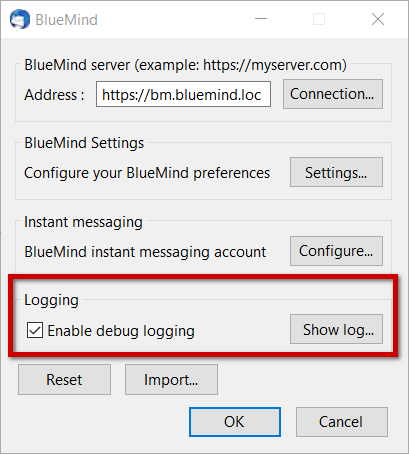
- Click "OK" to confirm
- Restart Thunderbird


#### Viewing logs

Logs can be accessed in the "Logging" section (see above) by clicking the "Show log..." button.

## Known issues

### The calendar tab opens a blank page

If resetting the connector (see above) fails to resolve this issue, there are 2 solutions:

#### Manually empty Thunderbird's browser cache

To do this:

- Open the Thunderbird Calendar tab
- Go to Tools > Clear recent history
- Choose "Everything" in the drop-down menu and check all the boxes
- Click "Clear now"
- Close then reopen the Thunderbird Calendar tab


#### Force-purge the caches

In addition to resetting and manually emptying Thunderbird's caches, you can force-purge them:

1. Close Thunderbird
2. Use the purgecaches command line option:


```
"C:\Program Files (x86)\Mozilla Thunderbird\thunderbird.exe" -purgecaches
```

For more information, visit: [https://developer.mozilla.org/en-US/docs/Mozilla/Command_Line_Options](https://developer.mozilla.org/en-US/docs/Mozilla/Command_Line_Options)

3. Delete the local storage folder:


```
C:\Users\John\AppData\Roaming\Thunderbird\Profiles\c05tkj52.default\storage\default\https+++bm.bluemind.loc
```

*NB: the program path may vary from one OS to another*

4. Restart Thunderbird


If none of these methods work to restore the calendar, then you need to enable detailed logging (see paragraph above) and send the logs to your IT service or BlueMind support.


