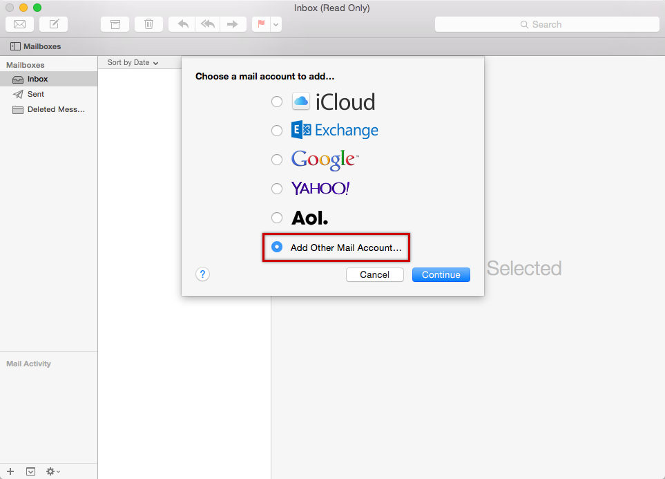
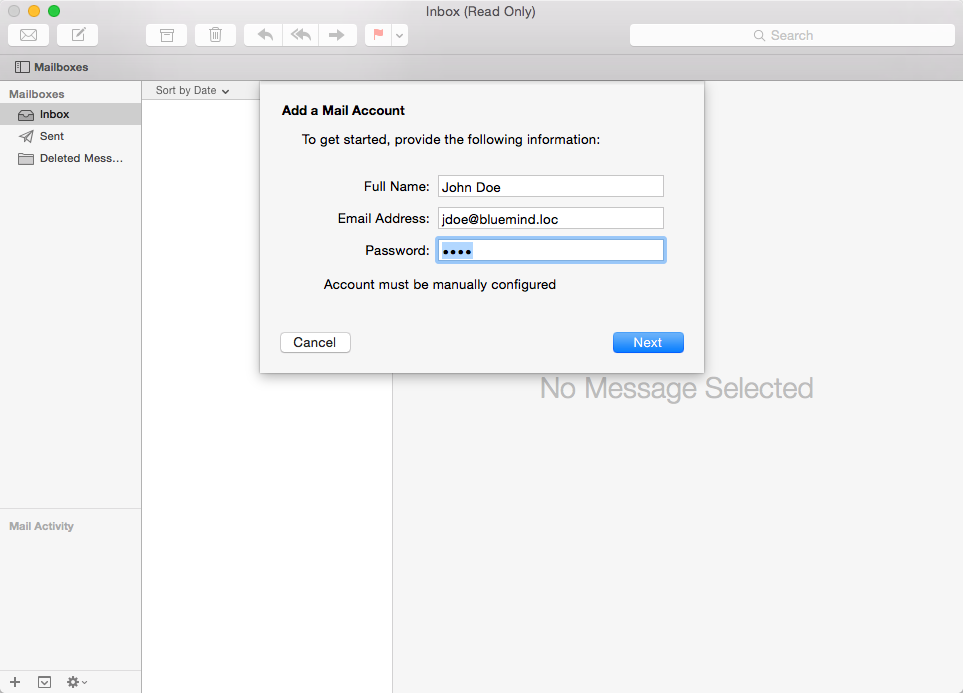
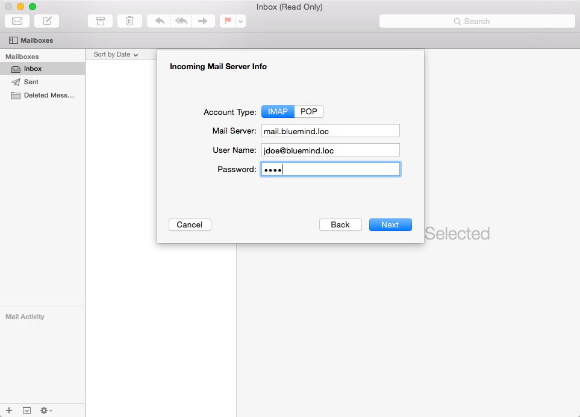
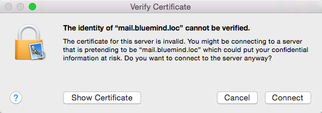
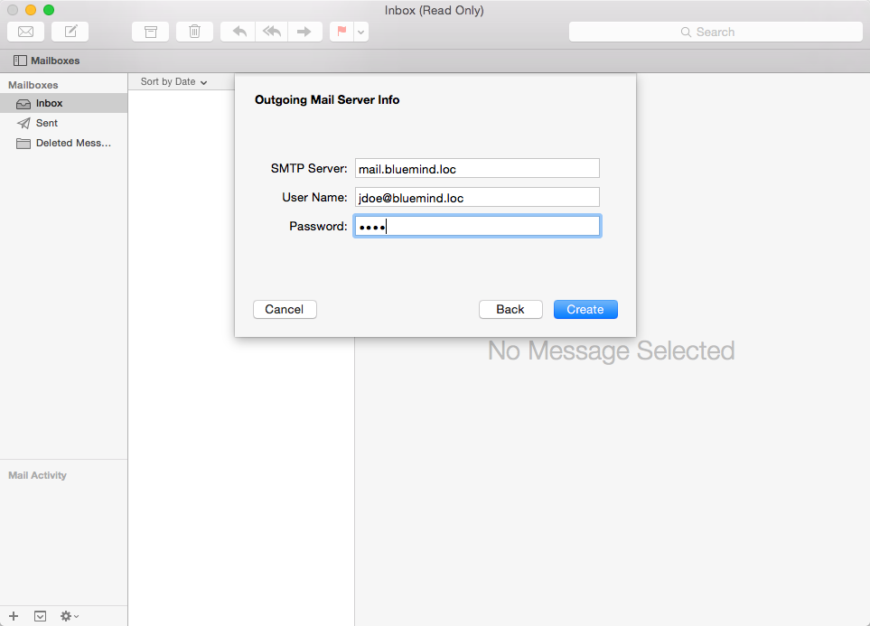
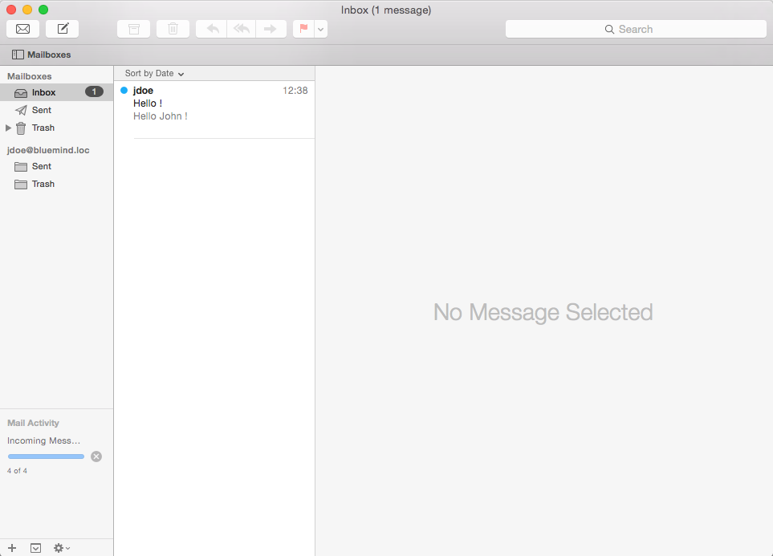

# Setting Up Apple Mail

# Introduction

 
:::important

This guide was written based on OS X Mavericks

:::

# Creating an account

There are several ways to create a new email account:

- In the internet accounts section: System Preferences > "Internet Account" > "Add other account"  > Select "Add a mail account" and click "Create"
- In the Apple Mail client:
  - when you first open Apple Mail and no other account has been set up, the software offers you to create a new mail account
  - through the Mail menu > "Accounts"

Select "Add Other Mail Account":

Enter the information requested:

- Full Name: this is the name that will appear for the account and in sent messages, you a free to use any name.
- Email Address: the email address provided to you
- Password: your user password

Click "Next" .

Check and correct the account connection information if necessary:

- Mail Server: The server address must be provided to you by your administrator. Typically, it is in the form &lt;server-name>.[domain.com](http://domaine.com) 
- User Name: the user name must be the **full user name, including the **domain name****.
- Password: The password is that provided to you by the administrator and allows you to connect to BlueMind.

 

Click "Next".

 

An alert warns you that the connection isn't secure, which isn't entirely true:

 

Click "Connect" to confirm that you want to connect to the server.

Check and correct the outgoing server connection information if necessary:

Validate by clicking "Create" and the mail account is created.

 

