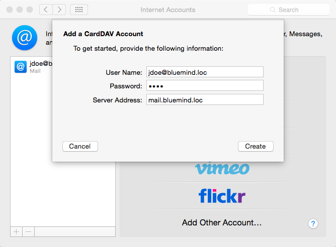
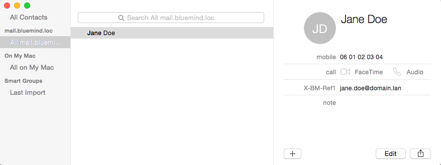

# Setting Up Apple Contacts

# Introduction

:::important

This guide was written based on OS X Yosemite.

The CardDav protocol is only validated with **native** Mac OS X clients and and preferably up-to-date OS. Given the standard's permissiveness, it is impossible for us to guarantee it will work correctly with other clients using this protocol.

:::

# Setting up a CardDAV account

## Creating an account

Go to the internet accounts section in System Preferences > "Internet Accounts":

Select "Add Other Account":

Select "Add a CardDav account":

Validate by clicking "Create".

Enter the user account connection information:

- User Name: full name including domain name, typically the user's main email address
- Password: the password provided to you by your administrator and that allows to connect to BlueMind
- Server Address: the server address must be provided to you by your administrator. Typically, it is in the form &lt;server-name>.[domain.com](http://domaine.com)

Validate by clicking "Create".

The Contacts application opens and shows the contacts:

:::important

Only the user's personal address book ("My contacts") is synchronized and available for display, search and autocomplete in emails.

:::

