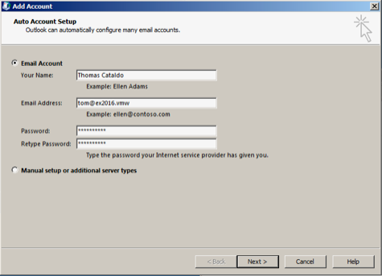
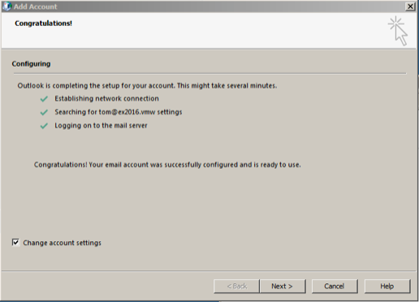
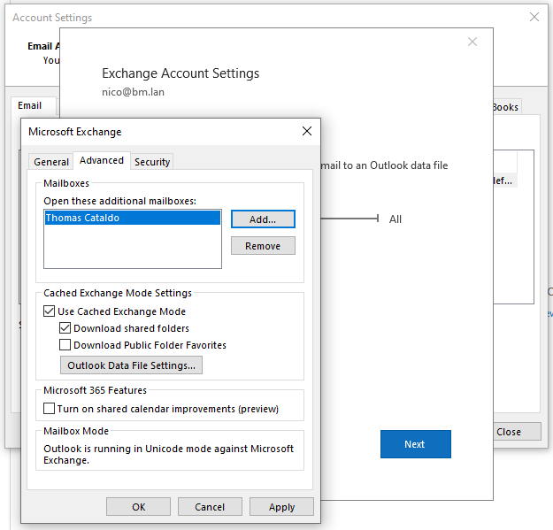
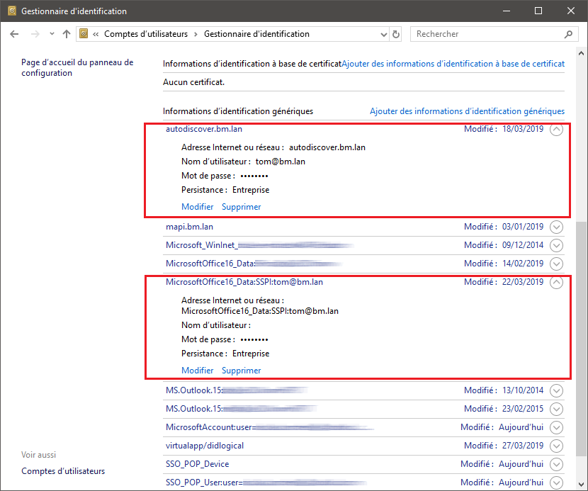

# Synchronizing with Outlook


# Introduction

With BlueMind 4.0, synchronizing with Outlook no longer requires a connector for you to be able to access BlueMind features in Outlook. You can now use all Outlook features while using BlueMind mail.

Installation requires 3 steps – the first two must be performed by an administrator:

1 [Server-side installation](/Guide_de_l_administrateur/La_souscription_BlueMind/Mise_en_œuvre_de_MAPI_pour_Outlook/)
1 Configuration of the Windows workstation to connect it to the server
1 Creation of an account in Outlook

:::important

Just like for earlier versions of BlueMind, using Outlook requires a subscription. [Please contact our sales teams to get a trial subscription](https://content.bluemind.net/decouvrez-bluemind-4-0).

:::


:::important

Connector-free, MAPI-based Outlook doesn't enable the use of the [linked attachments feature](/Guide_de_l_utilisateur/La_messagerie/Fichiers_volumineux_et_détachement_des_pièces_jointes/) (it is built into BlueMind and currently requires the Outlook connector).

:::

# Compatibility
:::important

Outlook for macOS

Windows and macOS use different communication protocols, as a result, we are enable to ensure compatibility with Outlook **for Windows**.

**BlueMind 4 isn't compatible with Outlook for macOS**.

:::

# Prerequisites

1 Versions:
  - [BlueMind 4.0](https://download.bluemind.net/bm-download/4.0) **with a subscription**
  - Client workstation:
    - Up-to-date **Windows** 10 
    - Up-to-date Outlook 2013 (or above) 
1 External and autodiscover urls must be available from the workstation via HTTPS: when entered into a browser, they must bring up the BlueMind login page.


# Configuring Outlook

- Open Outlook
- **Create a new Outlook profile: the account must not be added to an existing profile, including your default profile that appears on Outlook startup**


At the current stage of the MAPI protocol implementation in BlueMind, the Outlook profile thus created cannot be used to connect to another Exchange account.

**To do this: **

  - Go to the Control Panel > User Accounts > Mail (Microsoft Outlook) (depending on your display configuration, this menu may be shown in the control panel's root menu)
  - In the Mail Setup - Outlook, click "Show Profiles", then "Add" to create a new profile
  - Name the profile
  - The interface then takes to to the Email account creation interface
- 
Add a new Email account
:::important

Do not choose manual configuration.

:::

- 
Enter your email address and password:

:::important

You must use your default user address: aliases are not taken into account properly.

:::

- After a few moments, Outlook announces that the account has been successfully configured:
- Check "Change account settings" and click "Next"
-  **Check "Use Cached Exchange Mode"**  and slide the cursor all the way to the right to   "All":
- Click "Finish".


 **You're all set! Your Outlook account now natively communicates with BlueMind!** 

# Shared mailboxes

Version 4.3 of BlueMind has a mail subscription feature that works the same way as shared calendars and shared address books. This means that you can display shared mailboxes in Outlook with MAPI. 

To do this, just log into your BlueMind account and go to your account settings page  > Mail section > Subscriptions tab.

For more details about subscriptions, please go to:

- [Shared mailboxes - Subscriptions and third-party software](/Guide_de_l_utilisateur/La_messagerie/Les_boites_aux_lettres_partagées/#SharedMailboxes-abonnements)
- [Mail preferences - Subscriptions](/Guide_de_l_utilisateur/La_messagerie/Préférences_de_messagerie/#MailPreferences-abonnements)


# Shared user mailboxes

Access to user mailboxes is not available in public folders in the same way as for shared mailboxes.

To display user box in Outlook, go to Account Settings > Data Files tab > Settings > Advanced tab:



# Known Issues

## A profile is already configured on the PC

- 
In Outlook, File  > Account Settings > Manage profiles.
:::important

Depending on your Outlook and/or Windows version, the "Manage profiles" may not be present in this menu. You may also choose not to open Outlook.

In either case, go to the Control Panel and choose "Mail":

:::

- Choose "Show profiles"
- Select the profile and delete it
- **Restart Outlook**


Should the problem or data issues persist, you can delete all data:

In a browser, go to  `%localappdata%\Microsoft` (copy this chain in the file explorer's destination field) and delete the `Outlook` directory (Shift+Suppr.)

Then, go to `%APPDATA%\Roaming\Microsoft` and delete the Outlook directory (Shift+suppr) (`C:\users\[username]\AppData\Roaming\Microsoft` in windows10)

## Error when creating an account because of a wrong saved password

** **Issue/symptoms** ** **:** Outlook doesn't let you create an account when you enter a password – Outlook says that the password is wrong. 

** **Cause:** ** the user has saved a wrong password for this account during a previous attempt to create an account.

** **Troubleshooting Checks******:** in the server log file `/var/log/nginx/access.log`, you will find lines such as:


```
192.168.61.133 - - [06/May/2019:16:57:53 +0200] "POST /autodiscover/autodiscover.xml HTTP/1.1" 401 0 "-" "Microsoft Office/16.0 (Windows NT 10.0; Microsoft Outlook 16.0.11601; Pro)"
```


or


```
192.168.61.133 - tom@bm.lan [06/May/2019:16:58:31 +0200] "POST /mapi/nspi/?MailboxId=94a5c596-90a8-4985-91fd-57629ee06561@bm.lan HTTP/1.1" 200 149 "-" "Microsoft Office/16.0(Windows NT 10.0; Microsoft Outlook 16.0.11601; Pro)"
```


This means that a wrong password for [tom@bm.lan](mailto:tom@bm.lan) is being submitted during account creation.

** **Solution:** **

To remove the wrong password:

- make sure that Outlook and the account creation window are closed.
- open the Credential Manager by typing Windows + R
- then "`control /name Microsoft.CredentialManager`" in the run box:
- click OK (or type &lt;Enter>)
- delete entries such as  `autodiscover.domaine.tld`  and  `MicrosoftOffice16\_SSPI:utilisateur@domaine.tld`  E.g. to delete the password for *  [tom@bm.lan](mailto:tom@bm.lan)*:



## Shared mailboxes aren't shown in the list of user folders

Mailshares are shown in the "Public folders" section.

Public folders can be found by clicking the three dots at the bottom of the Outlook navigation pane:


