# IMAP Synchronization on Android

:::important

This guide was written using an LG Nexus 5 running Android 5.0.1.

For other smartphones or Android versions, operations are the same although screenshots may differ. Specifically, in earlier Android versions, email messages were viewed in the "Email" application, whereas now the "Gmail" application incorporates all mail accounts, whether they are provided by Google Mail or not.

:::

# Setting up a new email account

Open the Gmail application:

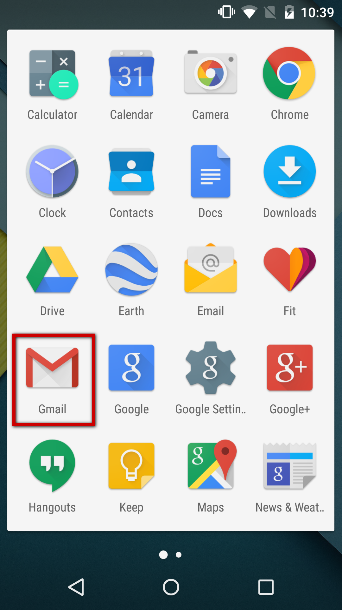

*Note: the Email application is still shown but when you open it, an alert warns you that you are being redirected to the Gmail application.*

If there is no account, choose to add an account from the application's home screen:

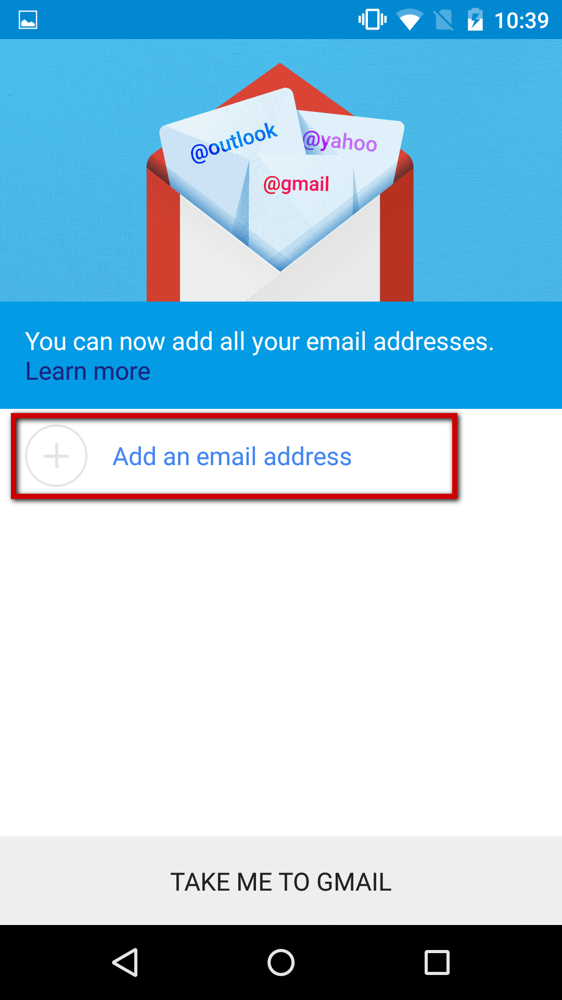

If an account already exists, open the menu and choose to add an account:

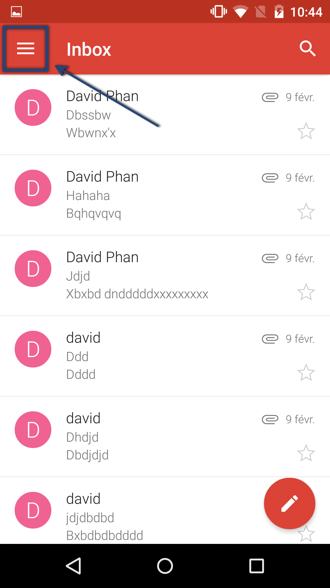 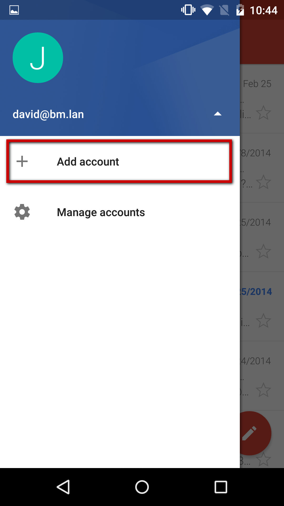

Select a personal type of account:

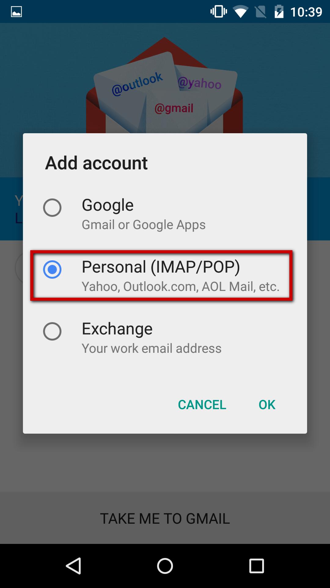

Enter the email address:

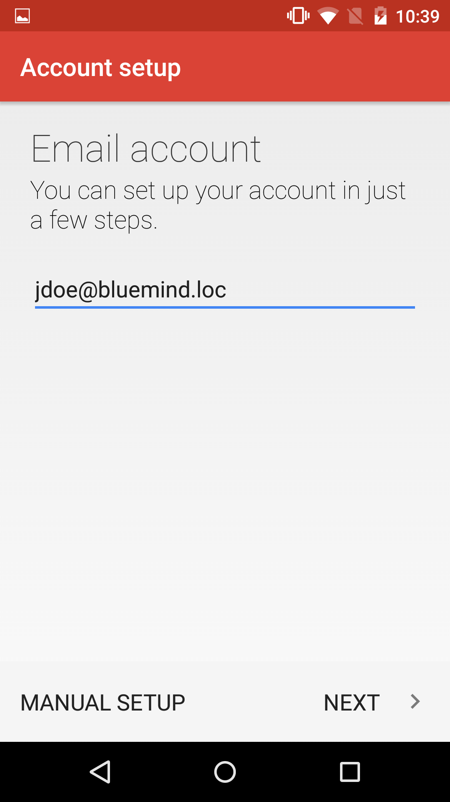

Select IMAP account setup:

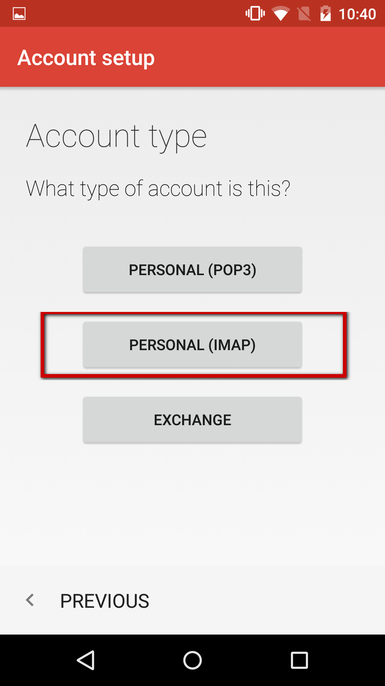

Enter your password:

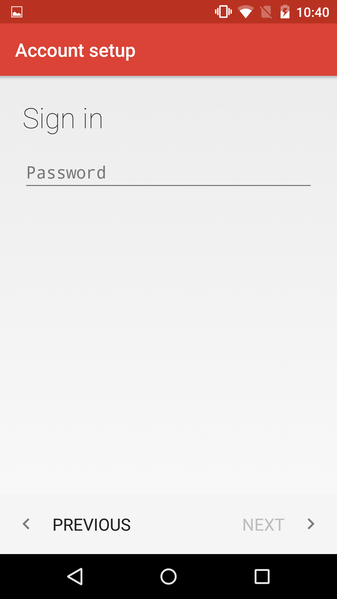

Enter the incoming server information (the server that allows you to receive/view messages):

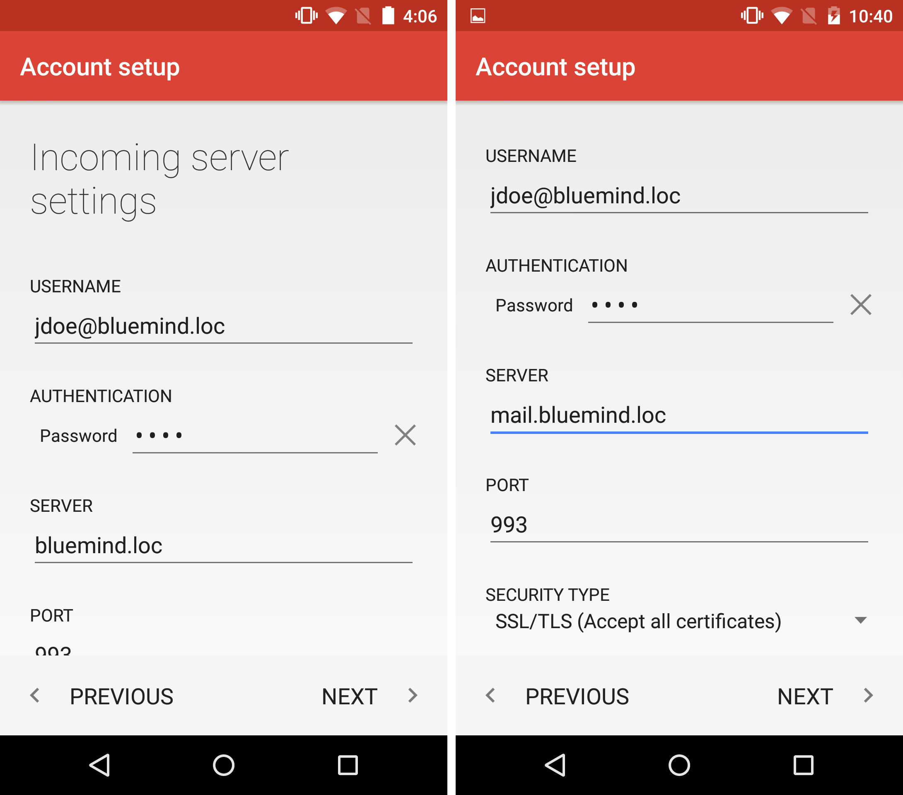

Barring special cases:

- Your username is your email address.
- The server address (here *mail.bluemind.loc*) is the same as the BlueMind access url (excluding https://).E.g. if you access BlueMind from your browser at [https://mail.bluemind.loc](https://mail.bluemind.loc), then you need to enter **mail.blumind.loc.**
- The security type must be set to **SSL/TLS (Accept all certificates)** NOT simple SSL/TLS.

Enter the outgoing server information (the server that allows you to send messages):

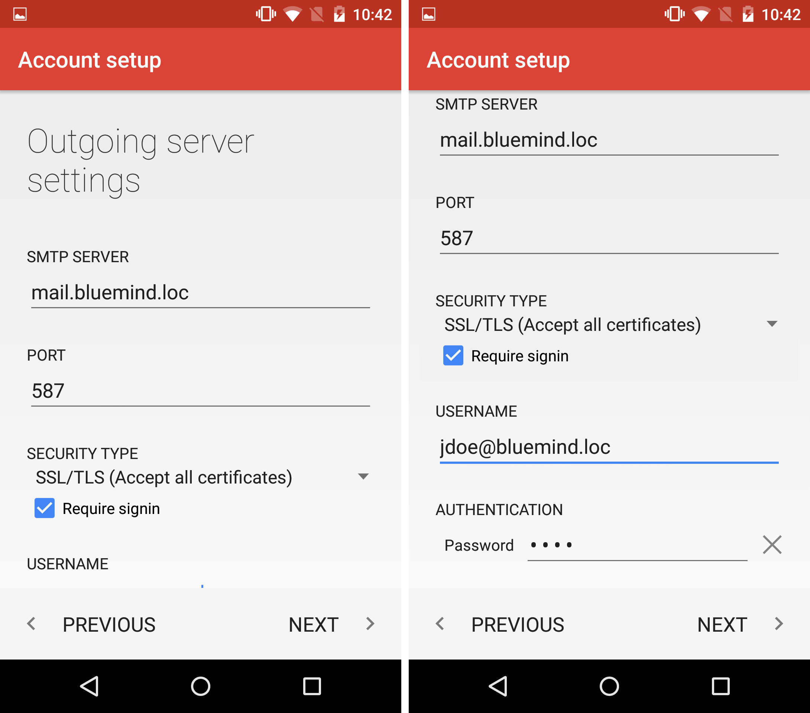

Barring special cases, this information, including server address, is the same as for the incoming server.
:::important

Do not forget to check "Require signin".
For security reasons, the server only authorizes its users to send messages. This option therefore instructs the application to ask the server to authenticate it when sending messages.

:::
:::important

Ports and security

The options above show default information. Connection ports and methods may vary. In case of trouble, please contact your administrator for the specific information required.

IMAP (incoming server):

- 143: TLS possible.
- 993: SSL.

SMTP (outgoing server):

- 25: TLS possible but not required.
  - no authentication: you can only send messages to one of BlueMind's domains.
  - authentication required or authentication from an IP listed in the administrator's interface in System management > System Configuration > Mail tab > "My Networks" box: enables you to send messages to anyone.
- 465: SSL + authentication required - enables you to send messages to anyone.
- 587: TLS + authentication required - enables you to send messages to anyone.

:::

Once the connection has been duly tested and established, the application offers you to configure the account's main options:

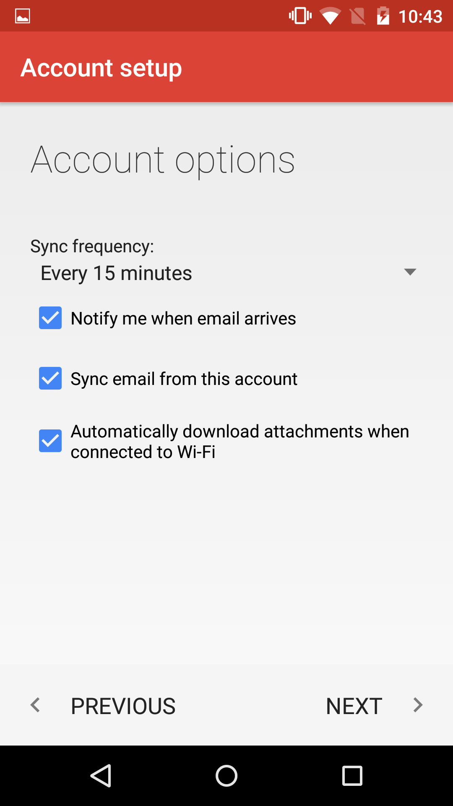

Check the options you want and tap "Next".

Enter the account's name and the name that will be shown as the account's user in sent messages:

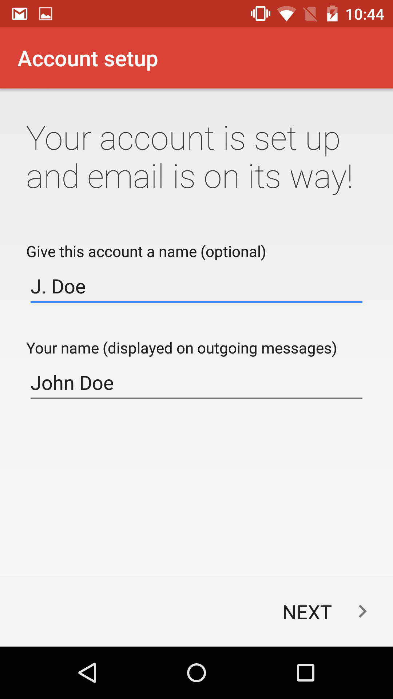

The mail account is then shown in the application's list of accounts:

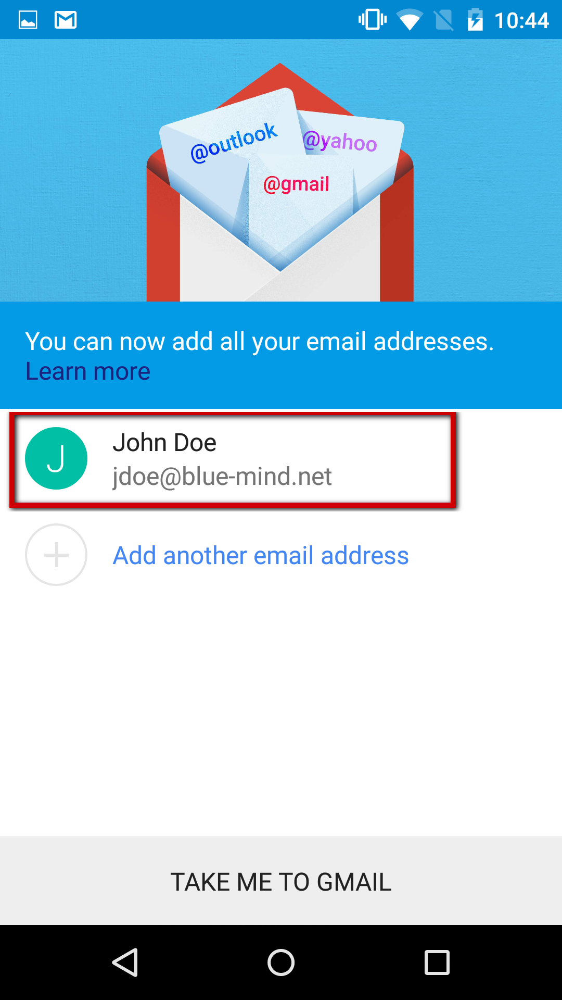

Messages are retrieved and displayed:

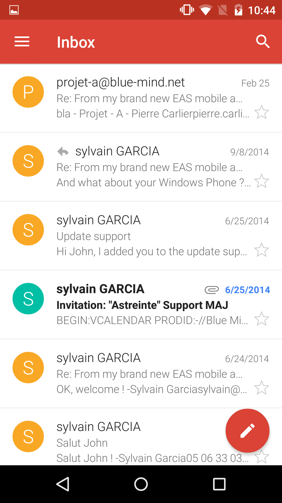

