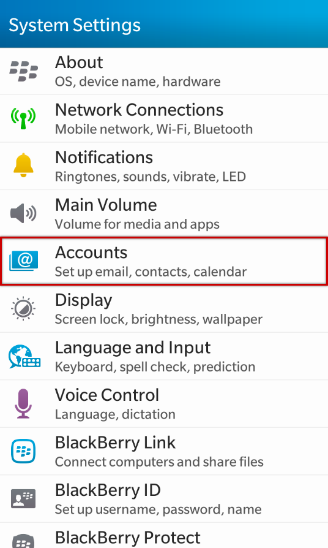
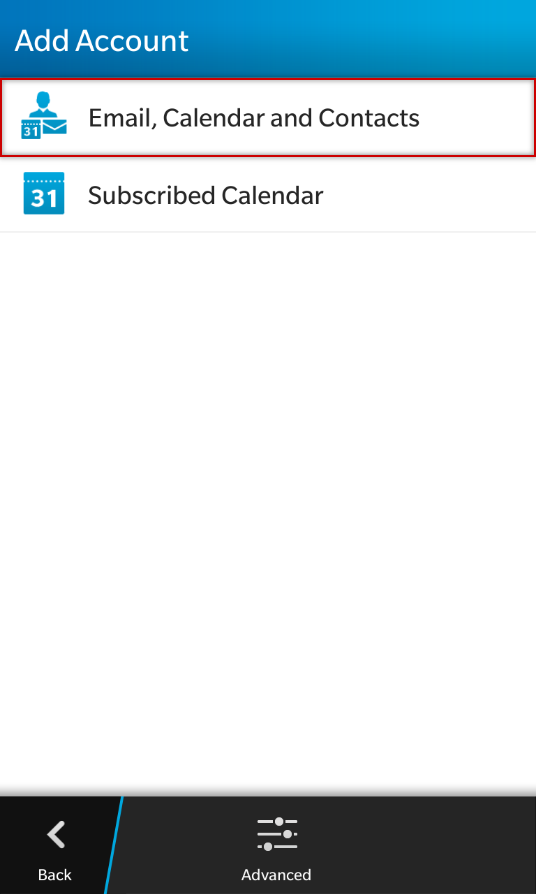
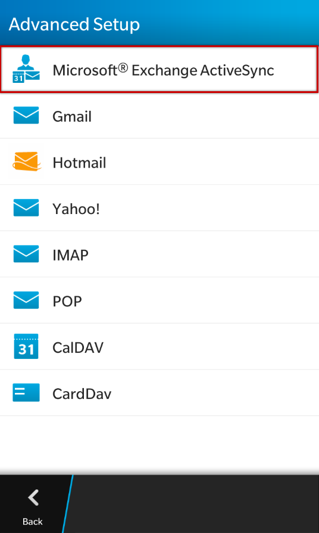
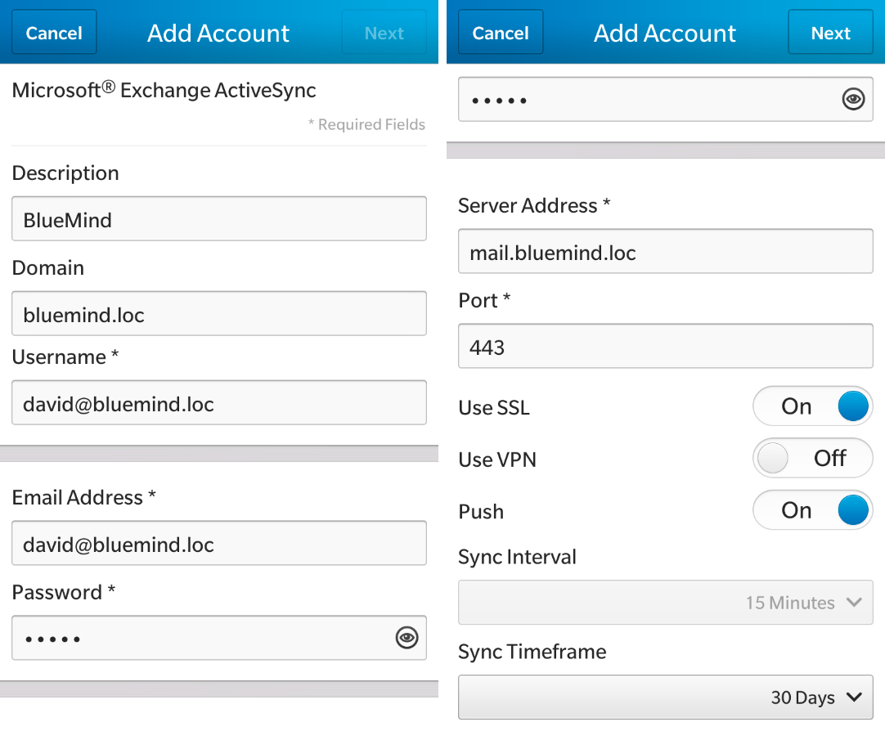
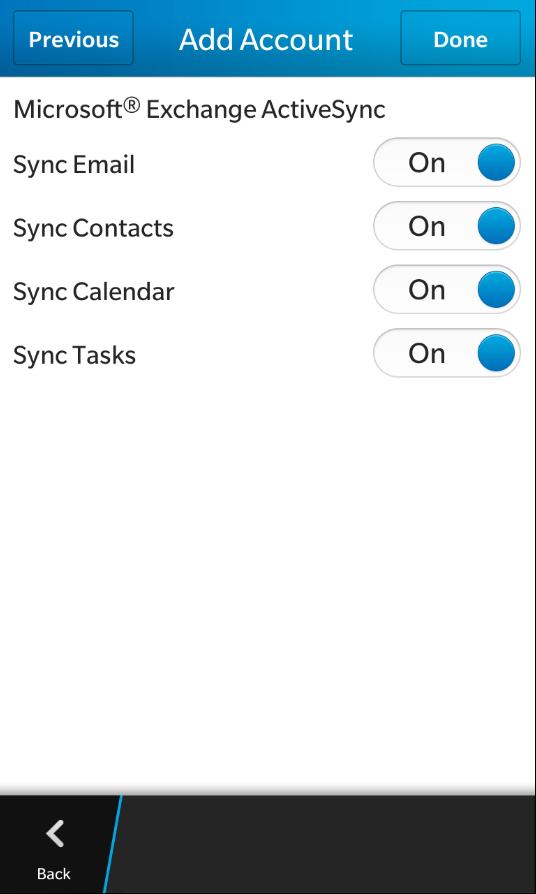
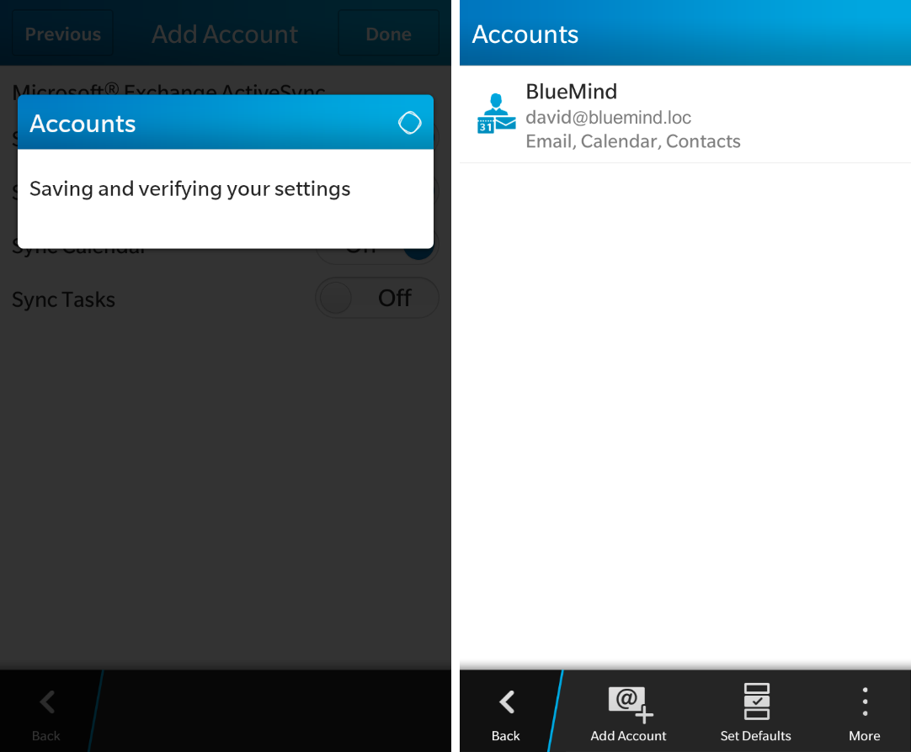
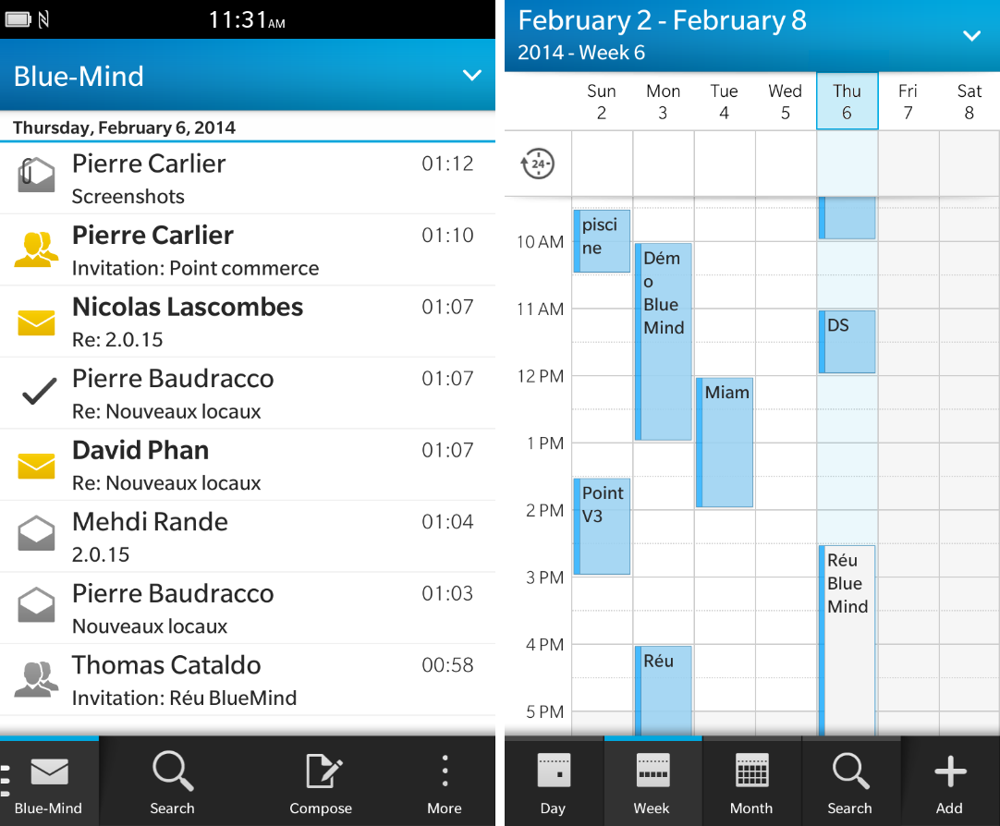
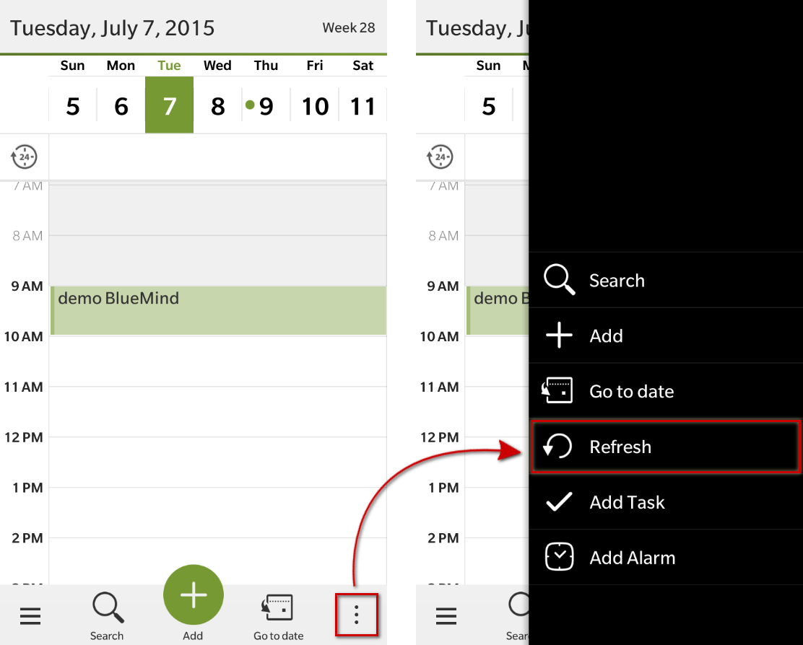

# Synchronizing with Blackberry

:::important

Being able to connect a** **smartphone to the BlueMind server depends on the authorization policy defined by administrators. Make sure you check with them whether you are indeed authorized to connect with a smartphone. In particular, some configurations require an administrator's manual authorization.

Please refer to the following page: [Configuring the EAS server](/Guide_de_l_administrateur/BlueMind_et_mobilité/Configuration_du_serveur_EAS/).

:::

# Introduction

ActiveSync is the preferred synchronization mode as it allows you to synchronize messages as well as contacts and calendars while [IMAP Synchronization](/Guide_de_l_utilisateur/Configuration_des_périphériques_mobiles/Synchronisation_avec_Blackberry/Synchronisation_IMAP_du_Blackberry/) is restricted to messages.

To find out more, please go to [Synchronizing with mobile phones and tablets](/Guide_de_l_utilisateur/Configuration_des_périphériques_mobiles/).

 

:::important

This guide was written using a Blackberry 10 OS. Depending on the software version used, the process should be the same, although screenshots may vary.

:::

# Supported BlackBerry devices

Only BlackBerry devices running OS 10 (Q5, Q10) are supported.

# Setting up an ActiveSync account

## Creating an ActiveSync account

In system settings, go to "Accounts":

Add an "email, contacts and calendar" account:

Select Microsoft&lt;sup>®&lt;/sup> Exchange ActiveSync:

Enter the account and server information:

Barring special cases:

- Use your BlueMind email address to log in.
- Domain is your email domain name: *bluemind.loc* in this example.
- Server Address (*mail.bluemind.loc* in this example) is the address you use to connect to BlueMind (removing https://) For instance, if in your web browser you access BlueMind at **https://bm.domain.com/** then you should enter: bm.domaine.com.

## Choosing which items to synchronize

In the screenshot below, enable or disable the items you want to synchronize:

Click "Done".
:::important

Only personal address books are synchronized with your smartphone's contacts. You can access contacts from other address books (Directory, Collected contacts, etc.) through your smartphone's search function (contacts, emails, etc.).

:::

## Account creation complete

The system saves your configuration and your account is shown:

You can now access your email and calendar on your Blackberry!

# Forcing the calendar to refresh

To force the calendar to synchronize, from the Calendar application, open the menu at the bottom right of the screen and tap "Refresh":

 

 

 

 

 

