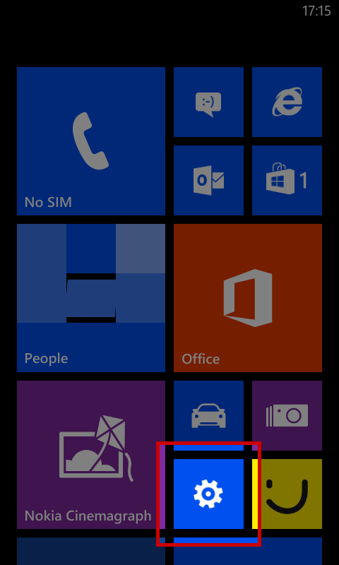
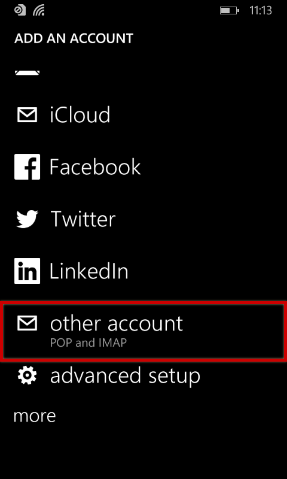
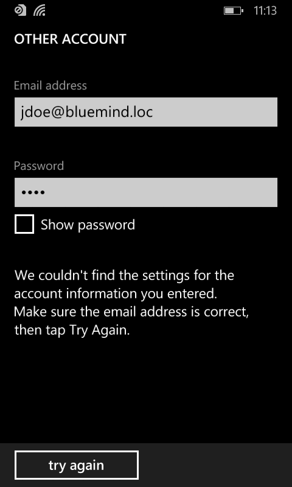
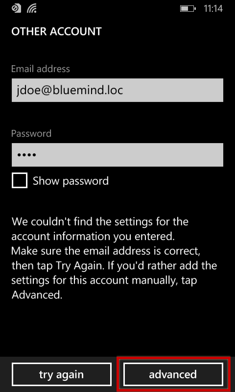
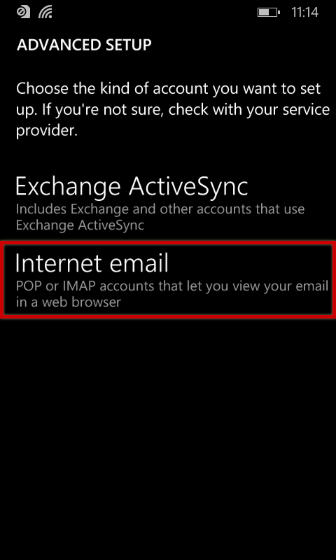
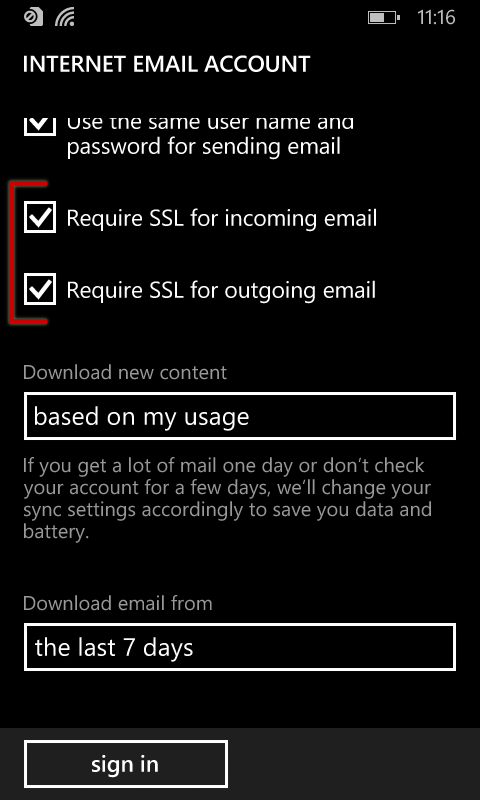

# IMAP Synchronization on Windows Phone

 

 

 
:::important

This guide was written using a Nokia Lumia 520 running Lumia Black (Windows Phone 8.0).

For other Windows Phone devices, the process is the same although screenshots may vary.

 

:::

 

 

 

# Setting up a new mail account

From the home screen or in the list of applications, go to settings:

Next choose "e-mail+accounts":

Select "add an account":

Scroll to and select "other account | Pop and IMAP":

Enter the account's connection information:

The system warns you it was unable to connect:

Tap "try again". The connection fails again but a new button allowing you to access advanced settings becomes available:

Select "Internet email":

Enter the incoming and outgoing server information:

At the bottom of the form, tap "advanced settings" in order to open more configuration options.
Check the two boxes to enable SSL protocol and select the synchronization interval and timeframe you wish:

Configuration is almost complete.

Back on the accounts page, a double message tells you an action is expected of you:

Tap the name of the account.

A warning message tells you that you are required to accept the server's certificate. Tap "continue" to confirm:

The warning goes away from the accounts screen, messages are retrieved and can be viewed in the application:

 

