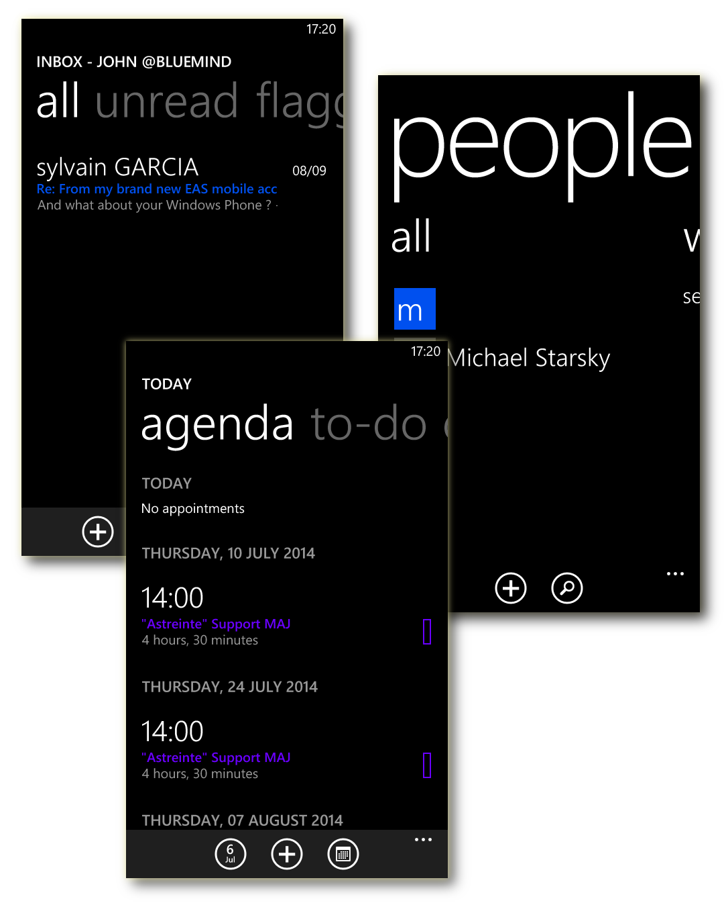
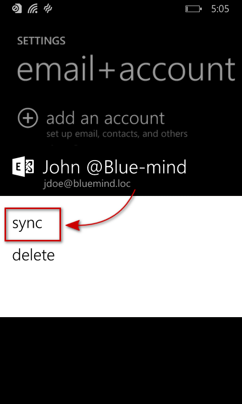

# Synchronizing with Windows Phone

# Introduction

ActiveSync synchronization is the preferred synchronization mode as it allows you to synchronize messages as well as contacts and calendars while IMAP is restricted to messages.

To find out more, go to the page [Synchronisation des périphériques externes](/Guide_de_l_utilisateur/Configuration_des_périphériques_mobiles/).

 

:::important

This guide was written using a Nokia Lumia 520 running Lumia Black (Windows Phone 8.0).

For other Windows Phone devices, the process is the same although screenshots may vary.

:::

 

# Setting up an account
:::important

Being able to connect a** **smartphone to the BlueMind server depends on the authorization policy defined by administrators. Make sure you check with them whether you are indeed authorized to connect with a smartphone. In particular, some configurations require an administrator's manual authorization.

Please refer to the following page: [Configuring the EAS server](/Guide_de_l_administrateur/BlueMind_et_mobilité/Configuration_du_serveur_EAS/).

:::

 

## Creating an account

From the home screen or the list of applications, go to settings:

Then select "email+accounts":

Select "add an account":

Select an "Outlook" account:

Enter your email address and password and tap "sign in":

Windows Phone then tests the settings to connect automatically.

If it fails to connect, switch to advanced mode:

Correct the username and the server:

Barring special cases, the settings are as follows:

- The username is your email address.
- The server address (*bluemind.loc *in this example) is the BlueMind url access (excluding https://).E.g. if in your web browser you access BlueMind at [https://bm.bluemind.loc](https://bm.domaine.com) then you need to enter **bm.bluemind.loc.**

Once this has been corrected, a connection with the server should be established; Windows Phone performs an initial synchronization and the account is shown in settings:

## Selecting which items to synchronize

Once your account is set up correctly, you can customize its name, select which items to synchronize and how often (as items arrive, every 30 mins, 1 hour, etc. or for an extended period e.g. the last 7 days, the last month, etc.):

Access to BlueMind Mail is shown on the home screen and shows the number of unread messages if any:

All account data is synchronized and available: messages, contacts, calendar:

# Forcing the calendar to refresh

To force the calendar to synchronize:

- Go to settings > "e-mail+account"·
- Long press the account you want
- Tap "Synchronize" in the menu that appears:

 

 

 

 

