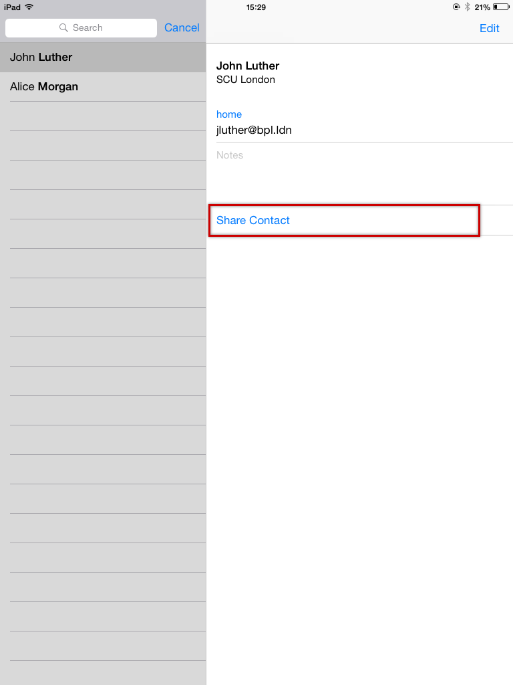
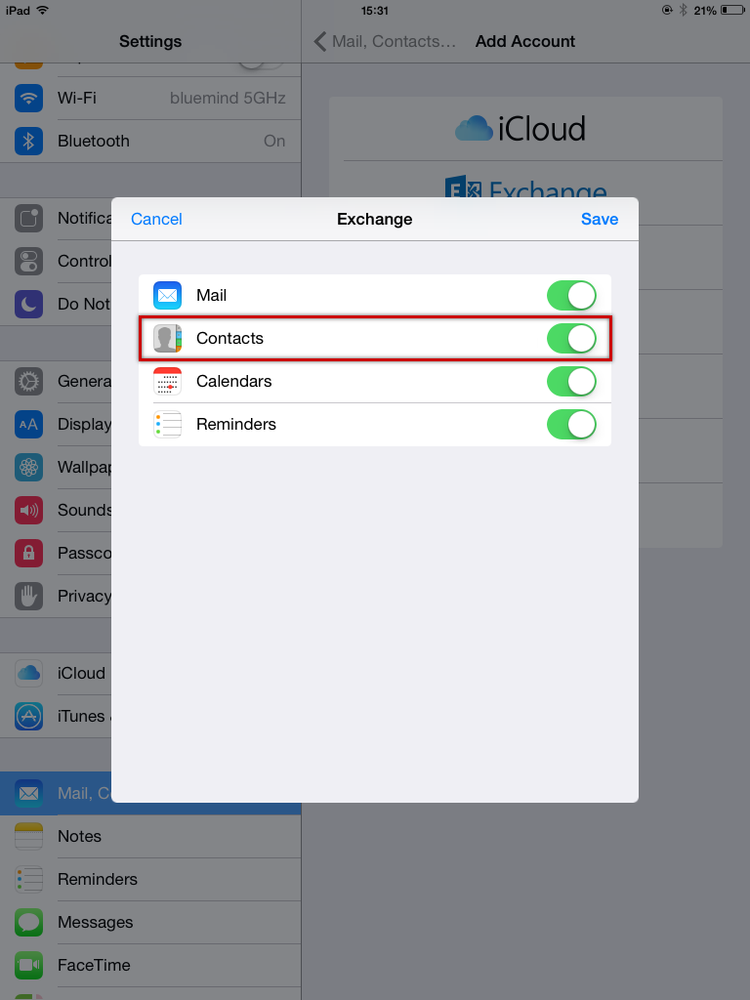
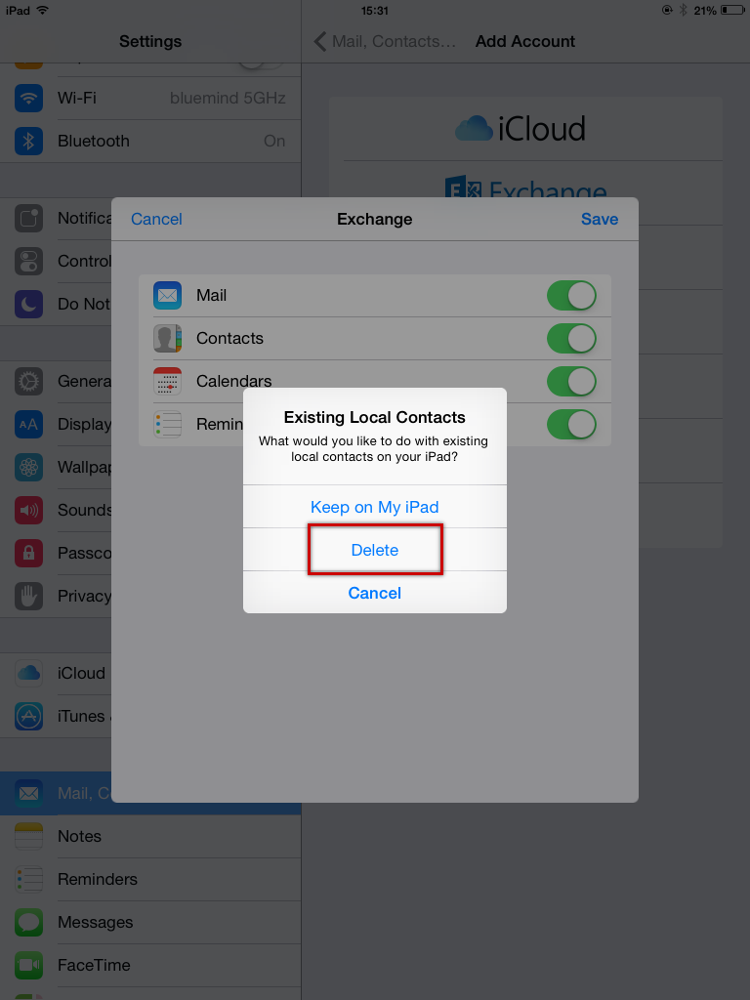

# Importing Local Contacts into BlueMind

# Introduction

When you migrate to BlueMind, you may already have contacts on an iOS device. This page describes how you can incorporate your old iOS contacts into BlueMind and therefore have them available on all synchronized devices (smartphone, web client, thick client).

:::important

This guide was written using a specific model of iPad. Screenshots are usually identical on all Apple products but may vary from one version to the next.

:::

# Procedure
:::important

You must have an email account on the device in order to send the contacts to the BlueMind user. If the user does not have any mail service other than BlueMind, they can create their BlueMind account, either using EAS or a simple IMAP account. This will have no negative impact on the procedure.

:::

1 First you need to export the contacts on the iOS device using the vCard format (.vcf file):
  - 
iOS is unable to export an entire address book. You must use a third-party application, such as [Backup Contacts + Share](https://itunes.apple.com/us/app/backup-contacts-+-share/id486537944?mt=8&ign-mpt=uo%3D4), which is available on the App Store.
:::important

If you export after having created the BlueMind EAS account, restrict the export to the local address book's contacts, otherwise all BlueMind would be duplicated.

:::

Once the file has been generated, email it to the user.

  - If you do not want to use a third-party application, or if you do not want to export all the contacts, you can export each contact individually.In the Contacts application, on every contact card you want to export, tap "Share Contact" then send it by email. A .vcf file is attached to a new message which you must address to the user.
1 Log into BlueMind on a web browser.
1 Open the message(s) contains the .vcf. files and save them on your computer. Go to the Contacts application and [import the file](/Guide_de_l_utilisateur/Les_contacts/).
1 If it doesn't exist yet, [create the user account](/Guide_de_l_utilisateur/Configuration_des_périphériques_mobiles/Synchronisation_avec_iOS/) on the iOS device.
1 Make sure that contact synchronization is enabled: 
  - At the end of the account creation procedure, you are given the option of selecting the items you want to synchronize (see the link above about creating a user account).
  - If the account exists already, go to settings and select the account:
1 
In order to avoid duplicates in the future, choose to delete the local contacts on the device when you are prompted to when you activate synchronization:

:::important

In some cases, the device may not prompt you to delete local data. You must therefore go to the Contacts application and delete contacts manually.

:::

1 
Go to the Contacts application: BlueMind contacts are shown, now including the contacts that used to be on your device only.

