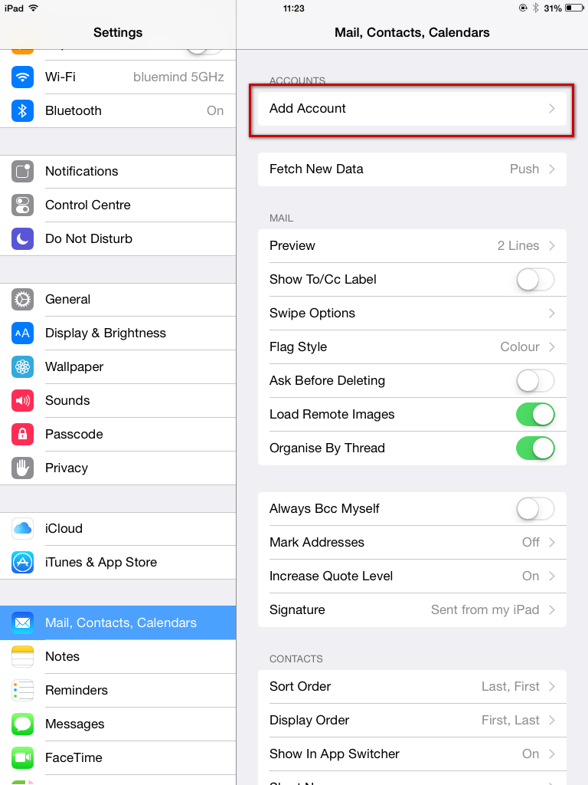

# IMAP Synchronization on iOS

:::important

This guide was written using a specific model of iPad. Screenshots are usually identical on all Apple products although on an iPhone the left-hand side menu will be hidden due to the device's smaller screen size.

:::

# Setting up a new email account

Go to settings and in the "Mail, Contacts, Calendars" section tap "Add Account":

Choose "Other" as type of account:

Choose "Add Mail Account":

Enter the main account information:

Check and correct the connection information if needed:

Barring special cases:

- the username is the same as your email address.
- the host name (here* mail.bluemind.loc*) is the same as the BlueMind access URL (excluding https://).E.g., if on your web browser you access BlueMind at https://mail.bluemind.loc, then you must type **mail.bluemind.loc**

Choose to synchronize messages only BlueMind does not offer note synchronization:

 

