# Synchronizing with iOS

# Introduction

## Synchronization

ActiveSync is the preferred synchronization mode as it allows you to synchronize messages as well as contacts and calendars while [IMAP synchronization](/Guide_de_l_utilisateur/Configuration_des_périphériques_mobiles/Synchronisation_avec_iOS/Synchronisation_IMAP_avec_iOS/) is restricted to messages.

To find out more, please go to [Synchronizing with mobile phones and tablets](/Guide_de_l_utilisateur/Configuration_des_périphériques_mobiles/).
:::important

This guide was written using one specific model of iPad. Screenshots are usually identical on all Apple products although they may vary from one version to the next.

:::

## Synchronized Items

### Contacts

Apple mobile devices synchronized using EAS can now include several address books: personal and shared address books.

All user address books (excluding collected addresses and the directory) can therefore be synchronized.

### Calendars

iOS permet de synchroniser l'ensemble des calendriers personnels et partagés avec l'utilisateur.

# Setting up an ActiveSync account
:::important

Being able to connect a** **smartphone to the BlueMind server depends on the authorization policy set by administrators. Make sure you check with them whether you are indeed authorized to connect with a smartphone. In particular, some configurations require an administrator's manual authorization.

Please refer to the following page: [Configuring the EAS server](/Guide_de_l_administrateur/BlueMind_et_mobilité/Configuration_du_serveur_EAS/).

:::

Go to Settings > Mail, Contacts, Calendars and tap "Add account":

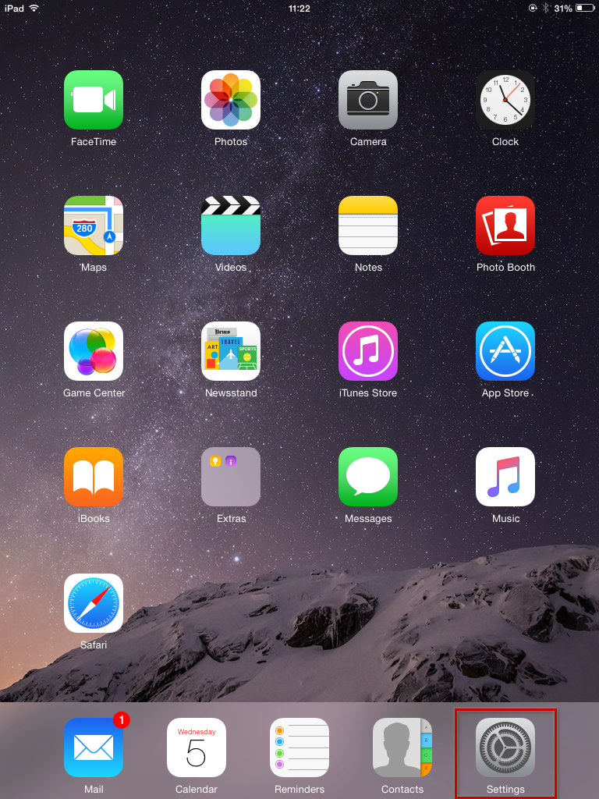 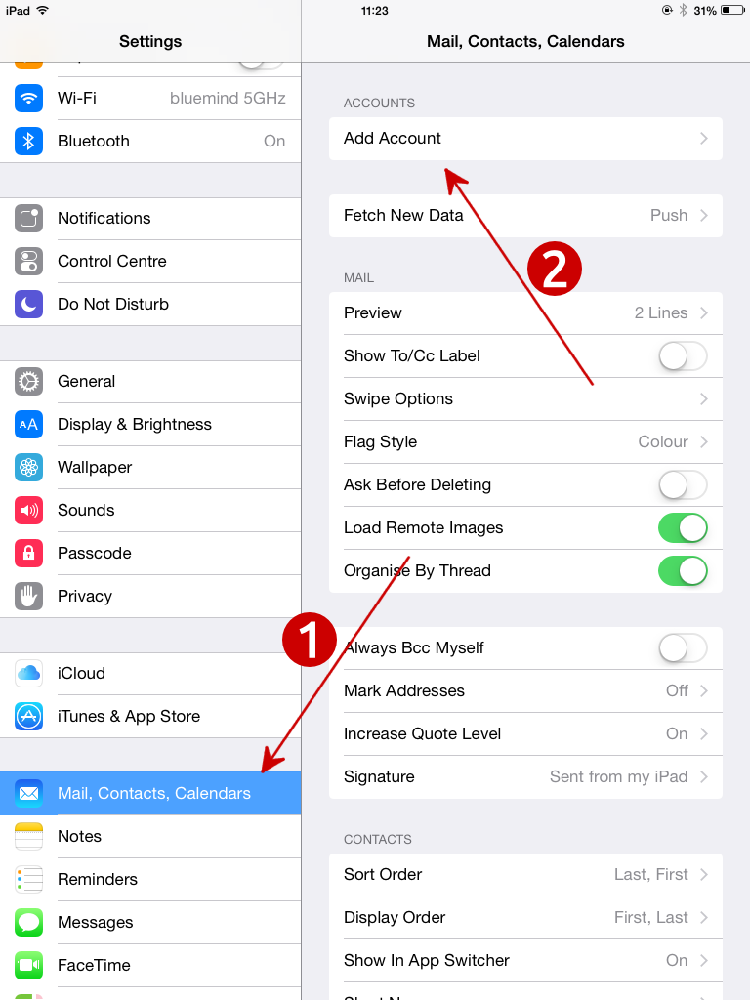

Choose to add an Exchange account:

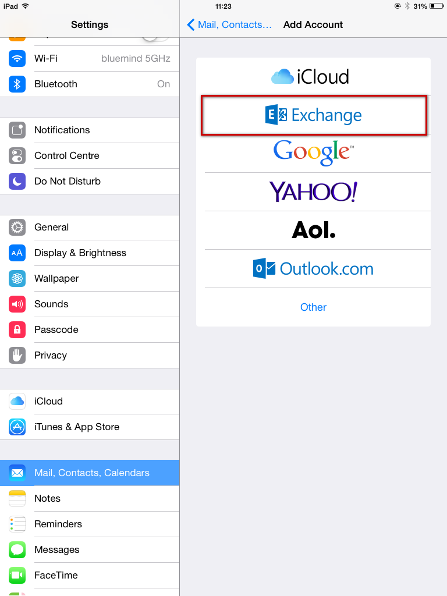

Fill in user information and tap "Next" in the top right corner:

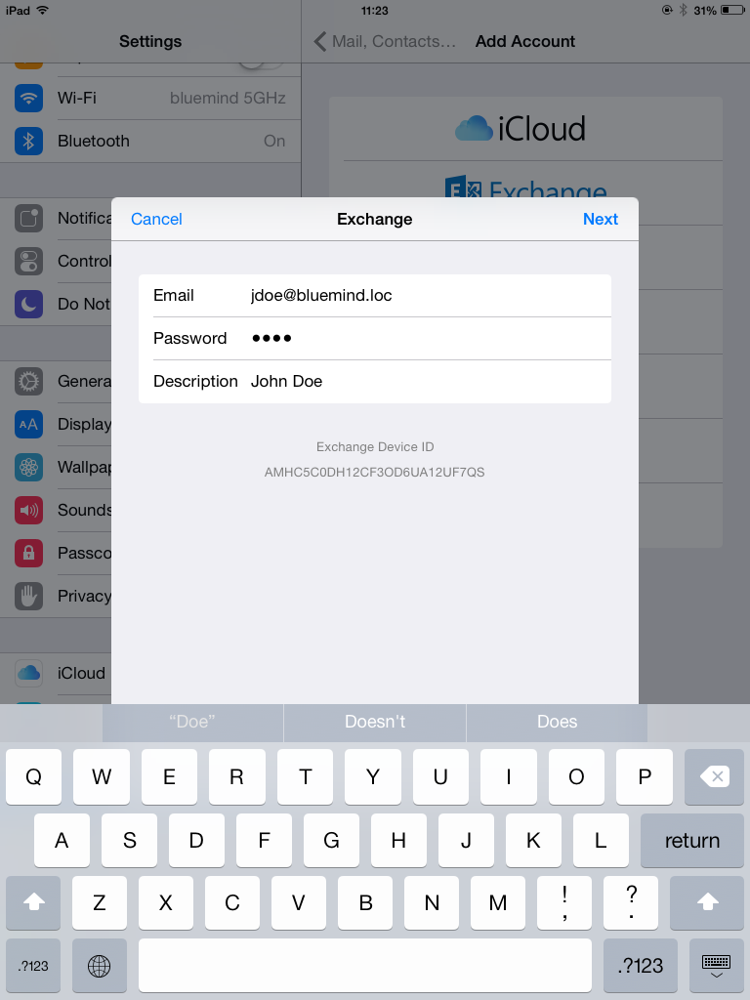

Fill in the detailed server information:

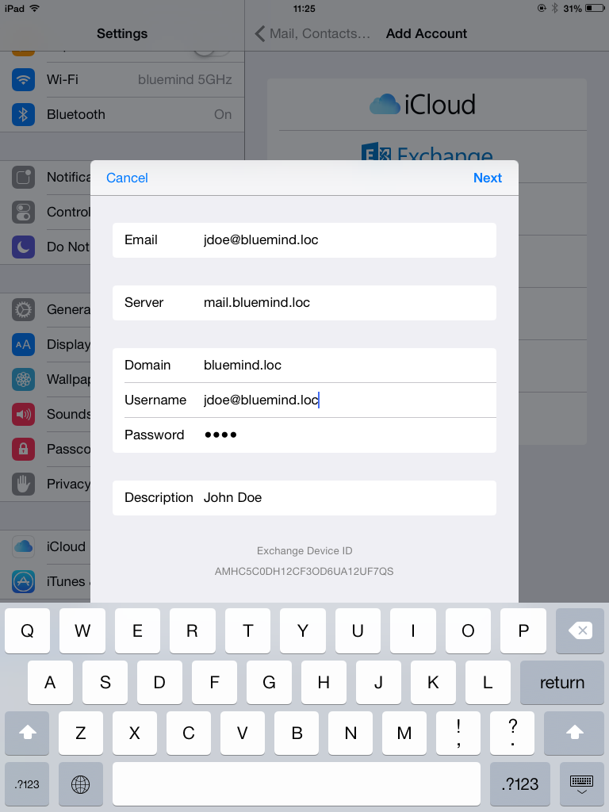

- **Email**: your email address
- 
**Server**: the address (URL)  your phone uses to access the ActiveSync service. It is typically called external URL and is similar to the address you are using to access BlueMind (excluding https://).

- 
**Domain**: your email domain name, usually the part of your email address to the right of the @.

- 
**Username and password**: your BlueMind username and password the way they were given to you by your administrator. Usually, your username is your full email address including the domain name.

- 
**Description**: this is optional. It allows you to recognize the account in your list of accounts.

Tap Next.

Your iOS device will then try to connect to your BlueMind server.

Once the connection is complete, you can choose the items you want to synchronize, and tap "Save":

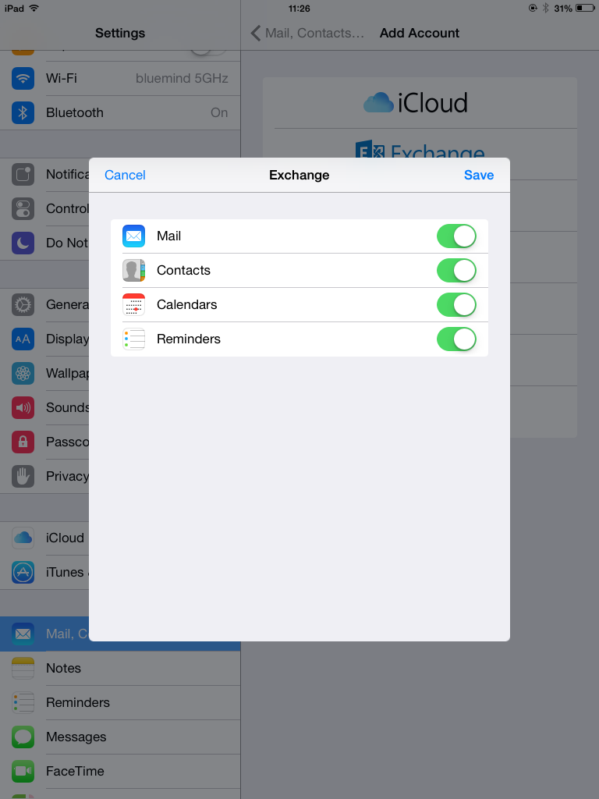

Your account now is shown in the list of accounts in the device:

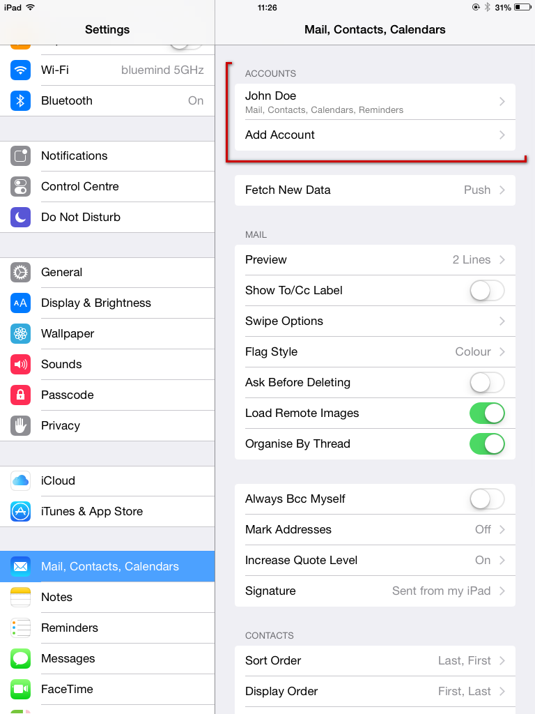

Tap the account to access the synchronization settings (items to synchronize, duration):

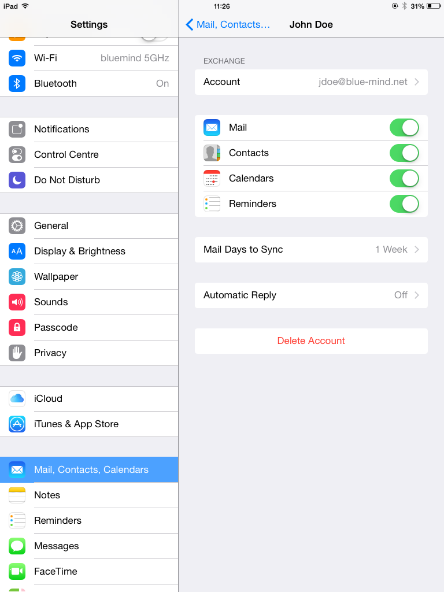

Congratulations! Your device is now synchronized with BlueMind!

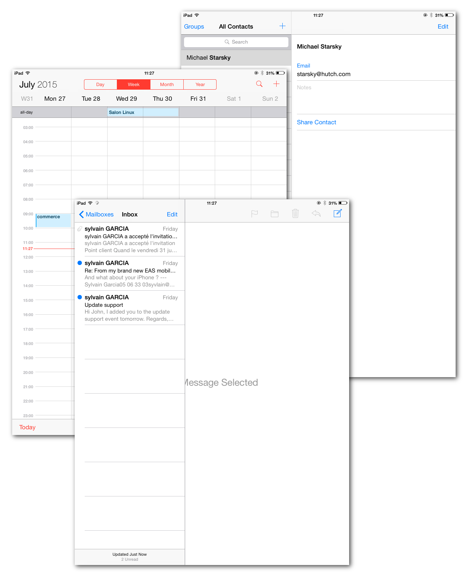

# Forcing the calendar to refresh
:::important

This part of the guide was written using an iPad running iOS 8.4.

:::

From the Calendar application, open the displayed calendars' window:

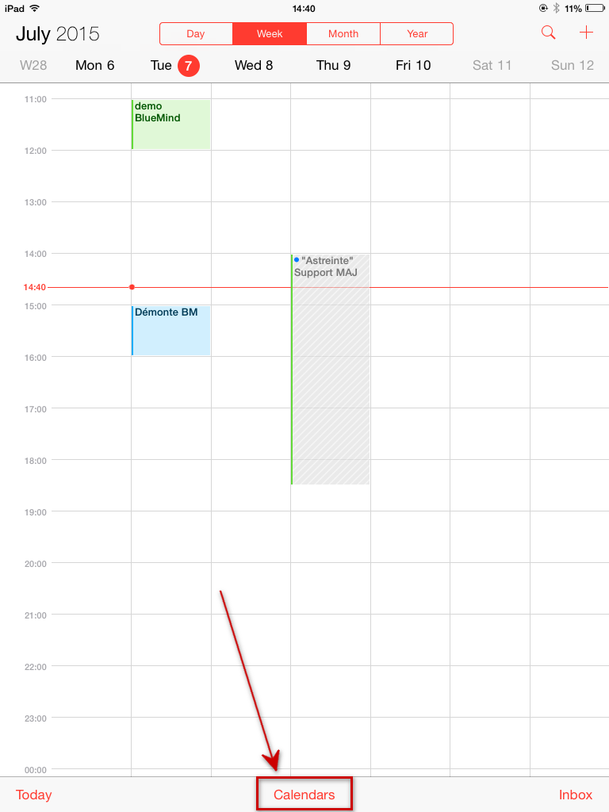

Tap the window and drag it downwards:

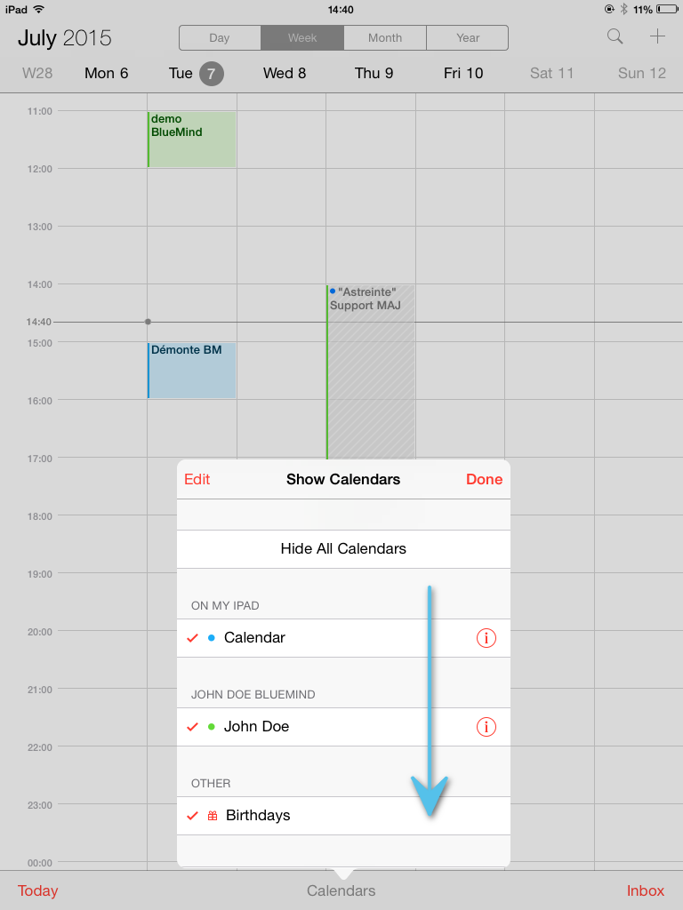

The spinning wheel is displayed, showing that the device is synchronizing the calendars:

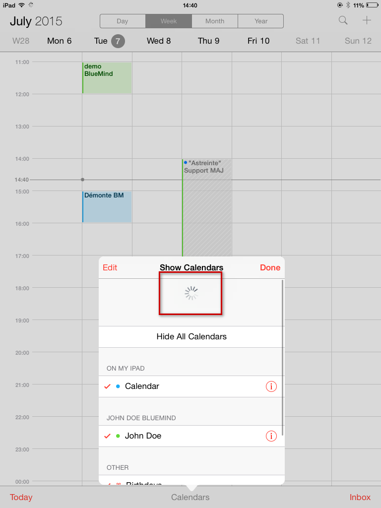

When the spinning wheel goes away and the window returns to normal, refreshing is complete.

