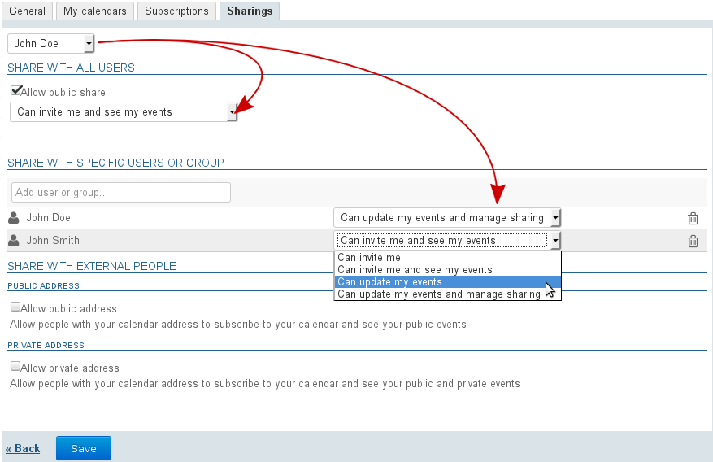
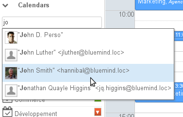
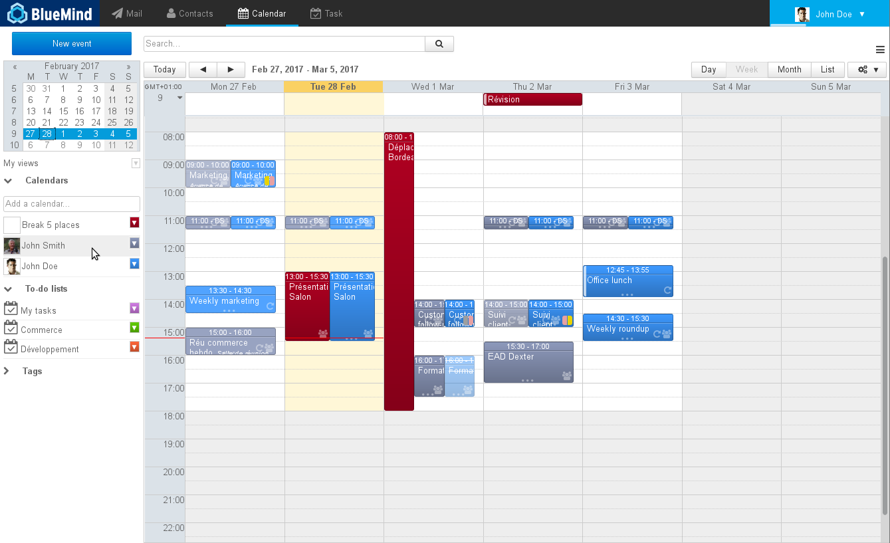
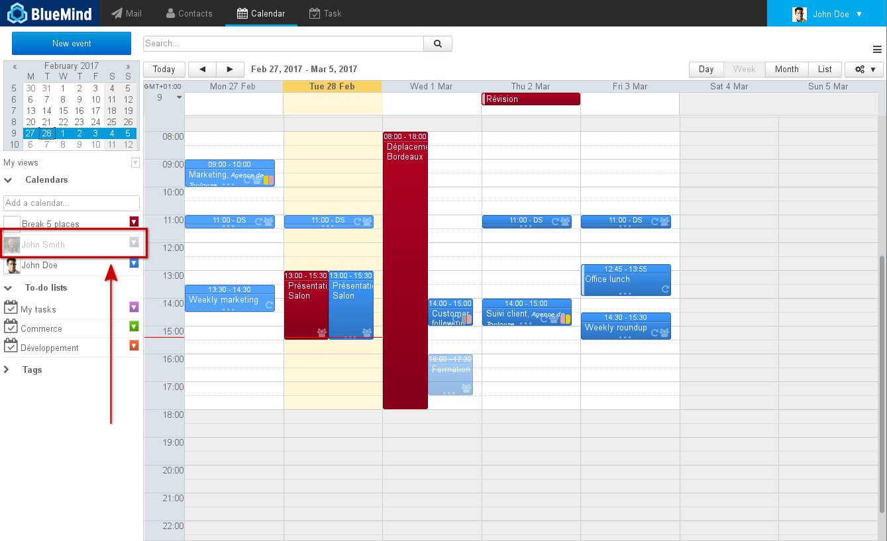
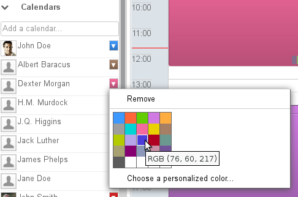
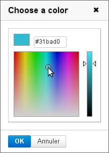
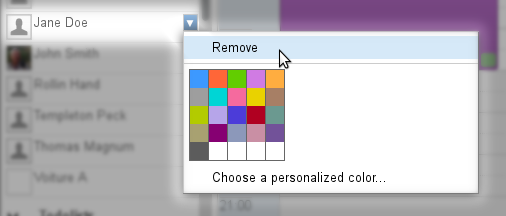
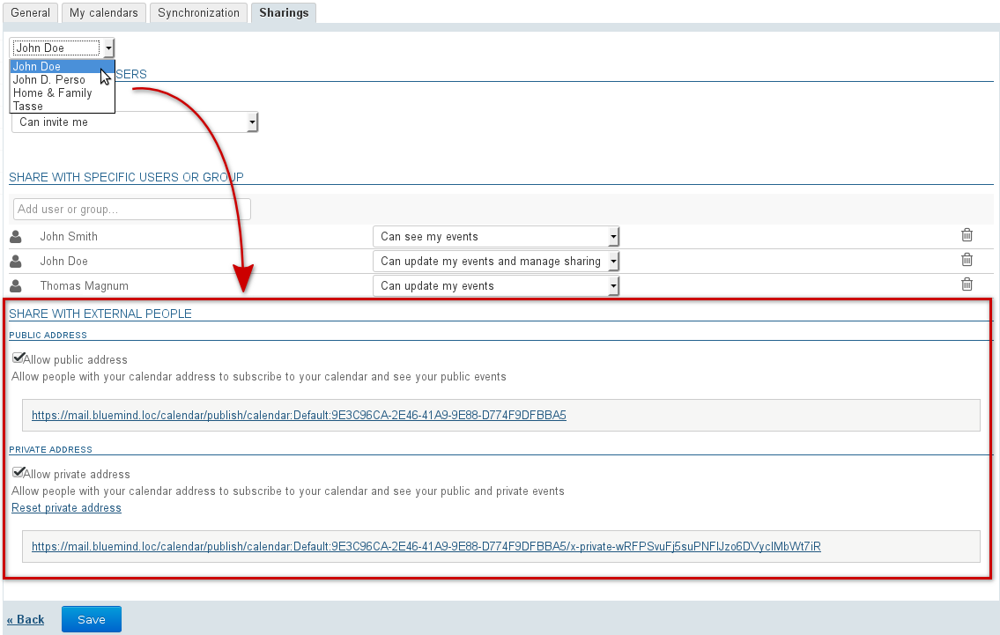

# Sharing Calendars

# Introduction

BlueMind v.3.5 offers the possibility to own multiple calendars – the main BlueMind calendar, a secondary calendar and user or domain calendars you have been given administration rights on, or synchronized external calendars – and manage how they are shared. You can keep each calendar private or share it with other users or group members by giving them different access levels.

# Sharing and delegating calendars

Rights can be delegated to all domain users (public share) or to specific users only.

Possible permission levels are:

- "**Can invite me**": the user cannot see your appointments but can invite you. If this minimum right has not been granted, autocomplete will not suggest your name in the "add participants" box in the event creation form.
- 
"**Can invite me and see my events**": the user can view this calendar and invite you. Private events will be shown as "private" instead of the title and with no other details but the date, time and duration.

- 
"**Can update my events**": in addition to the rights above, the user can accept and modify your events.

- 
"**Can update my events and manage sharings**": **the calendar is fully shared.** In addition to the rights above, the user is able to grant share rights on your calendar and **see or edit private events**.

To delegate your calendar, go to your user preferences ("My Account") > Calendar section > Sharings tab:

1 
Select the calendar you want to share.
:::important

You can choose from:

  - your default user calendar
  - your personal calendars which can be seen in the "My calendars" tab:
    - personal calendars you have created in BlueMind
    - external calendars you are subscribed to
  - other users' address books you have sharing permission on

:::
1 The "Share with all users" section is for sharing the calendar publicly (public share), i.e. these rights will be applied to all domain users:
  2 check the "Allow public share" box
  2 select the desired right from the drop-down list
1 To share with users or groups, go to the next section "Share with specific users or groups":
  2 
search for the user or the group using "Add user or group..." text box.
:::important

Email addresses cannot be entered here. Only directory users and groups are available.
For [Sharing with external people](#SharingCalendars-partage-exterieur) see the next chapter.

:::

  2 click to confirm the name suggested by autocomplete or by typing &lt;Enter>
  2 
select the desired right from the drop-down menu
:::important

"ICS" external calendars are synchronized as read-only, although editing is included in the list of rights, it cannot be applied: new items or changes made by the user the calendar is shared with will disappear at the next synchronization.

:::

1 Repeat this for each user or group
1 Once all the rights are set as desired, click "**Save" **to confirm

The table below shows the features available to users depending on the rights they are granted on the shared calendar:

      | Features\Right Granted | Invite | Invite+View | Edit | Edit+Manage |
| --- | --- | --- | --- | --- |
| Invite |  |  |  |  |
| Subscribe |  |  |  |  |
| View public meeting |  |  |  |  |
| View private meetings without details |  |  |  |  |
| View details in private meetings |  |  |  |  |
| View alerts for pending invitations |  |  |  |  |
| Accept/Reject an invitation to a public meeting |  |  |  |  |
| Accept/Reject an invitation to a private meeting |  |  |  |  |
| Create a public event |  |  |  |  |
| Create a private event |  |  |  |  |
| Edit a public event |  |  |  |  |
| Edit a private event |  |  |  |  |
| Grant/Remove a sharing right to a third-party |  |  |  |  |

:::important

This table also shows the features users have access to on shared calendars according to each right they are granted.

:::

# Displaying a shared calendar

You must have at least viewing or editing permission on the events in the calendar you want to display.

## In BlueMind or Thunderbird

You don't have to subscribe to a calendar to display it.

**To display a calendar:**

- in the "Add a calendar" text box, type the name of the user you are looking for.Autocomplete suggests users' names as you type.
- Select the name you are looking for in the list of suggestions:
- The calendar is then shown in a different color from those already displayed:

:::important

Group-specific rules

- For groups, autocomplete works with the first characters of the group's name.
- If you select a group, the calendars of the group's members who have shared their calendar with you will be displayed.
- If one or several users share their calendar(s) with a group, all group members will be able to see this calendar.

:::

**To hide a calendar temporarily,** click its user in the list. This user will then be grayed out and their events will no longer be shown:

** To change a calendar color:**

You can customize calendar display colors and assign colors to specific users.

To do this, click the color icon at the bottom of the list of calendars shown to unfold the menu and select a color:

For a greater choice of colors, click "Choose a personalized color..." to display the color palette:

:::important

The color is automatically saved for this calendar, it will be used again in future sessions and can be changed.

:::

**To remove a calendar's custom display**, click the color icon at the end of the row in the list of calendars to open the menu and click "Remove":

## In Outlook and on mobile devices

To view a shared calendar in Outlook or on a mobile device connected through EAS, you have to subscribe to this calendar and enable syncing for it.

This can be done straight from the notification email you've received, through dedicated links, or at any time in the Subscription preferences section of the BlueMind calendar. For more details, please refer to the paragraph: [Calendar preferences - §4. Subscriptions](/Guide_de_l_utilisateur/L_agenda/Préférences_de_l_agenda/#CalendarPreferences-abonnements)

# Domain calendars

Administrators can [create domain calendars](/Guide_de_l_administrateur/Présentation_du_produit/Messagerie_multi_domaines/) which are calendars shared between one or several users, as read-only or read and write depending on their permissions level.

Users with read permission are able to access a domain calendar in the same way as they would a user's calendar: in the main view (see above) or in their subscriptions page (see [Calendar Preferences](/Guide_de_l_utilisateur/L_agenda/Préférences_de_l_agenda/)).

# Sharing externally

The BlueMind calendar can be shared externally through a public address or a private address that allows private events to be viewed.
:::important

Publicly shared calendars allows people see the full details of public events and a "busy" status only for private events.

Privately shared calendars, on the other hand, allows all the details of private events to be viewed.

:::

To do this:

- go to the preferences page > Calendar section > "Sharings" tab
- in the drop-down list at the top of the page, select the calendar you want to share
- check the box for how you want to share it (public or private):
- **click Save to confirm **

The address specified can then be forwarded to people outside BlueMind for them to synchronize their user calendar with their ICS-compatible calendar.

