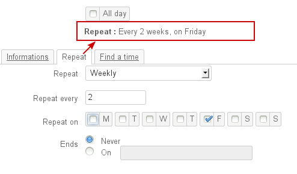
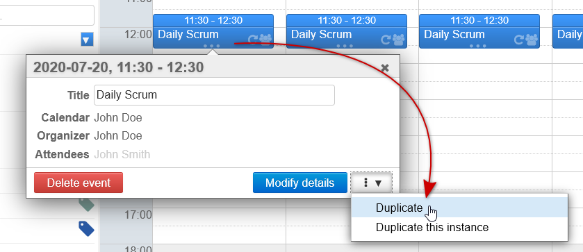

# Events

# Creating events

## Quick-creating an event

- In Calendar view, click the date and time you want to create an event for, or drag you mouse over the area to select the duration you want:

- To create an all-day event, click the day's date at the top of the hourly column: Drag your mouse along the days you want to include if your event takes place over several days.
- Fill in the relevant information:
  - Title
  - Calendar: you can choose either a personal calendar or one you have been given writing permission on**Only the calendars displayed in the current view are shown**
- 
Click "New event"
 Your event has now been created
:::important

Default availability

Short events - with start and end dates and times - are by default set as "Busy".

All-day events are by default set as "Available".

:::

The "Modify details" link takes you to the detailed event creation window.

## Creating a detailed event

Click "New event" at the top of the sidebar to open the event creation window:

Key event details are shown at the top of the page:

- **Title**
- **Start/end dates and times**
- **All day**: the event doesn't have any specific start/end times
-  **Allow date propositions**: when this box is checked, participants will be shown an interface where they can suggest a new time/date in response to the invitation

You can invite others in the right-hand side of the window. Click the icon before each guest's name to set their participation as optional or required:

Note:

- You can invite anyone in the domain who has given you invitation rights (share right "can invite me to an event" (see  *Sharing Calendars* below).
- You can invite anyone in your address books or anyone else simply by typing their email address.
- You can also associate resources to events by adding them the same way you add participants .
- When you add a group, each group member is added individually. 

Tabs give you access to additional features: recurring events and availability search.

### Event properties

The "Information" tab is used to set key event properties:

- **Location**.
- **Organizer** (shows the users who have given writing rights on their events AND whose calendar is displayed in main view).
- **  [Tags](/Guide_de_l_utilisateur/Les_catégories_tags_/)  **.
- **Description**.
- **Reminder**: to set event alerts and reminders. You can choose how notifications are shown using the "display" drop-down menu: 
  - **Email**: an email message is sent to the user - former default behavior 
  - **Notification**: a [browser notification](/Guide_de_l_utilisateur/Paramètres_utilisateur/#UserSettings-Parametresutilisateurs-Notifications) popup is shown
:::important

You can also set up default reminders for events. For more information go to: [Calendar preferences](https://forge.bluemind.net/confluence/display/DA/.Preferences+de+l+agenda+vBM-3.5)

:::
- **Availability**: allows users viewing your calendar to see if you can be reached during the event.**Default availability for short events is "Busy", while default availability for all-day events is "Available".** When you confirm that you are available, the event is shown in your calendar with a light border on the left hand side:
-  **Privacy**: allows you to hide event content from other users. All they will see is that the time slot is unavailable:
- 
** **Attachments****: used to attach files to calendar events

## Recurring events

Go to the "Repeat" tab to set how often an event is repeated: daily, weekly, monthly or yearly.

- Enter the **repeat period** (e.g.: every two weeks) in the "Repeat every" text box under the Repeat drop-down menu.
- For events **repeated weekly**, mark the day(s) you want the event repeated.
- For events** repeated monthly**, you must specify whether you want the event to be repeated on a day of the month (e.g.: the 3rd of every month) or a day of the week (e.g.: every second Tuesday of a month).

:::important

A sentence summarizing repeat settings above the "Repeat" tab is updated as you fill in the form:

:::

To **delete one instance of an event**:

- Display the event.
- Click the event, then click "Delete".
- Select "Only this instance" to keep other instances.

### Availability search

The "Find a time" tab is used to search for a common available time slot for event guests:

BlueMind automatically suggests the first available slot, shown between a green line and red line, based on the date entered in the form.

You can drag and move the whole slot with your mouse, or widen or narrow it by dragging the green and red lines separately.
When the time slot overlaps with one or several users' event(s), a warning message appears at the top of the page:

## Attachments

BlueMind Mail's [linked attachments](/Guide_de_l_utilisateur/La_messagerie/Fichiers_volumineux_et_détachement_des_pièces_jointes/) service allows you to attach files to calendar events – from version 3.5.13.
:::important

Availability

This feature relies on the linked attachments service set up for your email service. To be able to use this feature, the linked attachments service has to be installed and enabled and you must have the following [roles](https://forge.bluemind.net/confluence/display/DA/.Les+roles+%3A+droits+d+acces+et+d+administration+vBM-3.5):

- **Linked attachments**: used to attach files
- **Drive**: enables BlueMind storage space

If you can't see either of these sections, please ask your administrator.

:::

Once it is linked to an event, the file is available for download in the event details section at any time and it is sent in the invitation email to the event's participants if appropriate.

### Adding/Deleting files

To add a file:

- click "From local PC" to upload a new file

If you have the appropriate role enabled – i.e. "Drive" – a second link is available:

- click "From server" to open the BlueMind file browser and attach a file already available in your storage spaceFiles can be found again using the file chooser and be attached to other calendar events or [messages](/Guide_de_l_utilisateur/La_messagerie/Fichiers_volumineux_et_détachement_des_pièces_jointes/).

Click the trash  icon next to the file's name to delete it.

### Sending files to event attendees

Files attached to an event are sent to attendees in the invitation email:

- as file attachments if the total message size is under the limit authorized by the server:
- as download links if the total message size is above the limit authorized by the server:

:::important

File attachment/linking is completely automatic, it cannot be forced and applies to the combination of all attached files, even if some of them are small.

:::

### Downloading a file

When an event has an attachment, a paperclip is shown in calendar view:

Files attached to an event can be downloaded at any time by opening the event's editing form:

:::important

For event attendees

This also applies to event attendees: they can find the files and their download links in their calendar.

Attendees can also add files, however, just like for other changes they make to the event, they will not be shared with the organizer or other invitees.

:::

# Modifying events

To modify an event:

- In the main window, click the event.
- Change the title and click save.
- Or, click the "Modify details" link. This opens the same window as for creating events (see above).
- Once changes are done, click "Save" (or "Send" if the event has guests) at the top left of the page to apply.

:::important

Changes and Notifications
Changes made to tags or reminders are considered personal and are not notified to other participants. All other changes result in information updates being sent to participants.
:::

When you make changes to a recurring event – either by sliding the time slot in the calendar or using the event form –  you are prompted to choose one of the following options:

- **Only this instance**: only the instance the user has clicked will be modified – it will become an exception to the series which will remain unchanged.
- **All the subsequent**: the instance of the event the user has clicked as well as all subsequent instances will be modified. All previous instances of the series will remain unchanged.
- **All events in the series**: The entire series of events will be modified.

# Event duplication

 From BlueMind 4.3, you can duplicate an event or meeting, i.e. create a copy that can be edited or delegated to another organizer independently from the original event.

## General

To duplicate an event:

- click the event in calendar view
- open the drop-down menu at the bottom right of the popup and choose "Duplicate":
- The event creation form is filled in with the event's original contents (day, times, description, organizer, participants, etc.)
- 
Make the desired changes
:::important

Changes work the same way as those made on existing events (see above paragraph).

For instance, for shared calendars, the organizer's drop-down list only shows users who have given [read/write rights](/Guide_de_l_utilisateur/L_agenda/Le_partage_d_agenda/) on their calendar and whose calendar is currently displayed in main view.
For more details, please read the *Shared calendar *section below.

:::

- **Click Save to confirm the creation of the new event:**   In this instance, the "User training" event has been duplicated and renamed "Admin training" and the description has been edited – a new event has therefore been created with the same duration and location but with a different description. You then need to move the meeting to the desired time slot.

## Recurring event

For recurring events, the duplication drop-down menu offers two options:

- 
**Duplicate**: duplicates the whole series including recurring instances.
:::important

The new series is created with the times of the first instance and recurring instances – all instances are consistent and do not include any exceptions the original series may have contained.

:::

- **Duplicate this instance**: creates a single event (i.e. non-recurring) at the times of the chosen instance. 

## Meetings (events with guests)

When you duplicate a meeting, the new meeting is created with the same participants.

The new meeting is considered as a new independent meeting:

- Participants receive a new invitation **when the form is saved.**
- Participation statuses from the original meeting are not kept: all participants' statuses are set to "response pending".
- Any changes made to either meeting (original ou duplicate) will not affect the other.

:::important

Changes made by the organizer or participants can be seen depending on the rights you have on the calendar the event is duplicated on – see next section for details.

:::

## Shared calendar

If the duplicated event is on another user's calendar, there are several scenarios:

- **the other user has given read/write rights** on their calendar: that user is then set as the organizer of the duplicated event, whether they are already the organizer or a simple participant.
- 
**the other user has not given read/write rights** on their calendar: the event is duplicated on your calendar and you are automatically set as the organizer.
:::important

In this case, if the original user was the organizer, they become a participant to the meeting and they will be invited.

:::

**Examples with two users**

- Alice: department manager. She shares her calendar as read-only – right "can invite me and see my events"
- John: trainer, has given Nathalie read/write rights on his calendar – right "can modify my events"

#### First example: Alice wants to create a new training session based on an existing one in John's calendar.

Alice opens John's calendar and clicks his event "User training" then "Duplicate":

As Alice has read/write rights, the organizer stays the same, the target event will still be on John's calendar. Alice edits the event and changes the title to "Admin training" the next day:

Once it is saved, the new event is shown on John's calendar:

#### Second example: John wants to copy a meeting organized by Alice to organize his own event the following week.

Although he doesn't have read/rights on Alice's calendar, John can still duplicate her events:

The event is then copied on his own calendar (i.e. he becomes the organizer) and Alice is invited to the meeting:

John edits the date to organize the meeting himself the following week:

After it is saved, the meeting is shown in their calendar with the new settings:

The original meeting remains unchanged:

# Deleting events

To delete an event:

- click the event in the main window
- in the popup that opens, click "Delete"
  - if you are the event's organizer and you've invited several participants, the event is deleted in all the participants' calendars and they receive a notification email. 
  - if you are a participant to the event, only your participation is cancelled, the event is still present in other participants' calendar.The organizer does not receive a notification email but you are marked as not participating in the list of event invitees.
- when you delete a recurring event, you can choose to delete:
  - the current instance only
  - all past and future instances
  - future instances only.

:::important

CAUTION

When you delete an event you are a participant in, the event will no longer be shown in your calendar, which means that you will not be able to change your attendance status any more.

:::

# Attending events

## Display

In Calendar, events are shown differently depending on your attendance status:

- Event accepted: solid color
- Event pending response: transparent color
- Attendance deliberately set as "maybe": solid color with dotted frame
- Event declined: transparent color, contents crossed out

Event display depending on user attendance status

:::important

You can choose not to display declined events. To do this, go to your settings > Calendar > General tab: "Show rejected events".

:::

## Responding to event invitations

To accept or decline an invitation:

- Click the event in the main window.
- In the dialog box that opens, click the appropriate response button.  Depending on your choice, a notification of your response will be sent to the event organizer.

For more information, please see [Calendar](/Guide_de_l_utilisateur/L_agenda/)

## Proposing a new date/time

 With version 4.4, meeting participants can propose a new date/time for a meeting.
:::important

This feature is compatible with Outlook (connector-free) as well as all calendars that include this feature.

It works the same way as with BlueMind in Thunderbird.

:::

When the meeting's organizer has allowed participants to (see above **§1.2 Creating a detailed event**), a dedicated menu is then shown in the calendar's event popup window:

By clicking it, a search and proposal form opens:

You can then choose:

- **Your participation**:
  - No: will not attend the meeting at the current proposed time 
  - Maybe: may attend the meeting at the current proposed time 
- **The new date **and/or the new timeTo do this, you will be shown the same availability search interface as for creating new events (see [§1.2.c](#Events-rechdispo) above)

Once the form is filled in, click "**Send**" at the top of the page to send the proposal to the organizer.

 In the event popup, both in the organizer's and the participant's application, the participant's proposal is shown in orange between parentheses next to their name:

The organizer receives a message like this one:

An infobox summarizes the information and proposes the appropriate links to accept or decline the new date/time.

- **If the organizer accepts the proposal**:
  - the meeting is changed
  - all participants receive an email informing them that the event has been changed.
- **If the organizer rejects the proposal**:
  - the meeting stays unchanged
  - the participant who has made the proposal receives a message saying that the organizer has rejected their proposal
  - the proposal disappears from the popups in the calendars it was shown in
  - the other participants participants don't receive anything

:::important

Changes to response

A request can only be processed once – organizers cannot go back on their decision. Once they have responded, the infobox is no longer shown but a new one is shown indicating that the proposal has been processed:

:::
:::important

Recurring meetings

New date/time proposals are possible for the whole meeting series only. Participants cannot propose a new date/time for one instance only.

:::

# Event history

You can view event creation and editing history.

In an event's detailed view, click "History":

Event history shows:

- action date
- action type: "created" or "updated"
- author: who has performed the action
- origin: where the action has originated from – BlueMind web client, third-party client (thick or mobile), etc.

