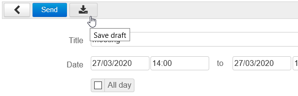

# Organizing Meetings

# Creating a meeting

## Creating an event

First create an event in the calendar. Either click "New event", or use quick-create – select the event's duration in the calendar and then click "Modify details" to open the event creation window:

In the event creation window, fill in the relevant information: location, tags, description, etc.

## Scheduling a recurrence

If you'd like to organize a recurring meeting, go to the "Repeat" tab to set the meeting's periodicity:

:::important

A meeting's periodicity can be set before or after adding participants and time-slot search. It can also be added later by editing the event.

:::

## Inviting people

In the right-hand side of the page, add the users or groups you want to invite.

You can choose for their participation to be required (default) or optional, by clicking the icon shown before their name after they are added:

## Booking resources

To book a resource, simply add it to the meeting as you would another attendee.
:::important

To find out more about booking resources, please go to the page [Resources](/Guide_de_l_utilisateur/Les_ressources/).

:::

## Searching for an available time slot

If one or several attendees are not available during the selected time slot, or if you want to look for another one, you can use the availability search tool in the "Find a time" tab:

This tab allows you to view busy or available time slots for the attendees and resources invited. 

- Drag the strip from left to right to move the time slot
- Click and drag the green and red lines to increase or decrease the meeting's duration
- Use the navigation buttons in the top left corner of the tab to change time periods and the horizontal scroll bar at the bottom of the tab to navigate within the period

## Sending invitations

Once the meeting's parameters are set, you must send an invitation to each attendee.

 **From version 4.2**, BlueMind's interface has been revised and made clearer. An event's organizer has the following options:

- 
****Send****

  - 
sends an invitation email to attendees

  - sends a booking request to resources 
  - 
adds the event to the invitees' calendar

- 
****Save draft****

  - 
the event is saved in the organizer's calendar

  - 
invitees do not receive any email

  - ressources are not booked
  - 
the event isn't shown in the participants or the ressources' calendar

- 
****Cancel (back arrow)****

  - 
no action is taken

In an effort to limit errors and inconsistencies, saving event modifications as draft is no longer possible. The organizer who makes changes to an event has the following choices: 

- ****Send****
  - attendees (users, external participants and ressources) receive a notification email
  - the event is updated in their calendar
- 
****Cancel (back arrow)****

  - 
no action is taken

When the change made only adds/removes one or several attendees, a popup window offers 2 options:

- 
****Send to All****: all attendees' invitee list is updated in their calendar, including their participation status (as known by the organizer at the time the email is sent)

- 
****Send to Changed****: only the attendees who have been added or removed from the event are notified.
This choice limits the number of emails sent when it is not necessary for all attendees to know the full list and all attendees' statuses.

:::important

In each user's or resource's calendar, solid colors indicate participation is confirmed, transparent colors indicate participation is pending confirmation (either a reply is pending or the user has replied "maybe") and in a striped transparent color if the user has declined the invitation:

:::
:::important

Versions earlier than 4.2

In earlier BlueMind versions, click "Save" at the top of the page. The following dialog box opens:

- Click "**Yes**" to send an email to each participant and resource manager – the event is added to their calendar pending their response. 
- **If you click "No", the invitation isn't sent by email and not added to attendees' calendars. **This enables you to finalize the event as a draft and edit it before you send the invitations.

:::

# Managing participation

## Participation notifications

When an attendee accepts, declines or puts on hold an invitation (replies "maybe"), the meeting's organizer is notified by email.

 To avoid confusions or discrepancies between organizers' and attendees' calendars, from BlueMind 4.2 **attendees are no longer able to change their participation status without notifying the organizer**.

Attendees can still send simple responses or add a note to the response. For recurring meetings, they can still respond for the whole series or one occurence only:

:::important

Versions earlier than 4.2

If an attendee later changes their participation status, they can choose whether or not to notify the meeting organizer. If they choose not to notify the organizer, then only their own version of the event is modified, the organizer's version is not updated and it will not show any changes.

:::

## Viewing participation statuses

Attendees other than the organizer cannot see other attendees' participation statuses in their version of the event. To see them, they must consult the organizer's version – provided they have reading privileges over that calendar:

- users who have **confirmed** participation are shown in black
- users whose response **is pending** (or replied "maybe") are grayed out
- users who have **declined **the invitation are shown grayed and struck out

:::important

- Attendees cannot see the details of other attendees' status, only the organizer is kept informed.
- Attendees are able to specify different participation statuses for each instance of a recurring meeting. As a result, **they can confirm their attendance for a whole series and, if necessary, specify that they will not attend a specific instance**.
- Each attendee has a customized view of a meeting, which means they can edit it (customized title, description, location, etc.) without it being visible by other attendees.
- ****WARNING****: the organizer's information prevails – when an organizer sends an update, participants' custom changes may be lost.

:::

## Inviting/removing attendees

To invite new attendees or to exclude some, simply edit the event:

- in the calendar, click the event to open the information window
- click the link "Modify details"
- add and remove attendees in the right hand side of the window
- click "Save" to confirm the changes and send new invitations
- no action is taken

When the change made only concerns adding/removing one or several attendees, a popup window offers 2 options:

- 
****Send to All****: when you use this option, all attendees' guest lists are updated in their calendars, including attendance status (as known to the organizer when it is sent)

- 
****Send to Changed****: only added or deleted attendees are notified. This limits number of emails sent when it is not necessary for all event attendees to know the full list or status of attendees.

Enregistrer

Enregistrer

Enregistrer

Enregistrer

Enregistrer

