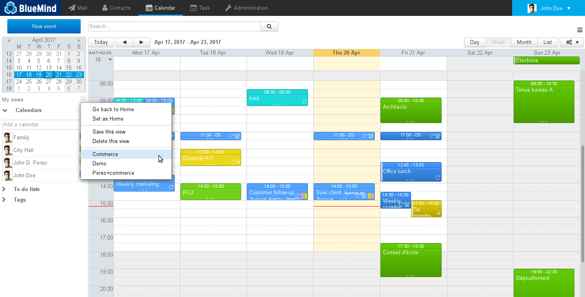
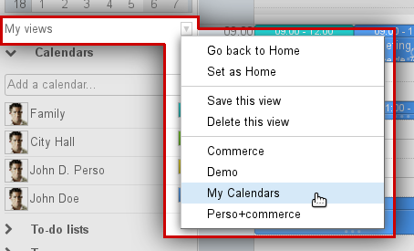
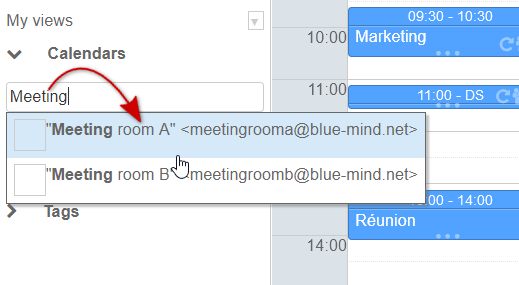
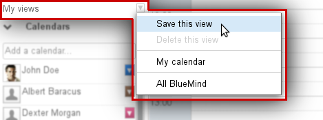
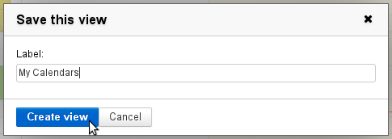
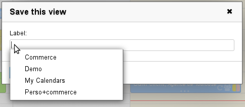

# Views

# Introduction

BlueMind allows you to customize and save several views to gain quick access to group calendars views.

:::important

For more information about displaying calendars, please go to the page [Sharing Calendars - §3 Multi-calendar display](/Guide_de_l_utilisateur/L_agenda/Le_partage_d_agenda/)

:::

# Access

To save, delete or return to default view, click the arrow next to "My views" in the sidebar and select the view you want:

# Creating a view

To create a new view:

- add the calendars you want to display to the current view:
- in the menu "My views", select "Save this view":
- name this view by filling in the "label" box in the popup window:
- validate by clicking "Create view"

# Modifying a view

To modify a view:

- add the calendars you want to display to the current view
- in the menu "My views", select "Save this view"
- 
in the "label" box, enter the name of the view you want to modify, or select it from the drop-down list:

:::important

The list of existing views is shown by clicking in the box or by autocomplete when typing.

:::

- The validation button changes to "Update view". Click it to save the new view.

# Deleting a view

To remove a view from the list:

- Display the view
- In the menu "My views", click "Delete this view":
- Accept when asked to confirm the deletion.

# Default view

The default view is the view that will be displayed when you log in to the application. This view cannot be deleted but it can be modified at any time using the first two menu choices:

- **Go back to my default view**: allows you to display the default view at any time
- **Set as default view**: the current display is set as the default view.

To reset your default view, simply select your user calendar and click "Set as default view".

