# Large files and linked attachments

# Introduction

BlueMind gives you the possibility to detach attachments from messages and show them as download links to recipients. This makes messages lighter, thereby relieving servers and communication networks: the file is no longer sent with the message and stored on the incoming server in addition to the outgoing server and possibly duplicated and multiplied as the message is forwarded and replied to.

This also allows you to send large files that exceed your email's authorized size limit.
:::important

This feature is not installed with BlueMind by default. For it to be available to users, the administrator must install it.

For more information, see [Linked Attachments](/Guide_de_l_administrateur/Configuration/Détachement_des_pièces_jointes/)

:::

# Attaching files in webmail

Files can be attached to messages either by clicking the "Attach a file" button or by dragging and dropping it in the right-hand area of the [composer](/Guide_de_l_utilisateur/La_messagerie/Le_composeur/):

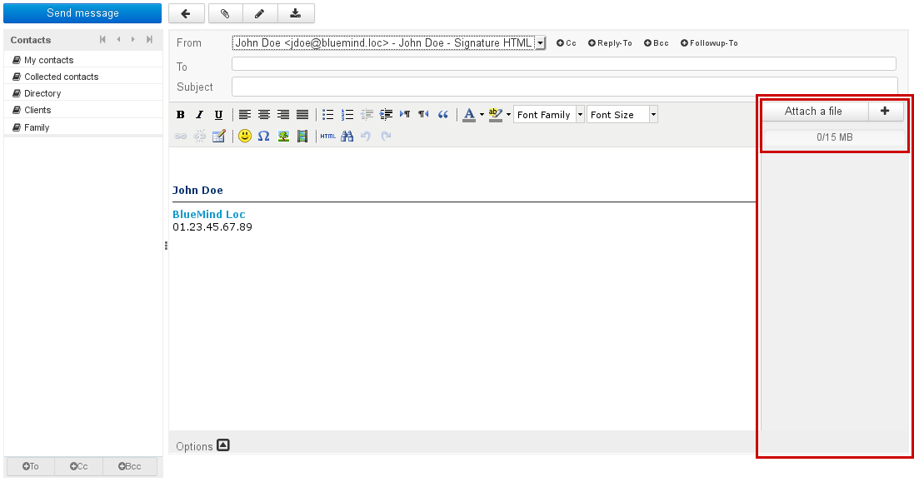
:::important

New

A capacity bar above the file list shows the total size of file attachments as a proportion of the maximum size authorized:

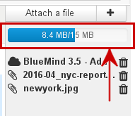

:::

## Attaching files using drag and drop

In the file browser, drag and drop one or several attachments into the right-hand pane of the composer.

The files are then either physically attached in the message or shown as hyperlinks, depending on the automatic detachment file size set by the administrator:

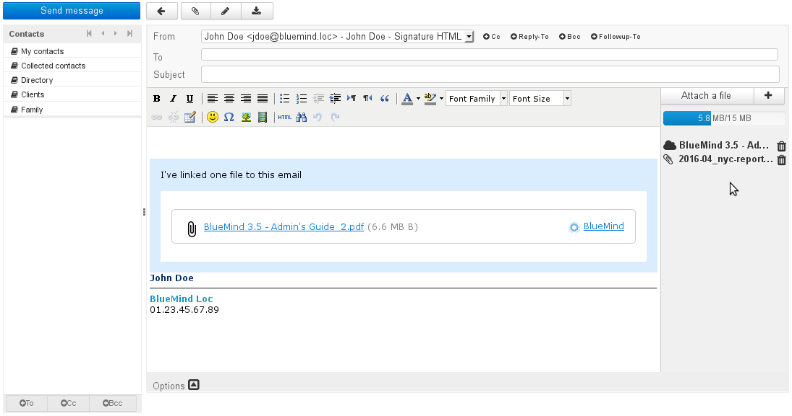

The icon before each file shows whether it is attached or linked:

- **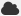** Detached file (also listed in the blue box in the message body)
- Physical file

The  icon at the end of the row allows you to delete attachments.

## Attaching files using the "Attach a file" button

Clicking the "Attach a file" or  buttons opens a dialog box that allows you to attach files from your computer or from the BlueMind server:

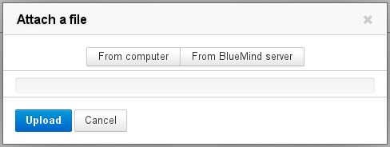

- **From computer** opens the default system file manager
- 
**From BlueMind server** opens the BlueMind file chooser:
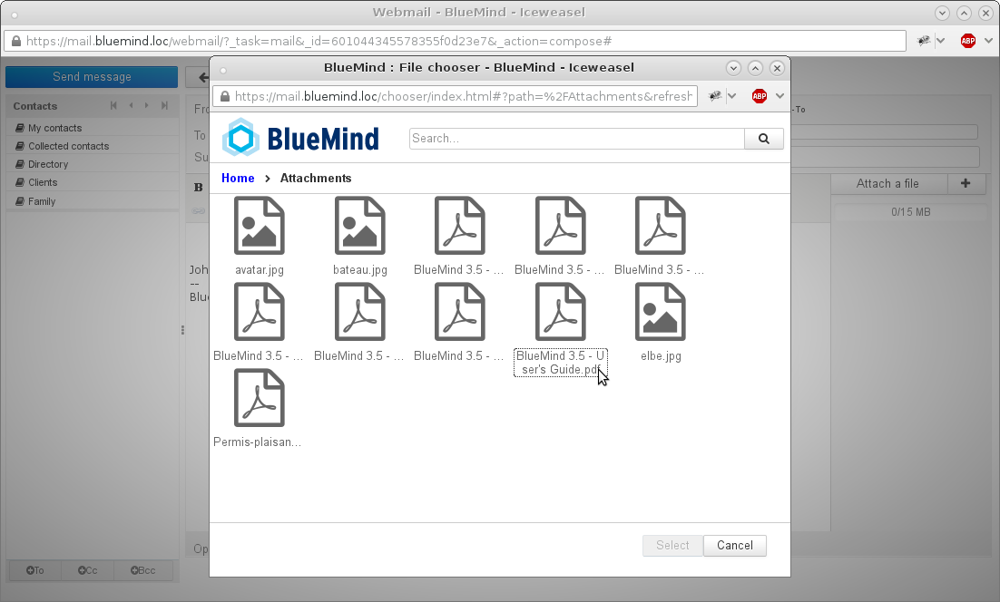
This file chooser enables you to browse previously sent files which are stored in the user's area on the server.
:::important

To select multiple files, clic them while pressing Ctrl/Command key

:::

Once selected, files are automatically added to your message. A button allows you to detach each file manually ("Store in remote server"):

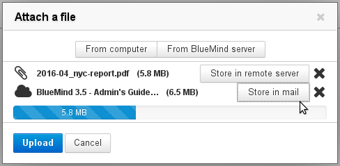

- When a file has been detached, the "Store in mail" button allows you to add it back to the message
- The  icon at the end of the row allows you to remove attachments (both physical and linked)
- The "From computer" and "From BlueMind server" buttons allow you to add more attachments.

:::important

When attachments size is close to the maximum limit, the capacity bar turns orange and it becomes red when it is exceeded.

:::

Once all files are selected, click the "Upload" button to confirm and attach them. Detached files are then sent to the server and the download box is added to the message as appropriate. Physical file attachments are shown in the right-hand pane of the message:

# Viewing attachments

When you receive a message, physical attachments are shown as a list to the right of the message while linked attachments are shown in a blue box within the message:

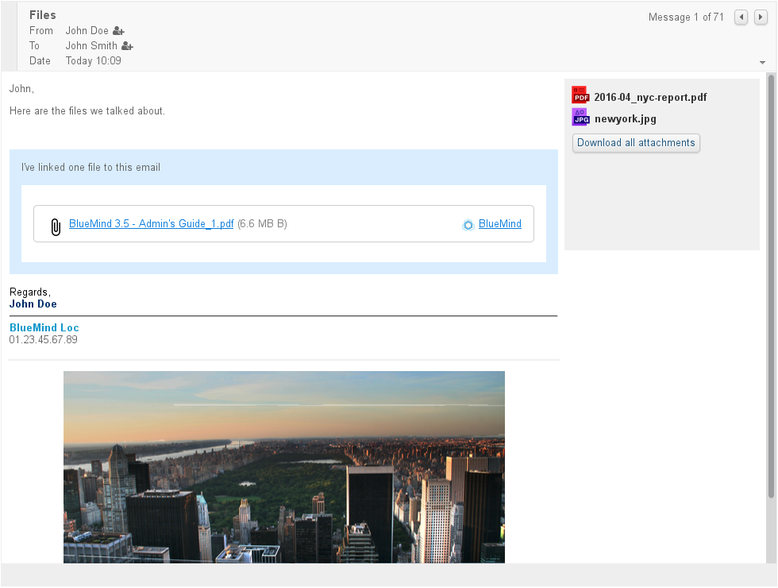

Click the file's name to download the attachment.
:::important

Physical attachments may be displayed differently depending on the thick client used. The linked files pane, however, forms part of the message and will therefore look the same in all thick mail clients provided HTML viewing is enabled.

:::

# Linking attachments in thick clients

The BlueMind connector allows users of Thunderbird to use the linked attachments feature.

For more information on how it works, please visit the dedicated page [Synchronisation avec Thunderbird.](/Guide_de_l_utilisateur/Configuration_des_clients_lourds/Configuration_de_Thunderbird/)
:::important

Outlook and MAPI

Linked attachments are a BlueMind feature. This means that they only work with the BlueMind for Outlook connector and not available in an [Outlook with MAPI](/Guide_de_l_administrateur/La_souscription_BlueMind/Mise_en_œuvre_de_MAPI_pour_Outlook/) context.

:::

# Connecting a NextCloud account

You can connect a NextCloud account if it is installed and operational on the domain.
:::important

This feature must first be configured by the administrator. For more information about setting it up, please go to the administrator's guide's dedicated page: [Connecting with Nextcloud](/Guide_de_l_administrateur/Configuration/Détachement_des_pièces_jointes/Connecter_avec_Nextcloud/)

:::

In user preferences, go to My account > "External accounts" tab

- If no account has been connected yet, a "Configure Account" button is shown. Click it to add a new account: 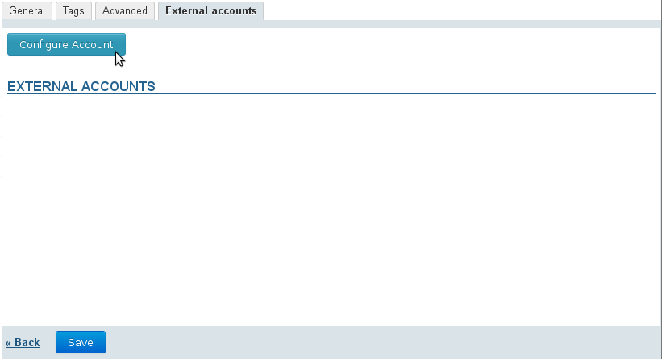
- Type in the login username and the password for the NextCloud you want to connect: 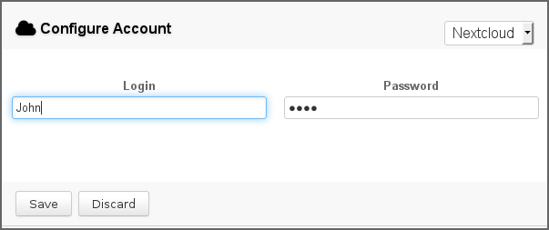
- **Save**
- The configuration button is gone and the account is shown:  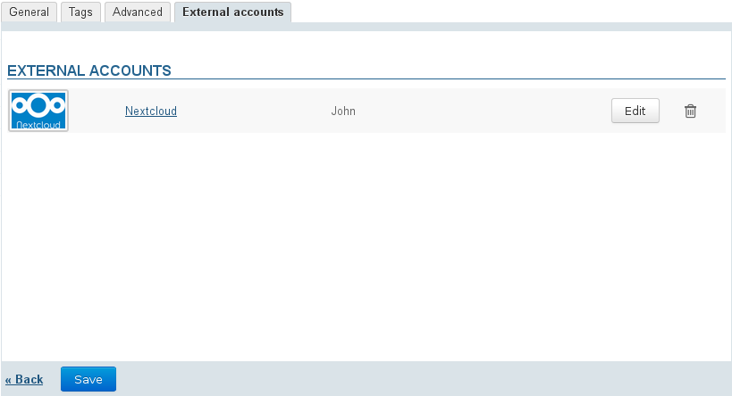Note: you can delete the connection at any time using the icon or modify the connection data by clicking the "Nextcloud" link or the "Edit" button
-  **Click "Save" to confirm the account creation**

From then on, linked attachments work in the same way but the BlueMind file chooser now shows NextCloud account files as well as their folder structure:

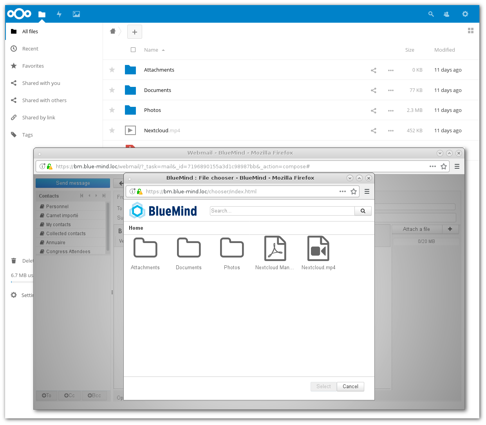
:::important

The files added as links from BlueMind are stored in the "Attachments" folder in the NextCloud account root folder.

:::

Enregistrer

