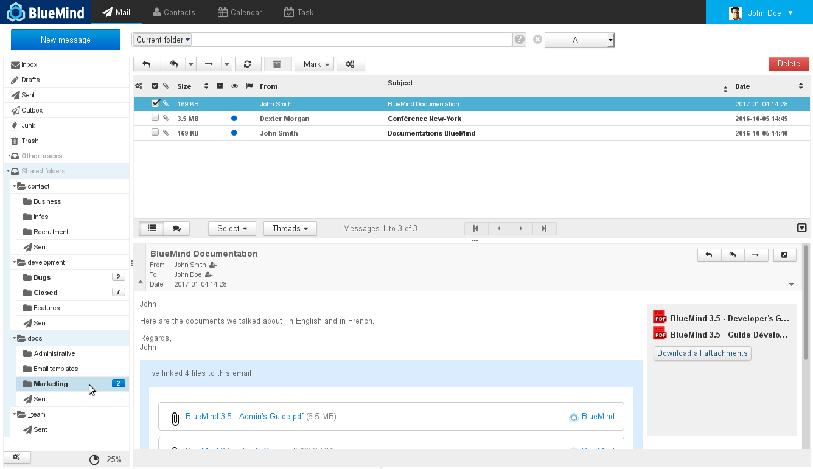
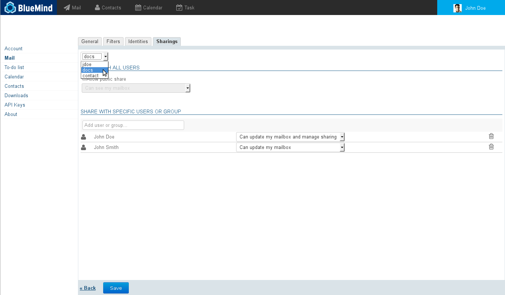
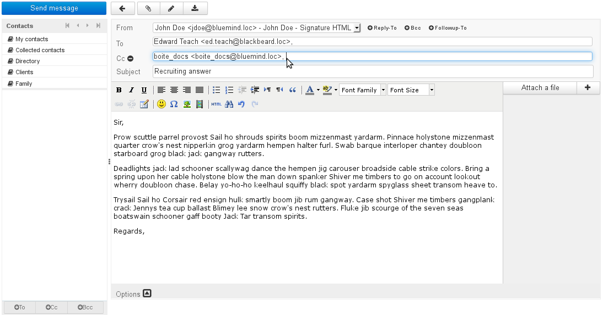
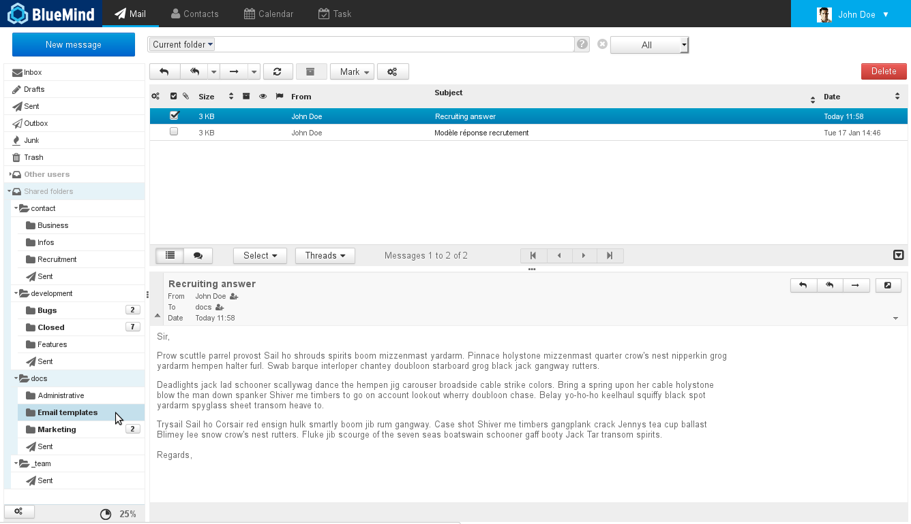
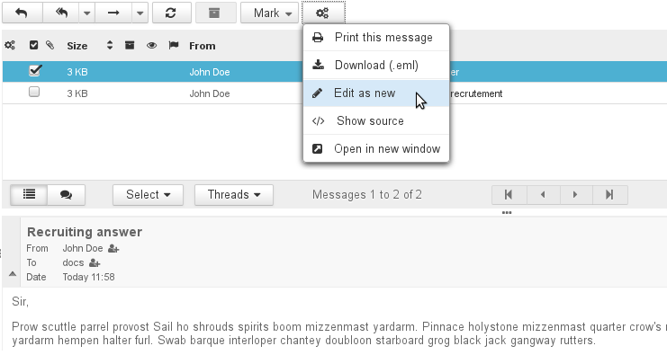
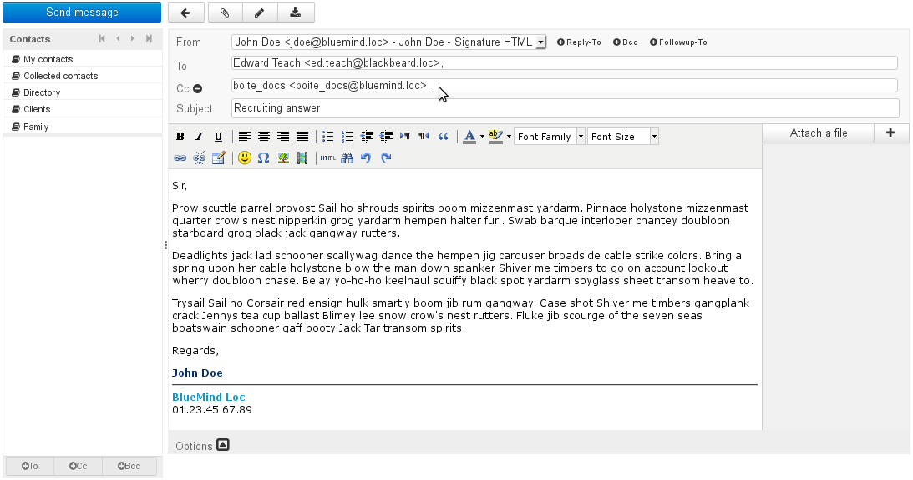
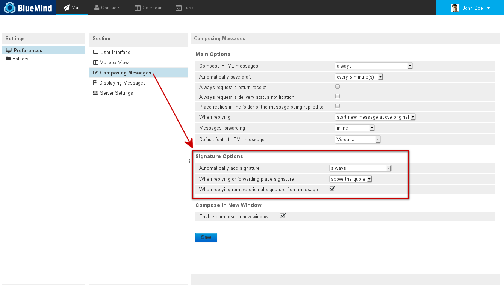
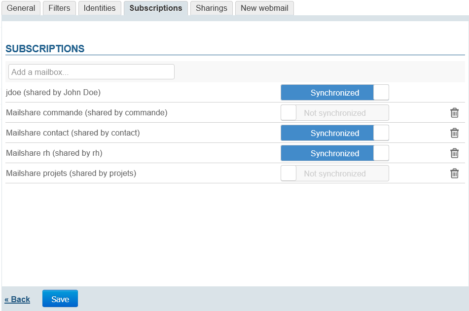
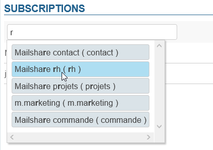
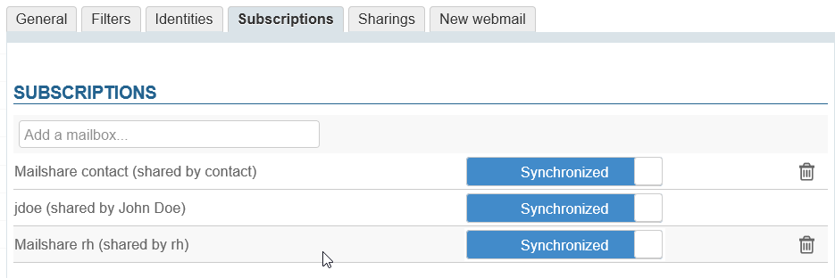

# Shared Mailboxes

# Introduction

Shared mailboxes are mailboxes that, unlike user mailboxes, are not user-specific: one or several users can be associated to them.
You can access and use a mailbox depending on the rights you have been granted:

- **reading**: you can read messages.
- **editing**: you can edit messages (add, delete, move...) and write in the mailbox's name.
- **managing**: in addition to reading and editing rights, you can manage the mailbox's share rights (public sharing, other users' rights, etc.).

These mailboxes are then available in a folder in your email client ("Shared folders" by default).

# Principles

Shared mailboxes are great for teamwork: all users with privileges on the shared mailbox can view (or more depending on their permissions level) the messages it contains.

Shared mailboxes work so that message "read status" information (read/unread) is specific to each user, whether the message has been read by other users or not.

However, reply and forward information is shared: if one user has replied to a message, all users will see the flag "Reply sent".

This is useful in collaborative work situations to manage shared inboxes (such as a contact mailbox) that include sub-folders such as "resolved, "sent", or "reply templates".

# Managing shared mailboxes

The domain administrator accesses the shared mailbox manager via his admin console in the directory entry manager.

If you have been granted management rights to a shared mailbox, you can access it in Mail settings, "Sharings" tab.

In this tab, select the mailbox whose share options you want to manage from the first drop-down list – this can be your own mailbox or a shared mailbox you have access to:

See [Managing Shares](/Guide_de_l_utilisateur/Gestion_des_partages/).

# Using shared mailboxes

## Writing "as" a mailbox

To write a message "as" a shared mailbox, i.e. to use the mailbox's email address as the sender, you must:

- be given the minimum right "can edit messages" by the administrator or the mailbox manager
- 
[create an identity for yourself](/Guide_de_l_utilisateur/La_messagerie/Les_identités/#Identities-mailshare) with this mailbox as the sender's address
:::important

If you want other mailbox right holders to be able to view the mailbox's sent messages, don't forget to uncheck the relevant box in the identity's management page.

:::

## Uses

Shared mailboxes can have a variety of uses in different situations, such as:

- ** **Projects****: a single project or department-specific mailbox, allowing users to centralize queries and data more comprehensively than through a simple distribution list or a group. 
- ** **Contacts****: to share contact messages between managers and salespeople as well as email templates for information or quote requests. 
- ** **Support****: to centralize support requests. The mailbox can be shared between IT technicians for support requests and between salespeople for monitoring.
- ** **To manage incoming requests****: mailboxes can be organized to sort requests according to their manager or processing status. E.g. the inbox receives incoming messages, a person-specific sub-folder can be used to move messages to in order to assign the message's processing. Once it has been processed, the message is moved to a "Processed" folder. You may also consider using status-specific sub-folders. E.g. for support requests: bug, information, improvement, or for sales mailboxes: quotes, invoices, prospects, etc.
- ** **Email templates****: a mailbox can contain the organization's email templates. It can be shared by the relevant users and include sub-folders for technical, sales or general templates, for instance.

## Email templates

A shared mailbox can be used to share emails that can serve as a common template for all its users.

First, you need to:

- Create an email.
- Send it to the desired mailbox if it has an email address, or copy (or drag) it straight into the mailbox from your webmail or email client (Outlook, Thunderbird, etc.).

The email appears in the shared mailbox and can be seen by all its users:

Next, to use the message stored in this mailbox, just select it in webmail and click "More actions" > Edit as new:

:::important

In Thunderbird, this option is available from the "Messages" menu or directly by right-clicking "Edit as new".

:::

A window containing the pre-filled message opens: the recipient's address and content are those of the original message and your signature is added.

:::important

Signature position depends on your settings and the email client used, therefore it may not be positioned at the end of the message.

In BlueMind's webmail, to check/edit signature position, go to user settings by clicking the wrench icon in the top right corner of the screen:

Next in Mail > Preferences > Composing Messages.

Signature options must be set as:

- Automatically add signature: always.
- When replying or forwarding place signature below the quote.
- When replying remove original signature from message.

In Thunderbird, to edit these options, go to the Edit menu (Tools in Windows) > Account Settings > "Composition & Addressing" section.

**Changing this option will affect the behavior of all messages.**

If you want to keep your signature above the quotes for other messages, cut/drag the signature which will be automatically inserted above when using templates.

:::

# Subscriptions and third-party software

From BlueMind version 4.3, you can manage subscriptions to shared mailboxes to show the ones you like in Outlook [connected over mapi](/Guide_de_l_utilisateur/Configuration_des_clients_lourds/Synchronisation_avec_Outlook/) and/or on mobile devices [connected over EAS](/Guide_de_l_utilisateur/Configuration_des_périphériques_mobiles/).
:::important

Subscriptions only concern third-party applications, they have no incidence on how the mailbox is displayed in BlueMind's webmail or third-party software synchronized over IMAP/POP.

:::

Once a mailbox has been shared and you have received the notification email (see above):

- go to the settings page: My account > Mail > Subscriptions tab:
- Start typing the name of the mailbox in the box at the top of the tab and autocomplete will suggest a list of mailboxes you have sharing rights to:
- 
Select the mailbox you want to add to the list. It is added with synchronization enabled by default:

:::important

  - **Synchronization enabled**: the mailbox will be visible in Outlook (mapi) and mobile devices (EAS)
  - **Synchronisation disabled**: the mailbox will be visible in Outlook (mapi) only

:::
- **Click Save to apply the subscriptions**

:::important

You can modify subscriptions (synchronization enabled/disabled) or delete them (click the  icon) at any time.

:::

