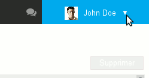

# Message Filters

# Introduction

Filters allow you to apply sorting rules and automatic actions to new incoming messages.

You can use them, for example, to store messages from a specific sender into a sub-folder or to delete messages with a specific subject without having to intervene manually on each message.

To manage message filters, open the user settings management:

Go to Mail > Filters tab:

:::important

The "Save" option is shown at the bottom of the page for each step. If you want to make several changes (create, modify, sort, etc.), you don't have click this every time, you can save once you have made all the changes you want.

:::

# Creating filters

To create a filter, click "Add filter" to open the dialog box:

1 Select the field you want to apply the rule to (From, To, Subject, etc.)
1 Choose the type of control you want to apply:
  - is: the field value must match this exactly.
  - is not: the field value must be different from the string of characters entered.
  - 
contains: the field value must include the string of characters entered.
:::important

In the example above, messages will be moved to the "A team" folder and marked as important if at least one of the recipients' address is "[a.team@bluemind.loc](mailto:a.team@bluemind.loc)". Choosing "is" would have meant that exclusively emails with this address as the only recipient would be moved.

:::

  - does not contain: the field value does not include the string of characters entered.
1 Choose one or several actions to apply:
  - mark as read
  - mark as important
  - delete
  - move to + choose folder
  - forward to + recipient email addresses : you can select several addresses to forward messages to. 
    - Autocomplete searches for addresses in all user directories (directory, personal address book, etc.).
    - You can also add external addresses manually. These will not be added to the collected addresses address book when the message is sent.
1 Click "Validate".
1 **Once you are done creating filters, click "Save" to apply.**

# Modifying filters

1 Click the pencil icon  at the end of the row of the filter you want to make changes to:
1 The editing window opens. Make the changes you want.
1 Click "Validate".
1 **When all filters are up to date, click "Save" to apply all changes.**

# Sorting filters

Filters are applied to emails in the order shown below.

**Once filters are in the desired order, click "Save" to apply changes.**
:::important

One single filter can be applied to one single message: once a filter has been applied, subsequent filters have no effect.

:::

# Deleting filters

1 Click the trash icon at the end of the row 
1 **Click "Save" to apply changes.**

