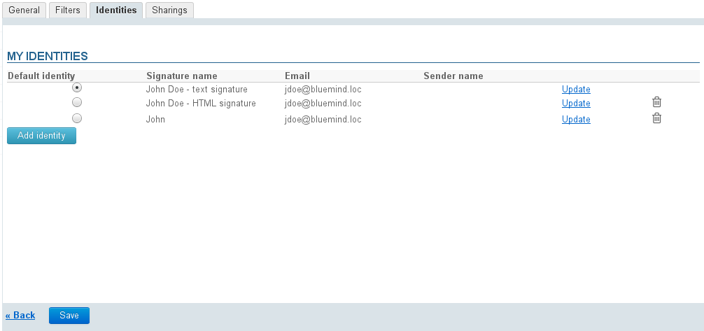
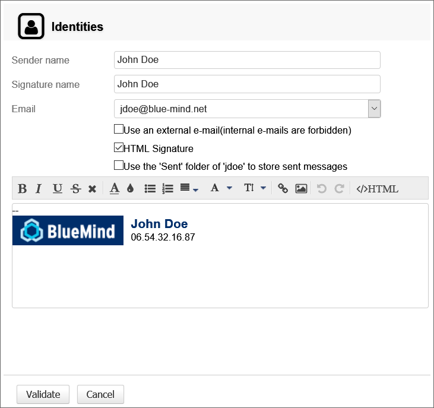
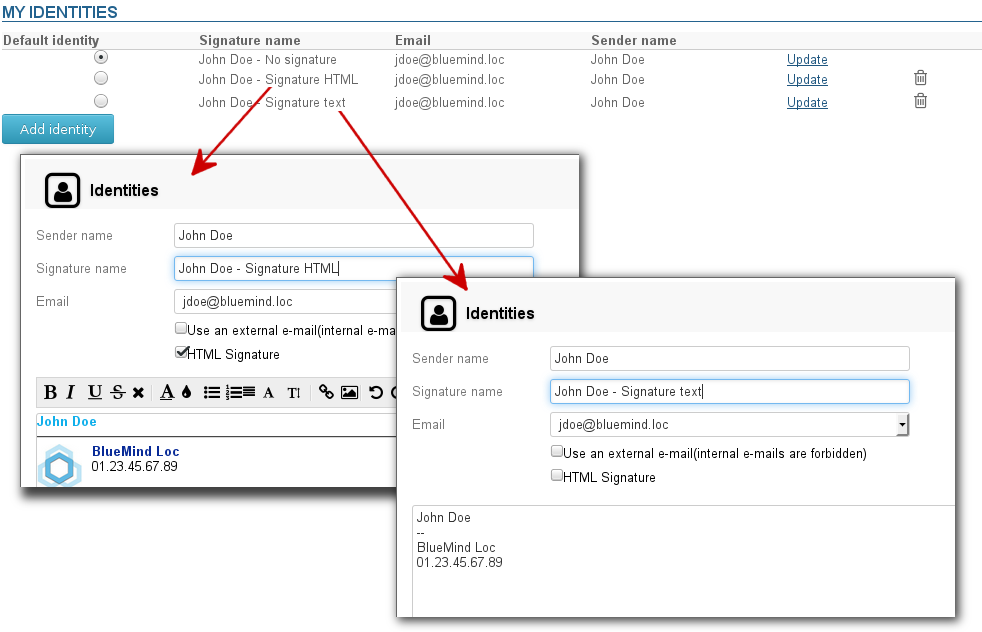

# Identities

## Introduction

BlueMind allows you to create several identities for a single user account.

When several identities have been created, you can select the identity (and therefore the address) you want to use when you send an email.

Identities can be linked to:

- your main address,
- a user alias,
- a shared mailbox address.

You can define and set a default identity to use when composing new messages.

## Managing identities

To manage identities, go to user settings:

  

Then go to Mail > Identities tab.

By default, you are assigned an identity which includes your email address and user name (first and last name).
The identity's signature has a name but no content.

- To add a new identity, click "Add identity" at the bottom of the list
- To edit an identity, click "Update" at the end of the corresponding row.

This opens the following dialog box:

- **Sender name** is the name that will appear in the messages you send.
- **The signature name** is designed to identify it in the list of identities as one same address and one same name displayed can be used for several identities. 
-  You can **choose among all the email addresses assigned to you** or shared with you: domain aliases, shared mailboxes, etc.  

:::tip

When you check the box "Use an external e-mail", you can create an identity for a non-BlueMind address.

For this option to be available, the administrator must grant you the "Mail > External identity" role.
To find out more about assigning rights, go to the page [Administrator's Guide](/Guide_de_l_administrateur/) > [Users](/Guide_de_l_administrateur/Gestion_des_entités/Utilisateurs/)

:::

- **Choose a format** (HTML or plain text) and input the signature contents.
- **The box  "use the 'Sent' folder of "&lt;userID>" to store sent messages** forces the use of the account's sent folder (user or shared mailbox) corresponding to the email address selected in the "Email" box. If this box isn't checked, the user's default sent messages folder will be used.
- **Validate**

:::info

Once you've created an identity, click "Validate" at the bottom of the page to save and apply changes.

:::

:::tip

You can create several identities with the same "Sender name" for a single email address. This enables you to write messages using different formats, for instance: full HTML signature for professional messages, no signature for personal messages or plain text signature for distribution lists...

In this case, the signature name is the distinguishing feature for these identities and allows you to tell them apart:

:::

## Identities and shared mailboxes

When you have editing and management rights to a shared mailbox, you can create an identity to use this mailbox as the message sender.

To do this, go to the "Identities" tab (see "managing identities" above):

- Click "Add an identity".
- Enter a Sender name.
- Select the shared mailbox address from the list of available email addresses.
- The shared mailbox signature information is inserted automatically.
- This information is as entered by your administrator in the shared mailbox's default identity.

:::info

If a shared mailbox has several email addresses, they all appear in the list of available addresses but only the mailbox's default identity information will be inserted, whether an identity corresponding to this address exists in the shared mailbox configuration or not.

:::

- Select the folder to be used for sent messages: check the box to use the shared mailbox or leave it unchecked to use the user's default folder. 
- Validate.

