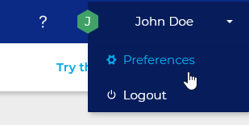
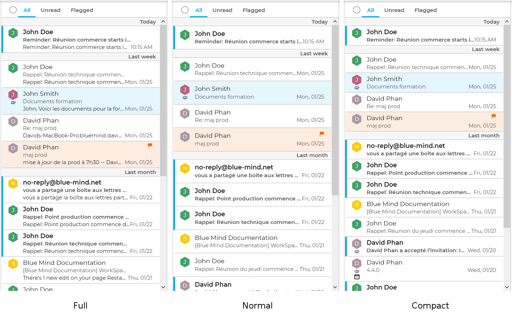
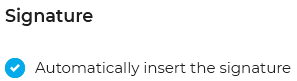
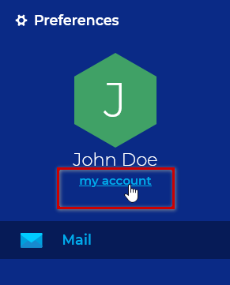

# Webmail Preferences

# Introduction

Webmail preferences let you customize the webmail interface. Its development is still in progress and constantly evolving.

# Access

Preferences are available in the menu in the top right corner of the page:

# Display preferences

BlueMind lets you choose whether to display more or less information and how many messages to show in the same space:

# Signature

The "Automatically insert the signature" option let you enable or disable the signatures configured in the account's [identities](/Guide_de_l_utilisateur/La_messagerie/Les_identités/).

# General BlueMind preferences

The "my account" link in the right-hand side column, under your user name, opens the [BlueMind user settings](/Guide_de_l_utilisateur/Paramètres_utilisateur/):

