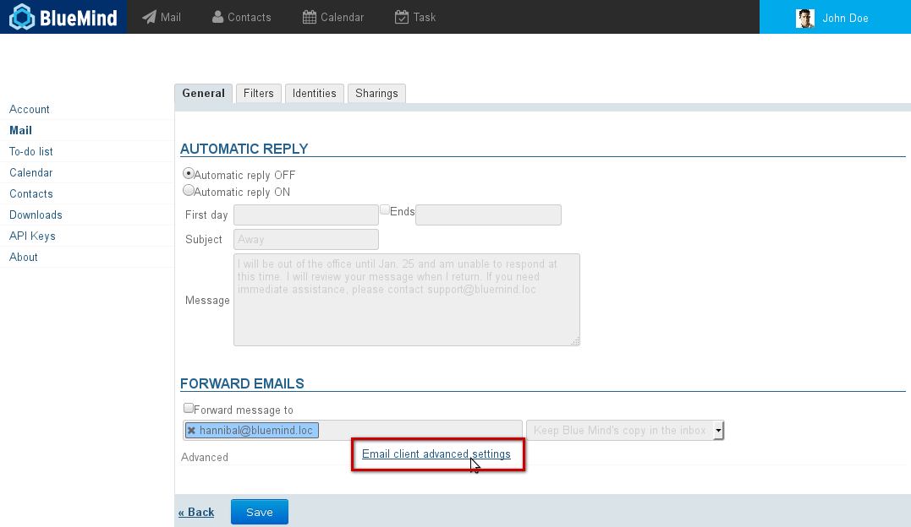
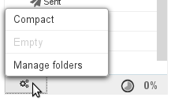
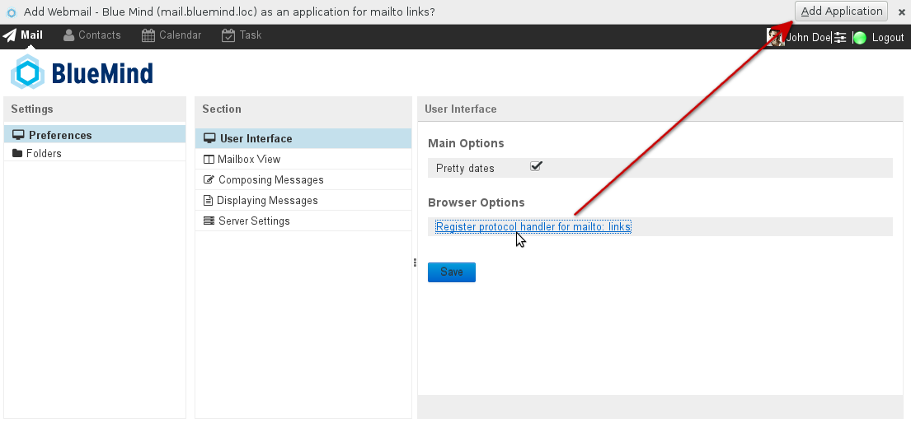
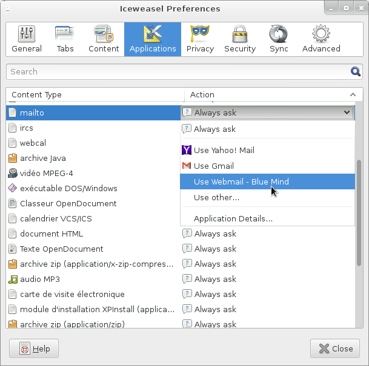
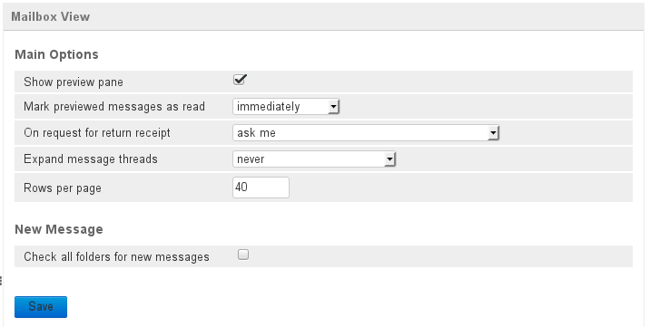
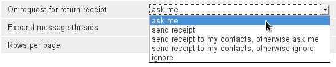
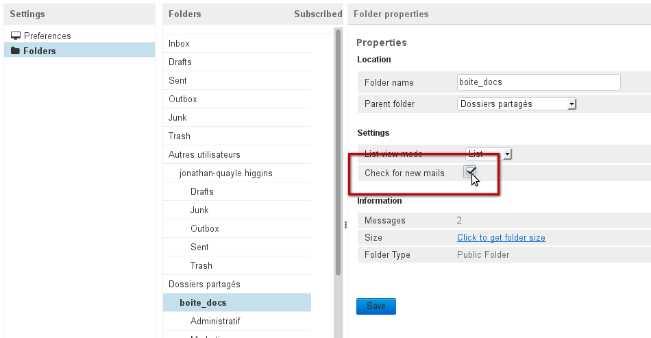
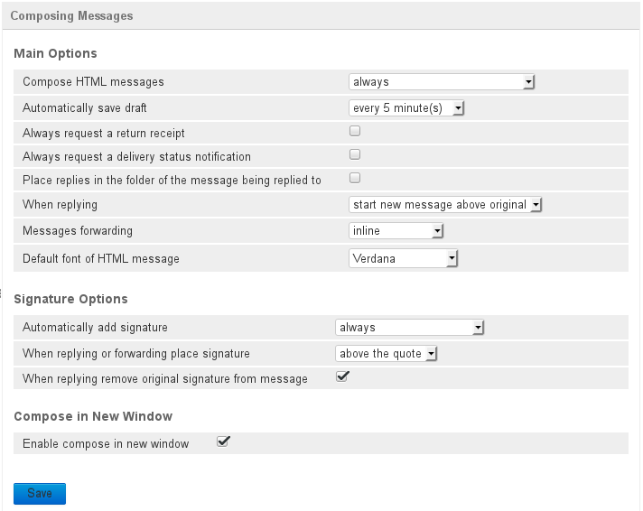
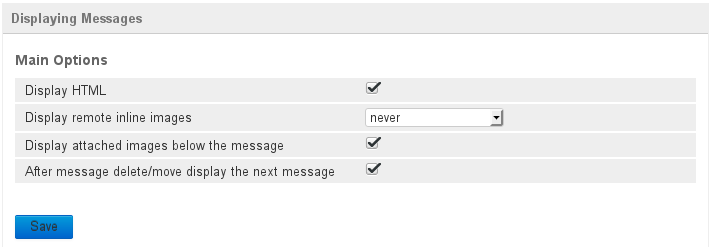
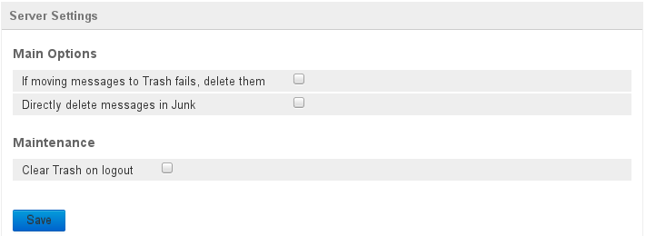

# Advanced Settings

# Introduction

Advanced settings allow you to customize how BlueMind Mail behaves and displays information, including:

- mailbox view
- user environment integration
- checking for new messages frequency
- date format
- message format (HTML or plain text)
- notifications handling (questions/answers)
- message writing and viewing
- server behavior for deletions

To access advanced settings, in the user preferences go to Mail > * Email client advanced settings  *link:

:::important

You can also access advanced settings directly in webmail by clicking the gears menu at the bottom left of the folders list > Manage folders > Preferences:

:::

# User interface

- By default, the date is displayed in short format: "Today 1:00pm", "December, 10, 2013 2:15pm" for the last 7 days, or "11/24/2013 10:03" for earlier dates.To use the full date format, clear the checkbox and click "Save". All dates will then be shown as "MM//DD/YYYY HH:MM AM/PM", for example "12/31/2013 1:37pm".
- The *"Register protocol handler for mailto: links" *link* *allows you to register BlueMind Mail in your browser so that when you click a "mailto:" link on a website or in an email, a new "compose message" window will open.

:::important

Don't forget to accept your browser's validation request after you click the link. For example, with Firefox:

You can undo or customize this in Preferences > Applications > Content Type: mailto:

:::

# Mailbox view

The mailbox view window allows you to customize the main Mail display options: pane display, message display, notification responses, how often Mail checks for new messages, etc.

## Main mailbox view options

-  **Show preview pane**: enables/disables message previews in the main Mail window. This option allows you to switch from a three-pane view (folders list on the left, list of messages in the main window, preview at the bottom right of the page) to a two-pane view (folders list on the left, list of messages on the right). In two-pane view, double-click a message to read it.
- **Mark previewed messages as read**: time interval before messages are marked as read
- **On request for return receipt**: allows you choose how BlueMind responds to return or read receipt requests: 
- **Expand message threads**: sets whether subjects threads are expanded in subject view (see [Mail §4.5 Message actions](https://forge.blue-mind.net/confluence/display/BM35/La+messagerie#Lamessagerie-Actionssurlalistedemessages))
- **Rows per page**: sets the number of messages to display in the message list

## Incoming messages

- 
**Check all folders for new messages** : forces Blue Mind to check for new messages in all the folders your are subscribed to (default folders,   sub-folders, shared mailboxes, etc.) ** ** .  ** ** By default, only your inbox is checked for new messages regularly. ** **       ** **  When this option is enabled, folders are checked every 3 minutes in groups of 20 folders maximum. As a result, a mailbox containing fewer than 20 folders (including default folders such as inbox, trash, etc.) will be checked for new messages every 3 minutes. For a mailbox containing 40 folders, each folder's messages will be retrieved every 6 minutes, etc.    
:::important

You can force BlueMind to check a specific folder for new messages by following the steps below:

  - Go to folder properties: in the left hand side menu in the same screen, or by clicking  at the bottom of the webmail folders list.
  - Select the folder you want to apply this to.
  - Check the "Check for new mails" box:

 The 20-folder maximum limit applies here too, but **you can only force-check for new messages for 16 folders** as 4 "slots" are reserved for the system to check the entire folder structure 4 folders at a time.

:::

# Composing messages

This section allows you to choose message composition and signature options: HTML or plain text format, draft saving, return receipts, delivery status notifications, signature position when replying, etc.

It also includes notification preferences and signature options.

## Main compose message options

- **Compose HTML messages**: allows you to choose whether you write messages in HTML mode "always, never or in certain cases only"
- &lt;label for="rcmfd_autosave"> &lt;strong>Automatically save draft&lt;/strong> &lt;/label> **s**: draft autosave time interval when composing messages. Drafts are saved and can be retrieved in the Mail "Drafts" folder
- &lt;label for="rcmfd_mdn_default"> &lt;strong>Always request a return receipt&lt;/strong>:&lt;/label> when this option is checked, all message recipients receive a request for a return receipt
- 
&lt;label for="rcmfd_dsn_default"> &lt;strong>Always request a delivery status notification&lt;/strong> &lt;/label>: when this option is checked, you will receive a notification advising you that the server has received your message and delivered it into the recipient's mailbox
:::important

Warning, this does not mean that the recipient has seen your message. All this does is tell you that it has been delivered into their mailbox.

:::

- &lt;label for="rcmfd_reply_same_folder"> &lt;strong>Place replies in the folder of the message being replied to&lt;/strong> &lt;/label>: when this option is checked, replies to messages will not be placed in the "Sent" folder, but in the folder where the original message to which you have replied is located
- &lt;label for="rcmfd_top_posting"> &lt;strong>When replying&lt;/strong> &lt;/label>: when replying to a message, allows you to choose whether you want to start writing above or below the original message
- &lt;label for="rcmfd_forward_attachment"> &lt;strong>Messages forwarding&lt;/strong> &lt;/label>: allows you to choose whether you want to forward messages as attachments or as text quotes
- &lt;label for="rcmfd_default_font"> &lt;strong>Default font of HTML message&lt;/strong> &lt;/label>: allows you to choose the font for composing messages

## Signature options

- **Automatically add signature**: sets when to add a signature: in all messages, no messages, in new messages only, when replying or forwarding messages only
- **When replying or forwarding place signature**: sets where the signature will be placed when replying and forwarding messages (above or below the quote)
- **When replying remove original signature from message**: when this option is checked, the original sender's signature is deleted from the reply, this helps streamline messages and makes reading easier, in particular for long conversations.

## Compose in new window

- **Enable compose in new window**: when this option is checked (default behavior), the new message composer opens in a separate window. If this option is unchecked, it replaces Mail view.

# Message display options

This section allows you to customize general display preferences for messages received: HTML or plain text format, image attachments and behavior after message deletions.

- **Display HTML**: when this option is unchecked, text formatting is removed and messages are shown in plain text
- **Display remote inline images**: allows you to chose whether or when to display remote inline messages (never, always or when the sender is known)
- **Display attached images below the message**: when this option is checked, picture attachments are displayed in the message viewing area
- **After message delete/move display the next message**: if this option is checked, when you delete a message you are viewing the next message in the list is displayed in its place in the preview area, otherwise, the preview area remains empty.

# Server settings

Server settings options allow you to configure how BlueMind behaves when you delete messages.

You can also choose whether to clear Trash on log out or not in this window.

## Main server options

- **If moving messages to Trash fails, delete them**: when this option is checked, if a message cannot be moved to the trash, it is deleted directly and permanently
- **Directly delete messages in Junk**: when this option is checked, spam messages are deleted instead of being placed in a specific folder

## Maintenance

- **Clear Trash on logout**: when this option is checked, the Trash folder is emptied automatically when you log out, otherwise you must empty this folder manually.

