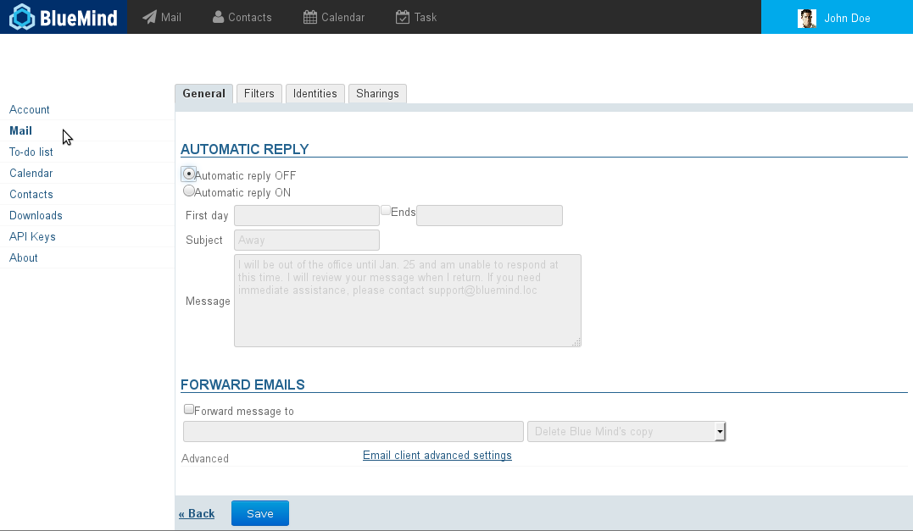
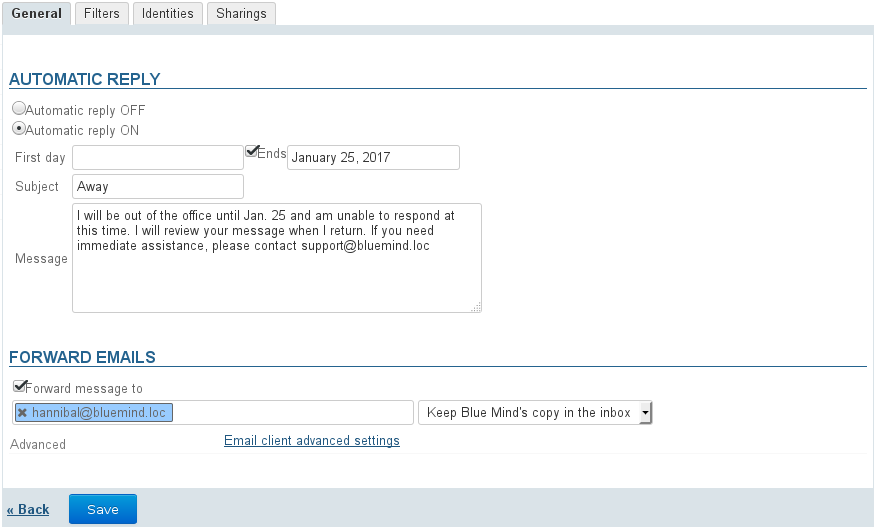
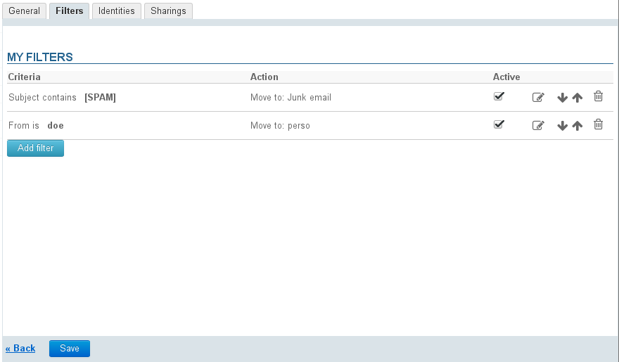
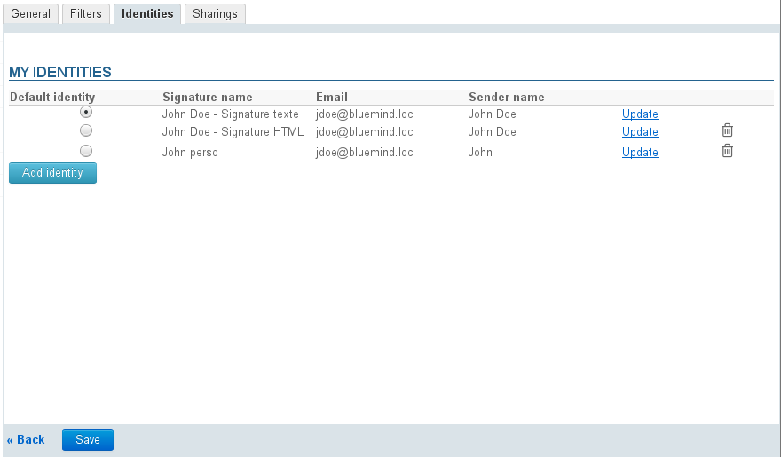
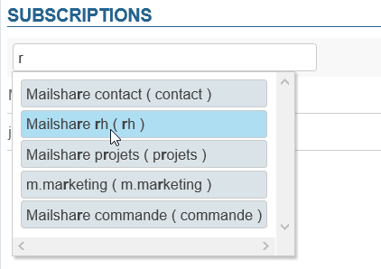
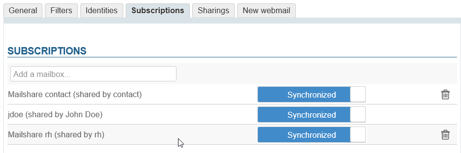

# Mail Preferences

# Introduction

To access Mail preferences, go to "My account" in the right hand corner of the navigation toolbar:

Clicking this from webmail takes you directly to the relevant section. Otherwise, click "Mail" in the left hand side menu:

# General preferences

The "General" tab allows you to set up the vacation responder: a reply will be sent automatically to everyone who sends you an email for the duration you set.

You can use this feature to notify people that you are out of the office.

- Start and end dates are not required:
  - If no start date is specified, the responder is enabled when the new settings are entered.
  - If no end date is specified, the responder remains active until you change the setting to "Vacation responder OFF"
Clicking the date input area opens a popup calendar to help you choose a date:- Completing the subject line is optional: if it is empty, a message with an empty subject line will be sent.
- Message content is mandatory. It will be shown in the body of sent messages.

:::important

When the responder is turned off, the last settings used are saved and brought up in case you want to turn it on again.

:::
:::important

An automatic away message is sent once in every 3-day period to every person who emails you.

If you turn the responder off and then back on during this period without changing the message's subject or contents, people who have already received an auto-reply will not be sent any more away messages and the countdown for the period continues where it left off.

E.g.:

- User A turns on their responder.
- User A receives a message from User B on day D, an away message is sent to User B and the 3-day countdown starts.
- User A turns off their responder on day D+1.
- User A receives a message from User B. No away message is sent.
- User A turns their responder on again, without changes, on D+2.
- User A then receives a message from B: the responder considers this is still D+2, therefore no away message is sent to User B.

:::

# Filters

Filters allow you to apply sorting rules and set automatic actions for new incoming messages.

You can use filters to organize messages from specific senders into a sub-folder, or have messages with a specific subject deleted, without any manual intervention from you.

To find out more about managing message filters, please go to the page: [Message filters](/Guide_de_l_utilisateur/La_messagerie/Les_filtres_de_messages/)

# Identities

The identities tab allows you to manage your identities and related signatures.

For more details, please go to the page: [Identities](/Guide_de_l_utilisateur/La_messagerie/Les_identités/).

# Subscriptions

This new section, available from version 4.3, is used to manage shared mailbox subscriptions so that they are shown (or not) in [Outlook connected over mapi](/Guide_de_l_utilisateur/Configuration_des_clients_lourds/Synchronisation_avec_Outlook/) or [mobile devices connected over EAS](/Guide_de_l_utilisateur/Configuration_des_périphériques_mobiles/).
:::important

Subscriptions are for third-party applications only, they have no incidence on how the mailbox is displayed in BlueMind's webmail or third-party applications synchronized over IMAP/POP.

:::

Subscriptions with or without synchronization provides different display options for each mailbox – enabling synchronization means that the mailbox concerned will be shown in devices connected over EAS.

    |  | Synchronization enabled | Synchronization disabled |
| --- | --- | --- |
| Outlook mapi |  |  |
| EAS |  |  |
| webmail | * no subscription required
* always displayed
 |
| IMAP | * no subscription required
* displayed depending on the [third-party software settings](Configuring-Thick-Clients_79862301.html)
 |

To add a subscription to a mailbox:

- Make sure that you have at least read privileges (see [Shared mailboxes](/Guide_de_l_utilisateur/La_messagerie/Les_boites_aux_lettres_partagées/)) – ask your global administrator or the mailbox's administrator.
- Start typing the name of the mailbox in the box at the top of the tab and autocomplete will suggest matching mailboxes you have share privileges on:
- 
Select the mailbox.
It is added to the list with synchronization enabled by default:

-  **Click ****Save**** to apply the subscriptions**

# Managing shares

You can manage sharing and delegation rights for your mailbox as well as any other component you are the administrator of (shared mailbox, resource) in the Sharings tab.
:::important

By default, your own editing and administration permissions are shown: these cannot be deleted or lowered.

:::

The sharing options available are:

- **Can send on my behalf**: the user selected is able to create an identity to send messages with the current user mail address
- **Can see my mailbox**: the user selected is able to read the messages in your mailbox.
- **Can update my mailbox**: the user selected is able to view your messages and edit them (delete, move between folders, folder name and structure, etc.).
- **Can update my mailbox and manage sharing**: in addition to the viewing and editing rights above, the user selected is able to modify your mailbox's share options.

See [Managing shares](/Guide_de_l_utilisateur/Gestion_des_partages/).

