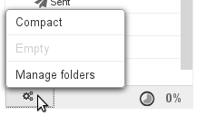
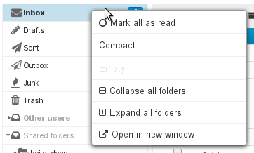
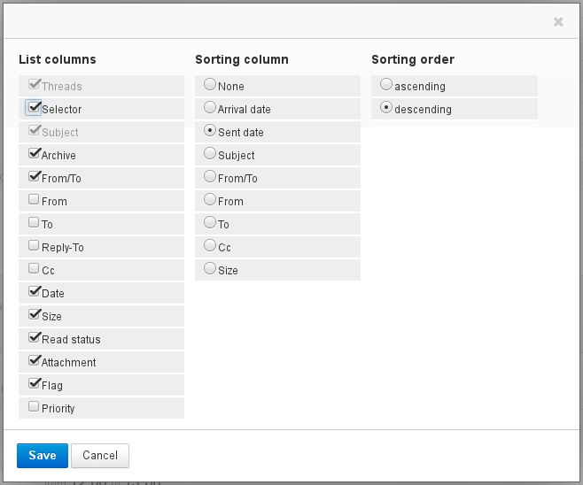
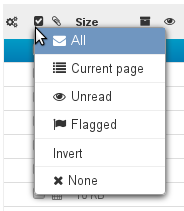
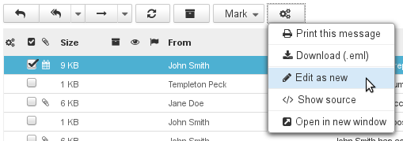
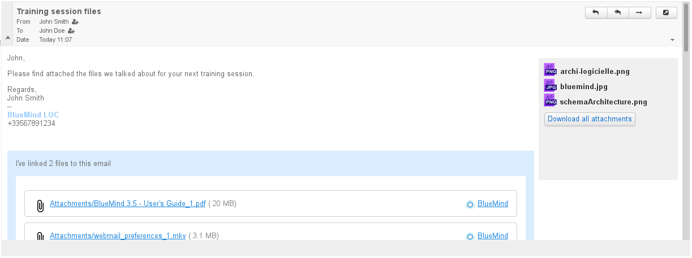
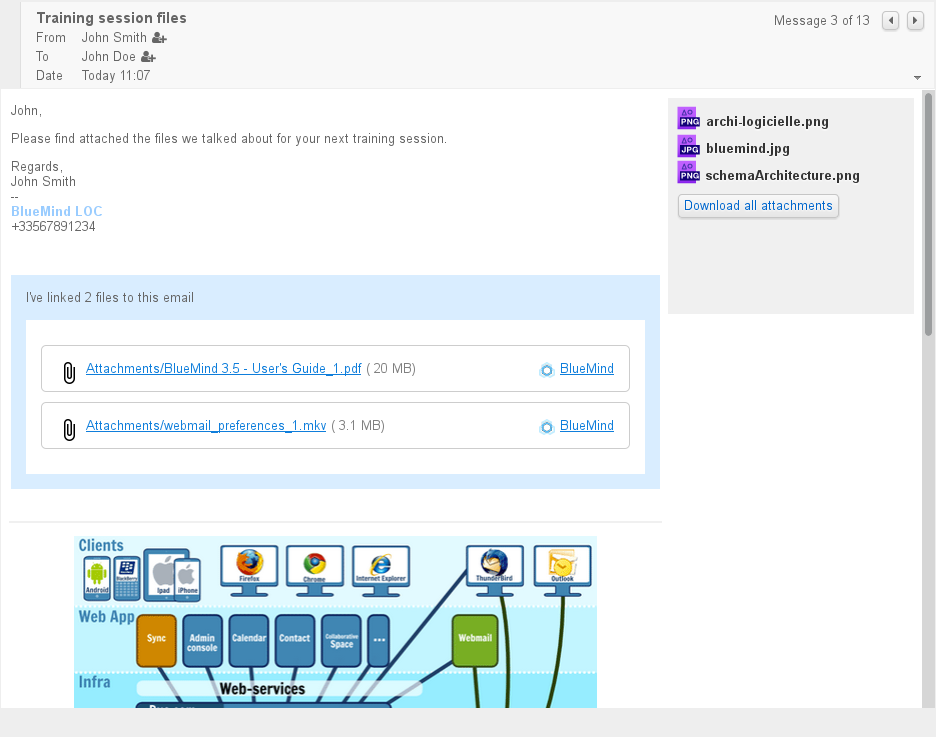

# Mail

# Introduction

Thanks to its thin client (webmail), BlueMind Mail offers a rich user interface with multiple features:

- Customizable 2 or 3-pane view
- Shared mailbox viewing and management
- Attachment drag and drop from desktop
- Address autocomplete
- 2 editing modes: text or HTML (rich text, images, etc.)
- Full-text, multi-folder search engine

# Display

BlueMind's default main view includes three panes:

-  : the sidebar shows your email folder structure, which includes your personal mailboxes as well as the shared mailboxes you have access to.
-  : displays the list of messages in the folder selected as well as related action buttons.
-  : shows the message selected in the list. You can choose not to display this area and opt for a two-pane view in the preferences menu.
-  : the advanced full-text (perform search in messages content and attachments) and multi-folder search engine

# Sidebar

The sidebar shows the directory structure for read-only or read-and-write folders you have access to, sorted alphabetically.
:::important

Refreshing the folders list

The BlueMind application has a folders list cache, so a recently created or shared folder may not be displayed in the list immediately.

To force-refresh the list, the trick is to:

- go to the Manage folders menu: 
- and just return to webmail, without doing anything else

:::

When a folder is selected, its content is shown in the right-hand pane .

The "shared folders" folder holds all the folders – user-specific or shared mailboxes – you have been granted rights to.

Messages can be moved from one folder to another by dragging and dropping them from the message list into the desired folder.

Right-click a folder to open a folder-specific action menu:

:::important

** **About disk quotas** **

When disk quota is enabled, the disk usage percentage is displayed permanently in Mail at the bottom of the left-hand pane and hovering with the mouse shows usage details:
  

Disk quota usage is color-coded: orange = 75% used, dark red = 85% used, and red 100% used:

When a quota is reached, incoming emails are blocked. These emails can be kept on the server for a few days.
This may also cause disruptions to send, and possibly delete, operations as the system needs to perform copies in a temporary and/or trash folders.
:::important

Disk quotas and deletion

To delete messages when the disk quota has been reached, use the delete permanently function (without sending them to the trash) by pressing &lt;SHIFT+Del>.

:::

When a disk quota has been reached, you can increase it manually and decrease it back to its original size at any time.

:::

# Message list

## Columns and sorting

The gears button   above the message list opens the column list and sorting window:

To apply sorting to a column, click it in the "Sorting column" list: if messages are already sorted by that column, the sorting order is reversed (ascending  descending), otherwise messages are sorted in ascending order. The column currently used for sorting is shown with an arrow in the column header:

To customize column order, click the header of the column you want to move in the message list. The message list is grayed out and the column's location is shown as a dotted line. You can then move the column to the desired location:

:::important

Columns and sorting order choices are saved and kept until your next connection.

:::

## Selecting multiple messages

There are several ways to select multiple messages:

- Click the rows for the first and last message while holding down the "shift" key to select all the messages in that range.
- Click each message row while holding down the "Ctrl" key.
- In the select messages column:
  - check the box corresponding to each message you want to select – no need to hold any key.
  - click the column header to display the selection menu:

The messages selected are highlighted in blue and the box is checked:

:::important

When several messages are selected, the preview pane does not show any content.

:::

## Reading and modifying message statuses

In addition to quickly providing overview information, the read and flagged columns allow you to change the status of messages: click in the appropriate column to switch between read/unread and add or remove a flag:

## Message actions

The toolbar above the message list -- in  -- gives you access to different actions depending on the message(s) selected:

These shortcut buttons give you quick access to key actions: reply, reply all, forward, archive, change read and importance status...

The gears button provides further actions, such as "**Edit as new**" which allows you to edit the message directly.

Drop-down arrows also provide more actions, in addition to the button's primary function:

Additional forwarding actions

### Replying to messages

- 
Select the message in the message list in  and click the  "Reply**"** button in the actions toolbar.

- 
A new message addressed to the incoming message's sender opens.
The "Recipient" box is already filled in.
Complete the message and send it.

:::important

To reply to all a message's recipients, click   "**Reply all**" and complete as above.

:::

### Forwarding messages

- 
Select the message and click  "**Forward message"**.

- The compose window opens quoting the incoming message.
- 
Select the recipients and compose the message and click 

### Deleting messages

- 
Select the message and:

  - 
click the  button to the top right of the message list. 

  - 
or right-click and click "Move message to trash"

  - 
or type "Del" on your keyboard.

You can retrieve moved messages for a duration according to Mail settings. By default, messages can be accessed for an unlimited time, unless they are manually deleted.
- 
To **delete messages permanently**:

  - 
Select the "Trash" folder and select the messages you want to delete.

  - 
Right-click and click "Delete message".

- 
To **empty the trash folder**:

  - 
select the "Trash" folder.

  - 
right-click it and select "Empty".

### Editing as a new message

To edit a message rather than replying to it or forwarding it, open the menu "More actions..."  and select "**Edit as new message**".

## Message list actions

Shortcut buttons at the bottom of the message list offer a range of actions and information on the message list:

- The first two buttons switch from simple list view to group-by-subject view.
- The "Select" menu selects messages according to preset filters.
- The "Threads" menu groups messages by thread.
- The center caption shows the number of messages currently in the list.
- The arrow buttons allow you to navigate between pages.

# Viewing messages

The message pane shows the content of the message selected:

:::important

Double-click a message in the message list to view it in the right-hand part of the window.

To return to default view, click the back arrow at the top left of the display area:

:::

## Header display

By default, message headers are displayed in simple mode. To view more details, click the arrow to the left of the header:

To display the full message header, click the arrow to the right of the header:

## Attachments

Attachments can be found in different places in the message, depending on the attachment type:

- attachments included in the message are located to the right of the message, in a gray column with a button that allows you to download them as a zip file
- [linked attachments](/Guide_de_l_utilisateur/La_messagerie/Fichiers_volumineux_et_détachement_des_pièces_jointes/) are located at the bottom of the message in a blue insert.

:::important

Attached images are shown in the message preview window.

:::

Clicking an attachment will either open a preview window or a download/open prompt, depending on its type.

