# Setting up Instant Messaging Clients

# Introduction

The XMPP protocol allows users to connect their dedicated software to BlueMind's instant messaging service and chat with other users, whether they too use BlueMind's integrated instant messaging application or any other dedicated software.

#  Thunderbird

1 
In Thunderbird, go to  > Tools > Chat Status > Show accounts...

1 Chat account wizard:
  - If no account is set up, the wizard opens automatically.
  - If at least one account is set up, click "New account" in the bottom left corner of the account management window.
1 
Select "XMPP" and click "Next".
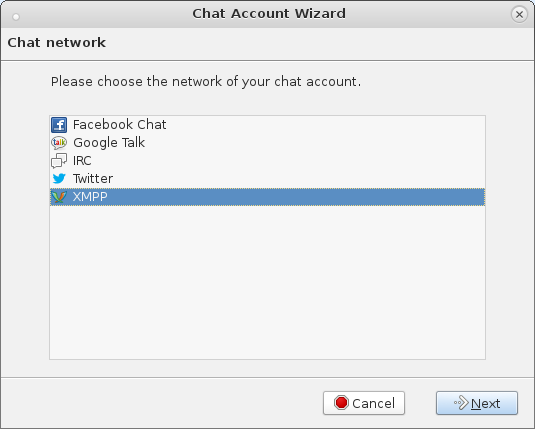

1 
In the "Username" box, enter your full email address (including domain name).
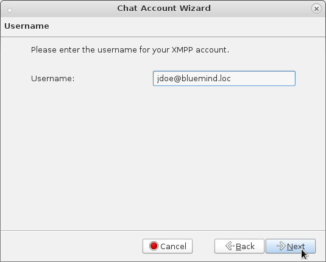

1 
Enter your email password.
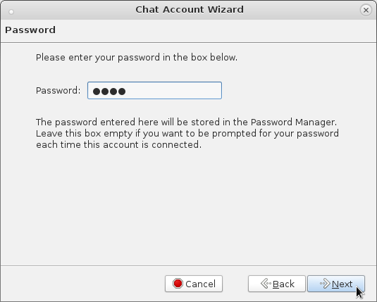

1 
Entering a local alias is optional and will only be visible by you.
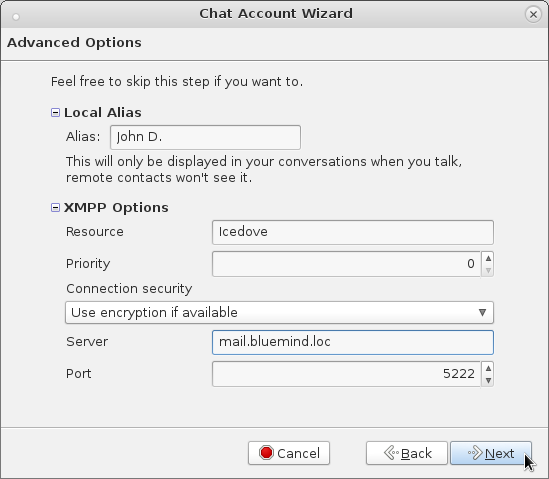
XMPP options:

  - Resource > optional
  - Priority > optional
  - Connection security > Require encryption
  - Server > same address as BlueMind
  - Port > 5222
1 Summary dialog > Uncheck "Connect this account now", otherwise the Thunderbird certificate acceptation prompt will not open when you first connect.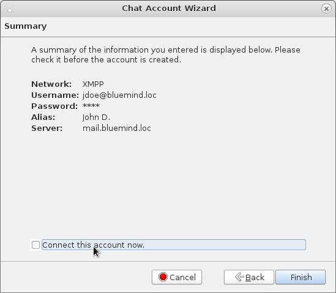

# Pidgin

1 Go to Accounts > "Manage accounts" and click "Add account".
1 In the "Basic" tab, fill in the connection information: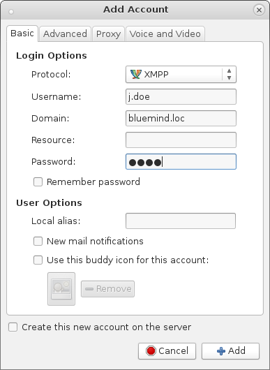
  - Protocol: XMPP
  - Username: full email address (including domain name)
  - Domain: BlueMind's server domain
  - Resource: optional
  - Password: user password
Note: "User options" are optional. Among others, they allow you to define an avatar and display name, which will not be visible by fellow chatters.1 In the "Advanced" tab, fill in the server information: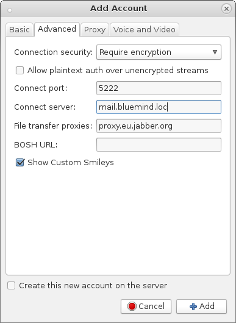
  - Connection security: "Require encryption"
  - Connection port: 5222
  - Connection server: full BlueMind server address, usually the same as the web application's address.

# Gajim

1 Opening the account creation wizard:
  - When you start Gajim, if no account is set up, the account creation window opens automatically.
  - Otherwise, go to Edit > Accounts > click "Add".
1 Select "I already have an account I want to use" and click "Forward".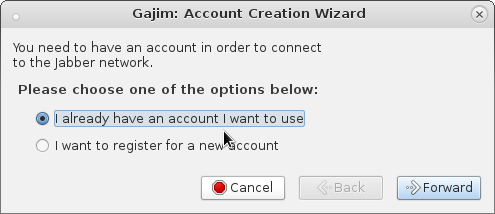
1 Enter the user connection information and click "Forward":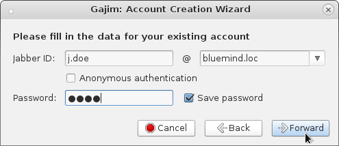
  - Jabber username: first and then second part of the user's email address.
  - password: the same as the email password.
1 Once the account is created, click "Advanced":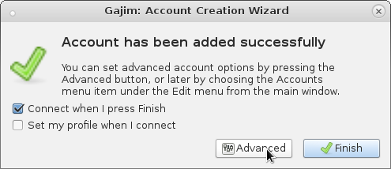
1 Go to the "Connection" tab and check "Use custom hostname/port" to enter the server information: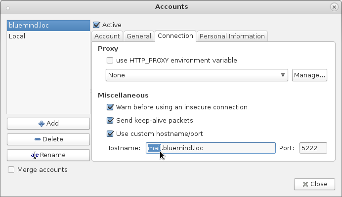
  - Hostname: full BlueMind server address, usually the same as the web application's address.

  - Port: 5222.
1 Click "Close" to return to the Gajim homepage. 
1 When you first connect (to change your status to "Available" for instance), a warning message about the security certificate appears. Confirm that you want to add this certificate in order to be able to connect: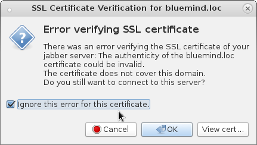

 

 

 

