# Instant Messaging

## Introduction

## Accessing Instant Messaging

Instant messaging is available at all times from all application pages. Just click the balloon callout icon in the BlueMind navigation toolbar:

:::tip

When a new conversation request or new message arrives in the background, the instant messaging icon blinks:

:::

Click the icon to open the IM interface:

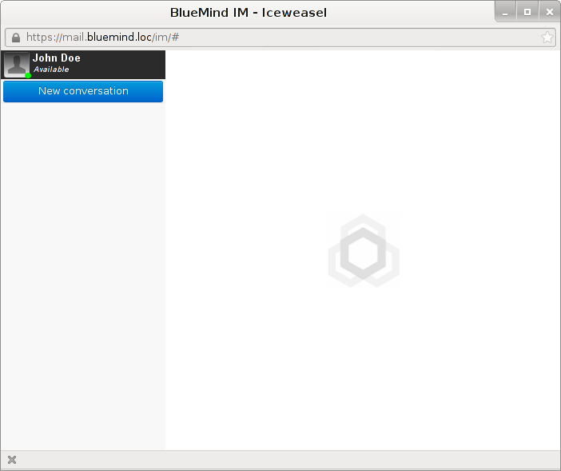

## One-person chat

To chat with a single user, click "new conversation" and use autocomplete to find them:

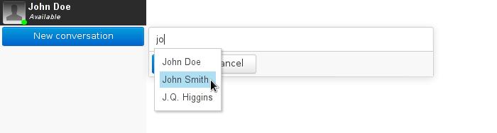

The user is then added to the list of chat participants:

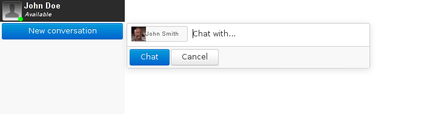

Click "Chat" to start the conversation.

The chat window opens and the user is added to the sidebar roster. Until they are added to favorites, users are shown as offline and filed under "not in list":

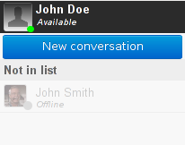

 See [Adding a user to favorites](#Lamessagerieinstantanee-favoris)

Type your message in the box at the bottom ("Send a message") and press &lt;Enter> to confirm and send:

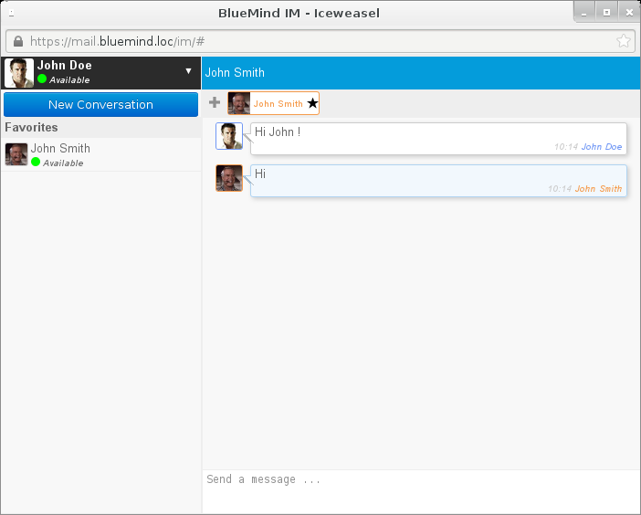

:::tip

Use the &lt;shift+Enter> key combination to insert line breaks in a message: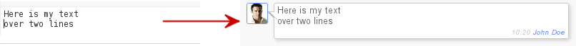

:::

## Group Chat

### Starting a group chat

To start a group start, follow the same steps as for a one-person chat and add more users to the conversation:

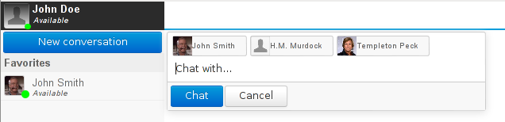

To remove a user, click on the "x" that appears when you hover your mouse over their name:

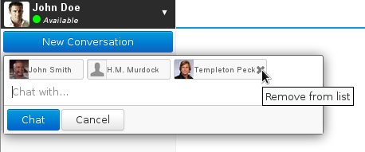

Next click "chat". A chat room is created and opens automatically:

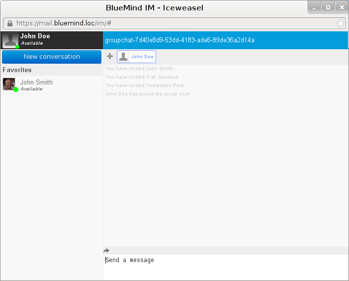

:::tip

To add a participant to an existing conversation, use the "+" button left of the current chat participants:

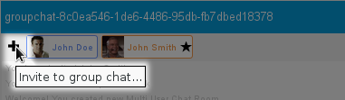

All chat participants can invite other participants.

:::

### Joining a chat

:::info

Users can only join group chats when invited by another participant.

:::

When someone starts a new conversation or adds another user, the users concerned receive an invitation:

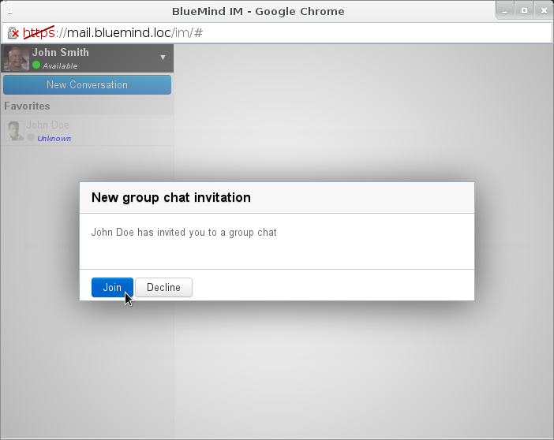

They enter the chat room by clicking "Join". Their name appears in the participants' list at the top of the window and the other users are notified of their arrival:

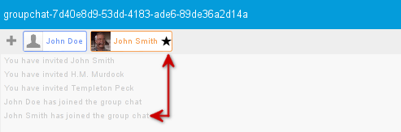

:::info

New chat participants cannot see messages posted before they joined the conversation. Only new messages will be delivered to them.

:::

### Chat history

Group chat history can be retrieved and saved.

To do this, click the "Send history" arrow above the text box:

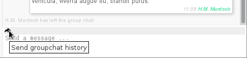

Enter the recipient's email address or search for a user, a group or a shared mailbox using autocomplete:

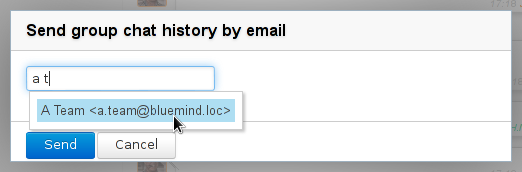

The conversation's content is then sent in text format to the email address entered and a message appears in the chat window to notify users.

:::tip

All chat participants are able to send chat history. This feature is not restricted to the chat creator.

:::

## Leaving a chat

To leave a chat, click the "x" that appears at the far right end of the conversation's tab when you hover your mouse over it:

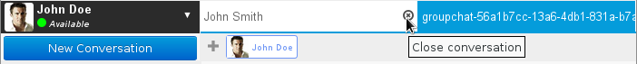

:::info

Closing the instant messaging window does not close chats. Chats are always available, along with their history, when users reopen their instant messaging application.

:::

## New incoming messages

If the window is not in focus when a new message comes in, the caption "Unread messages" blinks in the window title bar and can be seen in your desktop's task bar. New message(s) are shown on a blue background:

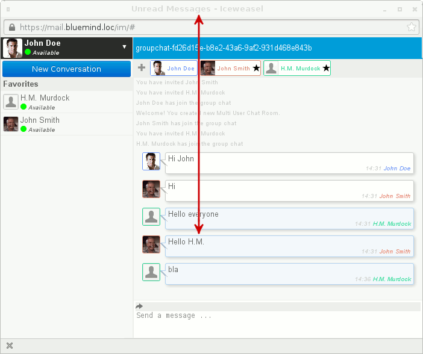

- The "Unread messages" caption stops blinking when the window comes back to the foreground.
- The messages background turns white again when you activate the message writing window.

:::tip

The number of unread messages is shown at the far right end of the conversation bar:

:::

When one or several new messages come in when you've scrolled up to the top of the window, the scroll bar remains in position and a ribbon at the bottom of the chat window shows the author and the first few words of the latest incoming message:

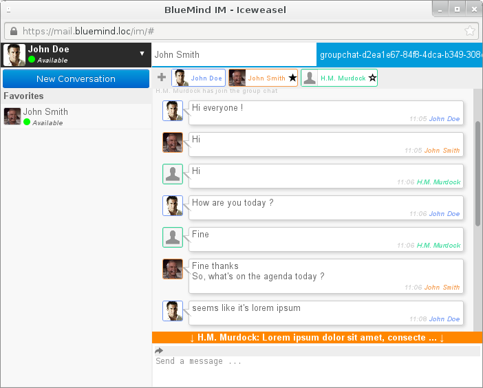

Clicking the ribbon will automatically scroll down to the last message received.

## Favorites

### Adding a user to favorites

To add users to your favorites and thereby see their status, click on the star next to their name when you hover with your mouse:

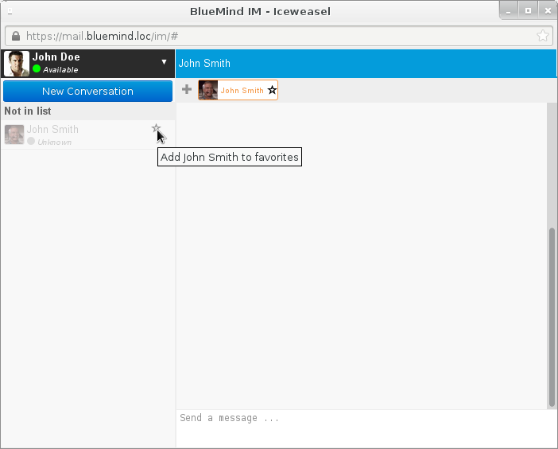

The user receives a subscription request notification:

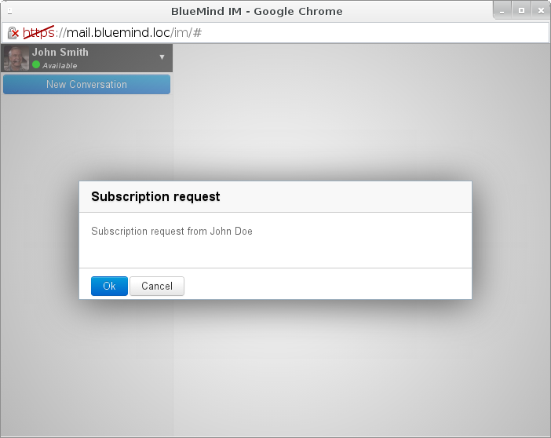

Once they accept this request, their status appears in the roster and they will be visible every time you connect to the IM application:

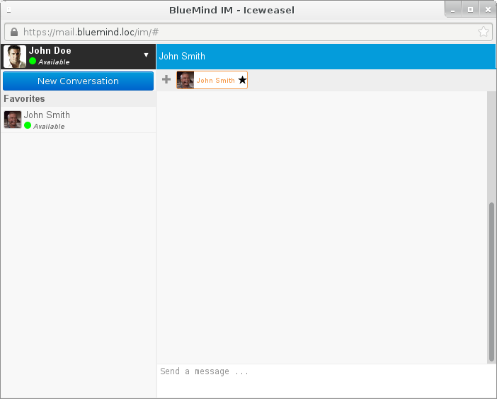

### Removing a user from favorites

Users can be removed from favorites using the same method as for adding. Just click on the star in their badge – in the roster or at the top of the chat window:

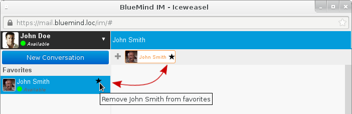

Once removal is confirmed, the user is deleted from the roster.

## Multiple simultaneous chats

The instant messaging application can handle several one-person or group chats simultaneously.

Just open a new conversation normally (as shown above). New chats automatically open in separate tabs within the same window:

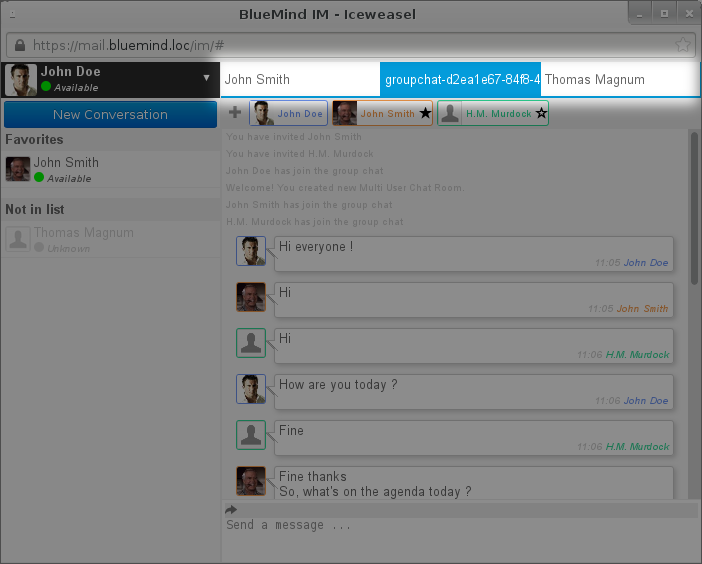

 Here, the user John Doe is in one group chat and two private chats – one with John Smith and the other with Thomas Magnum (who has not been added to his favorites yet).

## Availability status

Users can be online but have different availability statuses displayed:

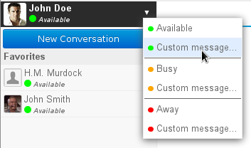

To access the custom message status menu, click the arrow to the right of your current status ("Available" by default), below your user name in the instant messaging window.

Possible statuses are:

- Available: users are at their computer and available to chat. Messages are delivered to them
- Busy: users are at their computer but busy. Messages are delivered to them but he does not wish to be disturbed and may not reply
- Away: users are not at their computer. Messages are delivered to them but they are unable to read them

For each status, a "Custom message" option enables you to write a customized message. The corresponding color dot is then displayed next to the custom status message:

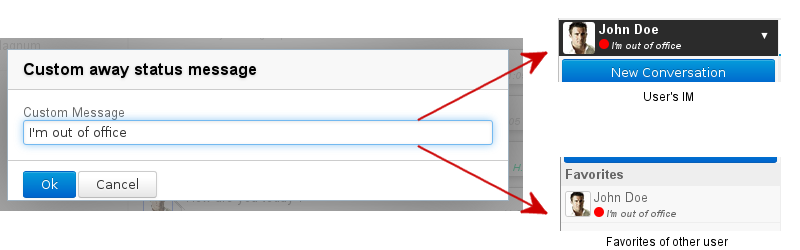

## Intégration de la téléphonie

Lorsqu'un système de [téléphonie](/Guide_de_l_utilisateur/La_téléphonie/) est connecté avec BlueMind, l'indicateur de présence est divisé en 2 parties, donnant des indications sur la présence en ligne ainsi que sur la disponibilité téléphonique :

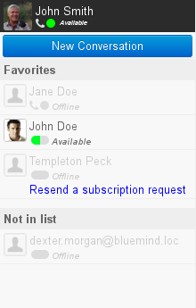

*Pour en savoir plus, consulter la page dédiée à [Telephony](/Guide_de_l_utilisateur/La_téléphonie/)**.*

