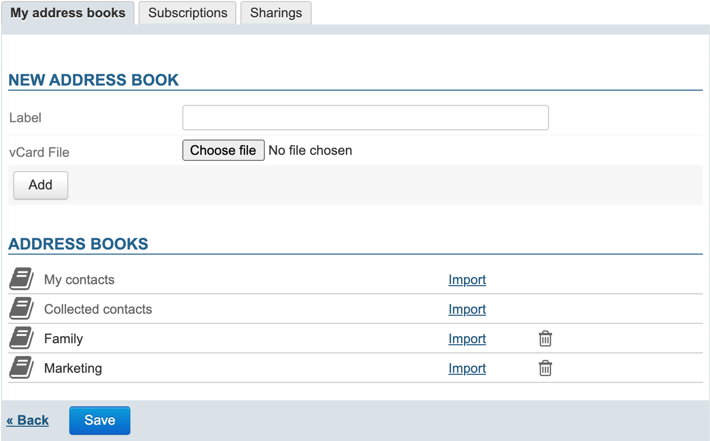
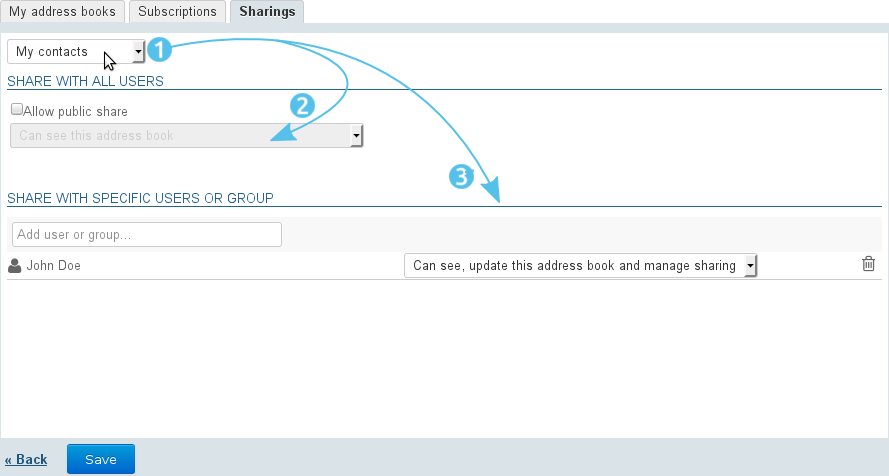
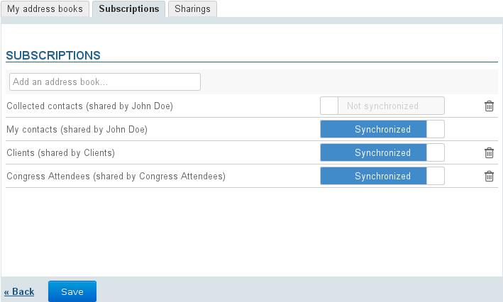
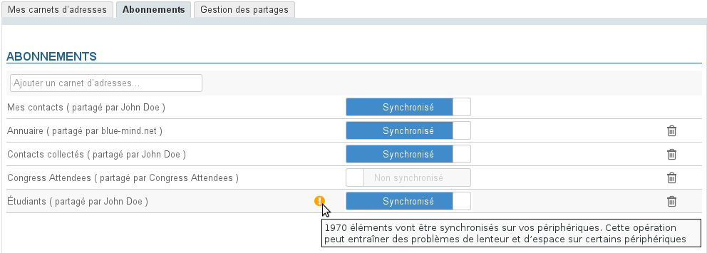
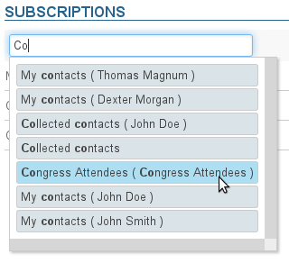
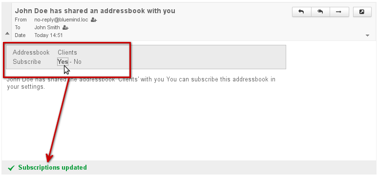

# Managing Address Books

# Introduction

You can manage your own address books as well as subscriptions to external address books (domain, other users, etc.) in Contact preferences.

To access Contact preferences, click "Settings" in the navigation bar and go to "Contacts". It can also be accessed straight from the Contacts application:

# User address books

By default, you have two address books:

- "My Contacts" (or Contacts): personal address book
- "Collected contacts": automatically pools together the addresses of message recipients not present in the directory:

:::important

The third default address book, the user directory, is a subscription to the domain address book. You are not able to manage it and it is not shown as an address book.

:::

You cannot modify or delete default address books, but you are free to use them and their contents as you wish.

## Creating and modifying address books

To** create **a new address book:

- Enter a label (name) for it.
- Optional: choose a vCard file to import contacts into this address book.
- Click "Add".

To **modify** an address book:

- Click the address book's name to open the text box:
- Enter the new name and type &lt;Enter> or by click  to confirm.To cancel typing, press &lt;Esc> or click .

To **delete **an address book:

- Click  at the end of the row.
- Confirm delete.

:::important

Using the "Save" button seen here as well as on all application windows is not necessary. Changes are applied as they are made, therefore any deletion confirmed will be final.

:::

## Importing contacts

To import contacts into an address book via preferences, you need to have the contacts you want to import in a [vCard](http://fr.wikipedia.org/wiki/VCard) file.

## Exporting address books

To export contacts from an address book, you must go to the Contacts application.
To find out more, go to: [ **Les contacts - Importer et exporter** ](https://forge.blue-mind.net/confluence/display/LATEST/Les+contacts#Lescontacts-Importeretexporter)

## Sharing address books

BlueMind allows you to share personal address books with users.

To** share **an address book, go to user preferences > Contacts > "Sharings" tab:

1 Select the address book you want to share.Users can share:
  - their personal address books: Contacts (aka "My Contacts"), Collected Contacts and address books they have created.
  - address books they have delegated rights on: they were given the permission "Can update contacts from this address book and manage sharing"
1 If you want to share the address book with all users in the domain, check the box "Allow public share" and select the type of rights you want to grant users.
1 ** **Recommended choice:** ** If you prefer to grant rights individually to specific users or a group, look for them by typing their name in the box and select the rights you want to grant them.
1 Once all rights are granted as desired, click "Save" to confirm.

# Subscriptions

## In user preferences

You can see your own address books as well as those shared with you in the *Synchronization* tab in settings.

:::important

Only address books listed here will appear in the BlueMind Contacts application, whether synchronization is enabled or not.

:::

The "Synchronization" button allows you to set different synchronization settings with client software (web application, thick clients or mobile devices) for each address book.

When synchronization is enabled, the data is downloaded into the software client. As a result:

    |  | Synchronization Enabled | Synchronization Disabled |
| --- | --- | --- |
| Web Application | contact cards can be viewed and are available offline | contact cards can be viewed in online mode but are unavailable offline |
| EAS iOS | - the address book can be viewed- contact cards can be viewed and are available offline | - the address book cannot be viewed- contact cards are available via search and autocomplete |
| EAS (other) | - the address book cannot be viewed- contact cards are available via search and autocomplete |
| DAV | - the address book can be viewed- contact cards can be viewed and are available offline |
| Outlook | - the address book can be viewed- contact cards can be viewed and are available offline | the address book cannot be viewed |
| Thunderbird | - the address book can be viewed- contact cards can be viewed and are available offline | - the address book can be viewed, with a different icon- contact cards are available via search (address book) and autocomplete (message composer) |

:::important

Volume Warning

When an address book contains a large amount of data (more than 1,000 contacts), a message warning of possible synchronization issues is displayed:

:::
:::important
The address books you create in the BlueMind Contacts application, as well as those you create in thick clients (Outlook or Thunderbird), are automatically added to subscriptions when synchronization is enabled.
:::

To add an address book:

- Start typing the name of the address book in the text box:
- As you type, autocomplete suggests address books your are not subscribed to yet: your own address books and those that other users have shared with you (see above).
- Choose from the list of suggestions and press &lt;Enter> or click the name**.**
- Disabled synchronization is desired.
- **Click "Save" to apply changes.**

:::important

You must click "Save" for the change in synchronization status to be applied then **run synchronization again (or wait for automatic synchronization)** in the software client for changes to be applied (data download and viewing if enabling, deleting data if disabling).

:::

## In the information email message

When a user shares an address book with you, you are notified via an automatic email message. This message allows you to subscribe to this address book directly:

